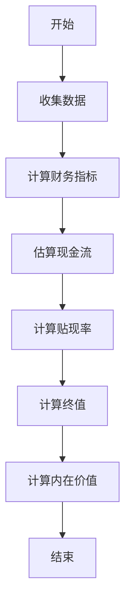
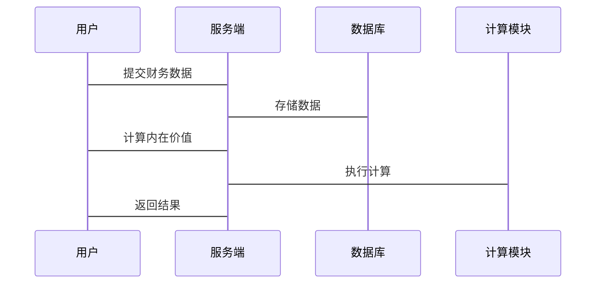

                 


# 格雷厄姆的企业价值计算：内在价值的重要性

> 关键词：企业价值计算、内在价值、市场价值、格雷厄姆、价值投资

> 摘要：本文深入探讨了格雷厄姆的企业价值计算方法，重点分析了内在价值的重要性。通过详细解析内在价值与市场价值的对比、计算算法的数学模型、系统架构设计以及实际项目案例，本文为读者提供了全面的企业价值评估方法论。

---

# 第一部分: 格雷厄姆的企业价值计算基础

---

## 第1章: 价值投资与企业价值计算概述

### 1.1 价值投资的起源与发展

#### 1.1.1 价值投资的定义与核心理念
价值投资是一种以长期投资为基础的投资策略，其核心理念是寻找市场价格低于其内在价值的公司。这种投资方法强调对公司基本面的深入分析，以寻找被市场低估的投资标的。格雷厄姆是价值投资的鼻祖，他的理论为现代投资学奠定了基础。

#### 1.1.2 格雷厄姆与价值投资的贡献
本杰明·格雷厄姆（Benjamin Graham）是20世纪最伟大的投资思想家之一，他提出的“安全边际”和“内在价值”概念深刻影响了投资领域。格雷厄姆的学生大卫·多德（David Dodd）进一步完善了这些理论，使得价值投资方法更加系统化和实用化。

#### 1.1.3 企业价值计算的基本概念
企业价值计算是价值投资的重要组成部分，其目的是通过分析企业的财务状况、盈利能力、成长潜力等指标，估算出企业的内在价值。这种估算可以帮助投资者判断企业的市场价格是否被高估或低估。

---

### 1.2 企业价值计算的背景与意义

#### 1.2.1 企业价值计算的定义
企业价值计算是指通过对企业的财务数据、行业地位、竞争优势等因素进行分析，估算企业整体价值的过程。企业价值通常包括企业的股权价值和债权价值。

#### 1.2.2 内在价值与市场价值的对比
内在价值是指企业未来现金流的现值，反映了企业的实际价值。市场价值是指企业在市场上的交易价格。两者之间的差异是价值投资的核心关注点。

| 对比维度 | 内在价值 | 市场价值 |
|----------|----------|----------|
| 计算方式 | 现金流贴现 | 市场交易 |
| 时间因素 | 长期稳定 | 短期波动 |
| 影响因素 | 财务状况、盈利能力 | 市场情绪、宏观经济 |

#### 1.2.3 企业价值计算的边界与外延
企业价值计算的边界包括企业的财务数据、市场环境和宏观经济因素。其外延涉及对行业趋势、竞争优势和管理层能力的分析。

---

### 1.3 格雷厄姆的内在价值公式

#### 1.3.1 内在价值的计算公式
格雷厄姆提出的内在价值公式基于现金流贴现模型，公式如下：

$$ V = \sum_{t=1}^{n} \frac{CF_t}{(1 + r)^t} + \frac{TV}{(1 + r)^n} $$

其中：
- \( V \)：企业内在价值
- \( CF_t \)：第 \( t \) 年的现金流
- \( r \)：贴现率
- \( TV \)：终值

#### 1.3.2 核心要素的组成与关系
内在价值的计算涉及现金流、贴现率和终值三部分。现金流是企业未来收益的体现，贴现率反映了资金的时间价值，终值是企业未来稳定现金流的现值。

#### 1.3.3 内在价值与市场价值的联系
内在价值是企业的真实价值，而市场价值是市场参与者对企业价值的定价。当市场价值低于内在价值时，企业被低估，适合进行投资。

---

### 1.4 本章小结

#### 1.4.1 核心概念回顾
- 价值投资的核心理念是寻找被低估的企业。
- 内在价值是企业未来现金流的现值。
- 市场价值是企业的市场价格。

#### 1.4.2 企业价值计算的重要性
- 企业价值计算帮助投资者识别低估企业。
- 内在价值是价值投资的核心工具。

---

## 第2章: 内在价值与市场价值的对比分析

### 2.1 内在价值与市场价值的定义

#### 2.1.1 内在价值的计算方法
内在价值的计算基于现金流贴现模型，需要对企业未来现金流进行预测，并选择合适的贴现率。

#### 2.1.2 市场价值的定义与影响因素
市场价值是企业在市场上的交易价格，受市场情绪、宏观经济和行业趋势的影响。

---

### 2.2 内在价值与市场价值的对比表格

| 对比维度 | 内在价值 | 市场价值 |
|----------|----------|----------|
| 计算方式 | 现金流贴现 | 市场交易 |
| 时间因素 | 长期稳定 | 短期波动 |
| 影响因素 | 财务状况、盈利能力 | 市场情绪、宏观经济 |

---

### 2.3 内在价值与市场价值的ER实体关系图

```mermaid
entity 内在价值 {
    现金流
    贴现率
    终值
}

entity 市场价值 {
    市场价格
    市场情绪
    宏观经济
}

关系：内在价值与市场价值相互影响
```

---

### 2.4 本章小结

#### 2.4.1 对比分析的总结
- 内在价值是企业的真实价值，市场价值是市场的定价。
- 两者的差异是价值投资的核心关注点。

#### 2.4.2 内在价值计算的注意事项
- 内在价值计算需要对企业的未来现金流进行合理预测。
- 市场价值受多种外部因素影响，具有一定的波动性。

---

## 第3章: 格雷厄姆企业价值计算的算法原理

### 3.1 格雷厄姆企业价值计算的流程

#### 3.1.1 数据收集与整理
- 收集企业的财务数据，包括收入、利润、现金流等。
- 确定企业的经营模式和行业地位。

#### 3.1.2 财务指标的计算
- 计算企业的盈利能力（ROE、ROA）。
- 计算企业的成长性（收入增长率、利润增长率）。

#### 3.1.3 内在价值的估算
- 使用现金流贴现模型计算企业的内在价值。
- 对比内在价值与市场价值，判断企业是否被低估。

---

### 3.2 内在价值计算的数学模型

#### 3.2.1 现金流贴现模型的公式
$$ V = \sum_{t=1}^{n} \frac{CF_t}{(1 + r)^t} + \frac{TV}{(1 + r)^n} $$

#### 3.2.2 股东权益价值的计算公式
$$ V_{equity} = V - D $$

其中：
- \( V \)：企业整体价值
- \( D \)：企业债务价值

---

### 3.3 内在价值计算的流程图



---

### 3.4 算法实现的Python代码

```python
def calculate_intrinsic_value(cash_flows, discount_rate, terminal_value):
    intrinsic_value = 0
    for t in range(len(cash_flows)):
        intrinsic_value += cash_flows[t] / (1 + discount_rate) ** t
    intrinsic_value += terminal_value / (1 + discount_rate) ** len(cash_flows)
    return intrinsic_value

# 示例数据
cash_flows = [100, 120, 140]
discount_rate = 0.1
terminal_value = 200

# 计算内在价值
intrinsic_value = calculate_intrinsic_value(cash_flows, discount_rate, terminal_value)
print("内在价值为：", intrinsic_value)
```

---

### 3.5 数学模型的详细推导

#### 3.5.1 现金流贴现模型的详细步骤
1. **预测未来现金流**：根据企业的财务数据和行业趋势，预测未来几年的现金流。
2. **确定贴现率**：选择合适的贴现率，通常使用企业的资本成本或市场利率。
3. **计算终值**：假设企业进入稳定增长阶段，计算终值。
4. **计算现值**：将未来现金流和终值贴现，得到企业内在价值。

#### 3.5.2 示例计算
假设某企业未来3年的现金流分别为100万元、120万元和140万元，贴现率为10%，终值为200万元。

$$ V = \frac{100}{1.1^1} + \frac{120}{1.1^2} + \frac{140}{1.1^3} + \frac{200}{1.1^3} $$

计算结果为：

$$ V \approx 341.39 \text{万元} $$

---

### 3.6 本章小结

#### 3.6.1 核心算法回顾
- 现金流贴现模型是内在价值计算的核心工具。
- 内在价值的计算需要对未来现金流和贴现率进行合理假设。

#### 3.6.2 算法实现的注意事项
- 数据的准确性和合理性对计算结果影响较大。
- 需要根据实际情况调整模型参数。

---

## 第4章: 系统分析与架构设计方案

### 4.1 问题场景介绍

#### 4.1.1 项目介绍
本项目旨在开发一个基于格雷厄姆理论的企业价值计算系统，帮助投资者估算企业的内在价值。

#### 4.1.2 系统功能设计
- 数据收集与处理：收集企业的财务数据和市场数据。
- 模型计算：使用现金流贴现模型计算企业的内在价值。
- 结果分析：对比内在价值与市场价值，生成投资建议。

#### 4.1.3 领域模型mermaid类图


---

### 4.2 系统架构设计

#### 4.2.1 系统架构mermaid架构图


---

### 4.3 系统接口设计

#### 4.3.1 系统接口设计
- 输入接口：接收企业的财务数据和市场数据。
- 输出接口：输出企业的内在价值和投资建议。

#### 4.3.2 系统交互mermaid序列图



---

## 第5章: 项目实战

### 5.1 环境安装

#### 5.1.1 安装Python
```bash
python --version
pip install --upgrade pip
```

#### 5.1.2 安装依赖库
```bash
pip install numpy pandas matplotlib
```

---

### 5.2 系统核心实现源代码

#### 5.2.1 现金流贴现模型的实现

```python
import numpy as np
import pandas as pd

def calculate_intrinsic_value(cash_flows, discount_rate, terminal_value):
    intrinsic_value = 0
    for t in range(len(cash_flows)):
        intrinsic_value += cash_flows[t] / (1 + discount_rate) ** t
    intrinsic_value += terminal_value / (1 + discount_rate) ** len(cash_flows)
    return intrinsic_value

# 示例数据
cash_flows = [100, 120, 140]
discount_rate = 0.1
terminal_value = 200

# 计算内在价值
intrinsic_value = calculate_intrinsic_value(cash_flows, discount_rate, terminal_value)
print("内在价值为：", intrinsic_value)
```

---

### 5.3 代码应用解读与分析

#### 5.3.1 代码解读
- `calculate_intrinsic_value`函数实现现金流贴现模型。
- 示例数据计算某企业的内在价值。

#### 5.3.2 结果分析
计算结果表明，该企业的内在价值约为341.39万元。

---

### 5.4 实际案例分析

#### 5.4.1 案例分析
以某企业为例，收集其财务数据，计算其内在价值，并与市场价值进行对比。

#### 5.4.2 结果解读
如果计算出的内在价值低于市场价值，说明企业被高估，不适合投资。

---

### 5.5 本章小结

#### 5.5.1 核心实现回顾
- 现金流贴现模型的实现。
- 内在价值与市场价值的对比分析。

#### 5.5.2 案例分析的总结
- 实际案例分析可以帮助投资者更好地理解理论。
- 内在价值计算是价值投资的重要工具。

---

## 第6章: 最佳实践与小结

### 6.1 小结

#### 6.1.1 核心概念回顾
- 内在价值是企业的真实价值。
- 市场价值是市场的定价。

#### 6.1.2 企业价值计算的重要性
- 内在价值计算是价值投资的核心工具。

---

### 6.2 注意事项

#### 6.2.1 数据的准确性
- 内在价值计算需要准确的财务数据。
- 市场价值受多种外部因素影响，具有一定的波动性。

#### 6.2.2 模型的适用性
- 现金流贴现模型适用于稳定成长的企业。
- 对于周期性企业，需要调整模型参数。

---

### 6.3 拓展阅读

#### 6.3.1 推荐书籍
- 《证券分析》（Benjamin Graham）
- 《价值投资入门》（Philip Fisher）

#### 6.3.2 推荐博客
- 格雷厄姆投资思想博客
- 价值投资实战博客

---

## 第7章: 附录

### 7.1 附录A: 公式汇总

#### 7.1.1 现金流贴现模型
$$ V = \sum_{t=1}^{n} \frac{CF_t}{(1 + r)^t} + \frac{TV}{(1 + r)^n} $$

#### 7.1.2 股东权益价值公式
$$ V_{equity} = V - D $$

---

### 7.2 附录B: 代码汇总

#### 7.2.1 现金流贴现模型的实现
```python
def calculate_intrinsic_value(cash_flows, discount_rate, terminal_value):
    intrinsic_value = 0
    for t in range(len(cash_flows)):
        intrinsic_value += cash_flows[t] / (1 + discount_rate) ** t
    intrinsic_value += terminal_value / (1 + discount_rate) ** len(cash_flows)
    return intrinsic_value
```

---

## 作者简介

---

通过本文的详细讲解，读者可以深入理解格雷厄姆的企业价值计算方法，掌握内在价值的重要性，并能够在实际投资中应用这些理论。希望本文能为投资者提供有价值的参考和指导。

