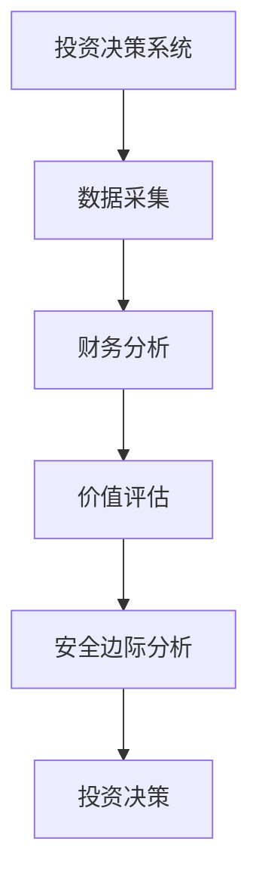

                 


# 《格雷厄姆的企业价值评估方法》

> **关键词**: 格雷厄姆, 企业价值评估, 投资方法, 安全边际, 财务分析, DCF模型

> **摘要**: 本文详细探讨了本杰明·格雷厄姆的企业价值评估方法，分析了其核心思想、安全边际概念、财务指标筛选标准以及现金流分析方法。通过实例分析，结合现代投资组合理论和系统架构设计，展示了如何将格雷厄姆的理论应用于实际投资决策。文章还提供了基于Python的DCF模型实现，帮助读者更好地理解和应用这一经典投资方法。

---

# 引言

格雷厄姆是价值投资的鼻祖，他的投资方法以稳健、安全为核心，强调通过对企业内在价值的深入分析来寻找被市场低估的投资标的。本文将从格雷厄姆的核心思想出发，逐步解析其企业价值评估方法，并结合现代技术手段，展示如何在实际投资中应用这些方法。

---

## 第1章: 格雷厄姆投资方法的背景与核心思想

### 1.1 格雷厄姆的生平简介

本杰明·格雷厄姆（Benjamin Graham）是20世纪最著名的投资学家之一，被誉为“价值投资之父”。他出生于1894年，去世于1976年。格雷厄姆的职业生涯始于1920年代，当时他开始在华尔街工作。他的投资理念深刻影响了包括沃伦·巴菲特在内的众多投资者。

### 1.2 格雷厄姆的价值投资理念

格雷厄姆的投资理念的核心是“安全边际”。他认为，投资者应该以低于企业内在价值的价格买入股票，以确保即使市场波动，投资者也能获得超额收益。他强调，投资的本质是购买企业的一部分，而不是赌博。

### 1.3 格雷厄姆投资方法的核心思想

格雷厄姆的核心思想可以总结为以下几点：
1. **安全边际**：买入价格远低于企业内在价值的股票。
2. **价值导向**：通过基本面分析，寻找被市场低估的企业。
3. **长期视角**：投资于具有强大竞争优势和良好管理的企业。

---

## 第2章: 企业价值评估的基本概念

### 2.1 企业价值的内涵

企业价值是指企业在公平市场条件下，所有者权益的公允价值。它包括企业的所有资产、负债和未来现金流的现值。企业价值的评估是投资决策的核心，因为它决定了企业的内在价值。

### 2.2 企业价值评估的边界与外延

企业价值评估的边界包括企业的财务状况、行业地位、管理团队等因素。其外延则涉及企业的未来现金流预测、市场环境变化等。

---

## 第3章: 格雷厄姆的企业价值评估模型

### 3.1 格雷厄姆的企业价值评估公式

格雷厄姆提出了一个简单的价值评估公式：

$$
\text{内在价值} = \text{ earnings} \times \text{合理市盈率}
$$

他认为，市盈率应该基于企业的行业地位和财务状况来确定。通常，他会选择市盈率低于市场平均水平的企业。

### 3.2 安全边际的计算方法

安全边际是内在价值与市场价格之间的差额。格雷厄姆建议，投资者应该寻找安全边际至少为50%的企业。

$$
\text{安全边际} = \text{内在价值} - \text{市场价格}
$$

---

## 第4章: 财务报表分析与企业价值评估

### 4.1 财务报表分析的定义与方法

财务报表分析是评估企业价值的重要工具。通过分析资产负债表、利润表和现金流量表，投资者可以了解企业的财务状况和盈利能力。

### 4.2 格雷厄姆的十二条投资准则

格雷厄姆提出了十二条投资准则，包括：

1. 只投资于具有持续盈利能力的企业。
2. 选择市盈率低于市场平均水平的企业。
3. 确保企业的债务负担不超过其资产价值。

---

## 第5章: 现金流分析与企业价值评估

### 5.1 现金流分析的定义与方法

现金流分析是评估企业财务健康状况的重要方法。通过分析企业的经营活动、投资活动和筹资活动的现金流，投资者可以判断企业的盈利能力和偿债能力。

### 5.2 格雷厄姆现金流分析的独特视角

格雷厄姆认为，现金流是衡量企业价值的重要指标。他建议投资者关注企业的自由现金流（FCFF）和自由现金流与市场价值的关系。

$$
\text{FCFF} = \text{净利润} + \text{非现金费用} - \text{资本支出}
$$

---

## 第6章: 现金流贴现模型（DCF模型）

### 6.1 DCF模型的定义与原理

现金流贴现模型（DCF模型）是评估企业内在价值的核心工具。其基本原理是将企业未来现金流的现值加总，减去初始投资，得到企业的内在价值。

### 6.2 DCF模型的数学公式

DCF模型的公式如下：

$$
\text{内在价值} = \sum_{t=1}^{n} \frac{\text{现金流}_t}{(1 + r)^t} + \frac{\text{残值}}{(1 + r)^n}
$$

其中，$r$是贴现率，$n$是企业的生命周期。

### 6.3 格雷厄姆DCF模型的特殊应用

格雷厄姆的DCF模型强调安全边际和保守的现金流预测。他建议投资者使用较低的贴现率，并关注企业的长期现金流。

---

## 第7章: 格雷厄姆投资方法的系统架构设计

### 7.1 系统功能设计

为了更好地应用格雷厄姆的方法，我们可以设计一个投资决策系统，包括以下功能模块：

1. **数据采集**：获取企业的财务数据。
2. **财务分析**：计算关键财务指标。
3. **价值评估**：使用DCF模型评估内在价值。
4. **安全边际分析**：计算安全边际。
5. **投资决策**：基于安全边际和财务指标做出投资决策。

### 7.2 系统架构设计

以下是系统的架构图：



---

## 第8章: 项目实战

### 8.1 环境安装

为了实现DCF模型，我们需要安装以下工具：

1. **Python**：用于数据分析和计算。
2. **Pandas**：用于数据处理。
3. **NumPy**：用于数学计算。
4. **Matplotlib**：用于数据可视化。

### 8.2 核心实现源代码

以下是DCF模型的Python代码示例：

```python
import pandas as pd
import numpy as np

# 假设我们有一个企业的现金流数据和贴现率
cash_flows = [100, 150, 200, 250, 300]
discount_rate = 0.1

# 计算未来现金流的现值
pv = 0
for t, cf in enumerate(cash_flows, 1):
    pv += cf / (1 + discount_rate) ** t

# 计算内在价值
print(pv)
```

### 8.3 实际案例分析

假设我们有一个企业，未来五年的现金流分别为100、150、200、250和300万元，贴现率为10%。那么，其内在价值为：

$$
\text{PV} = \frac{100}{1.1} + \frac{150}{1.1^2} + \frac{200}{1.1^3} + \frac{250}{1.1^4} + \frac{300}{1.1^5} \approx 620.93 \text{万元}
$$

---

## 第9章: 总结与展望

### 9.1 总结

格雷厄姆的企业价值评估方法以安全边际为核心，强调稳健投资。通过深入分析企业的财务状况和现金流，投资者可以找到具有长期价值的企业。

### 9.2 展望

随着技术的发展，格雷厄姆的方法可以通过自动化工具和大数据分析进一步优化。投资者可以利用人工智能和机器学习技术，提高价值评估的准确性和效率。

---

## 第10章: 最佳实践与注意事项

### 10.1 最佳实践

1. **持续学习**：不断更新投资知识和技能。
2. **分散投资**：降低风险。
3. **关注长期**：避免短期波动的影响。

### 10.2 注意事项

1. **数据质量**：确保财务数据的准确性和完整性。
2. **模型假设**：DCF模型的假设可能影响结果，需谨慎调整。
3. **市场变化**：关注宏观经济和行业趋势。

---

## 第11章: 拓展阅读

### 11.1 推荐书籍

1. 《The Intelligent Investor》——本杰明·格雷厄姆
2. 《The Theory of Investment Value》——戴维·戴维斯

### 11.2 在线资源

1. 格雷厄姆投资俱乐部
2. 价值投资论坛

---

## 结语

格雷厄姆的企业价值评估方法是投资领域的重要经典。通过深入理解其核心思想和方法，投资者可以在复杂的市场环境中做出更明智的投资决策。希望本文能够为读者提供有价值的 insights，并激发进一步的学习和实践。

--- 

**全文完**

