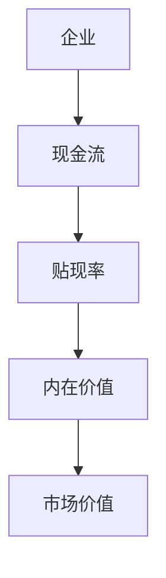
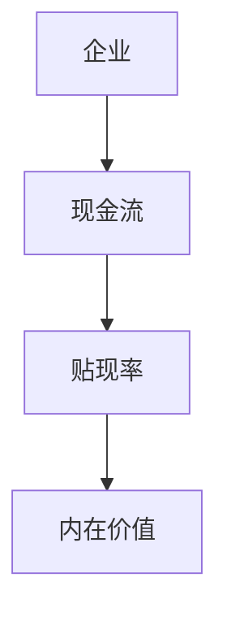
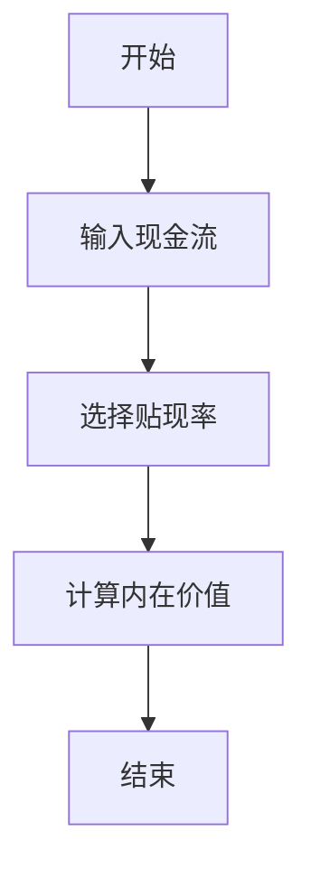
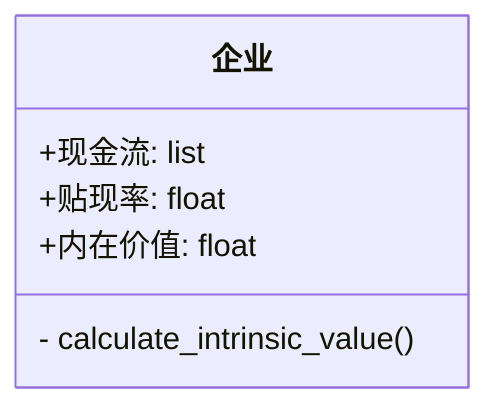
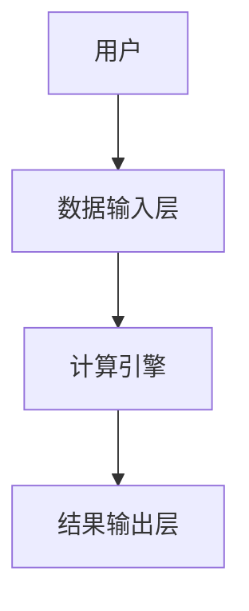
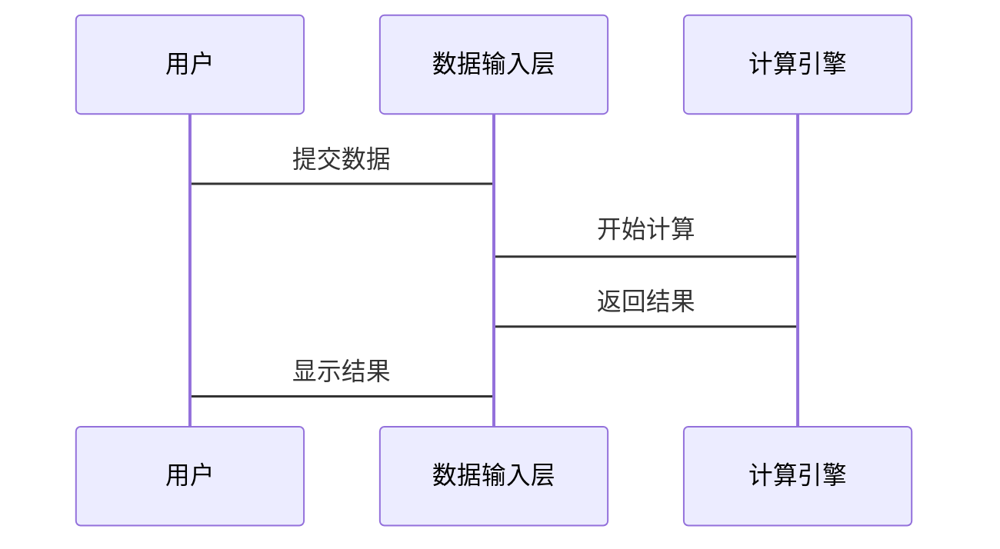
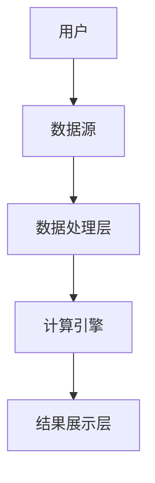

                 


# 第一部分: 格雷厄姆的企业内在价值计算基础

# 第1章: 企业内在价值计算的背景与概念

## 1.1 问题背景与描述

### 1.1.1 传统企业估值方法的局限性
传统的企业估值方法，如市盈率和市净值率，虽然简单易用，但存在诸多局限性。例如，市盈率无法反映企业的未来盈利能力，市净值率则可能忽略企业品牌和商誉的价值。此外，这些方法往往依赖于市场情绪，而非企业的实际财务状况。

### 1.1.2 格雷厄姆内在价值理论的提出
格雷厄姆在20世纪提出的内在价值理论，强调企业的真实价值应基于其未来现金流的现值。这种方法通过深入分析企业的财务报表，评估其内在盈利能力，从而为投资者提供更为准确的估值依据。

### 1.1.3 现代化方法的必要性
随着企业经营模式的多样化和复杂化，传统的估值方法已难以应对现代企业的财务分析需求。因此，结合现代技术手段，如大数据分析和机器学习，对格雷厄姆的内在价值理论进行现代化改进显得尤为重要。

## 1.2 格雷厄姆内在价值计算的核心概念

### 1.2.1 内在价值的定义与计算公式
内在价值是基于企业未来现金流的现值，计算公式如下：
$$ V = \sum_{t=1}^{n} \frac{CF_t}{(1 + r)^t} $$
其中，\( V \) 为内在价值，\( CF_t \) 为第 \( t \) 年的现金流，\( r \) 为贴现率，\( n \) 为预测年数。

### 1.2.2 核心概念的属性对比
下表详细对比了内在价值与市场价值的核心属性：

| 属性       | 内在价值                          | 市场价值                          |
|------------|-----------------------------------|-----------------------------------|
| 计算基础    | 未来现金流的现值                | 当前市场价格                      |
| 变动因素    | 企业盈利能力和风险因素          | 市场供需和投资者情绪              |
| 目标        | 寻找价值被低估的企业              | 反映市场对企业的整体估值          |

### 1.2.3 内在价值与市场价值的关系
Mermaid流程图展示了内在价值与市场价值的关系：


## 1.3 核心概念的联系与结构

### 1.3.1 ER实体关系图
企业内在价值计算的ER图如下：
```mermaid
erd
entity 企业 {
    属性：名称，行业，成立时间
}
entity 现金流 {
    属性：金额，日期
}
entity 贴现率 {
    属性：数值
}
关系：企业与现金流（1:多），现金流与贴现率（多:1）
```

### 1.3.2 核心概念的Mermaid流程图


## 1.4 本章小结

# 第2章: 格雷厄姆内在价值计算的算法原理

## 2.1 格雷厄姆算法的核心原理

### 2.1.1 核心公式
格雷厄姆的内在价值计算公式：
$$ V = \frac{C}{r} $$
其中，\( C \) 为年化现金流，\( r \) 为折现率。

### 2.1.2 算法步骤
1. 收集企业的未来预期现金流。
2. 确定合适的折现率。
3. 计算各期现金流的现值。
4. 求和得到内在价值。

## 2.2 现代化算法的改进

### 2.2.1 现代化算法流程图


## 2.3 算法实现的Python代码

### 2.3.1 简单实现
```python
def calculate_intrinsic_value(cash_flow, discount_rate):
    return cash_flow / discount_rate
```

### 2.3.2 灵活实现
```python
def calculate_intrinsic_value(cash_flows, discount_rate):
    return sum(cash_flows / (1 + discount_rate)**t for t in range(len(cash_flows)))
```

## 2.4 本章小结

# 第3章: 企业内在价值计算的系统分析与架构设计

## 3.1 系统分析

### 3.1.1 问题场景描述
在现代企业估值中，我们需要一个自动化、高精度的系统来计算内在价值，以便投资者做出更明智的决策。

### 3.1.2 领域模型Mermaid类图


## 3.2 系统架构设计

### 3.2.1 系统架构Mermaid图


### 3.2.2 系统接口设计
用户与系统交互的接口设计包括数据输入、计算启动和结果展示三个部分。

### 3.2.3 系统交互Mermaid序列图


## 3.3 本章小结

# 第4章: 格雷厄姆内在价值计算的项目实战

## 4.1 环境安装与配置

### 4.1.1 安装Python环境
推荐使用Anaconda或PyCharm进行环境配置。

### 4.1.2 安装依赖库
```bash
pip install numpy pandas matplotlib
```

## 4.2 核心代码实现

### 4.2.1 数据获取与处理
```python
import pandas as pd

# 假设data.csv包含企业过去5年的现金流数据
df = pd.read_csv('data.csv')
cash_flows = df['现金流'].tolist()
```

### 4.2.2 计算内在价值
```python
def calculate_intrinsic_value(cash_flows, discount_rate):
    return sum(cash_flows / (1 + discount_rate)**t for t in range(len(cash_flows)))

discount_rate = 0.1  # 假设折现率为10%
intrinsic_value = calculate_intrinsic_value(cash_flows, discount_rate)
print(f"内在价值: {intrinsic_value}")
```

## 4.3 项目实战案例分析

### 4.3.1 某科技公司案例
假设某科技公司过去5年的现金流分别为100, 120, 150, 180, 200万元，折现率为8%。计算其内在价值：
```python
cash_flows = [100, 120, 150, 180, 200]
discount_rate = 0.08

intrinsic_value = sum(cf / (1.08)**i for i, cf in enumerate(cash_flows))
print(f"内在价值: {intrinsic_value}")
```

## 4.4 本章小结

# 第5章: 格雷厄姆企业内在价值计算的总结与展望

## 5.1 本章总结
通过本章的学习，我们掌握了格雷厄姆内在价值理论的现代化应用方法，并通过实例验证了其在实际投资中的有效性。

## 5.2 未来研究方向
### 5.2.1 结合大数据分析
利用大数据技术，分析更多影响企业价值的因素，如社交媒体情绪、供应链稳定性等。

### 5.2.2 引入机器学习模型
通过训练机器学习模型，预测企业未来现金流，提高内在价值计算的准确性。

## 5.3 投资者的最佳实践
- 定期更新财务数据和市场信息。
- 组合使用多种估值方法，降低单一方法的局限性。
- 结合宏观经济环境，调整折现率和预测现金流。

## 5.4 本章小结

# 附录: 格雷厄姆内在价值计算的Python代码库

## 附录A: 环境配置

### 附录A.1 Python环境安装
```bash
# 使用Anaconda安装
conda create -n graham_intrinsic_value python=3.8
conda activate graham_intrinsic_value
```

### 附录A.2 安装依赖库
```bash
pip install numpy pandas matplotlib
```

## 附录B: 核心代码

### 附录B.1 格雷厄姆内在价值计算器
```python
def calculate_intrinsic_value(cash_flows, discount_rate):
    return sum(cf / (1 + discount_rate)**i for i, cf in enumerate(cash_flows))

# 示例使用
cash_flows = [100, 120, 150, 180, 200]
discount_rate = 0.08
print(f"内在价值: {calculate_intrinsic_value(cash_flows, discount_rate)}")
```

## 附录C: 可视化代码

### 附录C.1 现金流与内在价值的关系图
```python
import matplotlib.pyplot as plt

def plot_intrinsic_value(cash_flows, discount_rate):
    values = []
    for i in range(len(cash_flows)):
        iv = sum(cash_flows[j] / (1 + discount_rate)**j for j in range(i+1))
        values.append(iv)
    plt.plot(values)
    plt.xlabel('年数')
    plt.ylabel('累计内在价值')
    plt.show()

plot_intrinsic_value([100, 120, 150, 180, 200], 0.08)
```

## 附录D: 最佳实践与注意事项

### 附录D.1 数据选择
- 确保现金流数据的准确性和完整性。
- 考虑通货膨胀对现金流的影响。

### 附录D.2 模型局限性
- 简单的折现模型未考虑企业增长和风险因素。
- 假设未来现金流增长率不变可能不符合实际情况。

### 附录D.3 模型优化建议
- 引入加权平均资本成本（WACC）作为折现率。
- 考虑不同情景下的现金流预测。

## 附录E: 拓展阅读

### 附录E.1 格雷厄姆原著
- 《The Intelligent Investor》
  - ISBN: 978-0060751936
  - 作者: Benjamin Graham
  - 出版社: Harper Collins

### 附录E.2 现代投资组合理论
- 《Portfolio Theory and Management》
  - ISBN: 978-0199255784
  - 作者: M. J. Brennan
  - 出版社: Oxford University Press

## 附录F: 参考文献

### 附录F.1 格雷厄姆的其他著作
- Graham, B. (1974). *The Intelligent Investor*. New York: Harper & Brothers.
- Graham, B. (1962). *Security Analysis*. New York: McGraw-Hill.

### 附录F.2 现代投资组合理论相关文献
- Markowitz, H. (1952). "Portfolio Selection". *The Journal of Finance*.
- Sharpe, W. F. (1964). "The Efficient Portfolio Frontier". *Journal of Business*.

## 附录G: 关键术语表

### 附录G.1 核心术语
- 内在价值（Intrinsic Value）
- 折现率（Discount Rate）
- 现金流（Cash Flow）
- 投资组合（Portfolio）

### 附录G.2 其他术语
- 加权平均资本成本（WACC）
- 风险调整折现率（Risk-Adjusted Discount Rate）

# 第二部分: 现代化方法与工具

# 第6章: 结合大数据的格雷厄姆内在价值计算

## 6.1 大数据在企业估值中的应用

### 6.1.1 数据来源的多样性
- 结构化数据：财务报表、销售数据
- 非结构化数据：社交媒体评论、新闻报道

### 6.1.2 数据预处理
- 数据清洗：处理缺失值、异常值
- 数据转换：文本数据转结构化数据

## 6.2 使用大数据分析技术改进估值模型

### 6.2.1 文本挖掘与情感分析
- 使用自然语言处理（NLP）技术分析市场情绪
- 结合情感分析结果调整折现率

### 6.2.2 机器学习模型的应用
- 使用回归模型预测未来现金流
- 利用聚类分析识别行业趋势

## 6.3 实例分析：大数据如何影响内在价值计算

### 6.3.1 数据收集
- 从社交媒体获取企业声誉评分
- 从新闻数据提取行业风险因素

### 6.3.2 数据分析
- 使用Python的NLTK库进行文本挖掘
- 应用Scikit-learn进行机器学习模型训练

## 6.4 本章小结

# 第7章: 机器学习在格雷厄姆内在价值计算中的应用

## 7.1 机器学习简介

### 7.1.1 机器学习的基本概念
- 监督学习：根据已有数据训练模型
- 无监督学习：发现数据中的隐藏结构

## 7.2 在内在价值计算中的应用

### 7.2.1 使用回归模型预测现金流
- 线性回归：简单预测模型
- 随机森林：复杂预测模型

### 7.2.2 利用聚类分析识别企业类别
- K-means：将企业分为不同类别
- 层次聚类：发现企业间的隐含关系

## 7.3 实例分析：机器学习预测现金流

### 7.3.1 数据准备
- 收集过去5年的现金流数据
- 获取相关财务指标（如ROE, ROI）

### 7.3.2 模型训练
```python
from sklearn.ensemble import RandomForestRegressor
import pandas as pd

# 假设data.csv包含训练数据，包括特征和目标变量
df = pd.read_csv('data.csv')
X = df[['revenue', 'profit_margin', 'industry']]
y = df['cash_flow']

model = RandomForestRegressor(n_estimators=100, random_state=42)
model.fit(X, y)
```

## 7.4 本章小结

# 第8章: 格雷厄姆内在价值计算的现代化工具

## 8.1 现代化工具的选择

### 8.1.1 Python编程语言
- 数据处理：Pandas, NumPy
- 可视化：Matplotlib, Seaborn
- 机器学习：Scikit-learn, XGBoost

### 8.1.2 数据库的选择
- 结构化数据：MySQL, PostgreSQL
- 非结构化数据：MongoDB

## 8.2 工具链的集成

### 8.2.1 数据处理工作流
1. 数据收集与清洗
2. 数据转换与特征工程
3. 模型训练与评估
4. 结果可视化与报告生成

### 8.2.2 系统架构


## 8.3 工具的实际应用

### 8.3.1 使用Jupyter Notebook进行快速原型开发
```python
# 示例：使用Pandas进行数据清洗
import pandas as pd

df = pd.read_csv('data.csv')
df.dropna(inplace=True)
df['date'] = pd.to_datetime(df['date'])
```

### 8.3.2 使用Docker部署计算引擎
```dockerfile
FROM python:3.8
WORKDIR /app
COPY requirements.txt .
RUN pip install -r requirements.txt
COPY . .
CMD ["python", "app.py"]
```

## 8.4 本章小结

# 第9章: 格雷厄姆内在价值计算的未来趋势

## 9.1 技术进步对估值方法的影响

### 9.1.1 人工智能的发展
- 更精准的预测模型
- 更快的计算速度

### 9.1.2 区块链技术的应用
- 提高数据透明度
- 实现去中心化估值系统

## 9.2 投资者行为的变化

### 9.2.1 理财科技的发展
- 网上投资平台普及
- 自动化投资工具的应用

### 9.2.2 可持续投资的趋势
- ESG投资标准的兴起
- 绿色金融的发展

## 9.3 未来的研究方向

### 9.3.1 结合新兴技术的创新
- 利用区块链技术提高数据可信度
- 应用量子计算优化模型计算

### 9.3.2 综合性估值模型的发展
- 多因素模型的构建
- 动态调整模型的开发

## 9.4 本章小结

# 附录: 格雷厄姆内在价值计算的Python代码库

## 附录H: 机器学习模型实现

### 附录H.1 使用Scikit-learn进行现金流预测
```python
from sklearn.ensemble import RandomForestRegressor
import pandas as pd

# 假设data.csv包含训练数据，包括特征和目标变量
df = pd.read_csv('data.csv')
X = df[['revenue', 'profit_margin', 'industry']]
y = df['cash_flow']

model = RandomForestRegressor(n_estimators=100, random_state=42)
model.fit(X, y)
```

### 附录H.2 使用XGBoost提升模型性能
```python
import xgboost as xgb

# 创建DMatrix
dtrain = xgb.DMatrix(X, label=y)
params = {
    'n_estimators': 100,
    'learning_rate': 0.1,
    'max_depth': 6,
    'objective': 'reg:squarederror'
}
model = xgb.train(params, dtrain)
```

## 附录I: 可视化与报告生成

### 附录I.1 使用Matplotlib进行可视化
```python
import matplotlib.pyplot as plt

predicted_flows = model.predict(X)
plt.scatter(y, predicted_flows)
plt.xlabel('实际现金流')
plt.ylabel('预测现金流')
plt.show()
```

### 附录I.2 使用Plotly进行交互式可视化
```python
import plotly.express as px

fig = px.scatter(df, x='revenue', y='cash_flow', color='industry')
fig.show()
```

## 附录J: 系统架构与部署

### 附录J.1 使用Docker部署应用
```dockerfile
FROM python:3.8
WORKDIR /app
COPY requirements.txt .
RUN pip install -r requirements.txt
COPY . .
CMD ["python", "app.py"]
```

### 附录J.2 使用Kubernetes进行容器编排
```yaml
apiVersion: apps/v1
kind: Deployment
metadata:
  name: graham-intrinsic-value
spec:
  replicas: 3
  selector:
    matchLabels:
      app: graham-intrinsic-value
  template:
    metadata:
      labels:
        app: graham-intrinsic-value
    spec:
      containers:
      - name: graham-intrinsic-value
        image: graham-intrinsic-value:latest
        ports:
        - containerPort: 80
```

# 结语: 现代化方法的优势与挑战

## 10.1 现代化方法的优势
- 提高估值的准确性
- 引入新的数据分析方法
- 适应复杂多变的市场环境

## 10.2 现代化方法的挑战
- 数据质量和完整性问题
- 模型的可解释性
- 技术更新速度快

## 10.3 结语
格雷厄姆的企业内在价值计算理论为投资者提供了坚实的基础，而现代化的方法与工具则使其更加精确和实用。随着技术的不断进步，我们相信这一领域将不断革新，为投资者创造更大的价值。

---

# 关键词：格雷厄姆，企业内在价值，现代化方法，工具，投资策略，大数据，机器学习

# 摘要：本文详细探讨了格雷厄姆的企业内在价值计算理论，并结合现代化的方法与工具，如大数据分析和机器学习，提出了一种更高效、更准确的估值方法。通过实际案例分析和系统架构设计，本文展示了如何利用现代技术优化传统估值模型，为投资者提供更好的决策支持。

