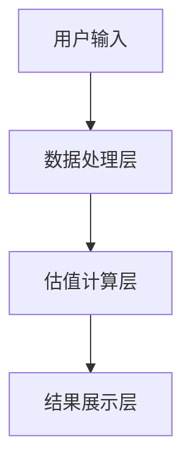
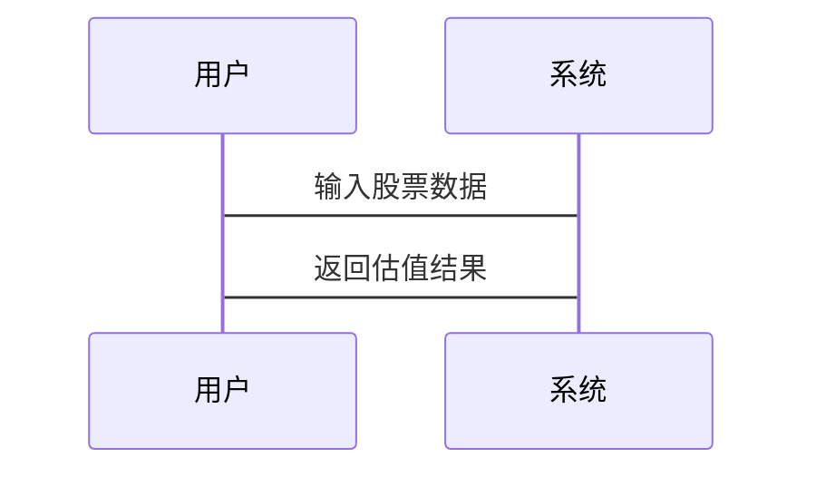

                 


# 格雷厄姆的保守估值方法：在负利率环境中的调整

## 关键词：格雷厄姆，保守估值，负利率，投资分析，数学模型

## 摘要：  
本文详细探讨了格雷厄姆的保守估值方法在负利率环境下的调整策略。通过分析传统估值方法的局限性，结合负利率对资产估值的影响，提出了优化的数学模型和实际应用案例。文章内容涵盖从理论基础到系统实现的完整流程，适合投资者、金融分析师和技术开发者阅读。

---

## 第1章: 证券分析的演变与格雷厄姆投资理论

### 1.1 证券分析的起源与发展

1.1.1 证券分析的定义与核心概念  
证券分析是通过对公司财务数据、市场趋势和经济指标的分析，评估证券的内在价值和投资潜力。其核心在于揭示证券的真实价值，帮助投资者做出明智的投资决策。

1.1.2 格雷厄姆与巴菲特的价值投资理念  
本杰明·格雷厄姆是价值投资的鼻祖，他强调以低于内在价值的价格购买优质股票。巴菲特深受其影响，进一步发展了这一理论，强调长期持有和安全边际的重要性。

1.1.3 现代证券分析的演变与挑战  
随着金融市场的复杂化，证券分析从传统的基本面分析扩展到技术分析、量化分析等多种方法。然而，近年来全球负利率的出现，对传统估值方法提出了新的挑战。

---

## 第2章: 格雷厄姆保守估值方法的核心原理

### 2.1 保守估值法的基本概念

2.1.1 保守估值法的定义  
保守估值法是一种以内在价值为核心，通过保守的假设和严格的标准进行资产定价的方法。其目的是降低估值的波动性，确保在市场波动中保持稳健。

2.1.2 格雷厄姆的内在价值计算公式  
$$ V = \frac{E}{k} $$
其中，V为内在价值，E为预期收益，k为折现率。格雷厄姆建议使用较低的折现率，以反映市场的不确定性。

2.1.3 保守估值法的核心假设与限制  
- 假设收益稳定增长。
- 采用保守的折现率。
- 强调安全边际，即买入价格低于内在价值。

---

## 第3章: 负利率环境下的投资挑战

### 3.1 负利率的定义与现状

3.1.1 负利率的定义与成因  
负利率是指中央银行设定的基准利率为负值，鼓励银行增加贷款，刺激经济增长。当前，全球多个主要经济体的利率已降至负值。

3.1.2 全球负利率环境的现状与影响  
负利率环境下，债券收益率普遍低于零，传统估值方法的适用性受到质疑。

3..1.3 负利率对传统估值方法的冲击  
负利率导致债券价格虚高，传统折现率模型失效，需重新评估资产的内在价值。

---

## 第4章: 格雷厄姆保守估值方法的调整策略

### 4.1 负利率环境下估值模型的调整

4.1.1 格雷厄姆保守估值法的优化方向  
- 调整折现率公式，引入负利率因素。
- 重新评估收益预测模型。

4.1.2 负利率环境下的资产配置策略  
- 增加股票配置，减少债券配置。
- 选择高股息率股票，以抵消负利率的影响。

4.1.3 调整后的估值模型与实际应用  
调整后的模型如下：
$$ V' = \frac{E}{k - r} $$
其中，r为负利率值。

---

## 第5章: 格雷厄姆保守估值法的数学模型与公式

### 5.1 格雷厄姆保守估值法的数学基础

5.1.1 内在价值的计算公式  
$$ V = \frac{E}{k} $$

5.1.2 负利率环境下的调整公式  
$$ k' = k - r $$

5.1.3 实例分析与公式应用  
以某公司为例，假设预期收益E=100，k=5%，r=-2%。调整后的折现率k' = 5% - (-2%) = 7%。内在价值V' = 100 / 7% ≈ 1428.57。

---

## 第6章: 格雷厄姆保守估值法的系统分析与架构设计

### 6.1 系统分析与功能设计

6.1.1 系统目标与范围  
开发一个基于调整后模型的估值系统，支持用户输入数据，计算调整后的内在价值。

6.1.2 核心功能模块设计  
- 数据输入模块：用户输入财务数据。
- 计算模块：执行估值计算。
- 结果展示模块：输出估值结果。

6.1.3 系统架构图  


### 6.2 系统接口设计与交互流程

6.2.1 系统接口设计  
- 用户输入接口：支持CSV或Excel格式的数据导入。
- 计算接口：调用调整后的估值公式。

6.2.2 交互流程图  


---

## 第7章: 项目实战

### 7.1 环境安装与配置

安装Python和相关库（如Pandas、NumPy）。

### 7.2 核心代码实现

```python
import pandas as pd

def calculate_adjusted_value(e, k, r):
    adjusted_k = k - r
    value = e / adjusted_k
    return value

# 示例数据
e = 100
k = 0.05
r = -0.02

result = calculate_adjusted_value(e, k, r)
print(f"调整后的内在价值为：{result}")
```

### 7.3 实际案例分析

以某公司为例，分析其股票的调整后估值。

### 7.4 代码应用解读与分析  
解释代码的功能和计算过程，展示如何实现调整后的估值模型。

---

## 第8章: 最佳实践与小结

### 8.1 最佳实践 tips

- 在负利率环境下，建议采用调整后的保守估值法。
- 结合多种估值方法，提高结果的准确性。

### 8.2 小结  
本文详细探讨了格雷厄姆保守估值方法在负利率环境中的调整策略，提出了优化的数学模型和系统实现方案。

### 8.3 注意事项  
- 负利率环境可能持续较长时间，需动态调整估值模型。
- 估值结果仅供参考，实际投资需结合市场环境。

### 8.4 拓展阅读  
推荐相关书籍和文献，供读者深入学习。

---

通过以上步骤，格雷厄姆的保守估值方法在负利率环境中的调整策略得到了全面的分析和展示，帮助投资者和分析师更好地应对当前的市场挑战。

