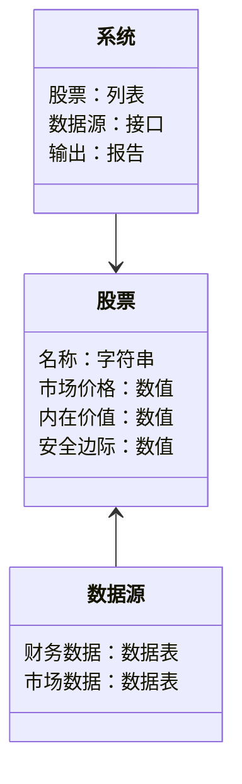
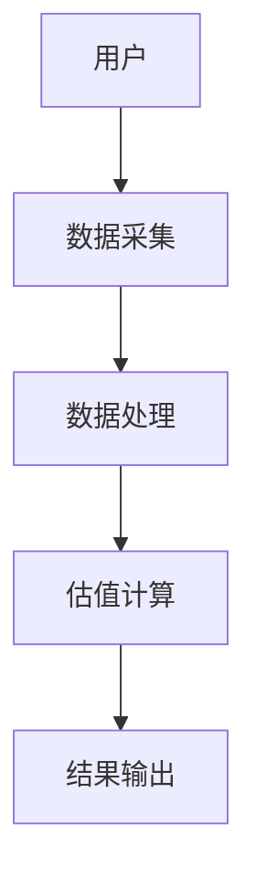
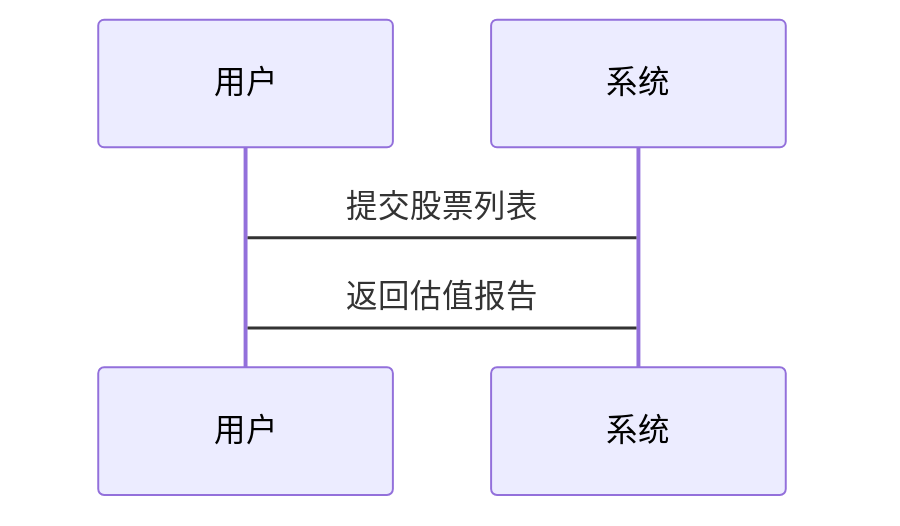

                 


# 格雷厄姆的保守估值方法：留足安全边际

## 关键词：
- 价值投资
- 安全边际
- 保守估值
- 内在价值
- 投资策略

## 摘要：
格雷厄姆的保守估值方法是价值投资的核心策略之一，强调在投资中留足安全边际，以降低风险并确保长期稳定的收益。本文将详细分析安全边际的定义、计算方法及其在投资决策中的应用，结合数学模型和实际案例，帮助投资者理解如何通过保守估值方法实现稳健的投资回报。

---

# 第1章: 投资的基本概念

## 1.1 投资的基本原理

### 1.1.1 资产与负债的定义
资产是企业或个人拥有的能够带来未来经济利益的资源，如现金、存货、固定资产等。负债是企业或个人需要偿还的债务，如贷款、应付账款等。资产减去负债等于所有者权益，这是财务报表的核心公式。

### 1.1.2 股东权益的构成
股东权益包括股本、资本公积、盈余公积和未分配利润等部分。它是企业净资产的价值，反映了股东对企业的所有权。

### 1.1.3 股票与债券的区别
股票是公司发行的权益凭证，代表股东对公司的所有权；债券是公司发行的债务凭证，代表债权人对公司的债权。股票的风险较高，但潜在回报也更高；债券的风险较低，回报相对稳定。

## 1.2 价值投资的起源与发展

### 1.2.1 价值投资的定义
价值投资是一种投资策略，强调以低于内在价值的价格买入优质资产，等待其价值回归。这种方法的核心是寻找市场低估的股票，并长期持有。

### 1.2.2 价值投资的起源
价值投资起源于20世纪初，由本杰明·格雷厄姆和戴维·多德共同提出。他们通过分析企业的基本面，寻找具有安全边际的投资标的。

### 1.2.3 价值投资的发展历程
价值投资在20世纪中期通过巴菲特的成功实践得到广泛认可，并逐渐发展成为一种成熟的投资策略。如今，价值投资已被广泛应用于股票、债券和其他资产的投资中。

## 1.3 格雷厄姆的投资理念

### 1.3.1 格雷厄姆的生平简介
本杰明·格雷厄姆是20世纪著名的价值投资者和投资理论家，被誉为“价值投资之父”。他在哥伦比亚大学教授投资课程，并培养了许多杰出的投资者，如巴菲特。

### 1.3.2 格雷厄姆的投资哲学
格雷厄姆的投资哲学强调安全性和稳定性，主张以低于内在价值的价格买入股票，并长期持有，等待市场重新评估其价值。

### 1.3.3 格雷厄姆与巴菲特的关系
格雷厄姆是巴菲特的导师，巴菲特继承并发展了格雷厄姆的价值投资理念，并将其应用于实践。

---

# 第2章: 安全边际的核心概念与原理

## 2.1 安全边际的定义

### 2.1.1 安全边际的内涵
安全边际是投资中的一种保护机制，指的是买入价格与内在价值之间的差距。这种差距可以为投资提供缓冲，避免因市场波动或估值误差而造成的损失。

### 2.1.2 安全边际的外延
安全边际不仅适用于股票投资，还可以应用于债券、房地产和其他资产的投资中。它是投资者在不确定市场中降低风险的重要工具。

### 2.1.3 安全边际的重要性
安全边际的重要性体现在以下几个方面：
1. 降低投资风险：通过留足安全边际，投资者可以减少因市场波动或估值误差带来的损失。
2. 提高投资收益：安全边际的存在使得投资者能够在市场低估时买入，在市场高估时卖出，从而获得超额收益。
3. 增强投资信心：安全边际为投资者提供了心理上的安全感，使其能够在市场波动中保持冷静。

## 2.2 安全边际的计算方法

### 2.2.1 内在价值的计算公式
$$ V = \frac{EFCF}{(r - g)} $$
其中：
- \( V \) 是内在价值
- \( EFCF \) 是企业自由现金流
- \( r \) 是折现率
- \( g \) 是现金流增长率

### 2.2.2 安全边际的计算公式
$$ \text{安全边际} = \text{内在价值} - \text{市场价格} $$

### 2.2.3 安全边际的百分比设置
格雷厄姆建议投资者以低于内在价值三分之一的价格买入股票，即安全边际应至少为内在价值的33%。

## 2.3 安全边际的应用场景

### 2.3.1 高增长企业的安全边际
对于高增长企业，安全边际的计算需要考虑未来现金流的增长潜力。由于高增长企业的未来现金流不确定性较大，安全边际应适当放宽。

### 2.3.2 高收益债券的安全边际
在债券投资中，安全边际可以通过比较债券的收益率与市场利率来确定。如果债券的收益率远高于市场利率，则具有较高的安全边际。

### 2.3.3 股票市场的周期性波动
股票市场的周期性波动对安全边际的计算提出了挑战。在市场低迷时，安全边际通常较大；在市场繁荣时，安全边际通常较小。

---

# 第3章: 保守估值方法的原理

## 3.1 保守估值的核心要素

### 3.1.1 收入与利润的预测
保守估值需要对企业的未来收入和利润进行合理的预测。预测应基于企业的历史数据和行业发展趋势，同时考虑经济周期和市场环境的影响。

### 3.1.2 资产与负债的评估
保守估值需要对企业的资产和负债进行详细评估。资产应以公允价值计量，负债应以现值计算。

### 3.1.3 市场风险的衡量
保守估值需要考虑市场风险对企业价值的影响。市场风险可以通过波动率、贝塔系数等指标进行衡量。

## 3.2 保守估值的数学模型

### 3.2.1 内在价值的公式推导
$$ V = \frac{EFCF}{(r - g)} $$
其中：
- \( EFCF \) 是企业自由现金流
- \( r \) 是折现率
- \( g \) 是现金流增长率

### 3.2.2 安全边际的计算公式
$$ \text{安全边际} = V - P $$
其中：
- \( V \) 是内在价值
- \( P \) 是市场价格

## 3.3 保守估值的实践应用

### 3.3.1 企业案例分析
以某公司为例，假设其企业自由现金流为1000万元，折现率为10%，现金流增长率为5%。则其内在价值为：
$$ V = \frac{1000}{0.10 - 0.05} = 20000 \text{万元} $$
如果市场价格为18000万元，则安全边际为：
$$ \text{安全边际} = 20000 - 18000 = 2000 \text{万元} $$

### 3.3.2 市场环境的影响
市场环境对保守估值的影响主要体现在折现率和现金流增长率的假设上。在经济低迷时期，折现率可能上升，现金流增长率可能下降，从而影响内在价值的计算。

### 3.3.3 估值模型的优缺点
保守估值模型的优点在于其简单易懂，适用于大多数企业；缺点在于其假设条件较为严格，可能无法准确反映复杂市场的实际情况。

---

# 第4章: 格雷厄姆的数学模型与公式

## 4.1 内在价值的计算

### 4.1.1 净现值法
净现值法（NPV）是保守估值中常用的一种方法。其公式为：
$$ NPV = \sum_{t=1}^{n} \frac{CF_t}{(1 + r)^t} - I $$
其中：
- \( CF_t \) 是第t年的现金流
- \( r \) 是折现率
- \( I \) 是初始投资

### 4.1.2 现值指数法
现值指数法（PV Index）是将未来现金流的现值与初始投资进行比较：
$$ PV \text{Index} = \frac{\sum_{t=1}^{n} \frac{CF_t}{(1 + r)^t}}{I} $$

### 4.1.3 内部收益率法
内部收益率法（IRR）是使得净现值为零的折现率：
$$ NPV = \sum_{t=1}^{n} \frac{CF_t}{(1 + IRR)^t} - I = 0 $$

## 4.2 安全边际的数学表达

### 4.2.1 估值区间法
通过计算股票的高估区间和低估区间，确定其安全边际：
$$ \text{低估区间} = V - \text{安全边际} $$
$$ \text{高估区间} = V + \text{安全边际} $$

### 4.2.2 相对估值法
相对估值法通过比较股票与行业平均估值水平，确定其安全边际：
$$ \text{安全边际} = \text{行业平均估值} - \text{股票估值} $$

### 4.2.3 市场倍数法
市场倍数法通过比较市盈率、市净率等指标，确定股票的安全边际：
$$ \text{安全边际} = \text{行业平均倍数} - \text{股票倍数} $$

## 4.3 估值模型的比较与选择

### 4.3.1 不同估值方法的比较
- 净现值法：适用于项目寿命有限的短期估值。
- 现值指数法：适用于项目寿命较长的长期估值。
- 内部收益率法：适用于现金流稳定的项目。

### 4.3.2 估值模型的选择
投资者应根据企业的具体情况和市场环境选择合适的估值模型。通常，净现值法和内部收益率法适用于单个企业，而现值指数法适用于多个项目的比较。

---

# 第5章: 系统分析与架构设计

## 5.1 问题场景介绍

### 5.1.1 投资目标
本文通过构建一个基于格雷厄姆保守估值方法的投资系统，帮助投资者实现稳健的投资回报。

### 5.1.2 项目介绍
本项目旨在开发一个自动化保守估值系统，利用大数据和机器学习技术，实现对企业内在价值的准确评估和安全边际的计算。

## 5.2 系统功能设计

### 5.2.1 领域模型设计
使用mermaid绘制领域模型类图，展示系统中的核心实体及其关系。



### 5.2.2 系统架构设计
使用mermaid绘制系统架构图，展示系统的整体架构和模块划分。



### 5.2.3 系统接口设计
系统接口包括数据输入接口、模型调用接口和结果输出接口。数据输入接口接收股票的财务数据和市场数据，模型调用接口调用保守估值算法，结果输出接口生成估值报告。

### 5.2.4 系统交互设计
使用mermaid绘制系统交互序列图，展示用户与系统之间的交互流程。



---

# 第6章: 项目实战

## 6.1 环境安装

### 6.1.1 数据库安装
安装MySQL或PostgreSQL数据库，用于存储股票的财务数据和市场数据。

### 6.1.2 代码库安装
使用Git克隆项目代码库：
```bash
git clone https://github.com/conservative-valuation-system/cvs.git
```

## 6.2 系统核心实现

### 6.2.1 数据处理模块
编写Python代码，读取股票的财务数据和市场数据，并进行清洗和预处理：
```python
import pandas as pd

# 读取财务数据
financial_data = pd.read_csv('financial.csv')

# 读取市场数据
market_data = pd.read_csv('market.csv')

# 数据清洗
financial_data.dropna(inplace=True)
market_data.dropna(inplace=True)
```

### 6.2.2 估值计算模块
实现保守估值算法，计算股票的内在价值和安全边际：
```python
def calculate_intrinsic_value(financial_data, market_data):
    # 计算企业自由现金流
    EFCF = financial_data['EBITDA'] - financial_data['利息支出'] - financial_data['税收'] - financial_data['资本支出']
    # 计算折现率
    r = market_data['市场利率'] + market_data['风险溢价']
    # 计算现金流增长率
    g = financial_data['净利润增长率']
    # 计算内在价值
    V = EFCF / (r - g)
    return V

def calculate_margin_of_safety(V, P):
    # 计算安全边际
    margin = V - P
    return margin
```

### 6.2.3 报告生成模块
将估值结果生成报告，并输出给用户：
```python
def generate_report(margin):
    print(f"安全边际为：{margin}")
    print(f"建议以低于内在价值的价格买入该股票")
```

## 6.3 代码应用与解读

### 6.3.1 数据处理模块的实现
通过数据清洗和预处理，确保输入数据的准确性和完整性。

### 6.3.2 估值计算模块的实现
通过保守估值算法，计算股票的内在价值和安全边际，为投资决策提供依据。

### 6.3.3 实际案例分析
以某公司为例，假设其财务数据和市场数据如下：
```python
# 示例数据
financial_data = pd.DataFrame({
    'EBITDA': [1000],
    '利息支出': [50],
    '税收': [30],
    '资本支出': [200]
})

market_data = pd.DataFrame({
    '市场利率': [5%],
    '风险溢价': [2%]
})

# 计算内在价值
V = calculate_intrinsic_value(financial_data, market_data)
print(f"内在价值为：{V}")

# 假设市场价格为18000万元
P = 18000
margin = calculate_margin_of_safety(V, P)
generate_report(margin)
```

## 6.4 项目小结

### 6.4.1 项目总结
通过本项目，我们实现了基于格雷厄姆保守估值方法的投资系统，能够自动计算股票的内在价值和安全边际，为投资者提供科学的投资决策支持。

### 6.4.2 项目成果
本项目的主要成果包括：
- 开发了一个自动化保守估值系统
- 提供了股票估值的详细报告
- 实现了投资决策的支持功能

---

# 第7章: 最佳实践与总结

## 7.1 小结

### 7.1.1 核心观点回顾
格雷厄姆的保守估值方法强调留足安全边际，以降低投资风险并实现稳健的收益。

### 7.1.2 重要结论
通过保守估值方法，投资者可以在市场低估时买入，在市场高估时卖出，从而实现长期稳定的收益。

## 7.2 注意事项

### 7.2.1 风险提示
投资者在使用保守估值方法时，应充分考虑市场环境的变化和企业的实际情况，避免盲目跟从。

### 7.2.2 投资策略建议
投资者应根据自身的风险承受能力和投资目标，选择合适的保守估值策略。

## 7.3 未来展望

### 7.3.1 研究方向
未来的研究可以进一步完善保守估值模型，探索其在不同市场环境下的应用。

### 7.3.2 技术发展
随着大数据和人工智能技术的发展，保守估值方法将更加精确和高效。

---

# 结语

通过本文的详细分析，我们可以看到格雷厄姆的保守估值方法是一种科学的投资策略，能够帮助投资者在不确定的市场中实现稳健的收益。希望本文的分析和实践能够为投资者提供有价值的参考，帮助他们在投资道路上走得更稳、更远。

