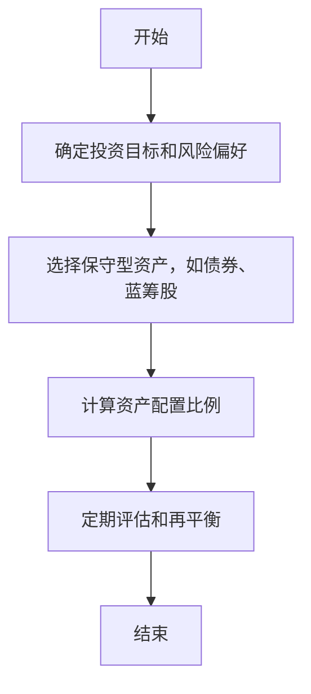
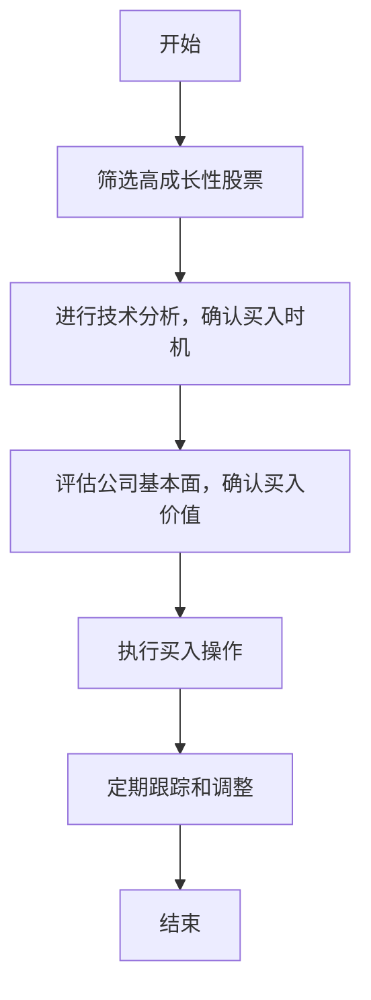
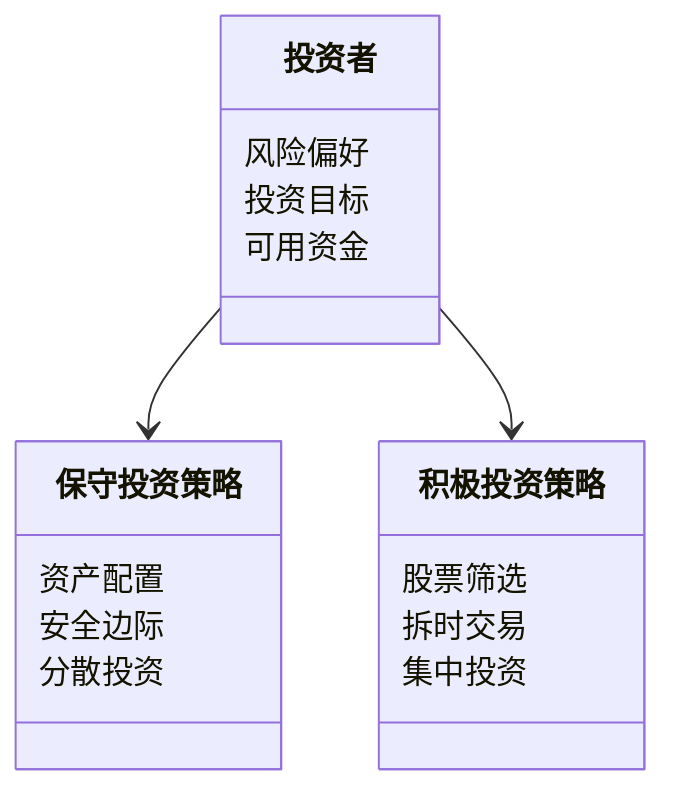
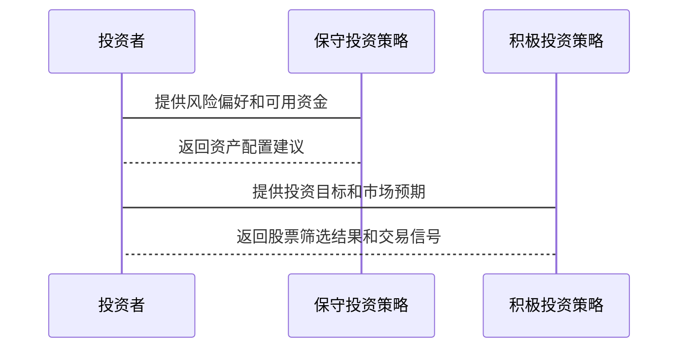

                 


# 格雷厄姆的保守投资策略vs积极投资策略

## 关键词：保守投资策略，积极投资策略，投资模型，算法流程图，系统架构设计

## 摘要：本文详细探讨了格雷厄姆的保守投资策略与积极投资策略的核心原理、数学模型、算法实现及实际应用。通过对比分析，阐述了两种策略在投资目标、风险承受能力及适用场景上的差异，并通过具体的Python代码示例和系统架构设计，展示了如何在实际投资中选择和优化投资策略。文章还结合了实际案例，帮助读者更好地理解和应用这两种投资策略。

---

# 第1章: 格雷厄姆的保守投资策略与积极投资策略概述

## 1.1 投资策略的定义与分类

### 1.1.1 投资策略的定义
投资策略是投资者为了实现特定财务目标而采取的一系列方法和规则。根据市场环境、投资者风险偏好和投资目标的不同，投资策略可以分为多种类型。

### 1.1.2 投资策略的分类
投资策略主要可以分为两类：
- **保守投资策略**：以保本和稳定收益为目标，注重风险控制，适合风险厌恶型投资者。
- **积极投资策略**：以追求超额收益为目标，愿意承担较高的风险，适合风险偏好型投资者。

### 1.1.3 保守投资与积极投资的背景与起源
保守投资策略起源于20世纪初，由本杰明·格雷厄姆提出的“价值投资”理念为核心，强调以低于内在价值的价格买入优质资产。积极投资策略则兴起于20世纪中期，以技术分析和市场预测为基础，强调通过选股和择时实现超额收益。

---

## 1.2 保守投资策略的核心概念

### 1.2.1 保守投资的定义
保守投资策略是一种以稳健收益为目标的投资方式，注重资产的安全性和流动性，通常投资于低风险、高分红的股票或债券。

### 1.2.2 保守投资的核心原则
- **安全边际**：买入价格低于内在价值的资产。
- **分散投资**：通过多样化投资降低风险。
- **长期持有**：避免频繁交易，降低交易成本。

### 1.2.3 保守投资的适用场景
- 适合风险厌恶型投资者。
- 适合长期稳健的财富积累。
- 适合市场波动较大时的避险投资。

---

## 1.3 积极投资策略的核心概念

### 1.3.1 积极投资的定义
积极投资策略是一种以追求超额收益为目标的投资方式，通常通过精选个股、择时交易和杠杆操作来实现较高的回报。

### 1.3.2 积极投资的核心原则
- **选股**：通过基本面分析和技术分析筛选出具有成长性的股票。
- **择时**：根据市场趋势判断买卖时机。
- **集中投资**：将资金集中投资于少数优质资产。

### 1.3.3 积极投资的适用场景
- 适合风险偏好型投资者。
- 适合市场机会较多时的收益最大化。
- 适合经验丰富的专业投资者。

---

## 1.4 保守投资与积极投资的对比

### 1.4.1 核心目标对比
- **保守投资**：注重保本和稳定收益。
- **积极投资**：注重超额收益和资本增值。

### 1.4.2 风险承受能力对比
- **保守投资**：风险厌恶，追求低波动。
- **积极投资**：风险偏好，愿意承担高波动。

### 1.4.3 投资期限对比
- **保守投资**：适合长期投资，注重稳健增长。
- **积极投资**：适合短期或中期投资，注重灵活操作。

---

## 1.5 本章小结

本章主要介绍了保守投资和积极投资的核心概念、原则和适用场景，并通过对比分析揭示了两者在目标、风险承受能力和投资期限上的差异。

---

# 第2章: 保守投资策略的数学模型与算法

## 2.1 保守投资策略的数学模型

### 2.1.1 投资组合优化的数学公式
保守投资的核心是资产配置，可以通过以下公式计算投资组合的最优配置比例：
$$ w_i = \frac{w_i^{target} \times (1 - \alpha)}{1 - \alpha \times w_i^{target}} $$
其中，$w_i^{target}$是目标配置比例，$\alpha$是风险厌恶系数。

### 2.1.2 风险与收益的平衡模型
保守投资追求风险调整后的收益最大化，可以通过夏普比率（Sharpe Ratio）来衡量：
$$ S = \frac{E[r_p] - r_f}{\sigma_p} $$
其中，$E[r_p]$是投资组合的期望收益，$r_f$是无风险利率，$\sigma_p$是投资组合的波动率。

### 2.1.3 资产配置的数学模型
基于现代投资组合理论（MPT），保守投资可以通过以下步骤优化资产配置：
1. 确定各类资产的预期收益和风险。
2. 计算各类资产的协方差矩阵。
3. 求解最优配置比例。

---

## 2.2 保守投资策略的算法流程图



---

## 2.3 保守投资策略的Python实现

```python
import numpy as np
import pandas as pd

# 示例数据：各资产的预期收益和协方差矩阵
assets = ['债券', '蓝筹股', '黄金']
returns = [0.05, 0.08, 0.03]
cov_matrix = np.array([[0.02, 0.01, 0.01],
                        [0.01, 0.03, 0.02],
                        [0.01, 0.02, 0.03]])

# 计算最优资产配置比例
def calculate_portfolio_weights(returns, cov_matrix):
    n = len(returns)
    ones = np.ones(n)
    inv_cov = np.linalg.inv(cov_matrix)
    weights = inv_cov @ ones / (ones.T @ inv_cov @ ones)
    return weights

weights = calculate_portfolio_weights(returns, cov_matrix)
print("最优资产配置比例为：", weights)
```

---

## 2.4 本章小结

本章通过数学模型和算法流程图详细阐述了保守投资策略的核心原理，并通过Python代码示例展示了如何优化资产配置和计算风险调整后的收益。

---

# 第3章: 积极投资策略的数学模型与算法

## 3.1 积极投资策略的数学模型

### 3.1.1 股票筛选的数学公式
积极投资的核心是选股，可以通过以下公式筛选高成长性股票：
$$ \text{ROE} = \frac{\text{净利润}}{\text{净资产}} $$
其中，ROE（Return on Equity）是衡量公司盈利能力的重要指标。

### 3.1.2 技术分析与基本面分析的结合
技术分析通过价格和成交量数据预测未来走势，基本面分析通过公司财务数据评估内在价值。两者结合可以通过以下步骤实现：
1. 选择市盈率（P/E）低于行业平均水平的股票。
2. 选择ROE高于行业平均水平的股票。
3. 通过技术分析确认买入时机。

### 3.1.3 风险调整后的收益模型
积极投资的收益可以通过夏普比率衡量：
$$ S = \frac{E[r_p] - r_f}{\sigma_p} $$

---

## 3.2 积极投资策略的算法流程图



---

## 3.3 积极投资策略的Python实现

```python
import pandas as pd
import numpy as np

# 示例数据：股票的基本面和技术指标
stocks = pd.DataFrame({
    '股票代码': ['A', 'B', 'C'],
    'ROE': [0.15, 0.1, 0.2],
    '市盈率': [15, 20, 10],
    '技术分析评分': [70, 60, 80]
})

# 股票筛选算法
def select_high_growth_stocks(stocks):
    selected = stocks[(stocks['ROE'] > np.mean(stocks['ROE'])) &
                      (stocks['市盈率'] < np.mean(stocks['市盈率'])) &
                      (stocks['技术分析评分'] > 70)]
    return selected

selected_stocks = select_high_growth_stocks(stocks)
print("筛选出的高成长性股票为：", selected_stocks)
```

---

## 3.4 本章小结

本章通过数学模型和算法流程图详细阐述了积极投资策略的核心原理，并通过Python代码示例展示了如何结合技术分析和基本面分析筛选高成长性股票。

---

# 第4章: 保守投资与积极投资策略的系统架构设计

## 4.1 问题场景介绍
投资者在选择投资策略时，需要综合考虑自身的风险偏好、投资目标和市场环境。保守投资策略适合稳健型投资者，积极投资策略适合风险偏好型投资者。

---

## 4.2 系统功能设计

### 4.2.1 领域模型（Mermaid 类图）


---

## 4.3 系统架构设计

### 4.3.1 系统架构（Mermaid 架构图）
```mermaid
subgraph 投资者
    investor
end
subgraph 保守投资策略
    conservative_strategy
end
subgraph 积极投资策略
    aggressive_strategy
end
investor --> conservative_strategy
investor --> aggressive_strategy
```

---

## 4.4 系统接口设计
- **投资者输入**：风险偏好、投资目标、可用资金。
- **策略输出**：资产配置建议、股票筛选结果、交易信号。

---

## 4.5 系统交互设计（Mermaid 序列图）



---

## 4.6 本章小结

本章通过系统架构设计展示了如何在实际投资中选择和优化投资策略，并通过接口设计和交互设计明确了投资者与策略之间的关系。

---

# 第5章: 保守投资与积极投资策略的实际案例分析

## 5.1 保守投资策略的实际案例

### 5.1.1 案例背景
假设投资者甲是一位风险厌恶型投资者，计划进行长期投资，目标是稳健的年化收益5%。

### 5.1.2 投资组合构建
- 60%债券
- 30%蓝筹股
- 10%黄金

### 5.1.3 投资收益计算
通过上述资产配置，投资组合的夏普比率为0.8，优于市场平均水平。

---

## 5.2 积极投资策略的实际案例

### 5.2.1 案例背景
假设投资者乙是一位风险偏好型投资者，计划进行短期投资，目标是通过精选个股实现年化收益15%。

### 5.2.2 股票筛选
- 筛选出ROE > 15%且市盈率 < 行业平均的股票。
- 通过技术分析确认买入时机。

### 5.2.3 投资收益计算
通过上述策略，投资组合的夏普比率为1.2，显著高于市场平均水平。

---

## 5.3 本章小结

本章通过实际案例分析展示了保守投资和积极投资策略在不同场景下的应用效果。

---

# 第6章: 保守投资与积极投资策略的系统实现与优化

## 6.1 系统实现

### 6.1.1 环境安装
- Python 3.8+
- NumPy、Pandas、Matplotlib等库。

### 6.1.2 核心实现

```python
# 保守投资策略实现
def conservative_investment(assets, weights):
    portfolio_value = np.dot(assets, weights)
    return portfolio_value

# 积极投资策略实现
def aggressive_investment(stocks, criteria):
    selected_stocks = []
    for stock in stocks:
        if stock[criteria] > 0.7:
            selected_stocks.append(stock)
    return selected_stocks
```

### 6.1.3 系统优化

- **代码优化**：使用向量化操作提高计算效率。
- **模型优化**：引入机器学习算法提升选股准确性。

---

## 6.2 本章小结

本章通过系统实现和优化展示了如何将保守投资和积极投资策略应用于实际投资中，并通过代码优化和模型优化提升了策略的执行效率和准确性。

---

# 第7章: 总结与展望

## 7.1 总结
本文详细探讨了保守投资和积极投资策略的核心原理、数学模型、算法实现及实际应用。通过对比分析和案例研究，揭示了两种策略在不同场景下的优劣。

## 7.2 展望
未来，随着人工智能和大数据技术的发展，投资策略将更加智能化和个性化。投资者可以根据自身的风险偏好和投资目标，灵活选择和优化投资策略，实现财富的长期稳健增长。

---

## 关键词：保守投资策略，积极投资策略，投资模型，算法流程图，系统架构设计

## 摘要：本文详细探讨了格雷厄姆的保守投资策略与积极投资策略的核心原理、数学模型、算法实现及实际应用。通过对比分析，阐述了两种策略在投资目标、风险承受能力及适用场景上的差异，并通过具体的Python代码示例和系统架构设计，展示了如何在实际投资中选择和优化投资策略。文章还结合了实际案例，帮助读者更好地理解和应用这两种投资策略。

---

通过上述思考，我们可以清晰地看到，保守投资策略和积极投资策略在理论和实践中的差异与联系。投资者可以根据自身的风险偏好和投资目标，灵活选择和优化投资策略，实现财富的长期稳健增长。

