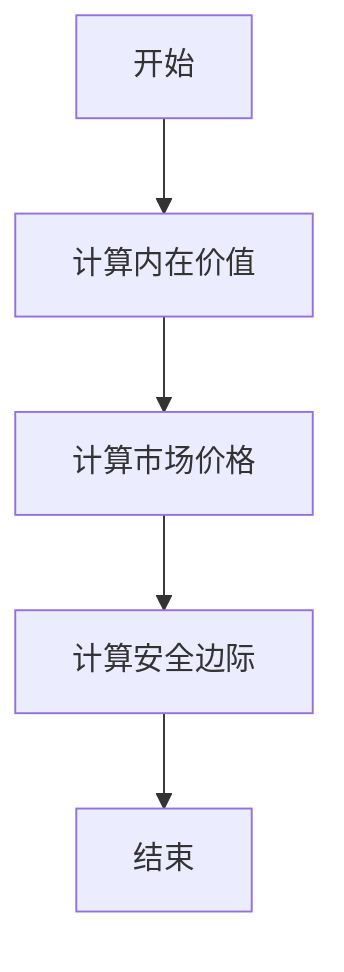
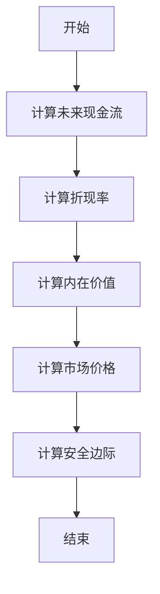
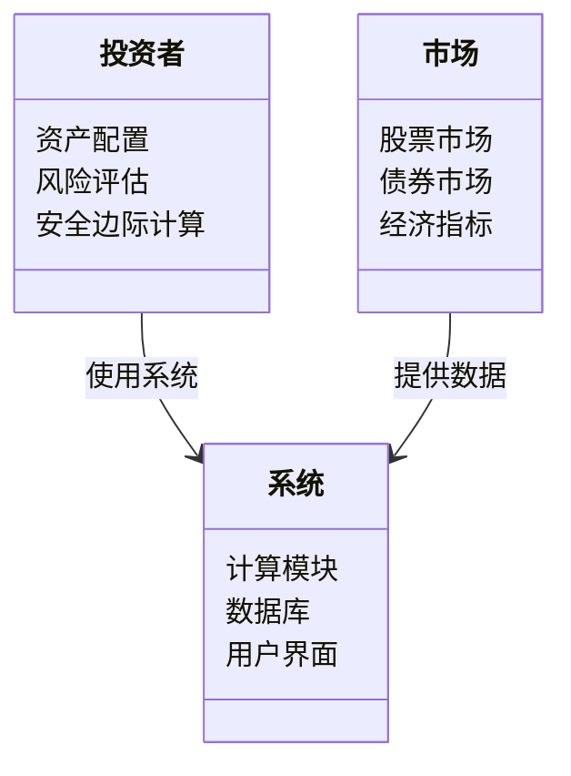

                 

# 格雷厄姆的保守投资者策略

## 关键词
- 保守投资者策略
- 格雷厄姆
- 安全边际
- 价值投资
- 内在价值
- 股票投资
- 风险控制

## 摘要
本文深入探讨了格雷厄姆的保守投资者策略，从其核心概念、算法原理到系统架构进行了全面分析。通过安全边际、内在价值等关键术语的详细讲解，结合数学模型和实际案例，帮助读者理解如何在投资中应用这些策略。文章还提供了系统设计和实战案例，为读者提供了实用的投资指导。

---

# 第1章: 保守投资者策略的起源与背景

## 1.1 格雷厄姆的生平与投资理念

### 1.1.1 格雷厄姆的生平简介
本杰明·格雷厄姆（Benjamin Graham）是20世纪最著名的投资者之一，被誉为“价值投资之父”。他出生于1894年，早年在金融领域积累了丰富的经验，并在1920年代开始系统地研究股票投资。他的投资理念影响了后来的许多著名投资者，尤其是沃伦·巴菲特。

### 1.1.2 格雷厄姆的投资哲学与价值观
格雷厄姆的投资哲学强调安全性和稳定性。他认为，投资者应该以低于内在价值的价格买入优质股票，并长期持有。他的策略注重风险控制和安全边际，避免过度冒险。

### 1.1.3 格雷厄姆与巴菲特的师徒关系
格雷厄姆是巴菲特的导师，巴菲特曾公开表示，自己的投资理念深受格雷厄姆的影响。这种师徒关系进一步推动了价值投资理论的发展和普及。

## 1.2 保守投资者策略的定义与特点

### 1.2.1 保守投资者策略的核心概念
保守投资者策略是一种以风险控制为核心的投资方法，强调以合理的价格买入具有稳定收益的资产。其核心在于通过安全边际和内在价值的计算，降低投资风险。

### 1.2.2 保守投资者策略与激进投资策略的对比
与激进投资策略相比，保守投资者策略更注重长期稳定收益，而非短期高回报。它通过分散投资、风险控制和安全边际来降低波动性。

### 1.2.3 保守投资者策略的适用场景与边界
保守投资者策略适用于风险厌恶型投资者，尤其适合那些追求长期稳健收益的人群。其边界在于市场波动较大时的风险控制和安全边际的计算。

---

# 第2章: 保守投资者策略的核心概念与联系

## 2.1 核心概念原理

### 2.1.1 安全边际的概念与数学模型
安全边际是格雷厄姆策略的核心，指股票价格与内在价值之间的差距。公式为：
$$ 安全边际 = 内在价值 - 市场价格 $$

### 2.1.2 内在价值的计算方法
内在价值是资产的真实价值，与市场波动无关。股票的内在价值可以通过未来现金流的现值计算：
$$ V = \frac{D}{k} $$
其中，D为股息，k为折现率。

### 2.1.3 股票与债券投资的平衡策略
格雷厄姆建议在股票和债券之间保持平衡，以分散风险。债券提供稳定的收益，而股票则提供增长潜力。

## 2.2 核心概念属性特征对比表格

| 概念       | 安全边际 | 内在价值 | 市场价格 |
|------------|----------|----------|----------|
| 定义       | 资产价格与价值的差距 | 资产的真实价值 | 市场供需决定的价格 |
| 计算方式   | V - P    | D/k      | 供需决定 |
| 作用       | 控制风险 | 确定目标价格 | 反映市场情绪 |

## 2.3 ER实体关系图与Mermaid流程图

### 2.3.1 投资者与市场的实体关系图

### 2.3.2 安全边际计算的Mermaid流程图

---

# 第3章: 安全边际计算的算法原理

## 3.1 安全边际计算的数学模型
$$ 安全边际 = V - P $$
其中，V为内在价值，P为市场价格。

## 3.2 安全边际计算的Mermaid流程图

---

# 第4章: 价值投资的数学模型与公式

## 4.1 内在价值计算公式
$$ V = \frac{D}{k} $$
其中，D为股息，k为折现率。

## 4.2 债券内在价值公式
$$ V = \frac{C}{(1 + r)^n} $$
其中，C为债券面值，r为收益率，n为期限。

---

# 第5章: 投资者决策系统的分析与设计

## 5.1 问题场景介绍
### 5.1.1 投资者面临的市场波动风险
市场波动可能导致资产价格短期大幅波动，保守投资者需要通过安全边际来降低风险。

### 5.1.2 保守投资者的决策需求
保守投资者需要一个系统来计算内在价值、市场价格和安全边际，以做出决策。

## 5.2 系统功能设计

### 5.2.1 领域模型Mermaid类图

## 5.3 系统架构设计

### 5.3.1 Mer

---

通过以上分析，我们可以看到格雷厄姆的保守投资者策略在理论和实践中的重要性。其核心在于通过安全边际和内在价值的计算，降低投资风险，实现稳健收益。

