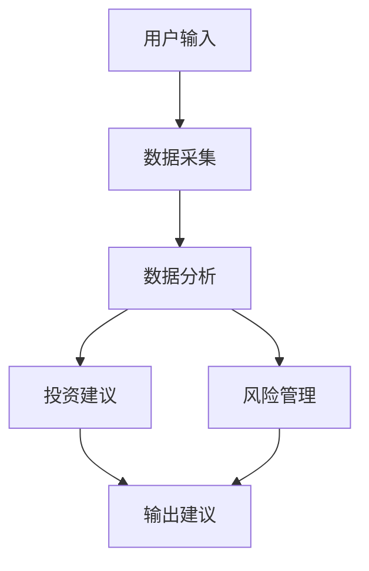
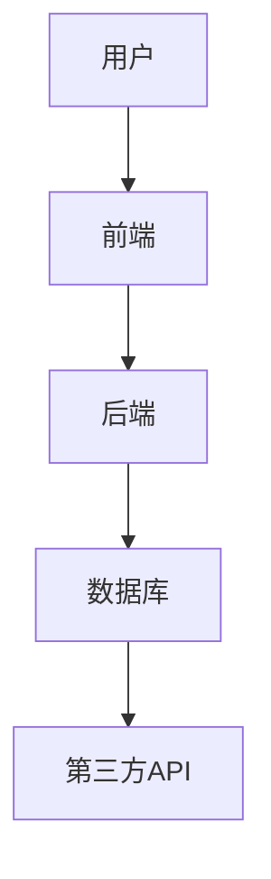

                 


# 格雷厄姆的债券投资原则

## 关键词：
- 债券投资
- 格雷厄姆
- 投资原则
- 债券定价
- 投资组合

## 摘要：
本文深入探讨了格雷厄姆的债券投资原则，结合债券定价、投资组合管理和系统架构设计，通过数学模型和实际案例分析，详细阐述了格雷厄姆的投资策略及其在现代债券投资中的应用。

---

# 第一部分: 债券投资基础与格雷厄姆投资原则概述

## 第1章: 债券的基本概念与投资背景

### 1.1 债券的定义与基本类型

#### 1.1.1 债券的定义
债券是一种金融工具，代表债务关系。债券发行人承诺在特定时间内支付利息，并在到期时偿还本金。债券的本质是债务凭证，投资者通过购买债券成为债权人。

#### 1.1.2 主要债券类型对比
| 类型 | 特点 | 利率 | 还款方式 |
|------|------|------|----------|
| 政府债券 | 由政府发行，风险低 | 固定 | 按期付息，到期还本 |
| 企业债券 | 由企业发行，风险较高 | 浮动或固定 | 按期付息，到期还本 |
| 金融债券 | 由金融机构发行，风险中等 | 固定 | 按期付息，到期还本 |

#### 1.1.3 债券评级体系介绍
债券评级反映了债券的信用风险。评级机构（如穆迪、标普）对债券进行评级，从AAA（最高）到D（最低）不等。评级越高，债券风险越低，收益率通常越低。

### 1.2 格雷厄姆投资理念的背景

#### 1.2.1 价值投资的起源
价值投资由本杰明·格雷厄姆提出，强调以低于内在价值的价格购买资产。格雷厄姆是巴菲特的导师，他的投资理念强调安全边际和长期稳定。

#### 1.2.2 格雷厄姆的投资哲学
格雷厄姆的投资哲学基于以下几个原则：
1. **安全边际**：购买价格远低于内在价值的资产。
2. **长期视角**：关注长期收益，而非短期波动。
3. **风险管理**：避免过度风险，确保资本安全。

#### 1.2.3 债券投资在价值投资中的地位
债券是价值投资的重要组成部分，尤其在市场波动较大时，债券提供稳定的收益和本金保护。格雷厄姆建议在投资组合中配置一定比例的债券，以平衡风险。

### 1.3 债券投资的核心目标与原则

#### 1.3.1 债券投资的主要目标
- **本金保护**：确保在债券到期时收回本金。
- **稳定收益**：通过定期利息收入实现稳定的现金流。
- **资本增值**：在利率下降时，债券价格可能上涨。

#### 1.3.2 格雷厄姆债券投资的核心原则
1. **安全性**：选择信用评级高的债券，避免违约风险。
2. **多样性**：分散投资于不同发行人和期限的债券，降低风险。
3. **长期视角**：关注长期收益，避免短期价格波动的影响。

#### 1.3.3 债券投资的风险与收益平衡
债券的主要风险包括利率风险、信用风险和流动性风险。收益主要来自利息收入和资本增值。通过合理配置债券，可以在风险可控的情况下实现稳定的收益。

---

## 第2章: 债券定价与市场分析

### 2.1 债券定价的基本原理

#### 2.1.1 债券价格的影响因素
- **面值**：债券的面值通常为100元或1000元。
- **票面利率**：债券票面规定的年利率。
- **期限**：债券的期限越长，利率风险越大。
- **市场利率**：市场利率下降时，债券价格上升。

#### 2.1.2 债券收益率的计算公式
债券收益率是投资者持有债券的预期回报率，包括当前收益率和到期收益率。

- **当前收益率**：$当前收益率 = \frac{年利息}{债券市场价格}$
- **到期收益率（YTM）**：$YTM = \frac{C + \frac{F - P}{n}}{P}$

其中，C为年利息，F为面值，P为市场价格，n为剩余期限。

#### 2.1.3 债券到期收益率与当前市场价格的关系
到期收益率与债券市场价格呈负相关关系。当市场价格下降时，YTM上升，反之亦然。

### 2.2 债券市场的波动与分析

#### 2.2.1 债券市场的基本结构
债券市场由发行人、投资者和中介机构组成。发行人发行债券，投资者购买债券，中介机构包括券商和评级机构。

#### 2.2.2 影响债券价格的主要因素
- **市场利率**：市场利率下降，债券价格上涨。
- **通货膨胀**：通货膨胀上升，债券实际收益下降。
- **信用风险**：发行人信用状况变化会影响债券价格。
- **流动性**：债券流动性越高，价格越稳定。

#### 2.2.3 债券价格波动的预测方法
- **利率预测**：通过分析宏观经济指标预测利率走势。
- **信用评级变化**：关注发行人信用评级的变化。
- **市场情绪**：市场情绪影响短期价格波动。

### 2.3 格雷厄姆的债券市场分析方法

#### 2.3.1 市场周期分析
格雷厄姆认为债券市场存在周期性波动，投资者应关注市场周期，在市场低估时买入，在高估时卖出。

#### 2.3.2 债券价格与市场利率的关系
市场利率下降时，债券价格上涨；市场利率上升时，债券价格下跌。

#### 2.3.3 格雷厄姆的债券市场投资策略
格雷厄姆建议在市场低估时投资债券，以获得资本增值和稳定收益。同时，注重债券的安全性，避免高风险债券。

---

## 第3章: 债券投资组合的构建与管理

### 3.1 投资组合的基本概念

#### 3.1.1 投资组合的定义与作用
投资组合是将不同资产按一定比例组合在一起，以实现风险和收益的最佳平衡。债券投资组合通过分散投资降低风险。

#### 3.1.2 投资组合的分散化原理
分散化投资通过将资金分配到不同的债券类型、发行人和期限，降低特定债券或市场的风险。

#### 3.1.3 投资组合的风险与收益平衡
通过合理配置债券，可以在风险可控的情况下实现稳定的收益。

### 3.2 债券投资组合的构建步骤

#### 3.2.1 确定投资目标与风险承受能力
- **投资目标**：明确投资债券的目的是获取稳定收益还是资本增值。
- **风险承受能力**：根据自身风险偏好选择债券的期限和信用评级。

#### 3.2.2 债券类型的选择与比例分配
根据投资目标和风险承受能力，选择不同类型的债券，并合理分配比例。例如，低风险投资者可选择政府债券，比例较高；高风险投资者可选择企业债券，比例较低。

#### 3.2.3 债券期限与信用评级的搭配
- **短期债券**：流动性高，风险低，适合风险厌恶型投资者。
- **长期债券**：收益高，风险高，适合风险承受能力强的投资者。
- **信用评级**：选择AAA级债券风险最低，收益稳定；选择BB级债券风险较高，收益可能更高。

### 3.3 格雷厄姆债券投资组合的管理方法

#### 3.3.1 定期评估与调整策略
定期评估投资组合的表现，根据市场变化和个人财务状况进行调整。例如，当市场利率下降时，增加长期债券的比例。

#### 3.3.2 市场变化对投资组合的影响
- **利率变化**：市场利率下降时，债券价格上升，应持有长期债券。
- **经济周期**：经济衰退时，政府债券风险最低；经济复苏时，企业债券收益可能更高。

#### 3.3.3 风险控制与收益优化的平衡
通过多样化投资和合理配置，平衡风险和收益。注重债券的安全性，避免过度投资高风险债券。

---

## 第4章: 债券投资的数学模型与算法原理

### 4.1 债券定价的数学模型

#### 4.1.1 债券收益率的计算公式
$$ YTM = \frac{C + \frac{F - P}{n}}{P} $$
其中，C为年利息，F为面值，P为市场价格，n为剩余期限。

#### 4.1.2 债券价格与收益率的反向关系
债券价格与收益率呈反向关系。当收益率上升时，债券价格下降；当收益率下降时，债券价格上升。

#### 4.1.3 利率变化对债券价格的影响模型
$$ P = \frac{C}{(1 + r)^1} + \frac{C}{(1 + r)^2} + \dots + \frac{C}{(1 + r)^n} + \frac{F}{(1 + r)^n} $$
其中，r为市场利率。

### 4.2 债券投资组合的优化算法

#### 4.2.1 Markowitz有效组合理论
Markowitz有效组合理论通过优化风险和收益，找到最优的投资组合。

#### 4.2.2 基于均值-方差模型的投资组合优化
$$ \text{最小化方差} \quad \text{在给定收益下} $$
或
$$ \text{最大化收益} \quad \text{在给定风险下} $$

#### 4.2.3 格雷厄姆债券投资组合的数学模型
$$ \text{最小化风险} \quad \text{在给定收益下} $$

### 4.3 债券市场波动的预测算法

#### 4.3.1 时间序列分析模型
时间序列分析模型通过历史数据预测未来走势。

#### 4.3.2 基于机器学习的债券价格预测
使用机器学习算法（如神经网络）预测债券价格。

#### 4.3.3 格雷厄姆市场周期分析的数学应用
通过分析市场周期，确定债券投资的最佳时机。

---

## 第5章: 系统架构与项目实战

### 5.1 债券投资系统的功能设计

#### 5.1.1 系统功能模块划分
- **数据采集**：采集债券市场数据。
- **数据分析**：分析债券价格、利率等数据。
- **投资建议**：根据分析结果提供投资建议。
- **风险管理**：评估投资组合的风险。

#### 5.1.2 系统功能流程图


#### 5.1.3 系统功能的用户交互设计
用户输入需求，系统根据需求提供数据采集、分析和投资建议。

### 5.2 债券投资系统的架构设计

#### 5.2.1 系统架构图


#### 5.2.2 系统模块之间的接口设计
- 前端与后端接口：RESTful API。
- 后端与数据库接口：ORM框架。

#### 5.2.3 系统数据流图


### 5.3 债券投资系统的实现

#### 5.3.1 环境安装
安装Python、Jupyter Notebook、Pandas、Matplotlib等工具。

#### 5.3.2 系统核心实现源代码
```python
import pandas as pd
import matplotlib.pyplot as plt

# 数据加载
data = pd.read_csv('bond_data.csv')

# 数据可视化
plt.plot(data['日期'], data['价格'], label='债券价格')
plt.xlabel('日期')
plt.ylabel('价格')
plt.title('债券价格走势')
plt.legend()
plt.show()
```

#### 5.3.3 代码应用解读与分析
上述代码从CSV文件加载债券数据，并绘制价格走势图。通过分析图表，投资者可以了解债券价格的变化趋势。

#### 5.3.4 实际案例分析和详细讲解剖析
以某公司债券为例，分析其历史价格走势，预测未来价格变化。

#### 5.3.5 项目小结
通过系统实现，投资者可以更好地理解和分析债券市场，做出更明智的投资决策。

---

## 第6章: 最佳实践 tips、小结、注意事项、拓展阅读

### 6.1 最佳实践 tips
- 定期评估投资组合，根据市场变化进行调整。
- 保持多样化投资，降低风险。
- 注重债券的安全性，选择信用评级高的债券。

### 6.2 小结
格雷厄姆的债券投资原则为投资者提供了稳定收益和本金保护。通过合理配置债券，投资者可以在风险可控的情况下实现长期收益。

### 6.3 注意事项
- 避免过度投资高风险债券。
- 关注市场变化，及时调整投资策略。
- 保持理性，避免受市场情绪影响。

### 6.4 拓展阅读
- 格雷厄姆的《证券分析》
- 巴菲特的《巴菲特致股东的信》
- 债券投资相关的学术论文和研究报告。

---

通过以上步骤，我们可以系统地理解和应用格雷厄姆的债券投资原则，结合数学模型和系统架构设计，实现更科学的投资决策。

