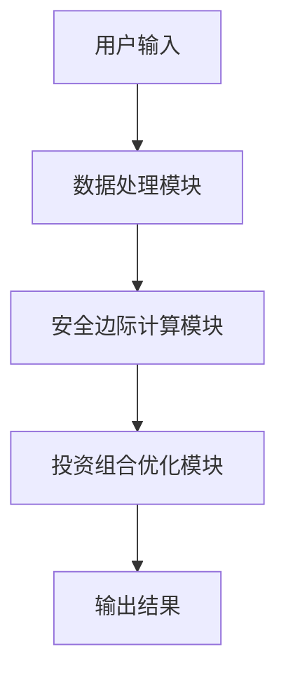
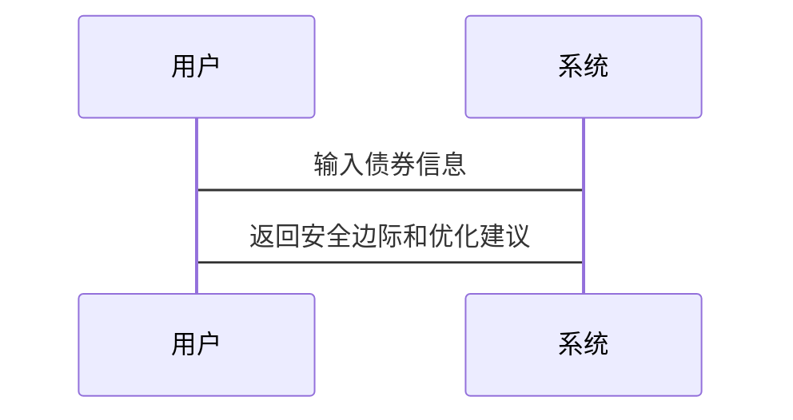

                 


# 格雷厄姆的债券投资策略及其现代应用

**关键词**：格雷厄姆、债券投资策略、价值投资、安全边际、现代投资组合

**摘要**：本文详细探讨了格雷厄姆的债券投资策略，从其核心理念、数学模型到现代应用，结合实际案例和系统架构设计，分析其在当前金融市场中的适应性与优化方法。通过逐步推理和逻辑分析，揭示了格雷厄姆策略的深层原理及其在现代投资组合管理中的重要性。

---

# 第1章 格雷厄姆债券投资策略的背景介绍

## 1.1 债券投资的基本概念

### 1.1.1 债券的定义与分类

债券是债务工具的一种，发行人向债券持有者借款，并在特定时间内按约定支付利息和本金。债券主要分为政府债券、企业债券和抵押债券等。

### 1.1.2 债券市场的基本结构

债券市场由发行市场和流通市场组成，投资者通过一级市场购买新发行债券，或通过二级市场交易现有债券。

### 1.1.3 债券收益率的计算公式

债券的收益率可以通过以下公式计算：

$$i = \frac{C}{P} \times 100\%$$

其中，$i$ 是到期收益率，$C$ 是债券的年利息，$P$ 是债券的市场价格。

---

## 1.2 格雷厄姆的投资理念

### 1.2.1 价值投资的核心思想

格雷厄姆强调以低于内在价值的价格买入资产，追求安全性和稳定性，而非短期收益。

### 1.2.2 安全边际的概念

安全边际是指债券市场价格低于其内在价值的程度，用以降低投资风险。

### 1.2.3 防御性投资策略

防御性投资策略注重长期稳健，避免高风险投资，通过分散投资降低风险。

---

## 1.3 债券投资的基本原则

### 1.3.1 利息收入与本金偿还

债券的收益来源于利息收入和本金偿还，利息收入是债券持有期间的现金流，本金偿还则是到期后收回的面值。

### 1.3.2 利率风险与债券价格的关系

债券价格与利率呈负相关关系，利率上升，债券价格下跌，反之亦然。

### 1.3.3 债券评级与信用风险

债券评级反映了债券的信用风险，评级越高，债券的安全性越强。

---

## 1.4 格雷厄姆债券投资策略的现代应用背景

### 1.4.1 当前债券市场的特点

现代债券市场更加复杂，涉及更多衍生工具和全球化趋势。

### 1.4.2 现代投资组合管理的演变

现代投资组合管理强调分散化和风险调整收益。

### 1.4.3 数量分析方法在债券投资中的应用

数量分析方法如量化模型和算法交易在现代债券投资中占据重要地位。

---

# 第2章 格雷厄姆债券投资策略的核心概念与联系

## 2.1 格雷厄姆防御性投资策略

### 2.1.1 防御性投资的定义

防御性投资注重长期稳健，避免市场波动带来的风险。

### 2.1.2 安全边际的计算方法

安全边际 = 内在价值 - 市场价格

### 2.1.3 防御性投资与进攻性投资的对比

| 概念 | 防御性投资 | 进攻性投资 |
|------|------------|------------|
| 目标 | 稳定收益   | 高收益     |
| 风险 | 较低       | 较高       |
| 持股 | 长期持有    | 短期交易    |

---

## 2.2 债券定价模型

### 2.2.1 债券定价的基本公式

$$P = \sum_{t=1}^{n} \frac{C}{(1 + r)^t} + \frac{P_{final}}{(1 + r)^n}$$

其中，$P$ 是债券价格，$C$ 是每年的利息，$r$ 是折现率，$P_{final}$ 是债券面值。

### 2.2.2 利率风险与债券价格波动的关系

债券价格波动受利率变动影响，长期债券的价格波动更大。

### 2.2.3 债券收益率曲线的形状对投资策略的影响

收益率曲线向上倾斜时，长期债券收益率较高，反之亦然。

---

## 2.3 格雷厄姆策略与现代投资组合理论的结合

### 2.3.1 现代投资组合理论的基本框架

现代投资组合理论强调分散化投资，以降低系统性风险。

### 2.3.2 格雷厄姆策略在组合管理中的应用

通过债券的分散化投资，降低组合的整体风险。

### 2.3.3 风险调整后的收益评估方法

使用夏普比率等指标评估投资组合的风险调整收益。

---

# 第3章 格雷厄姆债券投资策略的数学模型与算法原理

## 3.1 核心数学模型

### 3.1.1 债券久期的计算

久期衡量债券价格对利率变动的敏感性，计算公式为：

$$D = -\frac{1}{P} \cdot \frac{dP}{dr}$$

### 3.1.2 债券凸性的计算

凸性衡量久期在不同利率水平下的变化，计算公式为：

$$C = \frac{1}{P} \cdot \frac{d^2P}{dr^2}$$

---

## 3.2 算法原理

### 3.2.1 债券安全边际计算算法

```python
def calculate_margin(face_value, market_price, coupon_rate, years):
    annual_coupon = face_value * coupon_rate
    present_value = 0
    for year in range(years):
        present_value += annual_coupon / (1 + r) ** year
    present_value += face_value / (1 + r) ** years
    margin = face_value - present_value
    return margin
```

### 3.2.2 投资组合优化算法

使用凸优化方法优化投资组合，目标是最小化风险，最大化收益。

---

# 第4章 格雷厄姆债券投资策略的系统分析与架构设计

## 4.1 系统设计

### 4.1.1 系统功能模块

- 数据输入模块
- 安全边际计算模块
- 投资组合优化模块

### 4.1.2 系统架构设计



---

## 4.2 接口设计

### 4.2.1 数据接口

- 输入接口：债券面值、市场价、期限
- 输出接口：安全边际、投资组合建议

---

## 4.3 交互流程

### 4.3.1 交互流程图



---

# 第5章 格雷厄姆债券投资策略的项目实战

## 5.1 环境安装

安装必要的Python库，如NumPy和Pandas。

## 5.2 核心代码实现

### 5.2.1 安全边际计算

```python
def calculate_margin(face_value, market_price, coupon_rate, years, discount_rate):
    annual_coupon = face_value * coupon_rate
    present_value = 0
    for year in range(years):
        present_value += annual_coupon / (1 + discount_rate) ** year
    present_value += face_value / (1 + discount_rate) ** years
    margin = face_value - present_value
    return margin
```

### 5.2.2 投资组合优化

使用优化算法计算最优债券组合。

## 5.3 案例分析

分析一个具体案例，计算安全边际和优化建议。

## 5.4 项目总结

总结项目成果和实际应用中的注意事项。

---

# 第6章 格雷厄姆债券投资策略的最佳实践

## 6.1 最佳实践 tips

- 定期评估债券组合
- 保持分散化投资
- 注意市场风险

## 6.2 小结

格雷厄姆的债券投资策略在现代投资中依然具有重要价值。

## 6.3 注意事项

- 避免过度杠杆
- 定期重新评估组合风险

## 6.4 拓展阅读

推荐阅读相关书籍和学术论文，深入理解债券投资策略。

---

通过以上分析和设计，本文全面探讨了格雷厄姆的债券投资策略及其在现代投资中的应用，结合理论与实践，为投资者提供了有价值的参考。

