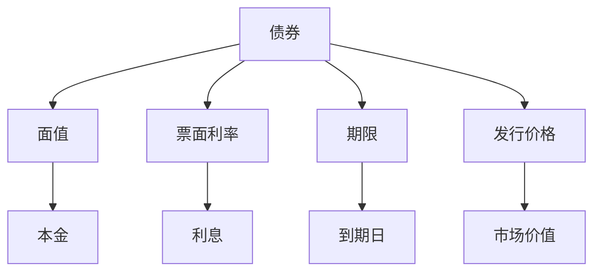
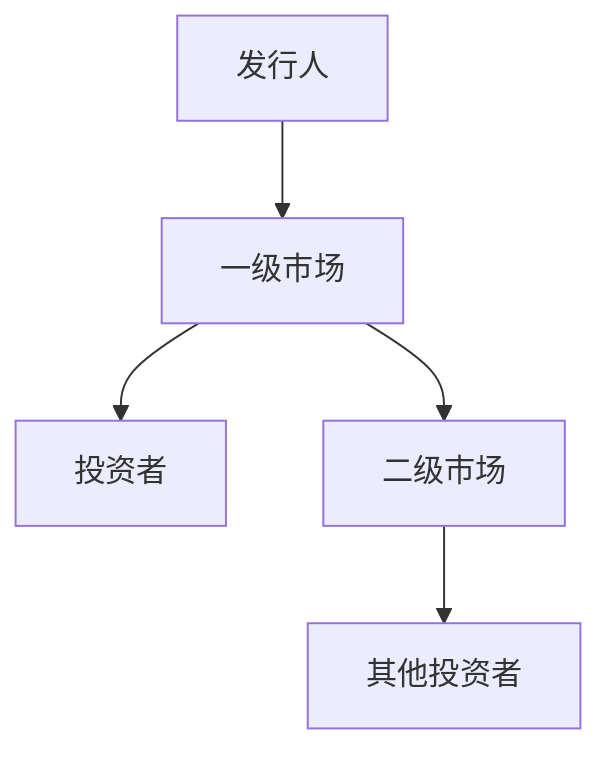
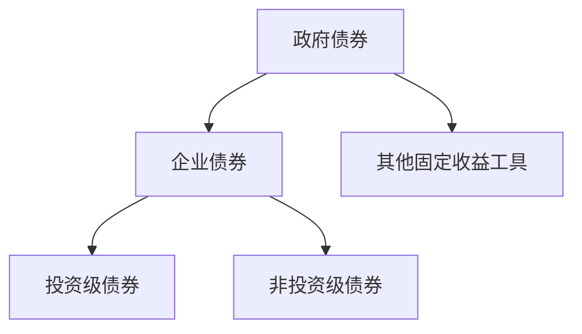
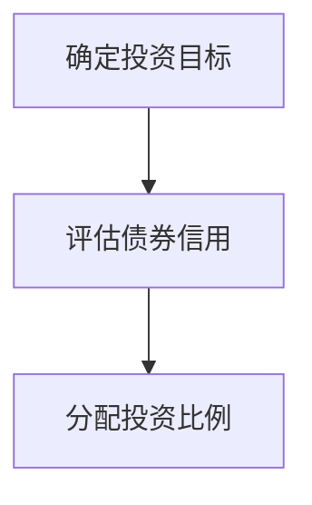

                 

# 格雷厄姆的债券投资策略：固定收益的角色

## 关键词：格雷厄姆、债券投资、固定收益、风险管理、投资策略

## 摘要：本文深入探讨了格雷厄姆的债券投资策略，分析了固定收益在投资组合中的角色。通过详细讲解债券市场的基本概念、固定收益的核心要素、格雷厄姆的投资原则、债券分析与估值方法、风险管理策略以及实际案例分析，本文为投资者提供了全面的理论指导和实践应用。

---

# 第一部分：格雷厄姆的债券投资策略基础

## 第1章：债券投资的背景与概念

### 1.1 债券市场的基本概念

#### 1.1.1 什么是债券
债券是一种债务工具，发行人承诺在特定时间内向债券持有人支付利息，并在到期时偿还本金。债券的基本要素包括面值、票面利率、期限和发行价格。

**Mermaid图示：债券的基本结构**

#### 1.1.2 债券的发行与流通
债券可以通过一级市场发行，也可以在二级市场流通。流通市场中的价格受供需关系和利率影响。

**Mermaid图示：债券发行与流通流程**

#### 1.1.3 债券市场的功能与作用
债券市场为政府和企业提供了融资渠道，同时为投资者提供了稳健的投资工具。

---

### 1.2 固定收益投资的定义与特点

#### 1.2.1 固定收益的定义
固定收益是指投资者按约定的利率和期限获得固定利息和本金偿还的投资工具。其核心特征是收益的确定性和本金的可回收性。

#### 1.2.2 固定收益投资的核心特点
- **本金固定**：债券的面值在发行时确定，到期后发行人必须偿还。
- **利息固定**：债券的票面利率在发行时确定，利息按期支付。
- **风险较低**：相比股票，债券的风险较低，收益相对稳定。

#### 1.2.3 固定收益与股票投资的区别
| 特性 | 固定收益 | 股票 |
|------|----------|------|
| 本金风险 | 低       | 高   |
| 收益稳定性 | 高       | 低   |
| 投资期限 | 固定     | 不定 |

---

### 1.3 格雷厄姆投资理念的起源

#### 1.3.1 价值投资的起源与发展
价值投资起源于20世纪初，由本杰明·格雷厄姆和戴维·多德提出。其核心是寻找被市场低估的证券。

#### 1.3.2 格雷厄姆的投资哲学
格雷厄姆强调安全边际和长期稳健投资，认为市场短期波动应被忽视，长期价值才是关键。

#### 1.3.3 格雷厄姆对固定收益投资的贡献
格雷厄姆将价值投资理念应用于债券市场，提出防御性投资策略，强调安全性和稳健性。

---

### 1.4 本章小结
本章介绍了债券市场的基本概念、固定收益投资的特点，以及格雷厄姆投资理念的起源和发展。通过对比分析，明确了固定收益在投资组合中的重要性。

---

## 第2章：固定收益在投资组合中的角色

### 2.1 固定收益资产的分类

#### 2.1.1 政府债券
政府债券由政府发行，通常被认为是最低风险的投资工具。

#### 2.1.2 企业债券
企业债券由企业发行，信用风险较高，但收益也相对较高。

#### 2.1.3 其他固定收益工具
包括可转换债券、垃圾债券等，风险和收益各不相同。

**Mermaid图示：债券分类结构**

---

### 2.2 固定收益投资的核心要素

#### 2.2.1 利率风险
利率上升会导致债券价格下跌，反之亦然。

#### 2.2.2 利息支付
债券的票面利率决定利息支付金额和频率。

#### 2.2.3 债务偿还期限
长期债券的风险和收益均高于短期债券。

---

### 2.3 格雷厄姆的债券筛选标准

#### 2.3.1 信用评估
格雷厄姆强调选择信用评级高的债券，以降低违约风险。

#### 2.3.2 债务负担分析
分析发行人的债务负担，确保其具备偿还能力。

#### 2.3.3 市场波动与估值
关注市场波动对债券价格的影响，寻找被低估的投资机会。

---

### 2.4 本章小结
本章详细探讨了固定收益在投资组合中的角色，分析了不同类型债券的特点，并介绍了格雷厄姆的债券筛选标准。

---

## 第3章：格雷厄姆债券投资策略的核心原则

### 3.1 防御性投资策略

#### 3.1.1 防御性投资的定义
防御性投资旨在通过选择低风险债券，确保本金安全和稳定收益。

#### 3.1.2 防御性投资的核心要素
- **选择高信用评级债券**：如AAA级债券。
- **关注短期债券**：降低利率风险。

#### 3.1.3 防御性投资的实施步骤
1. 确定投资目标：选择固定收益资产。
2. 评估债券信用：选择高信用评级债券。
3. 分配投资比例：一般不超过投资组合的30%。

**Mermaid图示：防御性投资步骤**

---

### 3.2 进攻性投资策略

#### 3.2.1 进攻性投资的定义
进攻性投资旨在通过高风险债券获得超额收益。

#### 3.2.2 进攻性投资的风险与收益
- **高收益**：可能获得高于市场的收益。
- **高风险**：违约风险较高。

#### 3.2.3 进攻性投资的适用场景
- 市场利率下降时。
- 高收益债券价格被低估时。

---

### 3.3 格雷厄姆投资策略的平衡点

#### 3.3.1 收益与风险的平衡
通过分散投资降低风险，平衡收益与风险。

#### 3.3.2 短期与长期投资的结合
根据市场环境调整投资期限，平衡流动性和收益性。

#### 3.3.3 债券与股票的配置比例
一般建议债券占比不超过50%，以保持投资组合的多样性。

---

### 3.4 本章小结
本章介绍了格雷厄姆的防御性和进攻性投资策略，强调了收益与风险的平衡，以及债券与股票的合理配置。

---

## 第4章：债券分析与估值方法

### 4.1 债券的基本分析方法

#### 4.1.1 债券信用评级的分析
信用评级是评估债券信用风险的重要指标，常用评级机构包括穆迪、标准普尔等。

#### 4.1.2 债务偿还能力的评估
分析发行人的财务状况，包括资产负债率、现金流等。

#### 4.1.3 利率变动对债券的影响
利率上升导致债券价格下跌，反之亦然。

---

### 4.2 债券定价的数学模型

#### 4.2.1 现值公式
债券的现值可以通过未来现金流的贴现计算。

$$现值 = \sum_{t=1}^{n} \frac{C}{(1 + r)^t} + \frac{F}{(1 + r)^n}$$

其中：
- \( C \)：每年的利息
- \( r \)：市场利率
- \( F \)：面值
- \( n \)：期限

#### 4.2.2 久期与凸性
久期衡量债券价格对利率变化的敏感性，凸性则衡量久期的变化。

---

### 4.3 债券的市场估值

#### 4.3.1 市场价格与内在价值
市场价格围绕内在价值波动，内在价值基于债券的现金流折现。

#### 4.3.2 市场估值的步骤
1. 确定债券的信用评级。
2. 估计市场利率。
3. 计算债券的现值。

---

### 4.4 本章小结
本章详细讲解了债券分析与估值的方法，包括信用评级、定价模型和市场估值，为投资者提供了理论支持。

---

## 第5章：风险管理与投资组合构建

### 5.1 风险管理的核心原则

#### 5.1.1 风险分散
通过投资不同类型的债券降低风险。

#### 5.1.2 风险对冲
利用衍生工具对冲利率风险。

#### 5.1.3 风险评估
定期评估投资组合的风险敞口。

---

### 5.2 投资组合构建的步骤

#### 5.2.1 确定投资目标
明确投资期限、风险承受能力和收益目标。

#### 5.2.2 选择债券种类
根据目标选择政府债券、企业债券等。

#### 5.2.3 调整投资比例
根据市场环境动态调整债券比例。

---

### 5.3 本章小结
本章强调了风险管理的重要性，介绍了投资组合构建的步骤，帮助投资者实现稳健收益。

---

## 第6章：案例分析与实战应用

### 6.1 案例分析：格雷厄姆策略的应用

#### 6.1.1 案例背景
假设当前市场利率为5%，某公司发行5年期债券，面值1000元，票面利率6%。

#### 6.1.2 分析过程
1. 计算债券的现值：
   $$现值 = \frac{60}{(1+0.05)^1} + \frac{60}{(1+0.05)^2} + \frac{60}{(1+0.05)^3} + \frac{60}{(1+0.05)^4} + \frac{60 + 1000}{(1+0.05)^5}$$
2. 结果：现值约为1120元。

#### 6.1.3 投资决策
市场价低于内在价值时买入，持有至到期。

---

### 6.2 实战应用：构建投资组合

#### 6.2.1 确定投资目标
- 投资期限：5年
- 风险承受能力：中等

#### 6.2.2 选择债券种类
- 60% 政府债券
- 30% 投资级企业债券
- 10% 可转换债券

#### 6.2.3 动态调整
定期评估市场环境，调整债券比例。

---

### 6.3 本章小结
本章通过案例分析和实战应用，展示了格雷厄姆策略的实际操作方法，帮助投资者更好地理解和应用。

---

## 第7章：总结与展望

### 7.1 总结
格雷厄姆的债券投资策略以稳健性和安全性为核心，强调固定收益在投资组合中的重要作用。通过科学的分析和合理的配置，投资者可以在风险可控的前提下获得稳定收益。

### 7.2 展望
未来，随着市场环境的变化，固定收益投资将面临更多挑战和机遇。投资者需要不断学习和调整策略，以应对复杂多变的市场环境。

### 7.3 最佳实践 tips
- 保持长期投资视角。
- 定期评估投资组合。
- 避免过度杠杆。

---

# 结语

格雷厄姆的债券投资策略为投资者提供了稳健的投资方法，帮助他们在固定收益领域实现长期回报。通过本文的深入分析，读者可以更好地理解和应用这些策略，优化自己的投资组合。

--- 

以上就是《格雷厄姆的债券投资策略：固定收益的角色》的技术博客文章，希望对您有所帮助！

