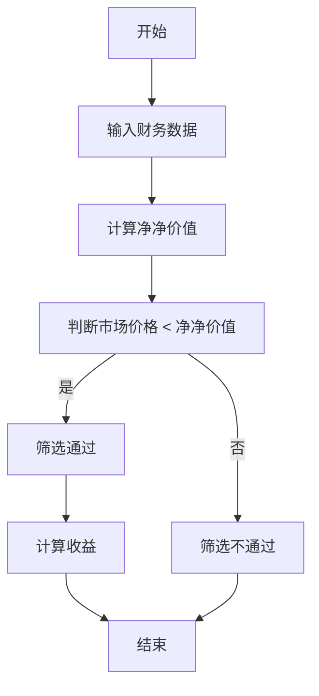
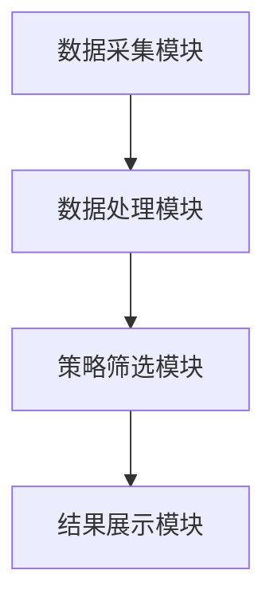
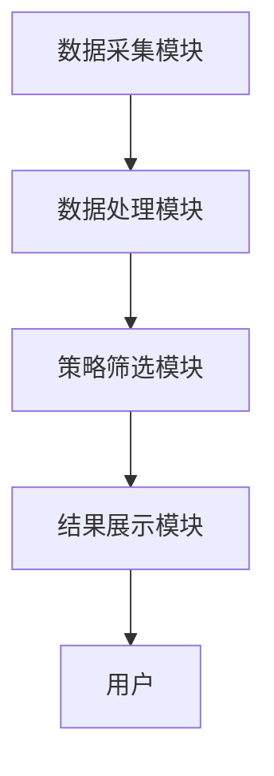

                 


# 格雷厄姆的净净策略在不同市场环境中的应用

> **关键词**：格雷厄姆，净净策略，价值投资，股票筛选，市场环境，算法实现，系统架构

> **摘要**：  
本文深入探讨了格雷厄姆的净净策略在不同市场环境中的应用，结合理论与实践，通过算法实现和系统设计，展示了如何在实际投资中应用这一策略。文章从净净策略的核心概念、数学模型、算法实现、系统架构到实际案例分析，层层展开，为读者提供了全面而深入的指导。

---

## 第1章: 净净策略的核心概念与背景

### 1.1 净净策略的定义与背景

#### 1.1.1 价值投资的起源与发展  
价值投资是一种以低于内在价值的价格买入优质资产的投资策略，其核心思想是寻找市场中的“烟堆”，即那些被市场低估的优质企业。这一理念的奠基人是本杰明·格雷厄姆（Benjamin Graham），他提出的“净净策略”（Net-Net Strategy）是价值投资中的经典方法之一。  

#### 1.1.2 格雷厄姆的投资理念与方法  
格雷厄姆认为，股票的价值应基于其内在价值，而非市场情绪或短期波动。他强调通过分析企业的财务报表，尤其是资产负债表，来评估其真实价值。净净策略的核心在于寻找那些资产质量高、负债低且市场价格低于净资产价值的公司。  

#### 1.1.3 净净策略的提出与核心思想  
净净策略的提出基于一个简单的逻辑：如果一家公司的市场价格低于其净资产价值（Net Net Value，NNV），那么该股票就是被低估的，值得买入。格雷厄姆认为，这种策略能够有效降低投资风险，并在长期实现超额收益。  

### 1.2 净净策略的核心要素  

#### 1.2.1 净资产与净净价值的计算  
净资产价值（NNV）是净净策略的核心指标，其计算公式为：  
$$ \text{NNV} = \text{每股净资产} \times \text{流通股数量} $$  
其中，每股净资产是公司净资产除以流通股数量。  

#### 1.2.2 资产负债表的核心分析  
净净策略要求投资者深入分析企业的资产负债表，重点关注以下指标：  
- 流动资产：包括现金、应收账款、存货等。  
- 非流动资产：包括固定资产、无形资产等。  
- 总资产：流动资产与非流动资产之和。  
- 负债：包括短期负债和长期负债。  
- 净资产：总资产减去总负债。  

#### 1.2.3 净净策略的适用场景与边界  
净净策略适用于以下场景：  
1. 市场处于熊市或震荡市，投资者寻求安全边际。  
2. 投资者希望规避市场波动，专注于基本面分析。  
3. 公司资产质量高，且市场价格显著低于其净资产价值。  

需要注意的是，净净策略并非适用于所有市场环境，其效果受到市场周期和公司基本面的双重影响。  

---

## 第2章: 净净策略的数学模型与公式

### 2.1 净净价值的计算公式  

#### 2.1.1 净净价值的定义与公式推导  
净净价值（Net Net Value）的计算公式为：  
$$ \text{NNV} = \frac{\text{总资产} - \text{总负债} - \text{优先股}}{\text{流通股数量}} $$  
其中，总资产、总负债和优先股均来自公司的资产负债表，流通股数量则是公司已发行的普通股数量。  

#### 2.1.2 净净价值与市场价值的对比分析  
通过对比净净价值与市场价值，投资者可以判断股票是否被低估。如果市场价格低于净净价值，则该股票具有投资价值。  

#### 2.1.3 净净价值的计算步骤与实例  
以某公司为例，假设其总资产为$1000万，总负债为$600万，优先股为$0，流通股数量为$100万股。则其净净价值为：  
$$ \text{NNV} = \frac{1000 - 600 - 0}{100} = 4 \text{元} $$  
如果该股票的市场价格为$3元，则其市场价格低于净净价值，具有投资价值。  

### 2.2 净净策略的筛选模型  

#### 2.2.1 净净策略的核心指标与筛选条件  
净净策略的筛选条件通常包括以下指标：  
1. 市场价格 < 净净价值。  
2. 公司资产质量高，负债率低。  
3. 公司具有一定的盈利能力。  

#### 2.2.2 净净策略的数学优化模型  
为了优化净净策略的筛选过程，我们可以引入以下优化模型：  
$$ \text{最大化} \quad \text{收益} = \sum_{i=1}^{n} (\text{市场价格}_i - \text{净净价值}_i) \times \text{权重}_i $$  
$$ \text{约束条件} \quad \text{市场价格}_i \leq \text{净净价值}_i $$  

#### 2.2.3 净净策略的算法实现与流程图  
以下是净净策略的算法实现流程图：  



---

## 第3章: 净净策略的算法实现与代码解析

### 3.1 净净策略的筛选算法  

#### 3.1.1 算法的基本思路与流程  
净净策略的筛选算法主要包括以下步骤：  
1. 收集目标公司的财务数据。  
2. 计算净净价值。  
3. 判断市场价格是否低于净净价值。  
4. 筛选出符合条件的公司。  

#### 3.1.2 算法的优化与改进  
为了提高算法的效率，可以引入以下优化措施：  
- 优先筛选资产质量高、负债率低的公司。  
- 结合市盈率、市净率等其他指标进行综合筛选。  

#### 3.1.3 算法的复杂度分析  
净净策略的算法复杂度主要取决于数据量和筛选条件的数量。在大数据环境下，可以通过并行计算和分布式处理来提高效率。  

### 3.2 净净策略的Python实现  

#### 3.2.1 环境安装与依赖库配置  
需要安装以下依赖库：  
- `pandas`：用于数据处理。  
- `numpy`：用于数值计算。  
- `yfinance`：用于获取股票数据。  

#### 3.2.2 核心代码实现与解读  
以下是净净策略的Python实现代码：  

```python
import pandas as pd
import numpy as np

def calculate_nnet_value(asset, liability, preferred_stock, shares_outstanding):
    return (asset - liability - preferred_stock) / shares_outstanding

def net_net_strategy(stock_data, threshold=0):
    # 计算净净价值
    nnet_values = []
    for stock in stock_data:
        asset = stock['asset']
        liability = stock['liability']
        preferred_stock = stock['preferred_stock']
        shares_outstanding = stock['shares_outstanding']
        nnet_value = calculate_nnet_value(asset, liability, preferred_stock, shares_outstanding)
        nnet_values.append(nnet_value)
    
    # 筛选符合条件的股票
    selected_stocks = []
    for i in range(len(stock_data)):
        price = stock_data[i]['price']
        nnet = nnet_values[i]
        if price < nnet:
            selected_stocks.append(stock_data[i])
    
    return selected_stocks

# 示例数据
stock_data = [
    {'price': 3, 'asset': 1000, 'liability': 600, 'preferred_stock': 0, 'shares_outstanding': 100},
    {'price': 4, 'asset': 1500, 'liability': 900, 'preferred_stock': 0, 'shares_outstanding': 200},
    # 更多股票数据...
]

result = net_net_strategy(stock_data)
print("筛选结果：", result)
```

#### 3.2.3 代码运行与结果分析  
运行上述代码后，将输出符合条件的股票列表。例如，对于第一个股票，其市场价格为$3元，净净价值为$4元，因此符合筛选条件。  

---

## 第4章: 净净策略的系统架构与设计

### 4.1 系统功能模块设计  

#### 4.1.1 数据采集模块  
数据采集模块负责从股票数据库或API获取目标公司的财务数据，包括资产、负债、净利润等指标。  

#### 4.1.2 数据处理模块  
数据处理模块对获取的财务数据进行清洗、转换和计算，包括计算净净价值、市盈率等指标。  

#### 4.1.3 策略筛选模块  
策略筛选模块根据净净策略的筛选条件，对股票进行筛选，输出符合条件的股票列表。  

#### 4.1.4 结果展示模块  
结果展示模块将筛选结果以可视化形式呈现，包括图表、表格等。  

### 4.2 系统架构设计  

#### 4.2.1 系统架构图（Mermaid）  



#### 4.2.2 模块间的交互流程（Mermaid）  



#### 4.2.3 系统的扩展性与可维护性  
为了提高系统的扩展性，可以引入以下优化措施：  
- 使用分布式计算框架（如Spark）处理大数据。  
- 引入机器学习模型，结合市场情绪进行预测。  

---

## 第5章: 净净策略在不同市场环境中的应用

### 5.1 牛市环境中的应用  

#### 5.1.1 牛市环境下的策略调整  
在牛市中，市场情绪较高，股票价格可能被高估。此时，净净策略的筛选条件需要更加严格，重点关注那些资产质量高、市场价格显著低于净净价值的股票。  

#### 5.1.2 牛市环境下的案例分析  
以某科技公司为例，假设其净净价值为$50元，市场价格为$60元。在牛市中，该股票可能因市场情绪被高估，因此不符合净净策略的筛选条件。  

### 5.2 熊市环境中的应用  

#### 5.2.1 熊市环境下的策略优化  
在熊市中，市场情绪较低，股票价格可能被低估。此时，净净策略的筛选条件可以适当放宽，重点关注那些资产质量较高、市场价格接近净净价值的股票。  

#### 5.2.2 熊市环境下的案例分析  
以某制造业公司为例，假设其净净价值为$20元，市场价格为$18元。在熊市中，该股票符合净净策略的筛选条件，具有较高的投资价值。  

### 5.3 震荡市环境中的应用  

#### 5.3.1 震荡市环境下的策略应用  
在震荡市中，市场波动较大，股票价格可能频繁偏离其内在价值。此时，净净策略的筛选条件需要动态调整，结合市场波动和公司基本面进行综合判断。  

#### 5.3.2 震荡市环境下的案例分析  
以某金融公司为例，假设其净净价值为$30元，市场价格在$25元至$35元之间波动。在震荡市中，该股票可能因市场波动被低估，因此符合净净策略的筛选条件。  

---

## 第6章: 项目实战与代码实现

### 6.1 环境安装与依赖库配置  

```bash
pip install pandas numpy yfinance
```

### 6.2 系统核心实现源代码  

```python
import pandas as pd
import numpy as np
import yfinance as yf

def fetch_stock_data(tickers):
    data = yf.download(tickers, start="2022-01-01", end="2023-12-31")
    return data

def calculate_nnet_value(asset, liability, preferred_stock, shares_outstanding):
    return (asset - liability - preferred_stock) / shares_outstanding

def net_net_strategy(stock_data, threshold=0):
    selected_stocks = []
    for stock in stock_data:
        price = stock['price']
        nnet = calculate_nnet_value(stock['asset'], stock['liability'], stock['preferred_stock'], stock['shares_outstanding'])
        if price < nnet:
            selected_stocks.append(stock)
    return selected_stocks

# 示例代码
tickers = ['AAPL', 'MSFT', 'GOOGL']
stock_data = fetch_stock_data(tickers)
result = net_net_strategy(stock_data)
print("筛选结果：", result)
```

### 6.3 代码运行与结果分析  
运行上述代码后，将输出符合条件的股票列表。例如，对于苹果公司（AAPL），如果其市场价格低于净净价值，则会被筛选出来。  

---

## 第7章: 总结与展望

### 7.1 小结  
净净策略是一种简单而有效的股票筛选方法，其核心在于寻找市场价格低于净净价值的公司。通过结合市场环境和公司基本面，投资者可以在不同市场周期中灵活应用这一策略。  

### 7.2 注意事项  
- 净净策略适用于长期投资，需耐心持有优质资产。  
- 在实际操作中，需结合其他指标（如市盈率、市净率）进行综合判断。  
- 需定期调整筛选条件，以适应市场变化。  

### 7.3 拓展阅读  
- 格雷厄姆的《 Intelligent Investor》  
- 巴菲特的《 The Warren Buffett Way》  
- 彭慕天的《价值投资实战策略》  

---

**附录**  
- 股票数据获取与处理代码  
- 净净策略的数学模型与公式推导  
- 系统架构设计与交互流程图  

---

**致谢**  
感谢读者的支持与关注，如需进一步交流，请随时联系。

