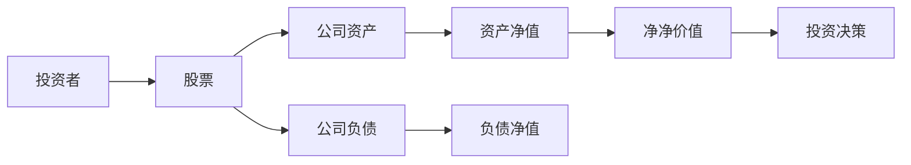
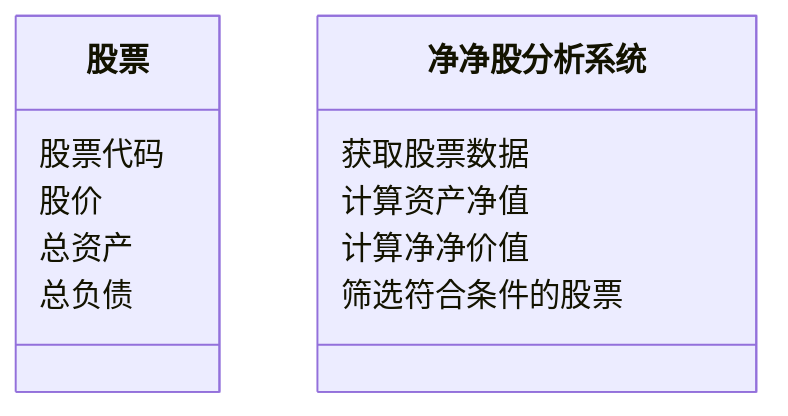
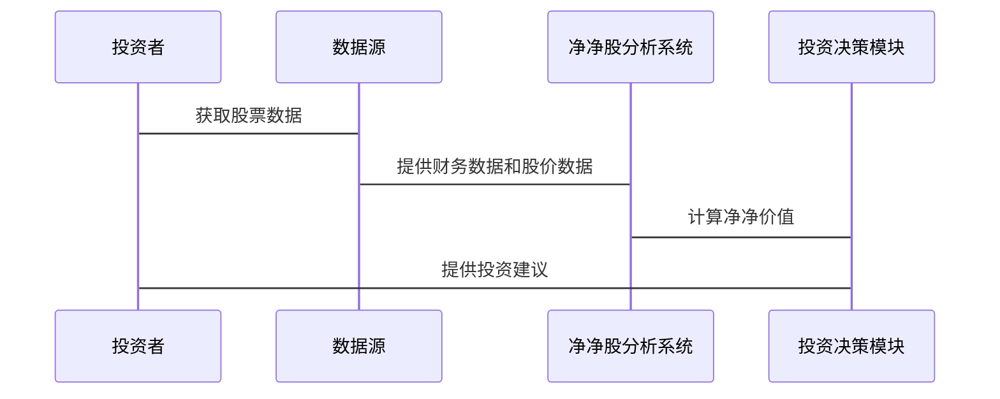

                 


# 格雷厄姆的净净股投资策略

## 关键词：净净股投资策略，本杰明·格雷厄姆，价值投资，资产净值，投资决策系统

## 摘要：本篇文章将深入探讨格雷厄姆的净净股投资策略，从其定义、核心概念、算法原理、系统架构设计到实际项目应用，全面解析这一经典的股票投资策略。通过本文，读者将了解如何通过计算资产净值与股价的差异，识别市场低估的股票，构建稳健的投资组合，并通过系统化的分析方法，实现长期的超额收益。

---

# 正文

## 第一部分: 格雷厄姆的净净股投资策略背景介绍

### 第1章: 净净股投资策略的定义与背景

#### 1.1 净净股投资策略的核心概念

##### 1.1.1 净净股的定义
净净股（Net Net Stocks）是本杰明·格雷厄姆提出的一种投资策略，核心在于寻找市场价格低于其账面价值的股票。具体来说，净净价值（Net Net Value）是指公司资产净值（总资产减去总负债）减去其当前股价后的价值。当净净价值为正时，意味着该股票的市场价格低于其账面价值，具有投资价值。

##### 1.1.2 净净股投资策略的历史背景
格雷厄姆是20世纪初著名的投资分析师，被誉为“价值投资之父”。他在《证券分析》一书中首次系统地提出了净净股的概念。这一策略在当时主要应用于那些资产-heavy的公司，尤其是铁路、制造业和银行等行业的公司。格雷厄姆认为，这类股票的市场价格往往被市场低估，长期来看具有较大的上涨潜力。

##### 1.1.3 净净股与传统投资策略的区别
传统的投资策略，如技术分析或成长股投资，更关注股票的短期价格波动或公司的成长性。而净净股策略则侧重于公司基本面的分析，尤其是资产净值与市场价格的关系。它强调的是安全边际，即市场价格远低于资产净值，从而为投资者提供了较高的风险溢价。

#### 1.2 格雷厄姆的投资理念
格雷厄姆的价值投资理念强调安全边际和长期稳健的回报。他认为，投资者应该寻找那些市场价格低于其内在价值的股票，尤其是那些资产净值远高于市场价格的公司。这种策略的核心在于避免市场波动的短期影响，专注于公司的长期价值。

#### 1.3 净净股投资策略的适用场景
净净股策略主要适用于那些资产-heavy且市场低估的公司，尤其是在经济衰退或市场低迷时期。此时，许多公司的市场价格可能远低于其资产净值，为投资者提供了良好的买入机会。然而，需要注意的是，净净股策略并不适用于所有类型的公司，尤其是那些资产轻、依赖于创新或服务行业的公司。

---

## 第二部分: 净净股投资策略的核心概念与联系

### 第2章: 净净股的核心概念与联系

#### 2.1 净净股的计算方法

##### 2.1.1 净净价值的计算公式
$$
\text{净净价值} = \text{资产净值} - \text{股价}
$$
其中，资产净值可以进一步分解为：
$$
\text{资产净值} = \text{总资产} - \text{总负债}
$$

##### 2.1.2 净净价值与市场价格的关系
当净净价值为正时，意味着该股票的市场价格低于其资产净值，具有投资价值。反之，则不具有投资价值。因此，投资者需要持续关注公司的资产净值和股价的变化，以判断是否符合净净股的条件。

##### 2.1.3 净净价值的评估标准
通常情况下，净净价值越高，意味着该股票的安全边际越大，投资风险越小。因此，投资者可以设定一个净净价值的最低标准（例如净净价值大于零），并在此基础上筛选符合标准的股票。

#### 2.2 净净股与其他投资策略的对比

##### 2.2.1 净净股与成长型投资的对比
成长型投资关注的是公司的未来增长潜力，而净净股策略则关注公司的资产净值与市场价格的关系。虽然两者都强调基本面分析，但侧重点不同。成长型投资更注重公司的盈利能力和发展前景，而净净股策略更注重公司的资产安全性和市场价格的低估程度。

##### 2.2.2 净净股与股息率投资的对比
股息率投资关注的是股票的股息收益率，而净净股策略则关注资产净值与股价的关系。两者都强调投资的安全性和收益性，但股息率投资更注重当前收益，而净净股策略更注重长期价值。

##### 2.2.3 净净股与指数投资的对比
指数投资是一种被动投资策略，通过跟踪市场指数来获得平均收益。而净净股策略则是一种主动投资策略，通过精选个股来获得超额收益。指数投资风险较低，但收益也较为有限，而净净股策略则可能面临更高的风险和收益。

#### 2.3 净净股的财务报表分析

##### 2.3.1 资产负债表在净净股分析中的作用
资产负债表是分析公司资产和负债的重要工具。通过分析公司的总资产和总负债，可以计算出资产净值，从而判断股票是否符合净净股的条件。

##### 2.3.2 利润表在净净股分析中的作用
利润表反映了公司的盈利能力。虽然净净股策略不直接关注公司的盈利能力，但盈利能力可以影响公司的资产净值和股价。因此，分析利润表有助于更好地理解公司的整体财务状况。

##### 2.3.3 现金流量表在净净股分析中的作用
现金流量表反映了公司的现金流状况。健康的现金流是公司财务健康的重要指标，也是判断公司是否具备持续发展能力的重要依据。

#### 2.4 净净股的ER实体关系图



---

## 第三部分: 净净股投资策略的算法原理

### 第3章: 净净股投资策略的算法原理

#### 3.1 净净股的计算与筛选

##### 3.1.1 计算净净价值
$$
\text{净净价值} = \text{资产净值} - \text{股价}
$$

##### 3.1.2 筛选符合条件的股票
投资者可以通过筛选净净价值大于零的股票，来构建投资组合。具体步骤如下：
1. 收集目标公司的财务数据，包括总资产、总负债和股价。
2. 计算资产净值：$\text{资产净值} = \text{总资产} - \text{总负债}$
3. 计算净净价值：$\text{净净价值} = \text{资产净值} - \text{股价}$
4. 筛选净净价值大于零的股票。

##### 3.1.3 示例代码
```python
import pandas as pd

# 假设data_frame包含股票的财务数据和股价
# data_frame的列包括：'total_assets', 'total_liabilities', 'price'

def calculate_net_net_value(data_frame):
    data_frame['net_net_value'] = data_frame['total_assets'] - data_frame['total_liabilities'] - data_frame['price']
    return data_frame

# 筛选净净价值大于零的股票
filtered_stocks = data_frame[data_frame['net_net_value'] > 0]
```

---

## 第四部分: 净净股投资策略的系统分析与架构设计

### 第4章: 净净股投资策略的系统分析与架构设计

#### 4.1 系统功能设计

##### 4.1.1 领域模型


##### 4.1.2 系统架构设计


#### 4.2 系统接口设计
系统接口设计包括数据获取、数据处理和投资决策三个模块。数据获取模块负责从数据库或网络获取股票的财务数据和股价数据；数据处理模块负责计算资产净值和净净价值；投资决策模块根据净净价值筛选符合条件的股票，并生成投资建议。

#### 4.3 系统交互设计


---

## 第五部分: 净净股投资策略的项目实战

### 第5章: 净净股投资策略的项目实战

#### 5.1 环境安装
为了实现净净股投资策略，需要安装以下工具和库：
- 数据获取工具：Yahoo Finance API 或其他股票数据源
- 数据处理工具：Python（Pandas, NumPy）
- 数据可视化工具：Matplotlib 或 Seaborn

#### 5.2 核心实现

##### 5.2.1 数据获取
```python
import yfinance as yf

# 下载股票数据
data = yf.download('AAPL', start='2020-01-01', end='2023-12-31')
```

##### 5.2.2 数据处理
```python
# 计算资产净值和净净价值
def calculate_net_net_value(data, assets, liabilities, price):
    net_assets = assets - liabilities
    net_net_value = net_assets - price
    return net_net_value

# 假设assets和liabilities是公司的财务数据
assets = 200  # 资产
liabilities = 100  # 负债
price = 50  # 股价

net_net_value = calculate_net_net_value(data, assets, liabilities, price)
print(f"净净价值: {net_net_value}")
```

##### 5.2.3 数据可视化
```python
import matplotlib.pyplot as plt

# 绘制股价与资产净值的关系图
plt.figure(figsize=(10, 6))
plt.plot(data.index, data['Adj Close'], label='股价')
plt.plot(data.index, [assets - liabilities] * len(data.index), label='资产净值')
plt.xlabel('日期')
plt.ylabel('价格')
plt.legend()
plt.show()
```

#### 5.3 案例分析
以苹果公司为例，假设其资产净值为200亿美元，总负债为100亿美元，股价为50美元。计算净净价值：
$$
\text{净净价值} = 200 - 100 - 50 = 50 \text{美元}
$$
由于净净价值为正，该股票符合净净股的条件，具有投资价值。

#### 5.4 项目小结
通过实际案例分析，我们可以看到净净股策略的有效性。然而，需要注意的是，净净股策略仅适用于那些资产-heavy且市场低估的公司，且需要结合其他因素（如公司的盈利能力、现金流状况等）进行综合评估。

---

## 第六部分: 净净股投资策略的小结

### 第6章: 净净股投资策略的小结

#### 6.1 最佳实践
- 选择那些资产净值远高于市场价格的公司。
- 结合其他基本面指标（如盈利能力、现金流状况等）进行综合评估。
- 定期复盘和调整投资组合。

#### 6.2 注意事项
- 净净股策略仅适用于特定类型的公司，尤其是资产-heavy的公司。
- 需要注意市场波动和宏观经济环境的影响。
- 长期投资，避免短期波动的影响。

#### 6.3 拓展阅读
- 《证券分析》（本杰明·格雷厄姆）
- 《价值投资实战指南》（李录）
- 《投资的艺术》（Philip A. Fisher）

---

通过本文的详细讲解，读者可以全面了解格雷厄姆的净净股投资策略，并将其应用于实际投资中。无论是从理论分析还是实际操作，净净股策略都为投资者提供了一种稳健的投资方法，帮助他们在市场中寻找低估的股票，实现长期的超额收益。

