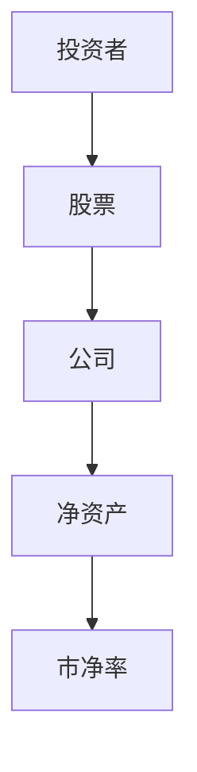
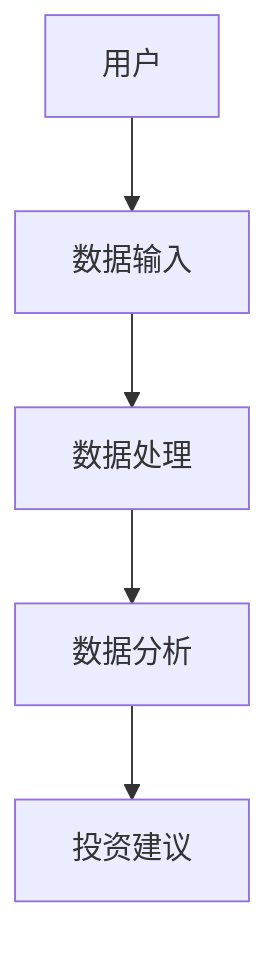
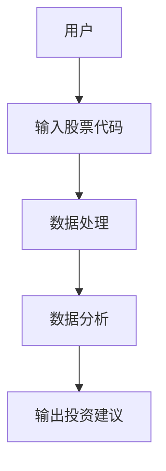

                 


# 格雷厄姆的净净股策略：在高科技股中寻找价值

## 关键词：价值投资，净净股策略，高科技股，格雷厄姆，投资策略

## 摘要：本文深入探讨了格雷厄姆的净净股策略，并分析其在高科技股中的应用。通过系统的理论分析和实际案例，本文揭示了如何利用净净股策略在高科技股中寻找投资价值。

---

# 第一部分: 格雷厄姆的净净股策略基础

## 第1章: 价值投资与净净股策略概述

### 1.1 价值投资的起源与发展

#### 1.1.1 价值投资的核心理念
价值投资是一种投资策略，强调以低于内在价值的价格购买优质资产。其核心理念是寻找市场低估的投资机会，长期持有，等待价值回归。

#### 1.1.2 格雷厄姆的生平与贡献
本杰明·格雷厄姆（Benjamin Graham）是价值投资的鼻祖，被誉为“价值投资之父”。他提出了“净净股”（N.Net）策略，即通过分析股票的净资产价值，寻找被市场低估的投资机会。

#### 1.1.3 净净股策略的起源与演变
净净股策略起源于20世纪30年代，格雷厄姆在《证券分析》一书中首次提出。该策略通过计算股票的账面价值，寻找市净率低于1的股票，即市场价格低于净资产价值的股票。

### 1.2 净净股策略的定义与特点

#### 1.2.1 净净股策略的定义
净净股策略是一种通过分析股票的净资产价值，寻找市场价格低于净资产价值的股票的投资策略。

#### 1.2.2 净净股策略的核心特点
- **低市净率**：寻找市净率低于1的股票。
- **高安全边际**：通过低市净率保证较高的安全边际。
- **长期价值**：关注股票的长期价值，而非短期波动。

#### 1.2.3 净净股策略与传统投资方法的区别
- **传统投资方法**：基于市场趋势、技术分析或短期收益进行投资。
- **净净股策略**：基于股票的内在价值，寻找市场低估的投资机会。

### 1.3 净净股策略在高科技股中的应用

#### 1.3.1 高科技股的特点与投资机会
高科技股通常具有高成长性、高波动性和高研发投入的特点。这些股票的内在价值可能被市场高估或低估，为投资者提供了寻找价值的机会。

#### 1.3.2 净净股策略在高科技股中的适用性
尽管高科技股波动性较大，但其净资产价值可能被市场低估，为净净股策略提供了应用空间。

#### 1.3.3 高科技股投资的风险与挑战
高科技股的高波动性和高研发投入可能导致净资产价值的波动，增加了净净股策略的应用难度。

## 1.4 本章小结
本章介绍了价值投资的起源与发展，详细阐述了净净股策略的定义、特点及其在高科技股中的应用。通过分析高科技股的特点和投资机会，为后续章节的应用提供了基础。

---

## 第2章: 净净股策略的核心概念

### 2.1 净净股策略的核心要素

#### 2.1.1 市场价与内在价值的对比
- **市场价**：股票的市场价格。
- **内在价值**：股票的内在价值，基于其净资产价值和未来增长潜力。

#### 2.1.2 净资产与市净率的计算
- **净资产**：公司资产减去负债。
- **市净率**：市场价格与每股净资产的比率。

#### 2.1.3 净净股策略的筛选标准
- **市净率低于1**：寻找市场价格低于净资产价值的股票。

### 2.2 净净股策略的数学模型与公式

#### 2.2.1 净资产的计算公式
$$
\text{净资产} = \text{资产} - \text{负债}
$$

#### 2.2.2 市净率的计算公式
$$
\text{市净率} = \frac{\text{市场价格}}{\text{每股净资产}}
$$

#### 2.2.3 内在价值的估算公式
$$
\text{内在价值} = \text{账面价值} \times (1 + \text{增长率})
$$

### 2.3 净净股策略的ER实体关系图


## 2.4 本章小结
本章详细介绍了净净股策略的核心概念，包括市场价与内在价值的对比、净资产与市净率的计算，以及内在价值的估算公式。通过ER实体关系图，展示了投资者、股票、公司、净资产和市净率之间的关系。

---

## 第3章: 高科技股的分析与投资策略

### 3.1 高科技股的特点与投资机会

#### 3.1.1 高科技股的核心特征
- **高成长性**：高科技股通常具有较高的增长率。
- **高波动性**：高科技股的市场价格波动较大。
- **高研发投入**：高科技股通常需要大量的研发投入。

#### 3.1.2 高科技股的内在价值评估
- **收益能力分析**：分析公司的盈利能力。
- **市场地位分析**：分析公司在市场中的地位。
- **未来增长潜力评估**：评估公司的未来增长潜力。

#### 3.1.3 净净股策略在高科技股中的应用案例
- **案例一：苹果公司**：分析苹果公司的净资产价值和市净率。
- **案例二：亚马逊**：分析亚马逊的净资产价值和市净率。
- **案例三：微软**：分析微软的净资产价值和市净率。

### 3.2 高科技股的内在价值评估

#### 3.2.1 收益能力分析
- **净利润率**：分析公司的盈利能力。
- **ROE**：分析公司的股东权益回报率。

#### 3.2.2 市场地位分析
- **市场份额**：分析公司在市场中的份额。
- **竞争优势**：分析公司的竞争优势。

#### 3.2.3 未来增长潜力评估
- **行业前景**：分析行业的未来发展前景。
- **公司战略**：分析公司的未来发展战略。

### 3.3 净净股策略在高科技股中的应用案例

#### 3.3.1 案例一：苹果公司
- **净资产价值**：计算苹果公司的净资产价值。
- **市净率**：计算苹果公司的市净率。
- **投资决策**：基于净净股策略，判断是否投资苹果公司。

#### 3.3.2 案例二：亚马逊
- **净资产价值**：计算亚马逊的净资产价值。
- **市净率**：计算亚马逊的市净率。
- **投资决策**：基于净净股策略，判断是否投资亚马逊。

#### 3.3.3 案例三：微软
- **净资产价值**：计算微软的净资产价值。
- **市净率**：计算微软的市净率。
- **投资决策**：基于净净股策略，判断是否投资微软。

### 3.4 本章小结
本章通过分析高科技股的特点和投资机会，详细介绍了如何在高科技股中应用净净股策略。通过具体案例分析，展示了如何评估高科技股的内在价值，并基于净净股策略做出投资决策。

---

## 第4章: 净净股策略的系统分析

### 4.1 系统功能设计

#### 4.1.1 问题场景介绍
- **目标**：设计一个系统，用于分析高科技股的净资产价值和市净率。
- **用户需求**：投资者需要一个工具，帮助他们分析高科技股的投资价值。

#### 4.1.2 系统功能设计
- **数据收集**：收集高科技股的财务数据。
- **数据分析**：计算净资产价值和市净率。
- **投资决策**：基于净净股策略，生成投资建议。

#### 4.1.3 系统架构设计


### 4.2 系统架构设计

#### 4.2.1 系统架构图


#### 4.2.2 系统接口设计
- **输入接口**：用户输入高科技股的股票代码。
- **输出接口**：系统输出投资建议。

#### 4.2.3 系统交互设计


### 4.3 项目实战

#### 4.3.1 环境安装
- **Python环境**：安装Python和相关库（如pandas、numpy）。
- **数据源**：获取高科技股的财务数据。

#### 4.3.2 核心代码实现
```python
import pandas as pd
import numpy as np

# 数据收集
data = pd.read_csv('高科技股数据.csv')

# 计算净资产价值
data['净资产'] = data['资产'] - data['负债']

# 计算市净率
data['市净率'] = data['市场价格'] / data['净资产']

# 应用净净股策略
data['投资建议'] = np.where(data['市净率'] < 1, '买入', '卖出')
```

#### 4.3.3 代码应用解读与分析
- **数据收集**：从CSV文件中读取高科技股的财务数据。
- **计算净资产价值**：使用公式`净资产 = 资产 - 负债`。
- **计算市净率**：使用公式`市净率 = 市场价格 / 每股净资产`。
- **投资建议**：基于市净率小于1的条件，生成买入或卖出的投资建议。

#### 4.3.4 案例分析
- **案例一：苹果公司**：分析苹果公司的数据，生成投资建议。
- **案例二：亚马逊**：分析亚马逊的数据，生成投资建议。
- **案例三：微软**：分析微软的数据，生成投资建议。

### 4.4 项目小结
本章通过系统分析，展示了如何设计一个用于分析高科技股的系统。通过Python代码实现数据收集、处理和分析，生成投资建议。

---

## 5. 最佳实践

### 5.1 小结
本文深入探讨了格雷厄姆的净净股策略，并分析其在高科技股中的应用。通过系统的理论分析和实际案例，本文揭示了如何利用净净股策略在高科技股中寻找投资价值。

### 5.2 注意事项
- **风险提示**：高科技股的高波动性可能导致投资损失。
- **市场情绪**：市场情绪可能影响股票价格，需谨慎考虑。
- **持续监控**：需持续监控股票的财务状况和市场环境。

### 5.3 拓展阅读
- **《证券分析》**：格雷厄姆的经典著作，深入探讨价值投资的理论。
- **《投资学原理》**：现代投资理论的经典教材。
- **《股市投资策略》**：其他投资策略的详细解读。

---

# 6. 总结

本文通过系统的理论分析和实际案例，深入探讨了格雷厄姆的净净股策略在高科技股中的应用。通过数学模型、系统架构和实际案例的分析，本文为投资者提供了一个全面而深入的指南，帮助他们在高科技股中寻找投资价值。

--- 

希望这篇文章能为您提供有价值的信息，并帮助您更好地理解格雷厄姆的净净股策略在高科技股中的应用。

