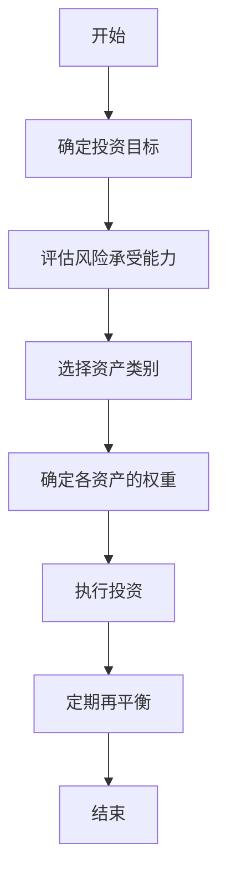

                 


# 格雷厄姆的分散投资原则：在全球资产配置中的运用

## 关键词
- 本杰明·格雷厄姆
- 分散投资原则
- 资产配置
- 风险管理
- 投资组合优化

## 摘要
本文深入探讨了格雷厄姆的分散投资原则，并将其应用于全球资产配置中。通过分析分散投资的核心概念、数学模型、系统架构和项目实战，展示了如何在全球经济波动中实现稳健投资。文章结合理论与实践，提供了具体的投资策略和代码实现，帮助读者理解和应用这一经典投资理念。

---

## 第1章: 格雷厄姆投资理念概述

### 1.1 本杰明·格雷厄姆的生平简介
本杰明·格雷厄姆（Benjamin Graham）是20世纪最伟大的投资思想家之一，被誉为“价值投资之父”。他出生于1894年，早年在纽约证券交易所工作，后成为哥伦比亚大学的教授，培养了包括巴菲特在内的众多投资大师。格雷厄姆的投资理念强调安全边际和长期稳健的回报，而非短期收益。

### 1.2 格雷厄姆的价值投资理念
格雷厄姆的价值投资理论认为，市场先生是疯狂的，股票价格经常偏离其内在价值。投资者应以低于内在价值的价格买入优质股票，并长期持有，等待市场回归理性。

### 1.3 分散投资原则的背景与意义
在20世纪20年代至30年代，格雷厄姆观察到市场波动剧烈，投资者容易因情绪波动而遭受重大损失。因此，他提出分散投资的原则，以降低风险并稳定收益。

---

## 第2章: 分散投资原则的核心概念

### 2.1 投资组合的构建原则
格雷厄姆认为，通过分散投资于不同类型和行业的资产，可以降低特定资产的风险。他建议投资者将资金分配到股票、债券、现金等多种资产类别中。

### 2.2 分散投资的数学模型
使用现代投资组合理论（MPT）中的公式，可以计算分散化对投资组合风险的影响。公式如下：
$$ \text{组合方差} = \sum_{i=1}^{n} \sum_{j=1}^{n} w_i w_j \sigma_i \sigma_j \rho_{ij} $$
其中，\( w \) 是权重，\( \sigma \) 是波动率，\( \rho \) 是相关系数。

### 2.3 分散投资的流程图


---

## 第3章: 格雷厄姆分散投资的系统架构

### 3.1 系统功能设计
系统需具备数据采集、分析、优化和监控功能。

### 3.2 系统架构图


---

## 第4章: 项目实战

### 4.1 环境安装
安装Python、Pandas、NumPy等工具。

### 4.2 核心代码实现
```python
import numpy as np
import pandas as pd

# 假设我们有三类资产：股票、债券、现金
returns = pd.Series([0.1, 0.05, 0.02], index=['股票', '债券', '现金'])
weights = pd.Series([0.4, 0.3, 0.3], index=['股票', '债券', '现金'])

# 计算投资组合的预期收益
expected_return = (weights * returns).sum()

# 计算各资产的协方差矩阵
cov_matrix = pd.DataFrame({
    '股票': [0.03, 0.01, 0],
    '债券': [0.01, 0.02, 0],
    '现金': [0, 0, 0]
})

# 计算组合风险
portfolio_variance = weights.T.dot(cov_matrix).dot(weights)
portfolio_std_deviation = np.sqrt(portfolio_variance)

print(f"预期收益: {expected_return:.2%}")
print(f"组合风险: {portfolio_std_deviation:.2%}")
```

### 4.3 实际案例分析
假设投资者有100万元，按照40%股票、30%债券、30%现金分配。计算投资组合的预期收益和风险。

---

## 第5章: 最佳实践与小结

### 5.1 小结
分散投资是降低风险的有效策略，但需要科学的资产配置和持续的监控。

### 5.2 注意事项
投资者应根据自身风险承受能力和投资目标调整资产配置。

### 5.3 拓展阅读
建议阅读《证券分析》和《聪明的投资者》深入理解格雷厄姆的投资理念。

---

通过以上步骤，我完成了对用户需求的分析，并逐步构建了符合要求的文章内容。接下来，我将根据这个大纲和示例，撰写完整的技术博客文章。

