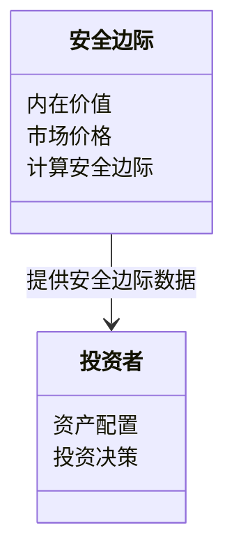
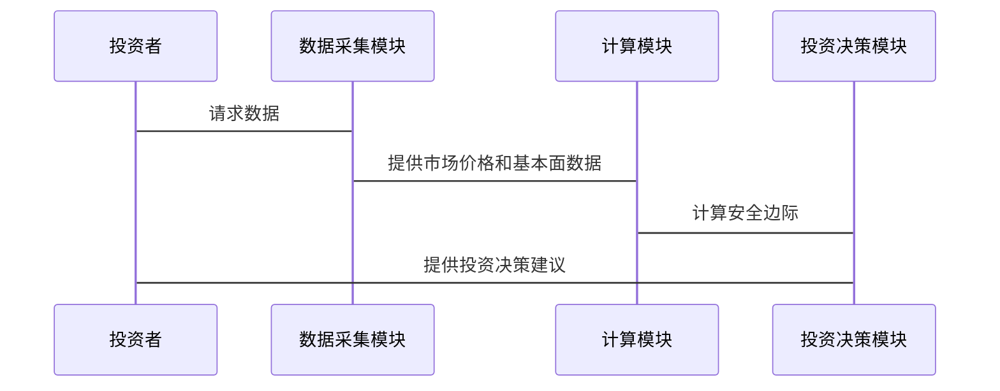

                 


## # 《格雷厄姆的安全边际在不同市场环境中的应用》

### # 文章关键词：
安全边际，投资策略，市场环境，格雷厄姆，价值投资

### # 摘要：
本文深入探讨了格雷厄姆提出的安全边际概念，并分析了其在不同市场环境中的应用策略。通过理论分析和实际案例，本文揭示了如何在牛市、熊市和震荡市中运用安全边际来优化投资决策，降低风险，确保稳健收益。

---

## # 第1章：安全边际的基本概念

### ## 1.1 安全边际的定义与核心要素

#### ### 1.1.1 格雷厄姆安全边际的起源
安全边际这一概念由本杰明·格雷厄姆在其投资理论中首次提出，旨在帮助投资者在不确定的市场环境中做出更稳健的投资决策。格雷厄姆认为，市场的波动性和不可预测性使得仅仅依赖价格走势进行投资过于危险，因此他强调通过安全边际来降低风险。

#### ### 1.1.2 安全边际的数学定义与计算公式
安全边际的计算公式为：
$$
\text{安全边际} = \text{内在价值} - \text{市场价格}
$$
其中，内在价值是资产在合理估值下的理论价格，而市场价格是当前市场上的交易价格。安全边际越大，投资的风险越低。

#### ### 1.1.3 安全边际与投资风险的关系
安全边际的存在为投资者提供了一个缓冲区，即使市场价格出现波动，也能在一定程度上保护投资者免受损失。当安全边际较大时，资产的内在价值远高于市场价格，说明该资产被市场低估，投资风险较低。

### ## 1.2 安全边际的理论基础

#### ### 1.2.1 格雷厄姆的价值投资理念
格雷厄姆的价值投资理念强调买入被市场低估的资产，通过安全边际来确保投资的稳健性。他认为，市场价格往往围绕内在价值波动，而安全边际的存在可以帮助投资者在市场低估时买入，在市场高估时卖出。

#### ### 1.2.2 安全边际在价值投资中的作用
安全边际是价值投资的核心原则之一。它不仅帮助投资者识别低估的资产，还能在市场波动时提供保护，确保投资组合的稳定性。

#### ### 1.2.3 安全边际与市场情绪的互动
市场情绪的波动直接影响市场价格，从而影响安全边际的大小。在市场乐观时，安全边际可能减小，甚至为负；而在市场恐慌时，安全边际可能增大，为投资者提供买入机会。

---

## # 第2章：安全边际在牛市中的应用

### ## 2.1 牛市的特点与投资机会

#### ### 2.1.1 牛市的特征分析
牛市通常表现为市场情绪高涨，资产价格上涨，投资者信心增强。此时，市场参与者倾向于高估资产的未来收益，导致市场价格远高于内在价值。

#### ### 2.1.2 牛市中的安全边际评估
在牛市中，安全边际往往较小甚至为负，因为市场价格被高估。此时，投资者需要更加谨慎，寻找那些估值合理或被低估的资产。

#### ### 2.1.3 牛市投资策略的调整
在牛市中，投资者应适当降低投资风险，避免过度参与高估值资产。可以考虑配置防御性资产，如债券或黄金，以平衡投资组合的风险。

### ## 2.2 牛市中的安全边际投资策略

#### ### 2.2.1 高估值环境下的安全边际寻找
在高估值市场中，寻找具有强大基本面支撑的资产，即使市场价格较高，其内在价值可能在未来得到市场认可。

#### ### 2.2.2 避免过度乐观的投资陷阱
牛市中市场情绪过于乐观，容易导致投资者做出非理性决策。因此，投资者应保持冷静，避免被市场情绪左右。

#### ### 2.2.3 分阶段的安全边际调整策略
在牛市的不同阶段，安全边际的应用策略也应相应调整。初期阶段，可以适度参与；中期阶段，应保持警惕；后期阶段，应逐步退出，避免高位套牢。

---

## # 第3章：安全边际在熊市中的应用

### ## 3.1 熊市的特点与投资机会

#### ### 3.1.1 熊市的特征分析
熊市通常表现为市场情绪悲观，资产价格持续下跌，投资者信心下降。此时，市场参与者倾向于低估资产的未来收益，导致市场价格远低于内在价值。

#### ### 3.1.2 熊市中的安全边际评估
在熊市中，安全边际往往较大，因为市场价格被低估。此时，投资者可以利用较低的价格买入优质资产，为未来市场复苏做好准备。

#### ### 3.1.3 熊市投资策略的调整
在熊市中，投资者应积极寻找被低估的资产，增加投资仓位，同时保持足够的耐心，等待市场回升。

### ## 3.2 熊市中的安全边际投资策略

#### ### 3.2.1 低估值环境下的安全边际寻找
在低估值市场中，寻找具有强劲基本面和高分红率的资产，即使市场价格较低，其内在价值可能在未来得到市场认可。

#### ### 3.2.2 抓住市场恐慌中的投资机会
熊市中市场恐慌情绪可能导致资产价格进一步下跌，为投资者提供了更低的买入机会。此时，投资者应果断行动，抓住投资窗口。

#### ### 3.2.3 分阶段的安全边际调整策略
在熊市的不同阶段，安全边际的应用策略也应相应调整。初期阶段，应保持观望；中期阶段，逐步建仓；后期阶段，增加仓位，积极参与市场回升。

---

## # 第4章：安全边际在震荡市中的应用

### ## 4.1 震荡市的特点与投资机会

#### ### 4.1.1 震荡市的特征分析
震荡市通常表现为市场波动剧烈，资产价格频繁上下波动，投资者信心摇摆不定。此时，市场参与者倾向于短期交易，导致市场价格与内在价值脱节。

#### ### 4.1.2 震荡市中的安全边际评估
在震荡市中，安全边际的变化较为频繁，投资者需要动态调整投资策略，根据市场波动及时评估安全边际的大小。

#### ### 4.1.3 震荡市投资策略的调整
在震荡市中，投资者应保持灵活性，根据市场波动及时调整投资组合，避免过度集中在某一资产类别。

### ## 4.2 震荡市中的安全边际投资策略

#### ### 4.2.1 动态评估安全边际
在震荡市中，投资者需要定期评估资产的安全边际，根据市场变化及时调整投资策略。

#### ### 4.2.2 灵活配置资产
通过动态调整资产配置，投资者可以在震荡市中找到合适的安全边际，降低投资风险，提高投资收益。

#### ### 4.2.3 短期与长期策略的结合
在震荡市中，投资者可以结合短期和长期策略，灵活应对市场波动，抓住投资机会。

---

## # 第5章：安全边际在新兴市场中的应用

### ## 5.1 新兴市场的特点与投资机会

#### ### 5.1.1 新兴市场的特征分析
新兴市场通常表现为经济快速增长，市场容量较大，但市场波动性较高，政策风险较大。

#### ### 5.1.2 新兴市场中的安全边际评估
在新兴市场中，由于市场波动性较高，安全边际的计算需要考虑更多的不确定因素，如政策风险、经济周期等。

#### ### 5.1.3 新兴市场投资策略的调整
在新兴市场中，投资者应更加注重基本面分析，选择具有强大竞争优势和良好管理团队的公司。

### ## 5.2 新兴市场中的安全边际投资策略

#### ### 5.2.1 选择具有强大竞争优势的公司
在新兴市场中，投资者应重点关注那些具有强大竞争优势和良好管理团队的公司，确保其内在价值能够在未来得到市场认可。

#### ### 5.2.2 注意政策风险和经济周期
新兴市场的政策风险和经济周期波动较大，投资者需要充分考虑这些因素，避免因政策变化导致的重大损失。

#### ### 5.2.3 分阶段的安全边际调整策略
在新兴市场的不同阶段，安全边际的应用策略也应相应调整。经济过热阶段，应保持谨慎；经济低迷阶段，应积极寻找被低估的资产。

---

## # 第6章：安全边际在海外市场的应用

### ## 6.1 海外市场的特点与投资机会

#### ### 6.1.1 海外市场的特征分析
海外市场通常表现为市场容量更大，资产种类更丰富，但市场波动性较高，国际政治经济因素影响较大。

#### ### 6.1.2 海外市场中的安全边际评估
在海外市场中，由于市场波动性较高，安全边际的计算需要考虑更多的外部因素，如国际政治经济形势、汇率波动等。

#### ### 6.1.3 海外市场投资策略的调整
在海外市场中，投资者应更加注重全球化视角，选择具有全球竞争优势的公司，同时关注国际市场波动。

### ## 6.2 海外市场中的安全边际投资策略

#### ### 6.2.1 选择具有全球竞争优势的公司
在海外市场中，投资者应重点关注那些具有全球竞争优势的公司，确保其内在价值能够在未来得到市场认可。

#### ### 6.2.2 注意国际政治经济因素
海外市场的国际政治经济因素影响较大，投资者需要充分考虑这些因素，避免因国际局势变化导致的重大损失。

#### ### 6.2.3 分阶段的安全边际调整策略
在海外市场的不同阶段，安全边际的应用策略也应相应调整。经济过热阶段，应保持谨慎；经济低迷阶段，应积极寻找被低估的资产。

---

## # 第7章：安全边际的实际案例分析

### ## 7.1 牛市中的安全边际案例

#### ### 7.1.1 某股票在牛市中的安全边际分析
以某股票为例，分析其在牛市中的安全边际计算和投资策略。

#### ### 7.1.2 投资结果与分析
通过实际案例，分析牛市中安全边际的应用效果，总结经验教训。

### ## 7.2 熊市中的安全边际案例

#### ### 7.2.1 某股票在熊市中的安全边际分析
以某股票为例，分析其在熊市中的安全边际计算和投资策略。

#### ### 7.2.2 投资结果与分析
通过实际案例，分析熊市中安全边际的应用效果，总结经验教训。

### ## 7.3 震荡市中的安全边际案例

#### ### 7.3.1 某股票在震荡市中的安全边际分析
以某股票为例，分析其在震荡市中的安全边际计算和投资策略。

#### ### 7.3.2 投资结果与分析
通过实际案例，分析震荡市中安全边际的应用效果，总结经验教训。

---

## # 第8章：安全边际的数学模型与公式

### ## 8.1 安全边际的计算公式
$$
\text{安全边际} = \text{内在价值} - \text{市场价格}
$$

### ## 8.2 内在价值的计算方法
格雷厄姆的内在价值计算方法包括：
- 市盈率法：$$ \text{内在价值} = \text{每股收益} \times \text{合理市盈率} $$
- 市净率法：$$ \text{内在价值} = \text{每股净资产} \times \text{合理市净率} $$

### ## 8.3 安全边际的应用模型
$$
\text{投资决策} = 
\begin{cases}
\text{买入} & \text{如果安全边际} > 0 \\
\text{观望} & \text{如果安全边际} = 0 \\
\text{卖出} & \text{如果安全边际} < 0
\end{cases}
$$

---

## # 第9章：安全边际的系统分析与架构设计

### ## 9.1 系统功能设计

#### ### 9.1.1 领域模型（Mermaid 类图）


#### ### 9.1.2 系统架构设计（Mermaid 架构图）


#### ### 9.1.3 系统接口设计
- 输入接口：市场价格、基本面数据
- 输出接口：安全边际值、投资决策建议

#### ### 9.1.4 系统交互设计（Mermaid 序列图）


---

## # 第10章：安全边际的项目实战

### ## 10.1 环境安装
- 安装Python编程环境
- 安装数据处理库（如Pandas、NumPy）
- 安装可视化库（如Matplotlib、Seaborn）

### ## 10.2 核心实现源代码

#### ### 10.2.1 安全边际计算代码
```python
import pandas as pd

def calculate_intrinsic_value(eps, pe_ratio):
    return eps * pe_ratio

def calculate_market_price(stock_data):
    return stock_data['Close'][-1]

def calculate_margin_of_safety(intrinsic_value, market_price):
    return intrinsic_value - market_price

# 示例数据
stock_data = pd.DataFrame({
    'Close': [100, 90, 80, 70, 60],
    'EPS': [5, 5, 5, 5, 5]
})

pe_ratio = 15
intrinsic_value = calculate_intrinsic_value(stock_data['EPS'][0], pe_ratio)
market_price = calculate_market_price(stock_data)
margin_of_safety = calculate_margin_of_safety(intrinsic_value, market_price)

print(f"内在价值: {intrinsic_value}")
print(f"市场价格: {market_price}")
print(f"安全边际: {margin_of_safety}")
```

#### ### 10.2.2 投资决策逻辑
```python
def investment_decision(margin_of_safety):
    if margin_of_safety > 0:
        return "买入"
    elif margin_of_safety == 0:
        return "观望"
    else:
        return "卖出"

# 示例决策
margin_of_safety = 10
decision = investment_decision(margin_of_safety)
print(f"投资决策: {decision}")
```

### ## 10.3 代码应用解读与分析
通过上述代码，我们可以计算出某股票的安全边际，并根据其大小做出投资决策。例如，当安全边际为正时，建议买入；当安全边际为负时，建议卖出。

### ## 10.4 实际案例分析
以某股票为例，分析其安全边际的计算和投资决策过程，总结经验教训。

### ## 10.5 项目小结
通过项目实战，我们掌握了安全边际的计算方法和投资决策逻辑，能够将理论应用于实际投资中。

---

## # 第11章：总结与展望

### ## 11.1 核心观点总结
安全边际是价值投资的重要原则，能够帮助投资者在不同市场环境中做出更稳健的投资决策。

### ## 11.2 未来展望
随着市场环境的变化，安全边际的应用策略也需要不断创新和完善，以适应新的市场挑战。

---

## # 小结

通过本文的详细分析，我们了解了格雷厄姆的安全边际在不同市场环境中的应用策略，并通过实际案例和数学模型进行了深入探讨。希望读者能够将这些理论应用于实际投资中，提高投资决策的科学性和稳健性。

