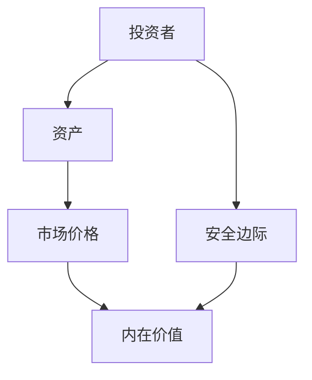
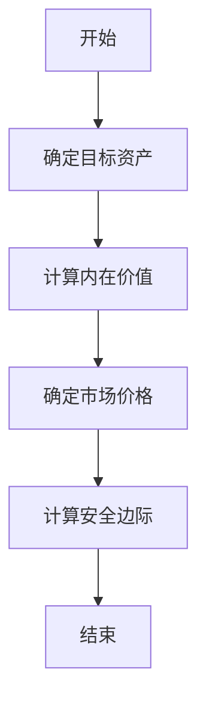
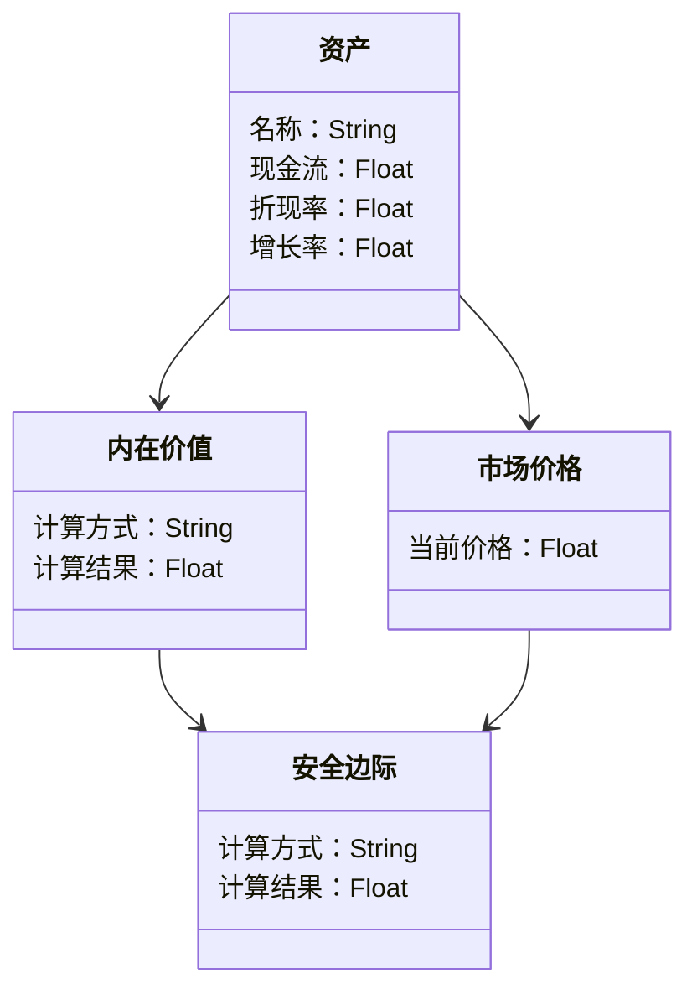
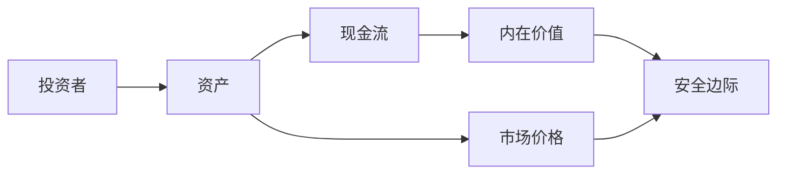
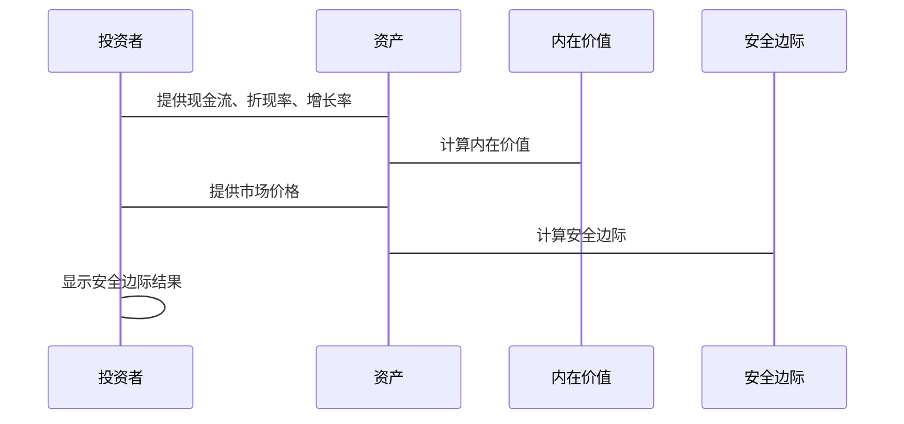

                 


# 格雷厄姆的安全边际概念

> 关键词：安全边际，投资学，价值投资，本杰明·格雷厄姆，投资策略，风险控制

> 摘要：本文将详细介绍格雷厄姆提出的安全边际概念，分析其在投资学中的重要性，探讨其数学模型和算法实现，并通过实际案例展示其在投资决策中的应用。文章从概念背景、数学原理、系统架构到项目实战，层层递进，帮助读者全面理解安全边际的投资策略及其在风险控制中的作用。

---

## 第一部分: 格雷厄姆的安全边际概念概述

### 第1章: 安全边际的起源与背景

#### 1.1 投资学中的安全边际概念
##### 1.1.1 安全边际的起源与发展
安全边际是投资学中的一个重要概念，由本杰明·格雷厄姆在20世纪初提出。它源于对传统估值方法的改进需求，旨在降低投资风险，确保投资者在市场波动中能够稳健获利。

##### 1.1.2 格雷厄姆与安全边际的关系
本杰明·格雷厄姆是价值投资的奠基人，他通过研究市场的波动性和投资者的心理行为，提出了安全边际的概念，强调以低于内在价值的价格买入资产，从而降低投资风险。

##### 1.1.3 安全边际在现代投资中的地位
安全边际不仅是价值投资的核心理念，也是现代投资组合理论的重要组成部分，它为投资者提供了一种保守且稳健的投资策略，尤其在市场波动加剧时显得尤为重要。

#### 1.2 安全边际的核心定义
##### 1.2.1 安全边际的定义与内涵
安全边际是指资产的市场价格与内在价值之间的差额，表示为内在价值与市场价格的比值。当市场价格低于内在价值时，两者之间的差额即为安全边际。

##### 1.2.2 安全边际与投资风险的关系
安全边际的存在意味着投资者在买入资产时有一定的“缓冲区”，即使市场价格下跌，也能在一定程度上抵消损失，从而降低投资风险。

##### 1.2.3 安全边际的计算方法
安全边际的计算公式为：
$$ \text{安全边际} = \frac{\text{内在价值} - \text{市场价格}}{\text{内在价值}} \times 100\% $$

### 第2章: 安全边际的核心概念与属性

#### 2.1 安全边际的原理与机制
##### 2.1.1 市场先生理论
格雷厄姆提出了“市场先生”理论，认为市场情绪波动会影响资产的市场价格。投资者应以独立于市场情绪的方式进行估值，寻找价格低于内在价值的资产。

##### 2.1.2 内在价值与市场价格的差异
内在价值是基于资产未来现金流的现值，而市场价格受市场情绪影响。两者的差异为安全边际提供了存在的基础。

##### 2.1.3 安全边际的形成与消失
安全边际在市场价格低于内在价值时形成，随着市场价格上升而缩小或消失。投资者应持续关注市场价格与内在价值的动态变化。

#### 2.2 安全边际的属性特征对比
##### 2.2.1 表格对比：安全边际与其他投资策略的差异

| 投资策略        | 投资目标          | 风险控制          | 安全边际          |
|-----------------|-------------------|-------------------|-------------------|
| 成长型投资      | 高增长            | 高风险            | 低                |
| 价值投资        | 高内在价值        | 低风险            | 高                |
| 防御型投资      | 稳定收益          | 极低风险          | 中                |

##### 2.2.2 图形分析：安全边际在投资周期中的变化


#### 2.3 安全边际的ER实体关系图



---

## 第二部分: 安全边际的数学模型与算法实现

### 第3章: 安全边际的算法原理与数学模型

#### 3.1 安全边际的计算流程



#### 3.2 安全边际的数学公式

##### 内在价值计算公式
$$ V = \frac{CF}{r - g} $$
其中，\( CF \) 是现金流，\( r \) 是折现率，\( g \) 是增长率。

##### 安全边际计算公式
$$ \text{安全边际} = \frac{\text{内在价值} - \text{市场价格}}{\text{内在价值}} \times 100\% $$

#### 3.3 通俗易懂的举例说明

假设某公司的内在价值为100元，市场价格为80元，则安全边际为：
$$ \text{安全边际} = \frac{100 - 80}{100} \times 100\% = 20\% $$

---

## 第三部分: 系统分析与架构设计

### 第4章: 安全边际系统分析与架构设计

#### 4.1 项目背景
设计一个基于安全边际的投资决策支持系统，帮助投资者快速计算安全边际，评估投资风险，做出明智的投资决策。

#### 4.2 系统功能设计
##### 4.2.1 领域模型类图



#### 4.3 系统架构设计
##### 4.3.1 系统架构图



#### 4.4 接口设计
##### 4.4.1 输入接口
```python
def calculate_intrinsic_value(cash_flow, discount_rate, growth_rate):
    return cash_flow / (discount_rate - growth_rate)
```

##### 4.4.2 输出接口
```python
def calculate_margin_of_safety(intrinsic_value, market_price):
    return ((intrinsic_value - market_price) / intrinsic_value) * 100
```

#### 4.5 交互设计
##### 4.5.1 交互序列图



---

## 第四部分: 项目实战与案例分析

### 第5章: 项目实战与案例分析

#### 5.1 环境安装
安装Python环境和必要的库，如`pandas`和`numpy`。

#### 5.2 代码实现

##### 5.2.1 内在价值计算函数

```python
def calculate_intrinsic_value(cash_flow, discount_rate, growth_rate):
    return cash_flow / (discount_rate - growth_rate)
```

##### 5.2.2 安全边际计算函数

```python
def calculate_margin_of_safety(intrinsic_value, market_price):
    return ((intrinsic_value - market_price) / intrinsic_value) * 100
```

#### 5.3 案例分析

##### 5.3.1 投资可口可乐的案例

假设可口可乐的现金流为1000万元，折现率为8%，增长率3%，市场价格为800万元。

1. 计算内在价值：
$$ V = \frac{1000}{0.08 - 0.03} = 20,000 \text{万元} $$

2. 计算安全边际：
$$ \text{安全边际} = \frac{20,000 - 8,000}{20,000} \times 100\% = 60\% $$

#### 5.4 项目总结
通过实际案例分析，验证了安全边际在投资决策中的有效性。当安全边际较高时，投资者可以更有信心地进行投资，降低风险。

---

## 第五部分: 最佳实践与总结

### 第6章: 最佳实践与总结

#### 6.1 投资建议
- 优先选择安全边际高的资产。
- 定期重新评估内在价值和市场价格。
- 结合市场环境调整投资策略。

#### 6.2 注意事项
- 安全边际不是绝对的保障，市场波动仍可能带来损失。
- 需要结合其他投资策略进行综合判断。

#### 6.3 拓展阅读
推荐阅读本杰明·格雷厄姆的《证券分析》和《聪明的投资者》，深入理解安全边际的理论与实践。

---

# 结语

通过本文的详细讲解，读者可以全面理解格雷厄姆的安全边际概念，并将其应用于实际投资决策中。安全边际不仅是一种稳健的投资策略，也是降低投资风险的重要工具。希望本文能为投资者提供有价值的参考，帮助他们在复杂多变的市场中做出明智的投资决策。

