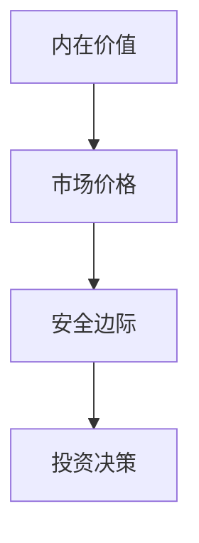
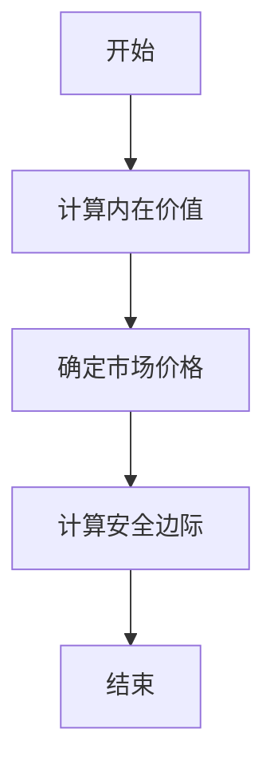
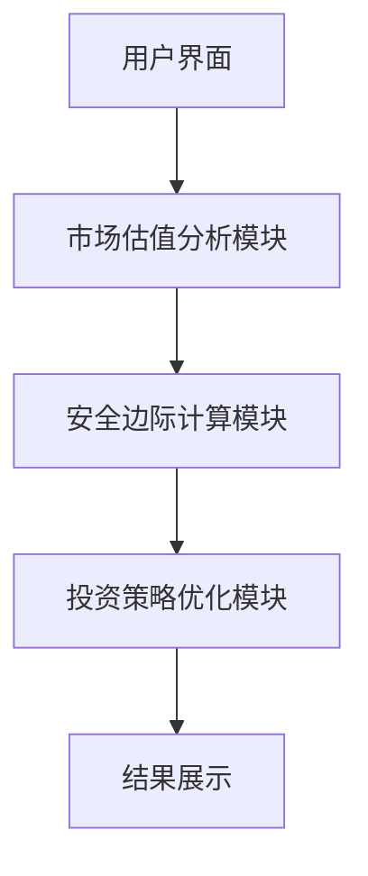

                 


# 格雷厄姆的安全边际理论在高估值市场中的调整

> 关键词：安全边际理论、高估值市场、价值投资、投资策略、风险管理、市场分析

> 摘要：本文详细探讨了格雷厄姆的安全边际理论在高估值市场中的应用与调整策略。通过分析高估值市场的特点，提出在当前市场环境下，如何动态调整安全边际的计算方法，并结合实际案例，阐述了在高估值市场中优化投资策略的有效方法。

---

## 第一章：安全边际理论的起源与发展

### 1.1 格雷厄姆的安全边际理论概述

格雷厄姆的安全边际理论是价值投资的核心理念之一。该理论强调以低于内在价值的价格买入资产，从而在市场波动中降低投资风险。安全边际的计算公式为：

$$ \text{安全边际} = \text{内在价值} - \text{市场价格} $$

其中，内在价值的计算公式为：

$$ \text{内在价值} = \sum_{t=1}^{\infty} \frac{\text{CF}_t}{(1 + r)^t} $$

其中，CFₜ为第t年的现金流，r为折现率。

### 1.2 安全边际理论的核心思想

安全边际理论的核心在于通过计算资产的内在价值，确定其市场价格的低估程度。在传统市场环境下，这种理论为投资者提供了有效的风险管理工具。然而，在高估值市场中，传统的安全边际计算方法需要进行调整，以适应新的市场环境。

---

## 第二章：高估值市场的现状与挑战

### 2.1 高估值市场的定义与特征

高估值市场是指市场整体估值水平显著高于历史平均水平的市场环境。以下是高估值市场的几个关键指标：

- **市盈率（P/E）**：当前股价与每股收益的比率。
- **市净率（P/B）**：当前股价与每股净资产的比率。
- **股息率**：股息与股价的比率。

在高估值市场中，上述指标通常远高于历史平均水平，导致传统安全边际理论的应用面临挑战。

### 2.2 高估值市场的现状分析

当前市场环境下，高估值现象主要由以下因素驱动：

- **低利率环境**：全球低利率政策导致资金流向股市，推高市场估值。
- **市场情绪**：投资者情绪高涨，导致市场参与者对资产价格的乐观预期。
- **结构性因素**：某些行业的高增长预期推动了整体市场估值的提升。

### 2.3 高估值市场对安全边际理论的挑战

在高估值市场中，传统安全边际理论的应用面临以下挑战：

- **内在价值的重新评估**：高估值市场中，资产的内在价值可能被高估，导致安全边际的计算结果不准确。
- **市场波动性增加**：高估值市场中，市场波动性显著增加，传统安全边际理论的稳定性受到挑战。
- **投资风险增加**：高估值市场中，资产价格的泡沫化风险增加，投资者面临更大的潜在损失。

---

## 第三章：安全边际理论的核心概念与联系

### 3.1 核心概念的原理分析

- **安全边际**：通过比较市场价格与内在价值，确定投资的安全空间。
- **内在价值**：基于未来现金流的折现计算，反映资产的真实价值。
- **市场估值**：市场价格的波动反映了市场参与者对资产价值的预期。

### 3.2 核心概念的属性特征对比

| 概念       | 定义                               | 计算公式                              |
|------------|------------------------------------|---------------------------------------|
| 内在价值   | 未来现金流的现值                  | $$\sum_{t=1}^{\infty} \frac{\text{CF}_t}{(1 + r)^t}$$ |
| 市场价格    | 当前资产的市场价格                | -                                     |
| 安全边际   | 内在价值与市场价格的差值          | $$\text{内在价值} - \text{市场价格}$$ |

### 3.3 实体关系图



---

## 第四章：安全边际理论的数学模型与算法实现

### 4.1 安全边际的计算流程

1. **计算内在价值**：基于未来现金流的折现模型。
2. **确定市场价格**：获取当前市场价格数据。
3. **计算安全边际**：内在价值减去市场价格。

### 4.2 计算流程图



### 4.3 Python代码实现

```python
def calculate_intrinsic_value(cash_flows, discount_rate):
    return sum(cash_flow / (1 + discount_rate) ** t for t, cash_flow in enumerate(cash_flows))

def calculate_margin_of_safety(intrinsic_value, market_price):
    return intrinsic_value - market_price

# 示例数据
cash_flows = [100, 110, 120, 130]
discount_rate = 0.08
market_price = 1000

intrinsic_value = calculate_intrinsic_value(cash_flows, discount_rate)
margin_of_safety = calculate_margin_of_safety(intrinsic_value, market_price)

print(f"内在价值: {intrinsic_value}")
print(f"安全边际: {margin_of_safety}")
```

---

## 第五章：高估值市场中的调整策略

### 5.1 动态调整安全边际计算方法

在高估值市场中，建议动态调整安全边际的计算方法，例如：

- **调整折现率**：在高估值市场中，适当提高折现率，以反映更高的市场风险。
- **调整未来现金流预测**：基于市场环境的变化，重新评估未来现金流。

### 5.2 分阶段建仓策略

在高估值市场中，建议采取分阶段建仓策略，逐步增加仓位，以降低投资风险。

### 5.3 风险管理策略

- **设置止损点**：在高估值市场中，设置合理的止损点，以限制潜在损失。
- **分散投资**：通过分散投资，降低单一资产的风险。

---

## 第六章：系统分析与架构设计方案

### 6.1 问题场景介绍

在高估值市场中，投资者需要实时监控市场估值变化，动态调整投资策略。

### 6.2 系统功能设计

- **市场估值分析**：实时监控市场估值指标。
- **安全边际计算**：动态计算安全边际。
- **投资策略优化**：基于安全边际结果，优化投资策略。

### 6.3 系统架构设计



---

## 第七章：项目实战与案例分析

### 7.1 环境安装

安装必要的Python库，如Pandas、NumPy等。

### 7.2 核心代码实现

```python
import pandas as pd
import numpy as np

def calculate_market_valuation_ratio(price, earnings):
    return price / earnings

# 示例数据
prices = pd.Series([1000, 900, 800])
earnings = pd.Series([50, 40, 30])

market_valuation_ratios = calculate_market_valuation_ratio(prices, earnings)
print(market_valuation_ratios)
```

### 7.3 案例分析

通过具体案例分析，验证调整后的安全边际理论在高估值市场中的有效性。

---

## 第八章：结论与展望

### 8.1 结论

本文探讨了格雷厄姆的安全边际理论在高估值市场中的应用与调整策略，提出了动态调整计算方法和分阶段建仓策略，为投资者提供了实用的指导。

### 8.2 展望

未来的研究可以进一步探讨高估值市场中其他投资理论的应用，以及如何结合人工智能技术优化投资策略。

---

## 第九章：最佳实践与注意事项

### 9.1 最佳实践

- 定期监控市场估值变化。
- 保持投资策略的灵活性。

### 9.2 小结

通过本文的分析，投资者可以在高估值市场中有效应用安全边际理论，优化投资策略，降低投资风险。

---

## 第十章：拓展阅读

### 10.1 相关书籍

- 《The Intelligent Investor》 by Benjamin Graham
- 《Security Analysis》 by Benjamin Graham and David Dodd

### 10.2 相关论文

- "The Theory of Value" by John R. Hicks

---

通过以上结构化的内容，您可以根据实际需求进一步扩展和丰富文章内容。

