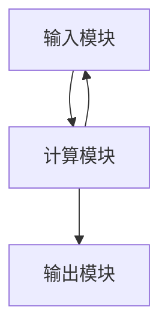

                 

# 格雷厄姆的安全边际理论实践

## 关键词
安全边际理论，价值投资，内在价值，投资风险管理，股票分析

## 摘要
本文深入探讨了格雷厄姆的安全边际理论，分析其核心概念、数学模型、算法原理以及在实际投资中的应用。通过案例分析和系统设计，展示了如何利用安全边际理论进行有效的投资决策。

---

# 第一部分: 格雷厄姆的安全边际理论基础

## 第1章: 安全边际理论的背景与核心概念

### 1.1 安全边际理论的起源与发展

#### 1.1.1 投资学的起源与发展
投资学作为一门学科，起源于对资产定价和风险管理的研究。早期的投资者关注市场波动和技术分析，但随着市场的复杂化，对价值评估的需求日益增长。

#### 1.1.2 格雷厄姆与安全边际理论的提出
本杰明·格雷厄姆是20世纪的投资大师，他提出的安全边际理论是价值投资的核心。他强调买入价格低于内在价值的股票，以降低投资风险。

#### 1.1.3 安全边际理论的演变与应用
随着时间推移，安全边际理论被应用于多种投资策略中，尤其是在机构投资和风险管理领域。它帮助投资者在不确定市场中做出更理性的决策。

---

### 1.2 安全边际理论的核心概念

#### 1.2.1 安全边际的定义与内涵
安全边际是指股票的市场价格与内在价值之间的差额。当市场价格低于内在价值时，投资风险降低，潜在收益增加。

#### 1.2.2 安全边际的计算方法
计算安全边际需要先确定股票的内在价值，再与市场价格比较。公式为：
$$ \text{安全边际} = \text{市场价格} - \text{内在价值} $$

#### 1.2.3 安全边际与投资风险的关系
安全边际越大，投资风险越低。投资者应选择安全边际较高的股票，以确保投资的稳健性。

---

### 1.3 安全边际理论与其他投资理论的对比

#### 1.3.1 与技术分析的对比
| 特性         | 安全边际理论       | 技术分析         |
|--------------|--------------------|------------------|
| 基础         | 内在价值与市场价   | 历史价格与形态   |
| 方法         | 价值评估           | 图表分析         |
| 应用场景     | 长期投资           | 短期价格预测     |

---

## 第2章: 安全边际理论的核心原理

### 2.1 安全边际的数学模型与公式

#### 2.1.1 内在价值的计算公式
$$ V = \sum_{t=1}^{\infty} \frac{CF_t}{(1 + r)^t} $$
其中，$CF_t$是第$t$年的现金流，$r$是折现率。

#### 2.1.2 安全边际的计算公式
$$ \text{安全边际} = \text{市场价格} - \text{内在价值} $$

### 2.2 安全边际的属性特征对比

| 特性         | 安全边际理论       | 技术分析         |
|--------------|--------------------|------------------|
| 计算基础     | 内在价值与市场价   | 历史价格与形态   |
| 应用场景     | 长期价值投资       | 短期价格波动     |
| 风险控制     | 降低投资风险       | 较少关注风险     |

---

## 第3章: 安全边际理论的系统分析与架构设计

### 3.1 投资分析系统的功能设计
- 输入模块：接收股票数据和市场信息。
- 计算模块：计算内在价值和安全边际。
- 输出模块：生成投资建议和风险报告。

### 3.2 系统架构设计

---

## 第4章: 安全边际理论的项目实战

### 4.1 项目背景与目标
以某科技公司为例，分析其股票的安全边际，评估投资价值。

### 4.2 数据收集与处理
收集该公司的财务数据和市场数据，计算其内在价值。

### 4.3 计算与分析
使用DCF模型计算内在价值，再与市场价格比较，得出安全边际。

### 4.4 投资建议
根据计算结果，建议投资者在安全边际较高时买入。

---

## 第5章: 安全边际理论的最佳实践

### 5.1 小结
安全边际理论是一种有效的投资工具，帮助投资者降低风险，实现稳健收益。

### 5.2 注意事项
- 数据准确性：确保输入数据的可靠性。
- 市场变化：定期更新分析，适应市场变化。
- 风险控制：合理配置资产，分散投资风险。

### 5.3 未来趋势
随着大数据和人工智能的发展，安全边际理论将更加精准和高效。

### 5.4 拓展阅读
推荐阅读格雷厄姆的《证券分析》和巴菲特的《投资之道》。

---

通过以上内容，我们系统地分析了格雷厄姆的安全边际理论，从理论基础到实际应用，为投资者提供了全面的指导。希望本文能帮助读者更好地理解和应用这一理论，实现稳健的投资收益。

