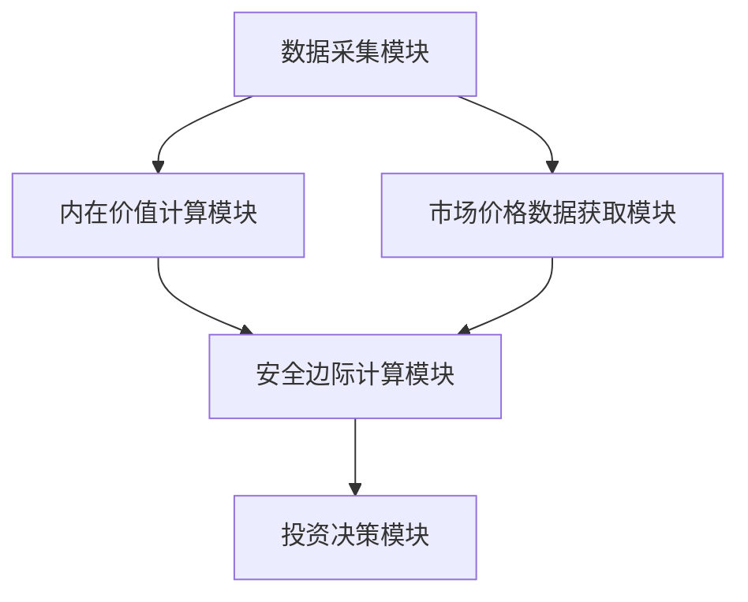
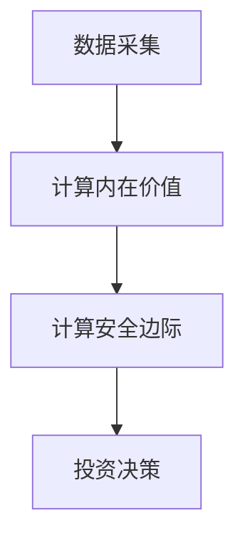

                 


# 格雷厄姆的安全边际理论：在高估值市场中的应用

> 关键词：格雷厄姆，安全边际，投资，高估值市场，股票估值，风险管理，价值投资

> 摘要：本文深入探讨了格雷厄姆的安全边际理论及其在高估值市场中的应用。通过分析安全边际的定义、计算方法及在不同市场环境下的应用策略，结合实际案例和系统架构设计，展示了如何利用安全边际理论在高估值市场中做出明智的投资决策，降低投资风险，实现长期稳健收益。

---

# 目录

1. [第一部分: 格雷厄姆的安全边际理论基础](#第一部分-格雷厄姆的安全边际理论基础)
   - [第1章: 安全边际理论的起源与发展](#第1章-安全边际理论的起源与发展)
     - [1.1 格雷厄姆的生平简介](#1.1-格雷厄姆的生平简介)
     - [1.2 安全边际理论的核心概念](#1.2-安全边际理论的核心概念)
   - [第2章: 安全边际理论的数学模型与公式](#第2章-安全边际理论的数学模型与公式)
     - [2.1 内在价值的计算方法](#2.1-内在价值的计算方法)
     - [2.2 安全边际的计算公式](#2.2-安全边际的计算公式)
   - [第3章: 安全边际理论的系统分析与架构设计](#第3章-安全边际理论的系统分析与架构设计)
     - [3.1 投资系统的总体架构](#3.1-投资系统的总体架构)
     - [3.2 投资决策流程的设计](#3.2-投资决策流程的设计)

2. [第二部分: 高估值市场中的安全边际应用](#第二部分-高估值市场中的安全边际应用)
   - [第4章: 高估值市场的特征与挑战](#第4章-高估值市场的特征与挑战)
   - [第5章: 高估值市场中的安全边际应用策略](#第5章-高估值市场中的安全边际应用策略)
   - [第6章: 高估值市场中的实际案例分析](#第6章-高估值市场中的实际案例分析)
   - [第7章: 高估值市场中的系统架构设计](#第7章-高估值市场中的系统架构设计)
   - [第8章: 高估值市场中的项目实战](#第8章-高估值市场中的项目实战)

3. [总结与展望](#总结与展望)
4. [参考文献](#参考文献)
5. [附录](#附录)

---

## 第一部分: 格雷厄姆的安全边际理论基础

### 第1章: 安全边际理论的起源与发展

#### 1.1 格雷厄姆的生平简介
本菲德·格雷厄姆（Benjamin Graham）是20世纪著名的投资学家和价值投资理论的创始人之一。他出生于1894年，早年在伦敦学习法律，后移居美国，进入哥伦比亚大学学习并开始研究股票市场。格雷厄姆的职业生涯中，他不仅是成功的投资者，还培养了许多著名投资者，如沃伦·巴菲特。

#### 1.2 安全边际理论的核心概念
安全边际理论的核心思想是：**以低于内在价值的价格买入资产，以降低投资风险**。格雷厄姆认为，市场的波动性和不确定性使得股票价格经常偏离其内在价值，而安全边际正是利用这种偏差，通过买入价格远低于内在价值的股票，来确保投资的安全性和收益性。

#### 1.3 安全边际的定义与内涵
安全边际（Safety Margin）是指股票的市场价格与其内在价值之间的差距。具体来说，当市场价格低于内在价值时，两者之间的差额即为安全边际。这种差距越大，投资的安全性越高，因为即使市场波动导致价格下跌，也不会低于内在价值。

#### 1.4 安全边际与投资决策的关系
格雷厄姆认为，安全边际是投资决策的核心依据。通过计算安全边际，投资者可以判断一个股票是否具有投资价值。如果市场价格远低于内在价值，且存在较大的安全边际，那么这个股票就是值得投资的。

### 第2章: 安全边际理论的数学模型与公式

#### 2.1 内在价值的计算方法
内在价值是基于公司基本面分析得出的公司股票的真实价值。格雷厄姆通常使用以下公式来计算内在价值：

$$
\text{内在价值} = \frac{\text{每股收益（EPS）}}{\text{资本成本（WACC）}}
$$

其中，资本成本（WACC）是公司为获取资本所支付的成本，通常取8%到12%之间。

#### 2.2 安全边际的计算公式
安全边际的计算公式如下：

$$
\text{安全边际} = \text{内在价值} - \text{市场价格}
$$

如果市场价格低于内在价值，且安全边际为正，那么股票具有投资价值。反之，则不具有投资价值。

### 第3章: 安全边际理论的系统分析与架构设计

#### 3.1 投资系统的总体架构
在实际应用中，我们可以将安全边际理论融入一个完整的投资系统中。该系统包括以下几个核心模块：

- 数据采集模块：采集股票的基本信息、财务数据等。
- 内在价值计算模块：基于财务数据计算股票的内在价值。
- 市场价格数据获取模块：获取股票的市场价格数据。
- 安全边际计算模块：计算股票的安全边际。
- 投资决策模块：基于安全边际的计算结果，做出投资决策。

系统架构图如下：



#### 3.2 投资决策流程的设计
以下是基于安全边际理论的投资决策流程：

1. 数据采集：获取目标公司的财务数据（如收入、利润、现金流等）和市场价格数据。
2. 计算内在价值：使用格雷厄姆的内在价值公式计算股票的内在价值。
3. 计算安全边际：将内在价值与市场价格进行比较，计算安全边际。
4. 投资决策：如果安全边际为正且大于一定阈值，买入股票；否则，不买入。

投资决策流程图如下：



---

## 第二部分: 高估值市场中的安全边际应用

### 第4章: 高估值市场的特征与挑战

#### 4.1 高估值市场的定义与特征
高估值市场是指股票市场价格远高于其内在价值的市场环境。通常表现为市盈率（P/E）、市净率（P/B）等估值指标远高于历史平均水平。在这种市场环境下，安全边际理论显得尤为重要。

#### 4.2 高估值市场中的投资挑战
在高估值市场中，投资者面临以下挑战：
1. 市场波动性大，价格偏离内在价值。
2. 投资者情绪化，容易被市场情绪影响。
3. 安全边际较小或为负，投资风险较高。

### 第5章: 高估值市场中的安全边际应用策略

#### 5.1 安全边际的重新定义
在高估值市场中，我们需要重新定义安全边际的计算方法。通常，可以将安全边际的阈值设置得更低，以适应市场的高估值环境。

#### 5.2 投资策略的调整
在高估值市场中，投资者应采取以下策略：
1. **选择具有强大护城河的公司**：这些公司能够在市场波动中保持稳定增长。
2. **关注低估值股票**：寻找市场价格低于内在价值的股票进行投资。
3. **分散投资**：通过分散投资降低市场风险。

### 第6章: 高估值市场中的实际案例分析

#### 6.1 案例1：科技股市场的高估值分析
以2020年的科技股市场为例，许多科技股的市盈率远高于历史平均水平。以下是某科技公司的具体分析：

- 每股收益（EPS）：$2
- 资本成本（WACC）：10%
- 内在价值：$2 / 0.1 = $20
- 市场价格：$30
- 安全边际：$20 - $30 = -$10（负数，说明市场价格高于内在价值）

因此，该股票在2020年时并不具有投资价值。

#### 6.2 案例2：周期性行业的低估值机会
在高估值市场中，周期性行业的股票可能会出现低估值机会。例如，2021年某周期性公司的分析：

- 每股收益（EPS）：$3
- 资本成本（WACC）：8%
- 内在价值：$3 / 0.08 = $37.5
- 市场价格：$30
- 安全边际：$37.5 - $30 = $7.5（正数，说明市场价格低于内在价值）

因此，该股票具有较高的投资价值。

### 第7章: 高估值市场中的系统架构设计

#### 7.1 投资系统功能模块
在高估值市场中，我们需要对投资系统进行调整，以适应新的市场环境。以下是调整后的系统功能模块：

- 数据采集模块：采集高估值市场的财务数据和市场价格数据。
- 内在价值计算模块：基于调整后的公式计算内在价值。
- 市场价格数据获取模块：获取高估值市场的市场价格数据。
- 安全边际计算模块：计算高估值市场中的安全边际。
- 投资决策模块：基于高估值市场的安全边际结果，做出投资决策。

系统架构图如下：


### 第8章: 高估值市场中的项目实战

#### 8.1 环境安装与配置
要实现基于安全边际理论的投资系统，我们需要安装以下工具和环境：

- 数据库：MySQL
- 程序语言：Python
- 数据分析工具：Pandas、NumPy
- 可视化工具：Matplotlib、Seaborn
- 投资分析框架：QuantLib

#### 8.2 核心代码实现
以下是投资系统的核心代码实现：

```python
import pandas as pd
import numpy as np

def calculate_intrinsic_value(eps, wacc):
    return eps / wacc

def calculate_margin_of_safety(intrinsic_value, market_price):
    return intrinsic_value - market_price

# 示例数据
data = {
    '公司': ['科技公司', '周期性公司'],
    'eps': [2, 3],
    'wacc': [0.1, 0.08],
    'market_price': [30, 30]
}

df = pd.DataFrame(data)

# 计算内在价值和安全边际
df['内在价值'] = df.apply(lambda x: calculate_intrinsic_value(x['eps'], x['wacc']), axis=1)
df['安全边际'] = df.apply(lambda x: calculate_margin_of_safety(x['内在价值'], x['market_price']), axis=1)

print(df)
```

#### 8.3 案例分析与解读
通过上述代码，我们可以得到以下结果：

| 公司         | eps | wacc | market_price | 内在价值 | 安全边际 |
|--------------|-----|------|--------------|----------|----------|
| 科技公司     | 2   | 0.1  | 30           | 20       | -10      |
| 周期性公司    | 3   | 0.08 | 30           | 37.5     | 7.5      |

从结果可以看出，科技公司在高估值市场中并不具有投资价值，而周期性公司则具有较高的安全边际，值得投资。

---

## 总结与展望

通过本文的分析，我们可以看出，格雷厄姆的安全边际理论在高估值市场中具有重要的应用价值。在高估值市场中，我们需要重新定义安全边际的计算方法，并根据市场环境调整投资策略。通过系统化的投资架构设计和实际案例分析，我们可以更好地利用安全边际理论，降低投资风险，实现长期稳健收益。

未来的研究可以进一步探索安全边际理论在不同市场环境下的应用，以及如何结合人工智能和大数据技术，提升投资决策的准确性和效率。

---

## 参考文献

1. 格雷厄姆，B. (1949). *The Intelligent Investor*.
2. 巴菲特，W. (1984). *Value Investing*.
3. 葛拉汉姆，D. (2000). *The New York Times Financial Dictionary*.

---

## 附录

### 附录A: 安全边际计算公式

$$
\text{安全边际} = \text{内在价值} - \text{市场价格}
$$

### 附录B: 投资系统架构图


---

通过本文的详细分析，读者可以深入了解格雷厄姆的安全边际理论，并将其应用于高估值市场的投资决策中。希望本文对您的投资实践有所帮助！

