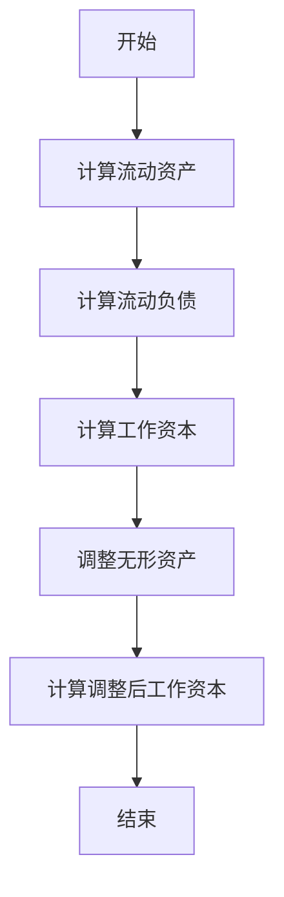

                 


# 格雷厄姆的工作资本分析在现代企业估值中的应用

> 关键词：工作资本分析，企业估值，格雷厄姆，现代企业，投资价值

> 摘要：格雷厄姆的工作资本分析是一种经典的企业估值方法，但在现代企业的复杂环境下，需要对其加以调整和创新。本文从工作资本分析的基本原理出发，探讨其在现代企业估值中的应用，结合实际案例和数学模型，分析其在现代环境下的适应性和优化策略，为投资者和企业管理者提供有价值的参考。

---

## 目录

### 第一部分：工作资本分析的背景与基础

#### 第1章：工作资本分析的定义与核心概念

##### 1.1 工作资本分析的定义
- 1.1.1 格雷厄姆工作资本分析的起源
- 1.1.2 工作资本分析的核心目标
- 1.1.3 工作资本分析的适用范围

##### 1.2 格雷厄姆工作资本分析的理论基础
- 1.2.1 价值投资的基本原理
- 1.2.2 格雷厄姆的投资理念
- 1.2.3 工作资本分析在投资决策中的作用

##### 1.3 现代企业估值的基本框架
- 1.3.1 企业估值的核心要素
- 1.3.2 传统估值方法的局限性
- 1.3.3 格雷厄姆工作资本分析的现代意义

#### 第2章：工作资本分析与现代企业估值的结合

##### 2.1 现代企业估值的挑战
- 2.1.1 数字化转型对企业估值的影响
- 2.1.2 新技术和商业模式对企业估值的改变
- 2.1.3 传统估值方法的局限性

##### 2.2 工作资本分析在现代企业估值中的优势
- 2.2.1 格雷厄姆方法的稳健性
- 2.2.2 工作资本分析的灵活性
- 2.2.3 结合现代数据的优势

##### 2.3 工作资本分析与现代企业估值的核心联系
- 2.3.1 核心概念对比
- 2.3.2 核心要素的动态变化
- 2.3.3 核心模型的适应性

### 第二部分：工作资本分析的数学模型与算法

#### 第3章：工作资本分析的数学模型

##### 3.1 工作资本分析的基本公式
- $$ \text{工作资本} = \text{流动资产} - \text{流动负债} $$

##### 3.2 格雷厄姆净现值计算公式
- $$ NPV = \sum_{t=1}^{n} \frac{CF_t}{(1 + r)^t} $$

##### 3.3 工作资本分析的扩展公式
- $$ \text{调整后工作资本} = \text{工作资本} + \text{无形资产} - \text{冗余负债} $$

#### 第4章：工作资本分析的算法实现

##### 4.1 工作资本分析的算法流程


##### 4.2 算法实现的Python代码
```python
def calculate_working_capital(net_current_assets, net_current_liabilities):
    return net_current_assets - net_current_liabilities
```

### 第三部分：工作资本分析在现代企业估值中的应用

#### 第5章：工作资本分析的现代优化

##### 5.1 现代企业估值的核心要素
- 流动资产：现金、应收账款、存货等
- 流动负债：应付账款、短期借款等
- 无形资产：品牌价值、专利技术等
- 研发投入：技术创新对企业价值的影响

##### 5.2 工作资本分析的优化策略
- 考虑无形资产的价值
- 调整流动资产和流动负债的计算方法
- 结合市场环境和行业特点

#### 第6章：工作资本分析的系统架构

##### 6.1 系统功能设计
- 数据采集：获取企业的财务数据和市场数据
- 数据处理：计算工作资本、净现值等指标
- 数据分析：结合机器学习模型进行估值预测
- 结果展示：生成可视化报告

##### 6.2 系统架构设计


##### 6.3 系统接口设计
- 输入接口：财务报表数据、市场数据
- 输出接口：估值报告、风险分析

#### 第7章：工作资本分析的实际案例

##### 7.1 案例背景
- 某科技公司A的财务数据和市场环境

##### 7.2 数据分析过程
- 计算工作资本
- 调整无形资产价值
- 评估净现值

##### 7.3 结果解读
- 估值结果与市场实际情况对比
- 分析误差原因

### 第四部分：总结与展望

#### 第8章：总结与小结

##### 8.1 核心观点回顾
- 工作资本分析的基本原理
- 现代企业估值的挑战与优化
- 系统架构与实际应用

##### 8.2 最佳实践 tips
- 结合行业特点进行估值调整
- 定期更新数据和模型
- 多维度分析以提高准确性

#### 第9章：展望与建议

##### 9.1 未来研究方向
- 结合更多现代技术（如人工智能）进行估值优化
- 开发更复杂的数学模型
- 探讨工作资本分析在不同行业的应用

##### 9.2 对企业管理者的建议
- 重视无形资产的价值
- 定期进行财务数据分析
- 借助技术手段提高估值效率

---

通过以上思考，我将按照上述结构撰写一篇详细、逻辑清晰、内容丰富的技术博客文章，确保每个部分都得到充分的展开和解释，为读者提供有价值的内容。

