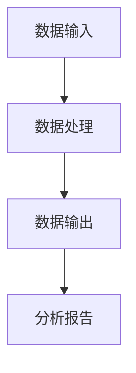

                 


# 格雷厄姆的工作资本分析：评估公司短期健康

> 关键词：工作资本分析，流动资产，流动负债，流动比率，速动比率，短期偿债能力

> 摘要：工作资本分析是评估公司短期健康的重要工具，通过分析流动资产和流动负债的关系，可以衡量公司的短期偿债能力和流动性。本文将详细介绍工作资本分析的核心概念、方法、实际应用以及系统架构，帮助读者全面理解并掌握如何利用工作资本分析来评估公司短期健康。

---

# 第1章：工作资本分析概述

## 1.1 工作资本分析的定义与意义

### 1.1.1 什么是工作资本分析
工作资本分析（Working Capital Analysis）是通过对流动资产和流动负债的分析，评估公司短期偿债能力和流动性管理的工具。它帮助企业在日常经营中确保能够偿还短期债务，维持正常的运营。

### 1.1.2 工作资本分析的重要性
- **评估短期偿债能力**：确保公司有足够的流动资产来覆盖流动负债。
- **优化流动性管理**：通过分析工作资本，企业可以更好地管理库存、应收账款和应付账款。
- **支持决策制定**：为管理层提供财务健康状况的清晰视角，帮助制定短期财务策略。

### 1.1.3 工作资本分析的目标
- 确保公司具备足够的流动资金来应对短期债务。
- 优化资产和负债结构，提高资金使用效率。
- 识别潜在的财务风险，及时采取纠正措施。

---

## 1.2 工作资本分析的核心概念

### 1.2.1 流动资产与流动负债
- **流动资产**：能够在一年内或一个经营周期内转换为现金的资产，包括现金、应收账款、存货等。
- **流动负债**：公司在一年内需要偿还的债务，包括应付账款、短期贷款等。

### 1.2.2 工作资本的计算公式
$$ \text{工作资本} = \text{流动资产} - \text{流动负债} $$

### 1.2.3 工作资本分析的边界与外延
- **边界**：仅关注流动资产和流动负债，不涉及长期资产和负债。
- **外延**：通过分析工作资本的变化趋势，评估公司财务健康状况的变化。

---

## 1.3 工作资本分析的方法

### 1.3.1 基本方法
- **比率分析**：通过计算流动比率、速动比率等指标，评估短期偿债能力。
- **趋势分析**：比较不同时间段的工作资本变化，识别趋势和潜在问题。

### 1.3.2 具体步骤
1. 收集公司财务报表数据。
2. 计算流动资产和流动负债。
3. 计算工作资本及其相关比率。
4. 分析结果，评估短期偿债能力和流动性。

### 1.3.3 应用场景
- 企业内部财务管理。
- 投资者评估公司短期财务健康状况。
- 银行贷款审批的重要参考。

---

## 1.4 本章小结

本章介绍了工作资本分析的基本概念、重要性、核心公式和方法，为后续章节的深入分析奠定了基础。

---

# 第2章：工作资本的结构与组成

## 2.1 流动资产

### 2.1.1 现金及现金等价物
- 包括库存现金、银行存款和短期投资，是流动性最强的资产。

### 2.1.2 应收账款
- 公司因销售产品或服务而产生的未收回的款项，通常包括应收账款和预付款项。

### 2.1.3 存货
- 包括原材料、在制品和成品，是流动资产的重要组成部分。

### 2.1.4 其他流动资产
- 包括其他应收款、待摊费用等。

---

## 2.2 流动负债

### 2.2.1 应付账款
- 公司因购买原材料或服务而产生的未付账款。

### 2.2.2 短期债务
- 公司在一年内需要偿还的贷款和债券。

### 2.2.3 应付职工薪酬
- 包括应付工资、奖金和福利等。

### 2.2.4 其他流动负债
- 包括预收账款、应付股利等。

---

## 2.3 工作资本的计算与应用

### 2.3.1 工作资本的计算公式
$$ \text{工作资本} = \text{流动资产} - \text{流动负债} $$

### 2.3.2 工作资本的正负意义
- **正值**：公司有足够的流动资产偿还短期债务。
- **负值**：公司流动资产不足以偿还流动负债，可能存在短期偿债风险。

### 2.3.3 工作资本的变动分析
- 分析工作资本的变化趋势，识别潜在的财务问题或改善。

---

## 2.4 本章小结

本章详细介绍了流动资产和流动负债的具体组成，以及工作资本的计算和应用，帮助读者更好地理解工作资本的结构。

---

# 第3章：流动比率与速动比率分析

## 3.1 流动比率

### 3.1.1 流动比率的定义
$$ \text{流动比率} = \frac{\text{流动资产}}{\text{流动负债}} $$

### 3.1.2 流动比率的解读
- 一般认为流动比率应保持在2:1以上，表明公司有足够的流动资产偿还短期债务。

## 3.2 速动比率

### 3.2.1 速动比率的定义
$$ \text{速动比率} = \frac{\text{速动资产}}{\text{流动负债}} $$

其中，速动资产 = 流动资产 - 存货。

### 3.2.2 速动比率的解读
- 一般认为速动比率应保持在1:1以上，表明公司扣除存货后的流动资产仍能偿还短期债务。

---

## 3.3 流动比率与速动比率的比较

### 3.3.1 区别
- **流动比率**：包括存货在内的流动资产与流动负债的比率。
- **速动比率**：扣除存货后的速动资产与流动负债的比率。

### 3.3.2 优缺点
- **流动比率**：更能全面反映流动资产的偿债能力，但可能高估存货较低的公司。
- **速动比率**：更能准确反映公司扣除存货后的偿债能力。

### 3.3.3 合理范围
- 流动比率：2:1以上为佳。
- 速动比率：1:1以上为佳。

---

## 3.4 本章小结

本章详细讲解了流动比率和速动比率的计算方法及其在工作资本分析中的应用，帮助读者更好地评估公司的短期偿债能力。

---

# 第4章：工作资本分析的实际应用

## 4.1 工作资本分析的步骤

### 4.1.1 确定分析目标
- 明确分析目的是评估短期偿债能力还是优化流动性管理。

### 4.1.2 收集数据
- 获取公司最近的财务报表，包括资产负债表和利润表。

### 4.1.3 计算工作资本及其相关比率
- 使用公式计算工作资本、流动比率和速动比率。

### 4.1.4 分析结果
- 根据计算结果，评估公司的短期偿债能力和流动性管理状况。

---

## 4.2 实际案例分析

### 4.2.1 案例背景
- 某制造公司最近的财务数据如下：
  - 流动资产：500万元
  - 流动负债：300万元

### 4.2.2 计算工作资本
$$ \text{工作资本} = 500 - 300 = 200 \text{万元} $$

### 4.2.3 计算流动比率
$$ \text{流动比率} = \frac{500}{300} = 1.67 $$

### 4.2.4 计算速动比率
假设存货为200万元，则速动资产为300万元。
$$ \text{速动比率} = \frac{300}{300} = 1.0 $$

### 4.2.5 结果分析
- **工作资本**：200万元为正，表明公司有足够的流动资产偿还短期债务。
- **流动比率**：1.67，略低于2:1，表明公司短期偿债能力一般。
- **速动比率**：1.0，表明扣除存货后的速动资产刚好等于流动负债，短期偿债能力较为紧张。

---

## 4.3 本章小结

本章通过实际案例分析，展示了如何将工作资本分析应用于实际财务评估，帮助读者更好地理解和应用相关概念。

---

# 第5章：系统架构与技术实现

## 5.1 系统架构设计

### 5.1.1 系统模块
- 数据输入模块：接收财务数据。
- 数据处理模块：计算工作资本及其相关比率。
- 数据输出模块：生成分析报告。

### 5.1.2 系统架构图



---

## 5.2 技术实现

### 5.2.1 数据处理
使用Python的Pandas库进行数据清洗和计算。

### 5.2.2 可视化
使用Matplotlib库生成图表，直观展示分析结果。

---

## 5.3 本章小结

本章介绍了工作资本分析系统的架构设计和技术实现，展示了如何利用技术工具提高分析效率。

---

# 第6章：项目实战与最佳实践

## 6.1 项目实战

### 6.1.1 环境搭建
- 安装Python和相关库（Pandas、Matplotlib）。

### 6.1.2 核心代码实现

```python
import pandas as pd
import matplotlib.pyplot as plt

# 输入财务数据
data = {
    '流动资产': [500],
    '流动负债': [300]
}
df = pd.DataFrame(data)

# 计算工作资本
working_capital = df['流动资产'] - df['流动负债']
print(f"工作资本: {working_capital.values[0]}万元")

# 计算流动比率
current_ratio = df['流动资产'] / df['流动负债']
print(f"流动比率: {current_ratio.values[0]:.2f}")

# 可视化
plt.figure(figsize=(10, 6))
plt.plot(df.index, df['流动资产'], label='流动资产')
plt.plot(df.index, df['流动负债'], label='流动负债')
plt.title('流动资产与流动负债对比')
plt.xlabel('时间')
plt.ylabel('金额(万元)')
plt.legend()
plt.show()
```

### 6.1.3 结果分析
- 工作资本：200万元，流动比率：1.67。

---

## 6.2 最佳实践

### 6.2.1 数据来源
- 确保数据准确可靠，优先使用经过审计的财务报表。

### 6.2.2 分析工具
- 熟练掌握Excel或Python工具，提高分析效率。

### 6.2.3 结果解读
- 结合行业标准和公司实际情况，全面解读分析结果。

---

## 6.3 本章小结

本章通过项目实战展示了如何利用技术工具进行工作资本分析，并总结了最佳实践，帮助读者在实际工作中更好地应用相关方法。

---

# 第7章：总结与拓展阅读

## 7.1 总结

工作资本分析是评估公司短期健康的重要工具，通过对流动资产和流动负债的分析，可以帮助企业优化流动性管理，评估短期偿债能力。本文详细介绍了工作资本分析的核心概念、方法、实际应用以及系统架构，为读者提供了全面的视角。

---

## 7.2 拓展阅读

- 《财务报表分析》：深入了解财务报表的构成和分析方法。
- 《企业风险管理》：学习如何识别和管理财务风险。
- 《Python数据处理与可视化》：掌握利用Python进行数据分析的技巧。

---

# 附录：常用公式与术语表

## 附录A：常用公式

### 附录A.1 工作资本公式
$$ \text{工作资本} = \text{流动资产} - \text{流动负债} $$

### 附录A.2 流动比率公式
$$ \text{流动比率} = \frac{\text{流动资产}}{\text{流动负债}} $$

### 附录A.3 速动比率公式
$$ \text{速动比率} = \frac{\text{速动资产}}{\text{流动负债}} $$

---

## 附录B：术语解释

### 附录B.1 流动资产
- 包括现金、应收账款、存货等，能够在一年内转换为现金的资产。

### 附录B.2 流动负债
- 包括应付账款、短期债务等，公司一年内需要偿还的债务。

---

# 结语

通过本文的学习，读者可以全面掌握工作资本分析的核心概念和实际应用，为评估公司短期健康提供有力支持。希望本文能够成为您在财务分析领域的实用指南。

