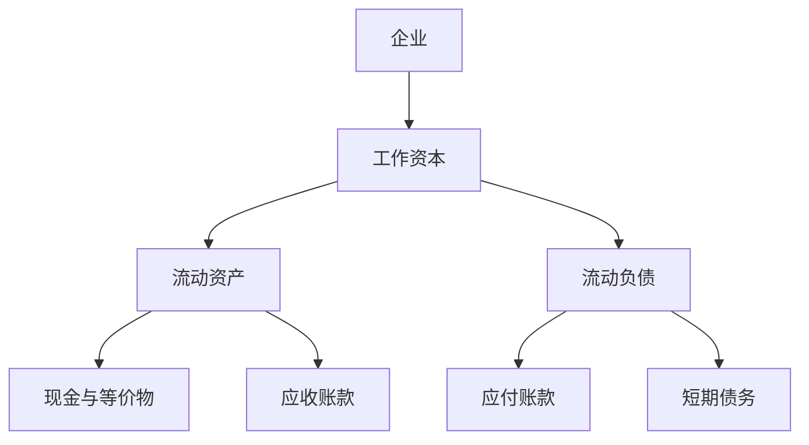
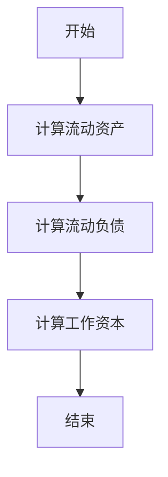
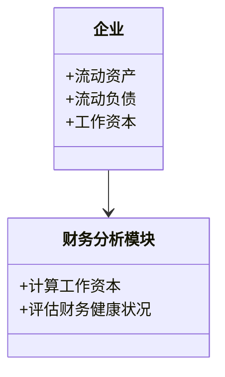
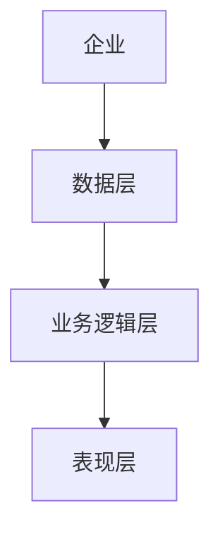
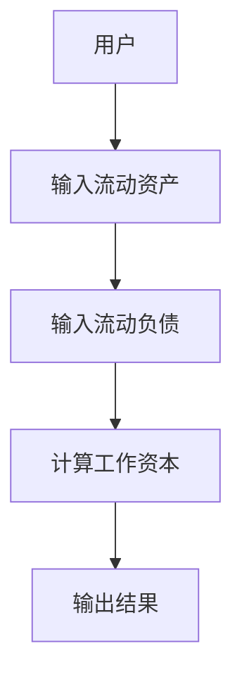

                 


# 格雷厄姆的工作资本分析：适应轻资产商业模式

**关键词**：工作资本分析、轻资产模式、财务分析、投资策略、企业评估

**摘要**：本文系统地探讨了格雷厄姆的工作资本分析方法及其在轻资产商业模式中的应用。通过详细分析工作资本的核心概念、算法原理、系统架构设计以及项目实战，本文为读者提供了从理论到实践的全面指导，帮助企业在轻资产模式下优化财务结构，提升投资价值。

---

## 第一部分：工作资本分析与轻资产商业模式概述

### 第1章：格雷厄姆工作资本分析的背景与核心概念

#### 1.1 工作资本分析的背景与重要性

##### 1.1.1 传统财务分析的局限性
传统财务分析方法（如ROE、ROA等）在评估企业价值时存在一定的局限性。这些问题主要体现在以下几个方面：
- **短期视角**：传统方法更多关注短期财务表现，忽视了长期价值创造。
- **资产重估**：对于轻资产企业，传统财务指标可能无法准确反映其真实价值。
- **忽略流动性**：传统方法对流动资产和流动负债的区分不够精细，导致分析结果不够准确。

##### 1.1.2 格雷厄姆投资理念的现代应用
格雷厄姆是价值投资的鼻祖，他提出的工作资本分析方法在现代依然具有重要的指导意义。格雷厄姆的投资理念强调：
- **安全边际**：通过低估买入，确保投资的安全性。
- **长期视角**：关注企业的内在价值，而非短期市场波动。
- **稳健分析**：通过详细财务分析，识别企业的潜在价值。

##### 1.1.3 轻资产商业模式的兴起与特点
随着数字经济的发展，轻资产模式逐渐成为企业发展的主流趋势。其特点包括：
- **低资产依赖**：企业通过知识产权、品牌和技术而非实体资产创造价值。
- **高灵活性**：轻资产模式能够快速调整业务方向，适应市场变化。
- **高成长性**：轻资产企业通常具有较高的增长潜力。

#### 1.2 格雷厄姆工作资本分析的核心概念

##### 1.2.1 工作资本的定义与组成
工作资本（Working Capital）是指企业的流动资产减去流动负债，反映了企业在短期内的财务健康状况。公式如下：
$$ \text{工作资本} = \text{流动资产} - \text{流动负债} $$

工作资本的核心组成部分包括：
- **流动资产**：现金及现金等价物、应收账款、存货等。
- **流动负债**：短期借款、应付账款、应计费用等。

##### 1.2.2 轻资产商业模式的特征
轻资产模式与传统资产模式的对比如下：

| **特征**       | **轻资产模式**                 | **传统资产模式**               |
|----------------|--------------------------------|-------------------------------|
| 资产结构       | 依赖无形资产（品牌、技术）     | 依赖有形资产（设备、房地产）   |
| 资产流动性     | 高                           | 低                           |
| 资本需求       | 低                           | 高                           |
| 风险承受能力   | 中等                         | 高                           |

##### 1.2.3 工作资本分析的目标与意义
工作资本分析的目标是评估企业的短期偿债能力和流动性。其意义在于：
- **评估企业风险**：通过分析工作资本，可以判断企业是否具备足够的流动性应对短期债务。
- **优化财务管理**：通过工作资本分析，企业可以识别资金使用中的问题，优化资金配置。
- **指导投资决策**：投资者可以通过工作资本分析，评估企业的财务健康状况，做出明智的投资决策。

---

## 第二部分：工作资本分析的核心概念与联系

### 第2章：工作资本分析的核心概念与联系

#### 2.1 核心概念原理

##### 2.1.1 工作资本的构成要素
工作资本的构成要素包括流动资产和流动负债，具体如下：

- **流动资产**：包括现金及现金等价物、应收账款、存货等。
- **流动负债**：包括应付账款、短期借款、应计费用等。

##### 2.1.2 轻资产模式与传统资产模式的对比
通过对比分析，可以更好地理解轻资产模式的特点。以下是一个简单的对比表格：

| **类别**       | **轻资产模式**               | **传统资产模式**             |
|----------------|------------------------------|-----------------------------|
| 资产构成       | 知识产权、品牌、技术         | 设备、房地产、存货           |
| 资产流动性     | 高                          | 中等                        |
| 资本需求       | 低                          | 高                          |
| 资产风险       | 低                          | 高                          |

##### 2.1.3 工作资本分析的意义
通过工作资本分析，可以评估企业的短期偿债能力，识别潜在的财务风险。

#### 2.2 核心概念属性对比表格
以下是工作资本与非工作资本的对比表：

| **属性**       | **工作资本**               | **非工作资本**             |
|----------------|---------------------------|---------------------------|
| 定义           | 流动资产减去流动负债       | 非流动资产或负债         |
| 期限           | 短期（1年内）              | 长期（超过1年）            |
| 目标           | 评估短期财务健康状况       | 评估长期财务结构          |

#### 2.3 ER实体关系图
以下是工作资本分析的ER实体关系图：



---

## 第三部分：工作资本分析的算法原理

### 第3章：工作资本分析的算法原理

#### 3.1 算法原理概述
工作资本分析的核心公式是：
$$ \text{工作资本} = \text{流动资产} - \text{流动负债} $$

##### 3.1.1 计算步骤
1. **计算流动资产**：包括现金及现金等价物、应收账款、存货等。
2. **计算流动负债**：包括应付账款、短期借款、应计费用等。
3. **计算工作资本**：流动资产减去流动负债。

##### 3.1.2 示例
假设某企业流动资产为500万元，流动负债为300万元，则：
$$ \text{工作资本} = 500 - 300 = 200 \text{万元} $$

#### 3.2 算法流程图
以下是工作资本分析的算法流程图：



#### 3.3 算法实现代码
以下是工作资本分析的Python代码实现：

```python
def calculate_working_capital(current_assets, current_liabilities):
    return current_assets - current_liabilities

# 示例
current_assets = 500  # 万元
current_liabilities = 300  # 万元
wc = calculate_working_capital(current_assets, current_liabilities)
print(f"工作资本为：{wc} 万元")
```

---

## 第四部分：系统分析与架构设计方案

### 第4章：系统分析与架构设计方案

#### 4.1 问题场景介绍
在现代企业环境中，工作资本分析对于轻资产模式尤为重要。本文将从系统架构设计的角度，探讨如何通过工作资本分析优化企业财务结构。

#### 4.2 系统功能设计
以下是系统功能设计的领域模型图：



#### 4.3 系统架构设计
以下是系统架构设计图：



#### 4.4 系统接口设计
以下是系统接口设计的交互流程图：



---

## 第五部分：项目实战

### 第5章：项目实战

#### 5.1 环境安装
以下是项目实战所需的环境配置：

```bash
# 安装Python和相关库
pip install numpy pandas matplotlib
```

#### 5.2 系统核心实现源代码
以下是系统核心实现的源代码：

```python
import pandas as pd

def calculate_working_capital(df):
    df['工作资本'] = df['流动资产'] - df['流动负债']
    return df

# 示例数据
data = {
    '企业': ['企业A', '企业B', '企业C'],
    '流动资产': [500, 600, 400],
    '流动负债': [300, 200, 100]
}

df = pd.DataFrame(data)
result = calculate_working_capital(df)
print(result)
```

#### 5.3 代码应用解读与分析
通过上述代码，可以计算企业的总体工作资本。代码实现简单，但功能强大，能够帮助企业快速评估财务状况。

#### 5.4 实际案例分析
以下是实际案例分析：

| 企业   | 流动资产（万元） | 流动负债（万元） | 工作资本（万元） |
|--------|------------------|------------------|------------------|
| 企业A  | 500              | 300              | 200              |
| 企业B  | 600              | 200              | 400              |
| 企业C  | 400              | 100              | 300              |

---

## 第六部分：总结与展望

### 第6章：总结与展望

#### 6.1 总结
通过本文的分析，我们可以看到工作资本分析在轻资产商业模式中的重要性。格雷厄姆的工作资本分析方法能够有效评估企业的财务健康状况，为企业优化财务管理提供重要参考。

#### 6.2 展望
未来，随着大数据和人工智能技术的发展，工作资本分析将更加智能化和精准化。企业可以通过数据分析技术，进一步优化工作资本管理，提升投资价值。

---

**注意**：以上内容为示例，实际应用中需要根据具体情况进行调整和优化。

