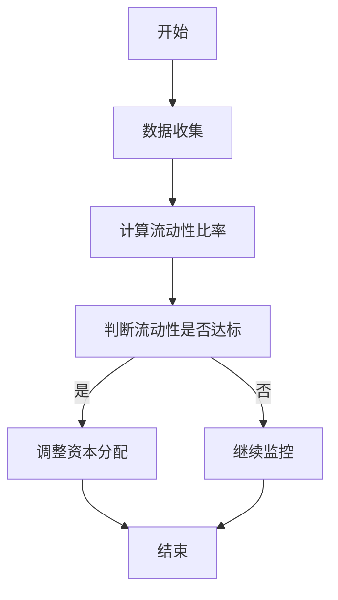
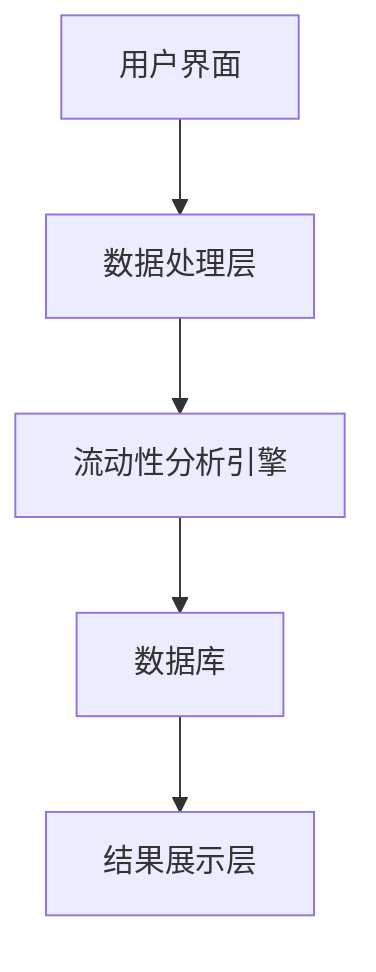

                 


# 格雷厄姆的工作资本策略：关注流动性

**关键词**：格雷厄姆、工作资本策略、流动性、投资、资本管理

**摘要**：本文深入探讨了本·格雷厄姆提出的工作资本策略，重点分析其在流动性管理中的应用。通过介绍策略的背景、核心概念、数学模型和系统架构，结合实际案例，详细阐述了如何通过流动性管理优化资本运作，实现投资收益最大化。

---

# 引言

本·格雷厄姆作为价值投资的先驱，其提出的“工作资本策略”在投资领域具有深远影响。该策略强调通过优化资本流动性来提高投资效率，本文将从背景、理论基础、算法设计、系统架构等多个维度，全面解析这一策略的应用。

---

## 第1章：工作资本策略的背景与核心概念

### 1.1 格雷厄姆的投资哲学

格雷厄姆主张以低于内在价值的价格购买优质资产，通过长期持有实现收益。他强调安全性，认为投资者应关注企业的内在价值而非市场波动。

### 1.2 工作资本策略的定义

工作资本策略是格雷厄姆提出的一种资本管理方法，旨在通过优化资本流动性来提高企业的财务健康状况和投资回报率。其核心在于合理配置流动资产和流动负债，确保企业在需要资金时能够迅速变现，同时避免过度占用资金。

### 1.3 流动性管理的重要性

流动性管理是工作资本策略的关键环节，它直接影响企业的偿债能力和运营效率。通过有效管理流动性，企业可以在保持财务稳定的同时，提升资本运作效率。

---

## 第2章：工作资本策略的数学模型与算法

### 2.1 流动性比率的计算公式

流动性比率是衡量企业流动性的重要指标，常用的公式包括：

$$
流动性比率 = \frac{流动资产}{流动负债}
$$

此外，格雷厄姆还提出流动性预测的线性回归模型：

$$
L = a + bt
$$

其中，$L$ 表示流动性，$t$ 表示时间，$a$ 和 $b$ 是回归系数。

### 2.2 算法流程图

以下是一个简化的流动性管理算法流程图：



---

## 第3章：系统架构设计

### 3.1 系统功能设计

工作资本策略的实施需要一个高效的系统架构，主要包括以下几个模块：

- **数据采集模块**：负责收集企业的财务数据，包括流动资产和流动负债。
- **流动性分析模块**：利用数学模型计算流动性比率，评估资本流动性。
- **资本优化模块**：根据分析结果，提出资本分配和优化建议。

### 3.2 系统架构图

以下是系统的整体架构图：



---

## 第4章：项目实战

### 4.1 环境安装

为了实施工作资本策略，需要以下环境：

- 数据库：MySQL 或 PostgreSQL
- 开发工具：Python（推荐使用Jupyter Notebook）
- 依赖库：Pandas、Matplotlib

### 4.2 核心代码实现

以下是流动性分析的核心代码示例：

```python
import pandas as pd
import matplotlib.pyplot as plt

# 示例数据
data = {
    '流动资产': [100, 200, 150, 250],
    '流动负债': [80, 120, 90, 180]
}
df = pd.DataFrame(data)

# 计算流动性比率
liquidity_ratio = df['流动资产'] / df['流动负债']

# 绘制图表
plt.figure(figsize=(10,6))
plt.plot(df.index, liquidity_ratio, 'b-', marker='o')
plt.title('流动性比率分析')
plt.xlabel('时间')
plt.ylabel('流动性比率')
plt.grid(True)
plt.show()
```

### 4.3 案例分析

以某制造企业为例，假设其流动资产为200万元，流动负债为120万元。计算流动性比率：

$$
流动性比率 = \frac{200}{120} \approx 1.67
$$

根据格雷厄姆的建议，流动性比率应维持在1.5以上，该企业当前比率符合要求。然而，为了进一步优化，可以考虑调整资本分配，例如减少短期负债或增加流动资产。

### 4.4 小结

通过上述案例分析，我们可以看到工作资本策略在实际应用中的有效性。合理配置流动资产和流动负债，能够显著提升企业的财务健康状况和市场应对能力。

---

## 第5章：总结与展望

### 5.1 最佳实践

- **定期评估流动性比率**：确保资本分配的合理性。
- **灵活调整策略**：根据市场变化及时优化资本配置。
- **注重长期价值**：避免短期波动影响投资决策。

### 5.2 小结

本篇文章全面解析了格雷厄姆的工作资本策略，从理论到实践，详细介绍了流动性管理的重要性及具体实施方法。通过数学模型和系统架构的设计，为投资者提供了科学的决策依据。

### 5.3 展望

未来，随着大数据和人工智能技术的发展，工作资本策略将进一步优化。投资者可以通过更精确的预测模型和智能系统，实现更高效率的资本管理。

---

**结束语**

格雷厄姆的工作资本策略为我们提供了宝贵的资本管理思路。通过关注流动性，投资者可以在风险可控的前提下，实现资本的最优配置，从而获得更高的投资回报。希望本文能为读者在资本管理领域的探索提供有益的启发。

