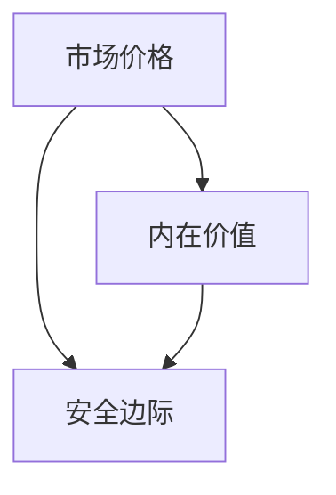
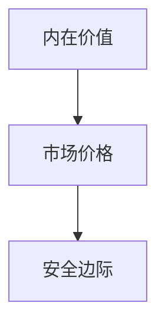
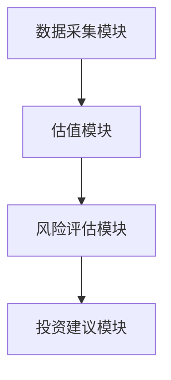
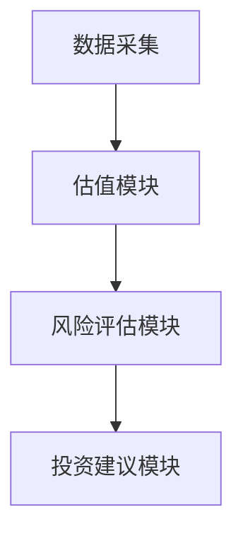
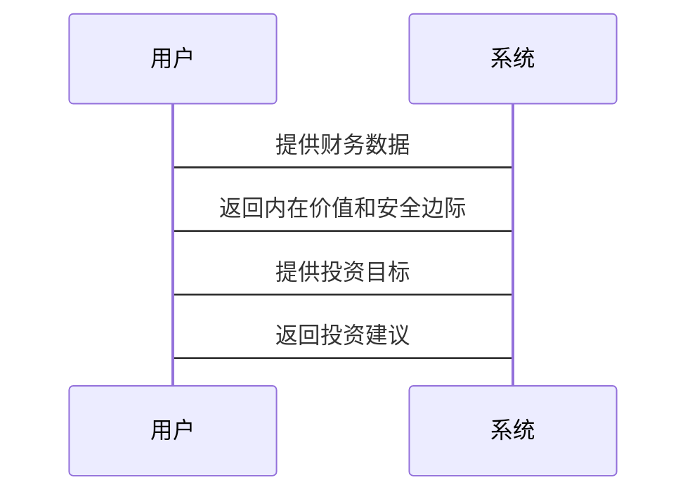

                 


# 《格雷厄姆的投资风险控制》

## 关键词：投资风险控制，格雷厄姆，安全边际，内在价值，投资策略

## 摘要：本文深入探讨了格雷厄姆的投资理念，特别是其在风险控制方面的独特见解。通过详细分析安全边际和内在价值等核心概念，结合数学模型和系统架构设计，本文为投资者提供了一套有效的风险管理工具和策略，帮助他们在复杂多变的市场中实现稳健投资。

---

## 第1章：投资风险控制的背景与重要性

### 1.1 投资风险的定义与分类

#### 1.1.1 风险的定义
投资风险是指在投资过程中，由于市场波动、经济变化或其他不可预见因素导致投资收益低于预期或出现损失的可能性。风险是投资决策中不可忽视的重要因素。

#### 1.1.2 投资风险的分类
投资风险可以分为系统性风险和非系统性风险：
- **系统性风险**：影响整个市场的风险，如经济衰退、政策变化等。
- **非系统性风险**：特定于某个资产或行业的风险，如公司经营不善、行业竞争加剧等。

#### 1.1.3 风险与收益的关系
风险与收益呈正相关关系，即收益越高，潜在风险也越大。投资者需要在风险和收益之间找到平衡点，以实现长期稳健的投资回报。

### 1.2 格雷厄姆投资理念的起源

#### 1.2.1 价值投资的起源
本杰明·格雷厄姆（Benjamin Graham）被誉为“价值投资之父”，他于20世纪初提出了价值投资的理念。他的投资方法强调以低于内在价值的价格购买优质资产，以降低投资风险。

#### 1.2.2 格雷厄姆的学术背景
格雷厄姆是哥伦比亚大学商学院的教授，他的投资理念在《证券分析》（1934年）和《聪明的投资者》（1949年）中得到了详细阐述。这些著作奠定了现代价值投资的基础。

#### 1.2.3 格雷厄姆投资理念的核心思想
格雷厄姆的价值投资理念强调：
1. 以低于内在价值的价格购买股票。
2. 重视安全边际，避免过度冒险。
3. 长期投资，耐心等待市场回归合理估值。

### 1.3 投资风险控制的必要性

#### 1.3.1 风险失控的后果
如果投资者不重视风险控制，可能会面临重大损失，甚至导致投资组合的崩盘。风险控制是确保投资稳健增长的关键。

#### 1.3.2 投资者的心理偏差与风险控制
投资者常常受到心理偏差的影响，如过度自信、从众心理等，这些偏差可能导致错误的投资决策。风险控制需要投资者克服这些心理偏差，保持理性。

#### 1.3.3 格雷厄姆理念在现代投资中的应用
尽管格雷厄姆的投资理念诞生于 decades ago，但其核心思想在现代投资中仍然具有重要的指导意义。特别是在当前市场波动加剧的情况下，格雷厄姆的风险控制方法更加显得尤为重要。

---

## 第2章：格雷厄姆投资风险控制的核心概念

### 2.1 安全边际

#### 2.1.1 安全边际的定义
安全边际是指股票的市场价格与其内在价值之间的差距。格雷厄姆认为，购买价格低于内在价值的股票才能提供足够的安全边际，从而降低投资风险。

#### 2.1.2 安全边际的计算方法
安全边际 = 内在价值 - 市场价格

#### 2.1.3 安全边际在投资决策中的作用
通过计算安全边际，投资者可以评估投资的安全性。安全边际越大，投资风险越小。

### 2.2 内在价值

#### 2.2.1 内在价值的定义
内在价值是指一家公司基于其财务状况、盈利能力、行业地位等因素所具有的真实价值。它是股票的理论上的合理价格，与市场波动无关。

#### 2.2.2 内在价值的计算方法
内在价值的计算通常基于 discounted cash flow (DCF) 模型或其他估值方法。例如：
$$ \text{内在价值} = \frac{\text{现金流}}{\text{折现率}} $$

#### 2.2.3 内在价值与市场价格的关系
市场价格可能会偏离内在价值，但长期来看，市场价格会回归内在价值。因此，投资者应关注内在价值，而非短期市场波动。

### 2.3 投资组合的风险分散

#### 2.3.1 风险分散的原理
通过将资金分配到不同资产或行业中，投资者可以降低投资组合的整体风险。这种策略被称为“不要将所有鸡蛋放在一个篮子里”。

#### 2.3.2 投资组合的构建方法
- **资产配置**：根据风险承受能力和投资目标，确定不同资产的权重。
- **行业分散**：选择不同行业的股票，以降低行业特定风险。

#### 2.3.3 格雷厄姆对投资组合分散化的建议
格雷厄姆建议投资者分散投资于多个优质资产，避免过度集中在某个行业或资产类别。

---

## 第3章：安全边际与内在价值的关系

### 3.1 安全边际与内在价值的数学模型

#### 3.1.1 安全边际的数学表达
$$ \text{安全边际} = \text{内在价值} - \text{市场价格} $$

#### 3.1.2 内在价值的计算公式
$$ \text{内在价值} = \sum_{t=1}^{n} \frac{\text{现金流}_t}{(1 + r)^t} $$

其中，$r$ 是折现率，$\text{现金流}_t$ 是第 $t$ 年的现金流。

### 3.2 安全边际与市场价格的关系图



### 3.3 内在价值与市场价格的关系图



---

## 第4章：格雷厄姆投资风险控制的算法原理

### 4.1 安全边际计算的算法

#### 4.1.1 计算步骤
1. 计算股票的内在价值。
2. 确定股票的市场价格。
3. 计算安全边际：$\text{安全边际} = \text{内在价值} - \text{市场价格}$。

#### 4.1.2 Python代码实现

```python
def calculate_intrinsic_value(cash_flow, discount_rate):
    return sum(cash_flow / (1 + discount_rate)**t for t in range(len(cash_flow)))

def calculate_margin_of_safety(intrinsic_value, market_price):
    return intrinsic_value - market_price

# 示例
cash_flow = [100, 120, 150]
discount_rate = 0.08
market_price = 1000

intrinsic_value = calculate_intrinsic_value(cash_flow, discount_rate)
margin_of_safety = calculate_margin_of_safety(intrinsic_value, market_price)

print(f"内在价值: {intrinsic_value}")
print(f"安全边际: {margin_of_safety}")
```

### 4.2 内在价值评估的算法

#### 4.2.1 计算步骤
1. 收集公司的财务数据（如现金流、净利润等）。
2. 确定合理的折现率。
3. 使用DCF模型计算内在价值。

#### 4.2.2 Python代码实现

```python
def discounted_cash_flow_model(cash_flow, discount_rate, growth_rate):
    return sum(cash_flow * (1 + growth_rate)**t / (1 + discount_rate)**t for t in range(len(cash_flow)))

# 示例
cash_flow = [100, 120, 150]
discount_rate = 0.08
growth_rate = 0.05

intrinsic_value = discounted_cash_flow_model(cash_flow, discount_rate, growth_rate)
print(f"内在价值: {intrinsic_value}")
```

### 4.3 投资组合风险分散的算法

#### 4.3.1 计算步骤
1. 确定投资组合的目标风险承受能力。
2. 根据资产的相关性进行分散投资。
3. 定期评估和调整投资组合。

#### 4.3.2 Python代码实现

```python
import numpy as np

def portfolio_variance(assets, correlations):
    covariance_matrix = np.zeros((len(assets), len(assets)))
    for i in range(len(assets)):
        for j in range(len(assets)):
            covariance_matrix[i][j] = assets[i] * assets[j] * correlations[i][j]
    return np.sqrt(np.mean(covariance_matrix))

# 示例
assets = [100, 200, 300]
correlations = [
    [1, 0.5, 0.3],
    [0.5, 1, 0.4],
    [0.3, 0.4, 1]
]

variance = portfolio_variance(assets, correlations)
print(f"投资组合方差: {variance}")
```

---

## 第5章：格雷厄姆投资风险控制的系统架构与设计

### 5.1 投资决策系统的功能设计

#### 5.1.1 系统功能模块
1. **数据采集模块**：收集市场数据和公司财务数据。
2. **估值模块**：计算股票的内在价值和安全边际。
3. **风险评估模块**：评估投资组合的风险。
4. **投资建议模块**：根据评估结果提供投资建议。

#### 5.1.2 系统功能流程图



### 5.2 系统架构设计

#### 5.2.1 系统架构图



### 5.3 系统交互设计

#### 5.3.1 用户与系统的交互流程



---

## 第6章：项目实战——基于格雷厄姆理念的投资组合管理

### 6.1 虚拟投资组合管理案例

#### 6.1.1 投资目标
构建一个包含5只股票的投资组合，每只股票的安全边际不低于20%。

#### 6.1.2 环境安装
安装必要的工具，如Python、Pandas、NumPy等。

#### 6.1.3 核心代码实现

```python
import pandas as pd

def calculate_intrinsic_value(stocks):
    intrinsic_values = []
    for stock in stocks:
        # 简化计算，假设现金流和折现率已知
        cf = [100, 120, 150]
        dr = 0.08
        iv = sum(cf / (1 + dr)**t for t in range(3))
        intrinsic_values.append(iv)
    return intrinsic_values

stocks = ['AAPL', 'MSFT', 'GOOGL', 'AMZN', 'BRK']
intrinsic_values = calculate_intrinsic_value(stocks)
market_prices = [300, 250, 220, 180, 400]

# 计算安全边际
margin_of_safety = [iv - mp for iv, mp in zip(intrinsic_values, market_prices)]

print(f"内在价值: {intrinsic_values}")
print(f"市场价格: {market_prices}")
print(f"安全边际: {margin_of_safety}")
```

#### 6.1.4 案例分析与解读
假设某股票的内在价值为200，市场价格为150，其安全边际为50。这表明该股票具有较高的投资价值。

#### 6.1.5 投资组合小结
通过选择内在价值高且市场价格低于内在价值的股票，投资者可以构建一个具有较高安全边际的投资组合，从而降低投资风险。

---

## 第7章：格雷厄姆投资风险控制的最佳实践

### 7.1 小结
格雷厄姆的投资理念强调安全边际和内在价值，这些概念在现代投资中仍然具有重要的指导意义。

### 7.2 注意事项
1. 投资者应定期评估投资组合的风险。
2. 避免过度依赖单一投资策略。
3. 保持对市场的持续学习和研究。

### 7.3 拓展阅读
1. 《证券分析》——本杰明·格雷厄姆
2. 《聪明的投资者》——本杰明·格雷厄姆
3. 《投资学原理》——彼得·林奇

---

## 结语
格雷厄姆的投资风险控制方法为投资者提供了一套科学的投资策略。通过理解和应用安全边际和内在价值等核心概念，投资者可以在复杂多变的市场中实现稳健的投资回报。

