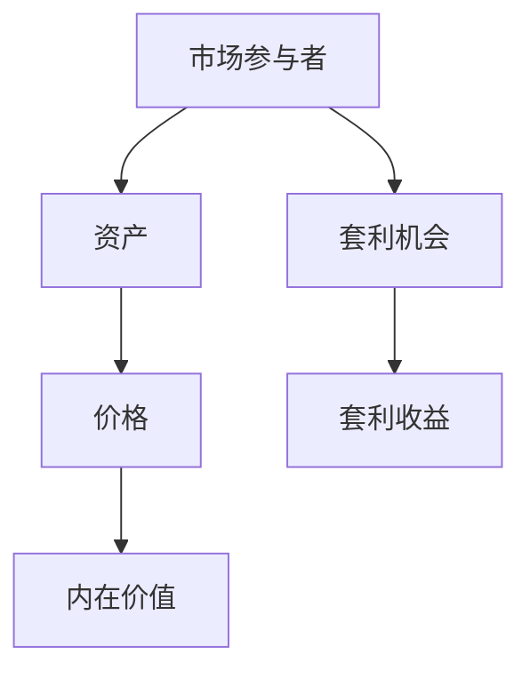
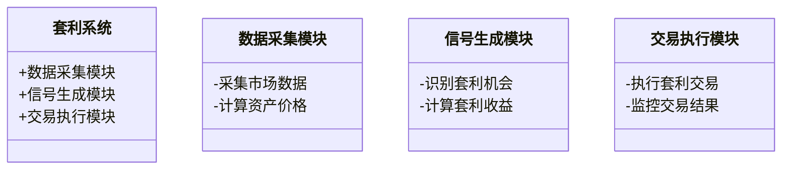
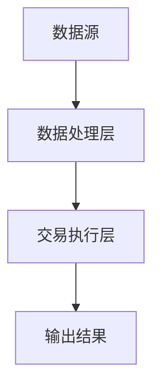

                 


# 格雷厄姆的特殊情况投资：寻找套利机会

> **关键词**：套利、价值投资、并购套利、可转债套利、风险管理、数学模型、系统架构  
> **摘要**：本文将深入探讨格雷厄姆的特殊情况投资策略，重点分析套利机会的识别与实施。通过数学模型、系统架构和实际案例，详细解析套利的核心概念、策略设计、系统实现及风险管理，帮助投资者掌握套利机会的寻找与操作。

---

# 格雷厄姆的特殊情况投资：寻找套利机会

## 1. 套利投资的定义与背景

### 1.1 套利的基本概念
套利是一种利用市场定价不公的短期投资策略，通过同时买入低估资产和卖出高估资产，从中获利。套利的核心在于“无风险”或“低风险”的价差套取，前提是市场存在定价偏差。

#### 1.1.1 套利的定义
套利是指利用市场中的价格差异，通过同时买入低价资产和卖出高价资产，从中获取无风险或低风险收益的投资策略。套利的核心在于发现市场中的定价偏差，并利用这种偏差获利。

#### 1.1.2 套利的分类
套利可以分为以下几类：
- **跨市场套利**：利用不同市场之间的价格差异进行套利。
- **跨期套利**：利用同一资产在不同时间点的价格差异进行套利。
- **事件驱动套利**：基于公司特定事件（如并购、重组）进行套利。
- **统计套利**：基于统计模型和数学公式进行套利。

#### 1.1.3 套利与投机的区别
套利与投机的区别主要在于风险和收益来源：
- 投机：基于市场趋势和价格波动，风险较高，收益不确定。
- 套利：基于市场定价偏差，风险较低，收益较确定。

### 1.2 格雷厄姆投资理念的核心
格雷厄姆是价值投资的鼻祖，他的投资理念以“安全边际”为核心，强调以低于内在价值的价格买入优质资产。

#### 1.2.1 价值投资的定义
价值投资是一种长期投资策略，强调以低于资产内在价值的价格买入优质资产，等待市场回归理性后卖出。

#### 1.2.2 格雷厄姆的投资策略
格雷厄姆的投资策略包括：
- **买入低估资产**：以低于内在价值的价格买入资产。
- **分散投资**：通过分散投资降低风险。
- **安全边际**：买入价格与内在价值之间的差距即为安全边际。

#### 1.2.3 格雷厄姆的市场观点
格雷厄姆认为市场短期是投票机，长期是称重机。投资者应忽略短期市场波动，关注长期价值。

### 1.3 套利在特殊情况投资中的地位
套利是特殊情况投资的重要策略，特别是在市场定价偏差时，套利机会往往存在于低估资产中。

#### 1.3.1 套利在特殊情况投资中的作用
套利通过发现市场定价偏差，帮助投资者在特定情况下获利。

#### 1.3.2 套利与市场效率的关系
套利是市场效率的体现，套利者通过套利行为使市场回归效率。

#### 1.3.3 套利的法律与道德边界
套利必须遵守法律法规，避免利用内幕信息或市场操纵进行套利。

---

## 2. 套利策略的核心概念与联系

### 2.1 套利的数学模型与公式
套利的数学模型主要基于均值回归理论，即价格会回归其内在价值。

#### 2.1.1 套利机会的识别公式
$$ \text{套利机会} = \text{当前价格} - \text{内在价值} $$

#### 2.1.2 套利收益的计算公式
$$ \text{套利收益} = \text{卖出价格} - \text{买入价格} $$

#### 2.1.3 套利风险的量化模型
套利风险主要通过标准差或VaR（Value at Risk）进行量化。

### 2.2 套利的ER实体关系图
套利的实体关系图如下：



### 2.3 套利的算法原理
套利算法基于均值回归模型，通过数学公式识别套利机会。

#### 2.3.1 套利算法的实现步骤
1. 识别市场中的价格偏差。
2. 计算套利收益。
3. 执行套利交易。

#### 2.3.2 套利算法的优缺点
- **优点**：低风险，收益确定。
- **缺点**：套利机会短暂，需快速执行。

---

## 3. 套利策略的系统分析与架构设计

### 3.1 系统功能设计
套利系统的核心功能包括数据采集、信号生成和交易执行。

#### 3.1.1 领域模型的Mermaid类图


### 3.2 系统架构设计
套利系统的架构设计包括数据源、处理层和执行层。

#### 3.2.1 系统架构的Mermaid架构图


### 3.3 系统接口设计
套利系统的接口设计包括数据接口和交易接口。

#### 3.3.1 系统接口的定义
- 数据接口：获取市场数据。
- 交易接口：执行套利交易。

#### 3.3.2 系统接口的实现
- 数据接口：通过API获取市场数据。
- 交易接口：通过交易平台执行交易指令。

---

## 4. 套利策略的系统实现与实战

### 4.1 系统环境安装
套利系统需要以下环境：
- 数据源：股票市场数据接口。
- 工具：Python编程语言，数据分析库（Pandas、NumPy）。

### 4.2 系统核心实现
以下是套利系统的Python实现代码：

```python
import pandas as pd
import numpy as np

# 数据采集模块
def get_market_data(tickers):
    # 模拟数据获取
    data = pd.DataFrame({'price': np.random.normal(100, 10, len(tickers)}, index=tickers)
    return data

# 信号生成模块
def generate_signals(data, value_formula):
    # 计算内在价值
    intrinsic_value = data['price'].apply(lambda x: value_formula(x))
    # 识别套利机会
    arbitrage_opportunity = (data['price'] < intrinsic_value)
    return arbitrage_opportunity

# 交易执行模块
def execute_arbitrage(arbitrage_opportunity, data):
    # 执行套利交易
    profit = 0
    for ticker in arbitrage_opportunity.index:
        if arbitrage_opportunity[ticker]:
            profit += data.loc[ticker, 'price']
    return profit

# 主函数
def main():
    tickers = ['AAPL', 'MSFT', 'GOOGL']
    data = get_market_data(tickers)
    # 假设价值公式为：内在价值 = 2 * price
    value_formula = lambda x: 2 * x
    arbitrage_opportunity = generate_signals(data, value_formula)
    profit = execute_arbitrage(arbitrage_opportunity, data)
    print(f"套利收益：{profit}")

if __name__ == "__main__":
    main()
```

### 4.3 系统功能测试
套利系统的测试包括功能测试和性能测试。

#### 4.3.1 系统功能测试
- 数据采集模块测试：获取市场数据。
- 信号生成模块测试：识别套利机会。
- 交易执行模块测试：执行套利交易。

#### 4.3.2 系统功能测试的结果分析
通过测试可以验证套利系统的有效性和稳定性。

---

## 5. 套利策略的案例分析与最佳实践

### 5.1 套利策略的案例分析
以下是两个套利策略的经典案例：

#### 5.1.1 并购套利
- **背景**：某公司被收购，市场预期股价上涨。
- **操作**：买入目标公司股票，卖出收购方股票。
- **结果**：股价上涨，套利获利。

#### 5.1.2 可转债套利
- **背景**：可转债价格低于其转股价值。
- **操作**：买入可转债，转为股票后卖出。
- **结果**：套利获利。

### 5.2 套利策略的最佳实践
- **分散投资**：降低风险。
- **快速执行**：抓住套利机会。
- **持续监控**：监控市场变化。

### 5.3 本章小结
通过案例分析和最佳实践，我们可以更好地理解套利策略的应用和风险。

---

## 6. 总结与展望

### 6.1 总结
本文详细探讨了格雷厄姆的特殊情况投资策略，重点分析了套利机会的识别与实施。通过数学模型、系统架构和实际案例，帮助投资者掌握套利的原理、策略和风险管理。

### 6.2 展望
未来，随着人工智能和大数据技术的发展，套利策略将更加精准和高效。

---

## 7. 注意事项

- **风险提示**：套利存在市场风险，需谨慎操作。
- **合规性**：套利需遵守法律法规，避免市场操纵。

---

## 8. 参考文献与拓展阅读

- 格雷厄姆的《 Intelligent Investor 》
- 投资分析相关的学术论文
- 套利策略的最新研究

---

通过本文的学习，读者可以深入理解格雷厄姆的特殊情况投资策略，掌握套利机会的寻找与操作，为投资实践提供有价值的参考。

