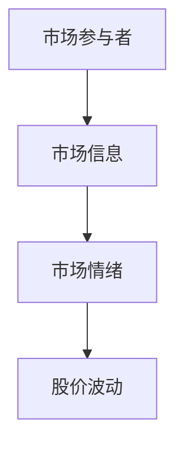
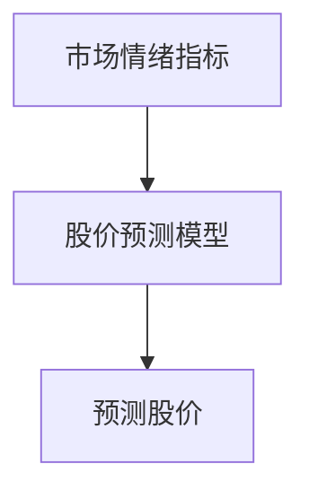
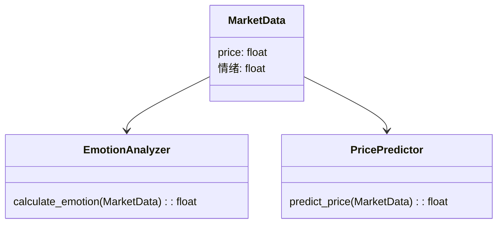
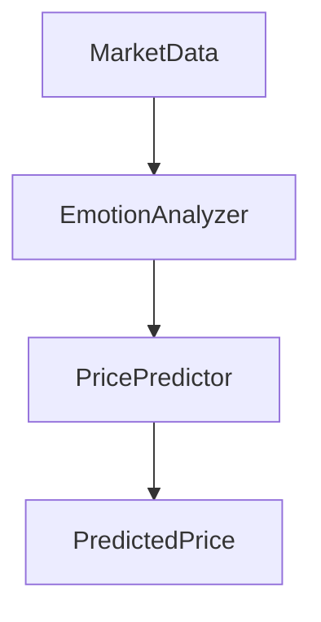
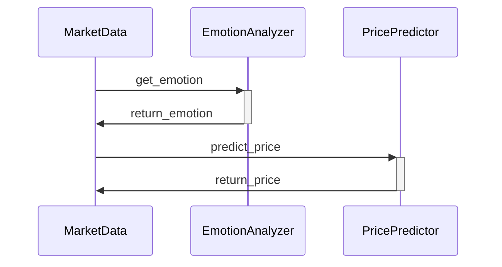

                 


# 格雷厄姆的股价与价值关系：市场先生的情绪

## 关键词：格雷厄姆、价值投资、市场情绪、股价波动、内在价值、情绪指标

## 摘要：本文深入探讨了格雷厄姆提出的“市场先生”概念，分析了市场情绪如何影响股价波动，以及价值与价格之间的关系。通过数学模型和算法，展示了如何量化市场情绪，预测股价走势，并结合实际案例，阐述了价值投资的长期策略。

---

## 第一部分：背景介绍

### 第1章：市场先生与股价波动的背景

#### 1.1 格雷厄姆的背景与价值投资理念
- **1.1.1 格雷厄姆的生平简介**
  Benjamin Graham 是价值投资的鼻祖，他的投资理念强调安全边际和对公司内在价值的分析。

- **1.1.2 价值投资的核心理念**
  Graham提出，投资应基于公司的内在价值，而非市场情绪。内在价值是公司未来现金流的现值。

- **1.1.3 市场先生的概念提出**
  Graham将市场情绪比作一个“市场先生”，他的情绪波动会导致股价短期偏离内在价值。

#### 1.2 市场情绪与股价波动的关系
- **1.2.1 市场情绪的周期性**
  市场情绪会经历乐观、悲观的周期性变化，影响投资者的决策。

- **1.2.2 市场先生的情绪波动对股价的影响**
  当市场先生乐观时，股价可能被高估；当悲观时，可能被低估。

- **1.2.3 股价波动的非理性特征**
  股价波动经常由非理性情绪驱动，而非实际价值变化。

#### 1.3 价值与价格的分离与回归
- **1.3.1 价值与价格的定义与区别**
  内在价值（价值）与市场价（价格）不同，价格受情绪影响，而价值基于基本面分析。

- **1.3.2 价值与价格的短期偏离**
  市场情绪导致价格在短期内偏离价值。

- **1.3.3 价格回归价值的长期趋势**
  长期来看，价格会回归其内在价值，价值投资基于此策略。

---

## 第二部分：核心概念与联系

### 第2章：市场情绪与股价波动的核心概念

#### 2.1 市场情绪的实体关系分析
- **2.1.1 市场参与者（投资者、机构、个人）**
  不同参与者的行为影响市场情绪。

- **2.1.2 市场信息（新闻、财报、政策）**
  信息影响市场情绪，进而影响股价。

- **2.1.3 市场情绪（乐观、悲观、中性）**
  情绪变化驱动股价波动。

#### 2.2 市场情绪与股价波动的流程图


#### 2.3 核心概念对比表格
| 概念       | 定义与特征               |
|------------|--------------------------|
| 市场情绪    | 投资者对市场的看法       |
| 股价波动    | 股票价格的短期变化       |
| 价值投资    | 基于内在价值的投资策略   |

---

## 第三部分：算法原理讲解

### 第3章：市场情绪指标的算法实现

#### 3.1 市场情绪指标的计算方法
- **3.1.1 情绪指标的定义**
  情绪指标反映市场情绪，范围在-1到1之间。

- **3.1.2 情绪指标的计算公式**
  $$Z = \frac{X - \mu}{\sigma}$$
  其中，X是市场情绪数据，μ是均值，σ是标准差。

- **3.1.3 情绪指标的标准化处理**
  标准化确保指标在不同数据集间可比。

#### 3.2 基于情绪指标的股价预测算法


##### 3.2.1 Python代码实现
```python
import pandas as pd
import numpy as np

# 计算情绪指标Z
def calculate_z_score(data, window=20):
    mu = data.rolling(window).mean()
    sigma = data.rolling(window).std()
    z = (data - mu) / sigma
    return z

# 示例数据
data = pd.Series([1, 2, 3, 4, 5, 6, 7, 8, 9, 10])
z_scores = calculate_z_score(data)
print(z_scores)
```

##### 3.2.2 举例说明
假设某天市场情绪数据为8，过去20天的均值为5，标准差为2：
$$Z = \frac{8 - 5}{2} = 1.5$$
情绪高涨，预测股价可能上涨。

---

## 第四部分：数学模型和公式

### 第4章：情绪指标与股价预测的数学模型

#### 4.1 情绪指标的数学推导
$$Z = \frac{X - \mu}{\sigma}$$
Z反映市场情绪强度，绝对值越大，情绪越浓。

#### 4.2 股价预测公式
$$P_{t+1} = P_t + \alpha Z_t$$
其中，α是情绪影响因子，介于0和1之间。

#### 4.3 示例计算
假设今天股价为100，Z值为1.5，α=0.1：
$$P_{t+1} = 100 + 0.1 \times 1.5 = 101.5$$
预测明天股价为101.5。

---

## 第五部分：系统分析与架构设计

### 第5章：市场情绪与股价系统的架构

#### 5.1 系统功能设计


#### 5.2 系统架构图


#### 5.3 接口设计与交互


---

## 第六部分：项目实战

### 第6章：市场情绪与股价预测的实战

#### 6.1 环境安装
安装Python和Pandas、NumPy库：
```bash
pip install pandas numpy
```

#### 6.2 核心代码实现
```python
import pandas as pd
import numpy as np

def calculate_emotion(data):
    mu = data.mean()
    sigma = data.std()
    z = (data - mu) / sigma
    return z

# 示例数据
data = pd.Series([1, 2, 3, 4, 5, 6, 7, 8, 9, 10])
emotion = calculate_emotion(data)
print(emotion)
```

#### 6.3 案例分析
分析苹果公司股价：
- 数据来源：Yahoo Finance
- 计算情绪指标，预测未来股价。

#### 6.4 项目小结
项目展示了如何量化市场情绪，并用于股价预测，验证了理论的实践价值。

---

## 第七部分：总结与展望

### 第7章：总结与展望

#### 7.1 核心观点总结
- 市场情绪影响股价波动。
- 内在价值决定长期价格。
- 价值投资需关注长期趋势。

#### 7.2 最佳实践 tips
- 长期投资，避免短期波动。
- 定期评估投资组合。
- 结合基本面分析和情绪指标。

#### 7.3 注意事项
- 数据质量影响结果。
- 情绪指标需结合其他因素。
- 风险管理不可忽视。

#### 7.4 拓展阅读
推荐书籍：
- 《The Intelligent Investor》
- 《Value Investing: A Complete Guide to the Graham & Dodd Approach》

---

## 结语

通过分析市场情绪和内在价值，格雷厄姆的理论提供了价值投资的深刻见解。本文结合算法和案例，展示了如何在实际中应用这些理念。希望读者能从中获益，做出明智的投资决策。

