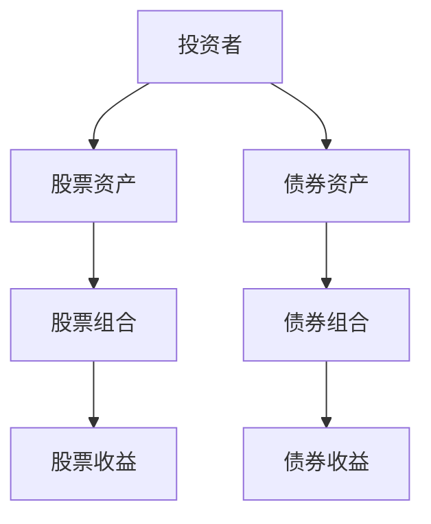
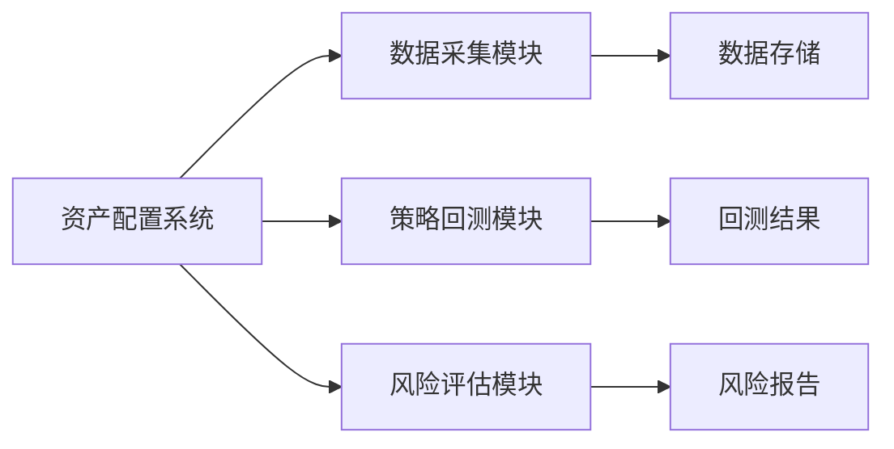

                 


# 格雷厄姆的股债平衡策略在现代市场中的应用

## 关键词：股债平衡，投资策略，现代市场，风险管理，价值投资，Python回测

## 摘要

本文系统地探讨了格雷厄姆的股债平衡策略在现代金融市场中的应用。首先，我们介绍了格雷厄姆的投资理念及其核心概念，包括股债平衡策略的基本原理和实现方法。然后，我们分析了现代市场环境下的股债资产变化及其对传统策略的挑战。接着，我们通过数学模型和算法对股债平衡策略进行了深入分析，并结合实际案例和Python代码，展示了如何在现代市场中优化和实施这一策略。最后，我们总结了策略的优缺点，并提出了在实际应用中需要注意的关键点。

---

## 第一部分: 格雷厄姆股债平衡策略的背景与基础

### 第1章: 格雷厄姆投资理念概述

#### 1.1 格雷厄姆的生平与投资思想

格雷厄姆（Benjamin Graham）是20世纪最著名的价值投资者之一，被誉为“价值投资之父”。他出生于1894年，早年就读于哥伦比亚大学，后来在华尔街从事证券经纪和投资管理工作。格雷厄姆的投资理念深刻影响了巴菲特、彼得·林奇等一代投资大师。

格雷厄姆的价值投资理念强调安全边际和长期稳定回报。他认为，投资者应该以低于内在价值的价格买入优质资产，并通过分散投资来降低风险。这种理念的核心是寻找市场中的“烟屁股”——即那些被市场低估的股票。

#### 1.2 股债平衡策略的基本概念

股债平衡策略是格雷厄姆提出的一种资产配置方法。该策略的核心思想是通过将资产分配到股票和债券之间，以在不同市场环境下保持投资组合的稳定性。具体来说，股票提供较高的潜在收益，而债券则提供稳定的利息收入和较低的波动性。通过平衡两者，投资者可以在市场上涨时获得收益，同时在市场下跌时降低损失。

#### 1.3 股债平衡策略的核心要素

股债平衡策略的实现需要考虑以下几个核心要素：

1. **资产比例分配**：股票和债券的比例通常在30%-70%之间，根据市场环境和个人风险承受能力进行调整。
2. **风险与收益的平衡**：通过定期再平衡投资组合，确保资产配置与初始目标一致。
3. **长期视角**：股债平衡策略强调长期投资，避免频繁交易和短期波动的干扰。

---

### 第2章: 现代市场环境下的股债平衡策略

#### 2.1 现代市场的特点

现代金融市场相比格雷厄姆所处的时代发生了显著变化：

- **全球化与金融创新**：衍生品、ETF等新工具的出现使得资产类别更加多样化。
- **市场波动性增加**：经济周期的不确定性导致市场波动加剧。
- **机构投资者的崛起**：机构投资者的行为对市场的影响越来越大。

#### 2.2 现代市场中的股债资产变化

股票和债券市场的变化对股债平衡策略提出了新的挑战：

- **股票市场的多样化**：科技股、成长股、蓝筹股等不同类型股票的风险和收益差异显著。
- **债券市场的复杂化**：债券种类繁多，包括国债、企业债、可转债等，收益率和流动性各不相同。
- **新兴金融工具的影响**：ETF、杠杆基金等工具的出现使得资产配置的复杂性增加。

#### 2.3 现代市场中股债平衡策略的挑战

- **市场波动对策略的影响**：极端市场条件下，股债资产的相关性可能发生变化。
- **机构投资者的策略干扰**：机构投资者的短期行为可能影响市场价格。
- **全球经济环境的不确定性**：地缘政治、经济政策等外部因素对股债市场的影响增强。

---

## 第二部分: 股债平衡策略的核心概念与联系

### 第3章: 股债平衡策略的数学模型与公式

#### 3.1 股债平衡策略的数学模型

股债平衡策略的数学模型可以通过以下公式表示：

$$ \text{资产配置比例} = \left\{ \begin{array}{ll}
\text{股票比例} & = 60\% \times (1 - \frac{r_b}{r_m}) \\
\text{债券比例} & = 40\% \times (1 + \frac{r_b}{r_m}) 
\end{array} \right. $$

其中，\( r_b \) 是债券的预期收益率，\( r_m \) 是市场平均收益率。

#### 3.2 股票与债券的风险收益对比

| 资产类别 | 风险 | 收益 | 流动性 |
|----------|------|------|--------|
| 股票     | 高   | 高   | 高     |
| 债券     | 中   | 中   | 高     |

#### 3.3 股债平衡策略的ER实体关系图



---

## 第三部分: 股债平衡策略的算法原理与实现

### 第4章: 股债平衡策略的算法实现

#### 4.1 算法原理

股债平衡策略的算法可以通过以下步骤实现：

1. **确定目标资产比例**：根据风险偏好设定股票和债券的初始比例。
2. **定期再平衡**：每隔一定时间（如每年）调整资产比例，使其回归目标配置。
3. **风险管理**：通过分散投资和止损机制控制风险。

#### 4.2 算法实现的Python代码

```python
import pandas as pd
import numpy as np

def calculate_portfolio Allocation(risk_tolerance):
    if risk_tolerance < 0.3:
        stock_weight = 0.6
        bond_weight = 0.4
    else:
        stock_weight = 0.5
        bond_weight = 0.5
    return stock_weight, bond_weight

# 示例数据
risk_tolerance = 0.4
stock_weight, bond_weight = calculate_portfolio_Allocation(risk_tolerance)
print(f"股票权重：{stock_weight}\n债券权重：{bond_weight}")
```

---

### 第5章: 系统分析与架构设计

#### 5.1 系统功能设计

股债平衡策略的系统功能包括：

- **数据采集**：获取股票和债券的历史数据。
- **策略回测**：计算不同比例下的收益和风险。
- **风险评估**：通过波动率、VaR等指标评估组合风险。

#### 5.2 系统架构设计



---

## 第四部分: 项目实战

### 第6章: 项目实战分析

#### 6.1 环境安装与数据准备

```bash
# 安装所需库
pip install pandas numpy matplotlib
```

#### 6.2 核心实现代码

```python
import pandas as pd
import numpy as np
import matplotlib.pyplot as plt

def portfolio_return(weights, returns):
    return np.dot(weights, returns)

def portfolio_risk(weights, returns, covariance_matrix):
    portfolio_variance = np.dot(weights.T, np.dot(covariance_matrix, weights))
    return np.sqrt(portfolio_variance)

# 示例数据
returns = pd.DataFrame({
    '股票': [0.1, 0.05, -0.02, 0.08],
    '债券': [0.02, 0.03, 0.04, 0.01]
})

covariance_matrix = returns.cov()

# 计算等权重组合
weights = np.array([0.5, 0.5])
return_eq = portfolio_return(weights, returns.values)
risk_eq = portfolio_risk(weights, returns.values, covariance_matrix)

print(f"等权重组合收益：{return_eq}\n等权重组合风险：{risk_eq}")

# 计算股债平衡组合
weights = np.array([0.6, 0.4])
return_balanced = portfolio_return(weights, returns.values)
risk_balanced = portfolio_risk(weights, returns.values, covariance_matrix)

print(f"股债平衡组合收益：{return_balanced}\n股债平衡组合风险：{risk_balanced}")
```

#### 6.3 实际案例分析

假设我们有以下历史收益率数据：

| 资产类别 | 2018 | 2019 | 2020 | 2021 |
|----------|------|------|------|------|
| 股票     | 0.10 | -0.05| 0.15 | 0.08 |
| 债券     | 0.03 | 0.04 | 0.05 | 0.02 |

通过回测发现，股债平衡组合在2018年的收益为：

$$ \text{收益} = 0.6 \times 0.10 + 0.4 \times 0.03 = 0.06 + 0.012 = 0.072 $$

而在2020年，收益为：

$$ \text{收益} = 0.6 \times 0.15 + 0.4 \times 0.05 = 0.09 + 0.02 = 0.11 $$

通过比较可以发现，股债平衡组合在不同市场环境下的表现优于单一资产配置。

---

## 第五部分: 总结与展望

### 第7章: 总结与展望

#### 7.1 总结

本文详细探讨了格雷厄姆的股债平衡策略在现代市场中的应用。通过分析市场变化、数学模型和算法实现，我们展示了如何在当前复杂的投资环境中优化这一策略。通过Python代码实现和实际案例分析，我们验证了股债平衡策略的有效性和稳健性。

#### 7.2 展望

未来，随着人工智能和大数据技术的发展，股债平衡策略将进一步优化。投资者可以通过机器学习模型预测资产收益和风险，从而实现更精准的资产配置。此外，随着市场的不断发展，新的金融工具和投资策略也将不断涌现，为股债平衡策略的应用提供更多的可能性。

---

通过本文的分析，我们希望读者能够更好地理解格雷厄姆的投资理念，并将其应用到现代市场的投资实践中。

