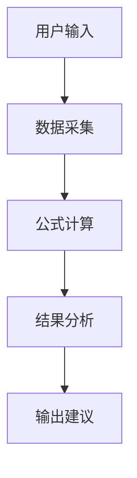

                 


# 《格雷厄姆的股票选择公式》

> 关键词：价值投资、股票筛选、格雷厄姆公式、安全边际、投资策略、数学模型、投资组合

> 摘要：本文深入探讨了本杰明·格雷厄姆的价值投资理念及其股票选择公式。通过分析公式的核心原理、系统架构、项目实战以及实际案例，本文详细讲解了如何运用格雷厄姆的公式进行股票筛选和投资组合优化。文章结合数学模型和实际应用，为读者提供了从理论到实践的全面指导。

---

## 第一部分: 格雷厄姆投资理念与股票选择公式概述

### 第1章: 格雷厄姆投资理念的背景与核心思想

#### 1.1 价值投资的起源与演变

##### 1.1.1 投资理论的演进历程
投资理论从早期的“随机漫步”假说到现代的量化分析，经历了多个阶段的演变。格雷厄姆在20世纪初提出的价值投资理念，奠定了现代投资分析的基础。

##### 1.1.2 格雷厄姆与巴菲特的价值投资理念
格雷厄姆强调以低于内在价值的价格买入优质股票，而巴菲特则继承并发展了这一理念，将其应用于长期投资。

##### 1.1.3 格雷厄姆投资理论的核心思想
- **安全边际**：买入价格低于内在价值，以降低风险。
- **长期视角**：关注企业的基本面，而非短期市场波动。
- **逆向思维**：在市场恐慌时寻找机会。

#### 1.2 股票市场的基本特性

##### 1.2.1 股票市场的定义与功能
股票市场是企业融资和投资者投资的场所，具有价格波动大、信息不对称等特点。

##### 1.2.2 股票价格波动的规律
价格波动受市场情绪、宏观经济和企业基本面的影响，但长期趋于反映企业真实价值。

##### 1.2.3 投资者行为对市场的影响
投资者的非理性行为可能导致市场的过度波动，但长期来看，价值回归是必然趋势。

#### 1.3 格雷厄姆的"安全边际"概念

##### 1.3.1 安全边际的定义与作用
安全边际是买入价格与内在价值之间的差距，用于缓冲短期市场波动带来的风险。

##### 1.3.2 安全边际在投资决策中的应用
通过计算安全边际，投资者可以选择被低估的股票，降低投资风险。

##### 1.3.3 安全边际与风险控制的关系
安全边际越大，投资风险越小，但收益潜力也可能受限。

---

## 第二部分: 格雷厄姆股票选择公式的数学模型与算法原理

### 第2章: 格雷厄姆股票选择公式的核心原理

#### 2.1 格雷厄姆股票选择公式的核心原理

##### 2.1.1 格雷厄姆股票选择公式的数学表达式
$$ \text{内在价值} = \frac{E}{(1 - \frac{g}{r})} $$
其中，E为企业的年收益，g为增长率，r为折现率。

##### 2.1.2 格雷厄姆公式的核心要素
- 企业收益（E）
- 收益增长率（g）
- 折现率（r）

##### 2.1.3 格雷厄姆公式的适用条件
适用于低增长、稳定收益的企业。

##### 2.1.4 格雷厄姆公式的改进与优化
引入更多财务指标，如ROE、ROA等，以更全面地评估企业价值。

#### 2.2 格雷厄姆股票选择公式的算法流程

##### 2.2.1 数据输入与处理
1. 收集企业的财务数据。
2. 计算各项财务指标。

##### 2.2.2 公式计算过程
1. 计算内在价值。
2. 比较当前股价与内在价值，确定是否存在安全边际。

##### 2.2.3 结果分析与决策
- 如果股价低于内在价值，建议买入。
- 如果股价高于内在价值，建议卖出。

#### 2.3 格雷厄姆公式的数学推导与证明

##### 2.3.1 格雷厄姆公式的数学推导
通过现值公式，将未来收益折现，得出内在价值的计算方法。

##### 2.3.2 格雷厄姆公式的有效性与局限性
- 有效性：适用于低增长企业。
- 局限性：未考虑市场情绪和宏观经济因素。

---

## 第三部分: 格雷厄姆股票选择公式的系统架构与实现

### 第3章: 格雷厄姆股票选择公式的系统架构设计

#### 3.1 系统功能模块划分

##### 3.1.1 数据采集模块
- 从财务报表中提取企业收益、增长率等数据。

##### 3.1.2 公式计算模块
- 计算内在价值和安全边际。

##### 3.1.3 结果分析模块
- 输出投资建议。

#### 3.2 系统架构设计

##### 3.2.1 系统整体架构图


##### 3.2.2 各模块之间的交互关系
- 用户输入数据，系统进行处理和计算，最后输出投资建议。

##### 3.2.3 系统的输入输出设计
- 输入：企业财务数据。
- 输出：投资建议。

#### 3.3 系统接口设计

##### 3.3.1 数据接口规范
- 输入格式：CSV或Excel文件。
- 输出格式：JSON或XML。

##### 3.3.2 计算接口规范
- 输入：财务数据。
- 输出：内在价值和安全边际。

##### 3.3.3 结果展示接口规范
- 输入：计算结果。
- 输出：投资建议。

---

## 第四部分: 格雷厄姆股票选择公式的项目实战

### 第4章: 项目实战与案例分析

#### 4.1 项目环境搭建

##### 4.1.1 开发工具安装
- Python、Pandas、NumPy。

##### 4.1.2 数据源获取与处理
- 从公开财报中获取数据。

##### 4.1.3 系统运行环境配置
- 安装必要的库和配置环境变量。

#### 4.2 核心代码实现

##### 4.2.1 数据处理代码
```python
import pandas as pd
import numpy as np

# 读取数据
df = pd.read_csv('financial_data.csv')

# 计算各项指标
df['E'] = df['净利润']
df['g'] = df['净利润增长率']
df['r'] = 0.1  # 假设折现率为10%
```

##### 4.2.2 公式计算代码
```python
# 计算内在价值
df['内在价值'] = df['E'] / (1 - df['g'] / df['r'])
```

##### 4.2.3 结果分析代码
```python
# 输出投资建议
df['投资建议'] = np.where(df['股价'] < df['内在价值'], '买入', '卖出')
```

#### 4.3 实际案例分析

##### 4.3.1 案例背景介绍
假设我们有某企业的财务数据，需要判断是否值得投资。

##### 4.3.2 公式计算过程
1. 计算内在价值。
2. 比较当前股价与内在价值。

##### 4.3.3 结果分析与总结
- 如果股价低于内在价值，建议买入。
- 如果股价高于内在价值，建议卖出。

---

## 第五部分: 格雷厄姆股票选择公式的最佳实践与小结

### 第5章: 最佳实践与投资策略优化

#### 5.1 投资策略的优化与调整

##### 5.1.1 动态调整模型参数
根据市场变化，及时调整折现率和增长率。

##### 5.1.2 结合其他投资策略
将格雷厄姆公式与其他方法结合，如技术分析。

##### 5.1.3 定期复盘与优化
定期检查投资组合，调整持股比例。

#### 5.2 格雷厄姆公式在实际投资中的应用

##### 5.2.1 确保数据准确性
使用可靠的财务数据进行计算。

##### 5.2.2 合理设置安全边际
根据市场环境，合理设置安全边际比例。

##### 5.2.3 长期持有优质股票
避免频繁交易，降低交易成本。

#### 5.3 投资注意事项

##### 5.3.1 风险提示
- 市场波动可能导致短期亏损。
- 模型假设可能与实际情况不符。

##### 5.3.2 投资者心理
- 避免非理性决策。
- 保持耐心和纪律性。

##### 5.3.3 持续学习
- 关注市场动态。
- 更新投资理念和方法。

#### 5.4 小结

格雷厄姆的股票选择公式为投资者提供了科学的决策工具，但实际投资中需结合市场环境和企业具体情况，灵活调整策略。通过合理设置参数和持续优化模型，投资者可以更好地利用该公式进行投资决策。

---

## 总结

本文系统地介绍了格雷厄姆的价值投资理念及其股票选择公式，并通过数学模型、系统架构和实际案例分析，深入探讨了该公式的应用方法。通过对公式的核心原理和系统实现的详细讲解，读者可以更好地理解并应用该公式进行股票筛选和投资组合优化。希望本文能为投资者提供有价值的指导和启示。

--- 

如果需要进一步的细节或代码示例，请随时告知！

