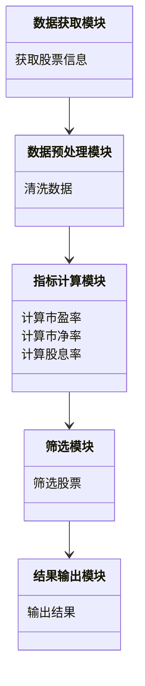
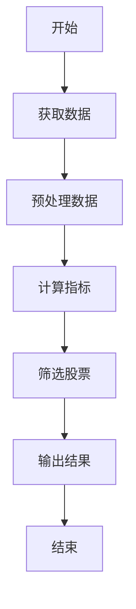

                 


# 《格雷厄姆的股票选择公式及其现代应用》

## 关键词：格雷厄姆、股票选择公式、价值投资、内在价值、安全边际、现代投资、Python代码

## 摘要：
本文深入分析了本杰明·格雷厄姆的经典股票选择公式及其在现代投资中的应用。通过详细阐述内在价值、安全边际等核心概念，并结合现代金融市场的特点，探讨了如何将格雷厄姆的理论与当前的技术和数据相结合，优化选股策略。本文还提供了基于Python的实现代码和实际案例分析，帮助读者更好地理解和应用这些经典公式。

---

# 第1章: 投资学基础与价值投资概述

## 1.1 投资学的基本概念

### 1.1.1 投资的基本定义
投资是指将资金投入某一实体或金融资产，以期在未来获得收益或资本增值的行为。投资的核心目标是通过科学的分析和决策，最大化资产的回报率。

### 1.1.2 金融市场的基本构成
金融市场由投资者、发行人、中介机构和监管机构构成。股票市场作为金融市场的重要组成部分，是企业融资和投资者投资的主要场所。

### 1.1.3 价值投资的起源与发展
价值投资起源于20世纪初，由本杰明·格雷厄姆和戴维·多德共同提出。其核心理念是寻找市场价格低于其内在价值的股票，长期持有以实现收益。

## 1.2 价值投资的核心理念

### 1.2.1 价值投资的定义
价值投资是一种投资策略，强调以低于内在价值的价格购买优质资产，长期持有，等待市场重新认识其价值。

### 1.2.2 格雷厄姆的价值投资理论
格雷厄姆提出，股票的价值应基于其未来现金流的现值计算，而非市场情绪或短期价格波动。他强调安全边际的重要性，即市场价格与内在价值之间的差距。

### 1.2.3 价值投资与其他投资策略的对比
与趋势投资和技术分析不同，价值投资注重基本面分析，寻找被市场低估的股票。其核心在于对企业的深入研究和对安全边际的追求。

## 1.3 格雷厄姆的生平与贡献

### 1.3.1 格雷厄姆的生平简介
本杰明·格雷厄姆（1897-1976）是20世纪最伟大的投资思想家之一，被誉为“价值投资之父”。他在哥伦比亚大学教授投资课程，并培养了包括沃伦·巴菲特在内的众多投资大师。

### 1.3.2 格雷厄姆对投资学的贡献
格雷厄姆提出了内在价值的概念，并强调安全边际的重要性。他的著作《证券分析》和《聪明的投资者》奠定了价值投资的理论基础。

### 1.3.3 格雷厄姆的投资哲学
格雷厄姆的投资哲学强调长期、稳健的投资策略，避免过度依赖市场预测，注重对企业基本面的深入研究。

---

# 第2章: 格雷厄姆的股票选择公式

## 2.1 格雷厄姆的选股标准

### 2.1.1 市盈率（P/E）的计算与应用
市盈率（P/E）= 股票价格 / 每股净利润。格雷厄姆建议选择市盈率低于某个阈值的股票，以确保安全边际。

### 2.1.2 市净率（P/B）的计算与应用
市净率（P/B）= 股票价格 / 每股净资产。格雷厄姆认为市净率低于某个值的股票具有较高的投资价值。

### 2.1.3 股息率的计算与应用
股息率= 每股股息 / 股票价格。格雷厄姆倾向于选择股息率较高的股票，以获得稳定的现金流。

## 2.2 格雷厄姆的内在价值公式

### 2.2.1 内在价值的定义
内在价值是股票基于未来现金流的现值计算出的理论价值，与市场价无关。

### 2.2.2 内在价值的计算公式
$$\text{内在价值} = \frac{\text{每股收益} \times (1 + \text{增长率})}{\text{折现率}}$$

### 2.2.3 内在价值与市场价的对比
如果市场价格低于内在价值，则股票具有投资价值。

## 2.3 安全边际的概念与应用

### 2.3.1 安全边际的定义
安全边际= 内在价值 - 市场价格。格雷厄姆建议选择安全边际较大的股票，以降低投资风险。

### 2.3.2 安全边际的计算方法
$$\text{安全边际} = \text{内在价值} - \text{市场价格}$$

### 2.3.3 安全边际在选股中的作用
安全边际是衡量股票投资风险的重要指标，较大的安全边际意味着更高的投资安全性。

---

# 第3章: 格雷厄姆选股公式的现代应用

## 3.1 现代金融市场的变化

### 3.1.1 现代金融市场的特点
现代金融市场数据量大、交易频繁、信息透明度高，且受到技术进步的影响。

### 3.1.2 现代投资工具的多样化
现代投资者可以使用ETF、指数基金等多种工具，实现多样化的投资组合。

### 3.1.3 技术进步对投资的影响
技术进步使得数据处理和分析更加高效，投资者可以利用大数据和人工智能优化选股策略。

## 3.2 格雷厄姆选股公式的现代调整

### 3.2.1 现代市盈率的扩展
现代市盈率考虑了更多因素，如行业特性、宏观经济指标等。

### 3.2.2 现代市净率的调整
现代市净率结合了企业成长性和资产质量，提高了评估的准确性。

### 3.2.3 现代股息率的重新定义
现代股息率考虑了企业的盈利能力和股息支付能力，避免了单一指标的局限性。

## 3.3 现代选股模型的构建

### 3.3.1 现代选股模型的构成
现代选股模型通常包括多个指标，如市盈率、市净率、股息率、成长性等。

### 3.3.2 现代选股模型的优缺点
优点：综合考虑了多因素，提高了选股的准确性。缺点：模型复杂，难以手动计算。

### 3.3.3 现代选股模型与格雷厄姆公式的关系
现代选股模型在格雷厄姆公式的基础上，结合了新的理论和技术，提高了适用性。

---

# 第4章: 格雷厄姆选股公式的数学模型与公式

## 4.1 格雷厄姆选股公式的数学模型

### 4.1.1 内在价值的数学模型
$$\text{内在价值} = \frac{\text{每股收益} \times (1 + \text{增长率})}{\text{折现率}}$$

### 4.1.2 安全边际的数学公式
$$\text{安全边际} = \text{内在价值} - \text{市场价格}$$

### 4.1.3 市盈率的数学公式
$$\text{市盈率} = \frac{\text{股票价格}}{\text{每股净利润}}$$

## 4.2 格雷厄姆选股公式的流程图

```mermaid
graph TD
    A[开始] -> B[计算内在价值]
    B -> C[计算市场价格]
    C -> D[计算安全边际]
    D -> E[选择安全边际大于零的股票]
    E -> F[结束]
```

---

# 第5章: 系统分析与架构设计方案

## 5.1 项目介绍
本项目旨在将格雷厄姆的选股公式应用于现代投资环境中，构建一个基于Python的选股系统。

## 5.2 系统功能设计

### 5.2.1 数据获取模块
从金融数据源获取股票的基本信息和财务数据。

### 5.2.2 数据预处理模块
清洗数据，处理缺失值和异常值。

### 5.2.3 指标计算模块
计算市盈率、市净率、股息率等指标。

### 5.2.4 筛选模块
根据格雷厄姆的选股公式，筛选出符合条件的股票。

### 5.2.5 结果输出模块
输出筛选结果，并提供可视化报告。

## 5.3 系统架构设计

### 5.3.1 类图


### 5.3.2 流程图


---

# 第6章: 项目实战

## 6.1 环境安装
安装必要的Python库，如Pandas、NumPy、Matplotlib等。

## 6.2 核心实现源代码
```python
import pandas as pd

# 获取数据
data = pd.read_csv('stock_data.csv')

# 计算市盈率
data['市盈率'] = data['股价'] / data['每股净利润']

# 计算市净率
data['市净率'] = data['股价'] / data['每股净资产']

# 计算股息率
data['股息率'] = data['股息'] / data['股价']

# 筛选股票
筛选条件：市盈率 < 15，市净率 < 2，股息率 > 2%
selected_stocks = data[(data['市盈率'] < 15) & (data['市净率'] < 2) & (data['股息率'] > 0.02)]
```

## 6.3 代码应用解读与分析
解释代码的每一部分，说明如何利用Python进行数据分析和选股。

## 6.4 实际案例分析和详细讲解剖析
通过具体案例，展示如何利用格雷厄姆的选股公式筛选出优质股票。

## 6.5 项目小结
总结项目的核心成果和实际应用价值。

---

# 第7章: 最佳实践 tips、小结、注意事项、拓展阅读

## 7.1 小结
格雷厄姆的选股公式在现代投资中仍然具有重要价值，但需要结合新的技术和数据进行优化。

## 7.2 注意事项
- 数据质量是关键，需确保数据的准确性和完整性。
- 模型的适用性需根据市场变化进行调整。
- 投资需分散风险，避免过度集中。

## 7.3 拓展阅读
推荐阅读《证券分析》和《聪明的投资者》等经典著作，深入理解价值投资的精髓。

---

# 附录: 格雷厄姆选股公式与现代投资工具的结合

## 附录1: 格雷厄姆选股公式与大数据分析
结合大数据技术，优化选股模型，提高选股的准确性和效率。

## 附录2: 格雷厄姆选股公式与机器学习
利用机器学习算法，预测股票价格和评估内在价值，提升投资决策的科学性。

---

通过以上结构，本文系统地介绍了格雷厄姆的股票选择公式及其现代应用，结合理论与实践，帮助读者更好地理解和应用这些经典公式。

