                 


# 格雷厄姆的财务报表分析：应对创新会计处理方法

**关键词**：财务报表分析，格雷厄姆，创新会计处理，投资决策，风险管理

**摘要**：本文深入探讨了格雷厄姆的财务报表分析方法，结合当前会计处理方法的创新趋势，分析了如何在复杂多变的商业环境中，运用格雷厄姆的分析框架应对会计处理方法的创新挑战。文章从财务报表分析的基础概念入手，逐步展开对格雷厄姆分析方法的详细解读，并结合实际案例，探讨了创新会计处理对财务报表分析的影响及应对策略。

---

## 第1章: 财务报表分析的背景与重要性

### 1.1 财务报表分析的核心概念

#### 1.1.1 财务报表分析的定义与目的
财务报表分析是通过对企业的财务报表（包括资产负债表、利润表和现金流量表）进行研究，评估企业的财务状况、经营成果和现金流量，从而为投资决策、风险管理等提供依据。

**核心概念术语说明**：
- **财务报表**：反映企业在一定会计期间内财务状况、经营成果和现金流量的书面文件。
- **财务分析**：通过对财务报表数据的整理、计算和比较，揭示企业财务状况和经营成果的过程。

**问题背景**：
随着企业经营环境的变化，会计处理方法也在不断创新。例如，收入确认的新准则、租赁会计的变革以及金融工具的创新处理，都对传统的财务报表分析提出了新的挑战。

**问题解决**：
通过格雷厄姆的财务分析方法，结合对创新会计处理的理解，可以帮助分析者更准确地解读财务报表，评估企业的真实价值。

**边界与外延**：
财务报表分析的边界在于财务报表本身的数据，外延则包括对企业经营环境、行业特点和会计政策的理解。

**核心要素组成**：
- 数据：财务报表中的各项数值。
- 方法：比较分析、趋势分析、质量分析等。
- 目标：评估企业价值、识别风险、支持决策。

#### 1.1.2 格雷厄姆的财务分析方法
格雷厄姆是价值投资的鼻祖，他提出的财务报表分析方法以“质量分析”为核心，强调对企业财务状况的深入理解，而非仅仅关注数字本身。

**核心概念联系**：
- 质量分析法：通过分析企业的资产质量、负债质量及收益质量，评估企业的财务健康状况。
- 相对价值分析：通过市盈率、市净率等指标，评估企业的市场价值是否合理。

**mermaid流程图**：
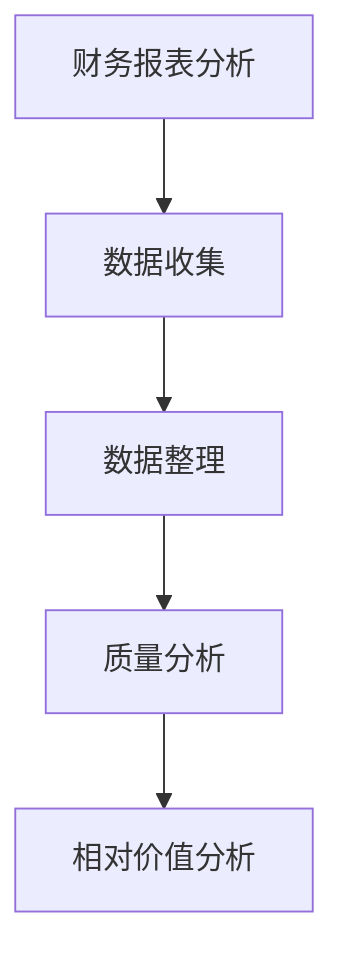

#### 1.1.3 创新会计处理方法的背景与挑战
随着会计准则的更新和企业经营模式的变化，会计处理方法也在不断创新。例如，收入确认从“完工法”向“履约进度法”的转变，以及租赁会计从“融资租赁”与“经营租赁”的二分法向单一租赁模型的转变。

**mermaid流程图**：
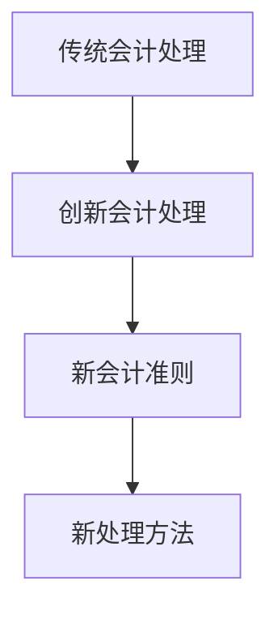

### 1.2 财务报表分析的重要性

#### 1.2.1 投资决策中的财务报表分析
投资者通过财务报表分析，可以评估企业的盈利能力、成长潜力和财务风险，从而做出明智的投资决策。

**数学模型**：
$$ 利润率 = \frac{净利润}{营业收入} $$
$$ 资产负债率 = \frac{总负债}{总资产} $$

#### 1.2.2 企业风险管理与财务报表分析
企业通过财务报表分析，可以识别潜在的财务风险，如流动性风险、偿债风险等，从而制定有效的风险管理策略。

**数学模型**：
$$ 流动比率 = \frac{流动资产}{流动负债} $$
$$ 速动比率 = \frac{速动资产}{流动负债} $$

#### 1.2.3 创新会计处理对财务报表分析的影响
创新会计处理方法改变了财务报表的结构和数据呈现方式，对传统的财务分析方法提出了新的要求。

**mermaid流程图**：
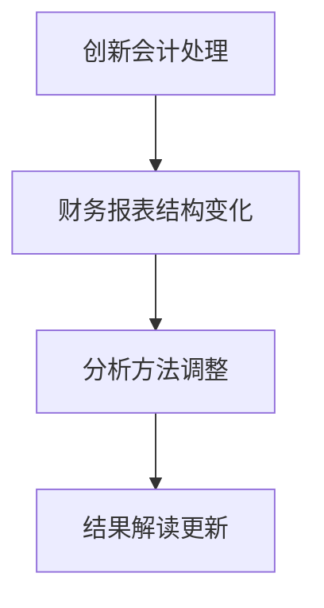

### 1.3 本章小结

#### 1.3.1 核心概念回顾
- 财务报表分析的核心是通过数据揭示企业的财务状况和经营成果。
- 格雷厄姆的分析方法以质量分析为核心，强调对企业真实价值的理解。

#### 1.3.2 问题背景总结
- 创新会计处理方法对财务报表分析提出了新的挑战，需要分析者不断更新分析方法和工具。

---

## 第2章: 财务报表的基本结构与分析方法

### 2.1 财务报表的构成

#### 2.1.1 资产负债表
资产负债表反映企业在某一特定日期的资产、负债和所有者权益的状况。

**数学模型**：
$$ 资产 = 负债 + 所有者权益 $$

#### 2.1.2 利润表
利润表反映企业在一定会计期间内的收入、费用和利润情况。

**数学模型**：
$$ 净利润 = 收入 - 费用 $$

#### 2.1.3 现金流量表
现金流量表反映企业在一定会计期间内的现金流入和流出情况。

**数学模型**：
$$ 现金净流量 = 现金流入 - 现金流出 $$

### 2.2 财务报表分析的基本方法

#### 2.2.1 比较分析法
通过比较不同期间的财务数据，分析企业的财务状况变化趋势。

**mermaid流程图**：
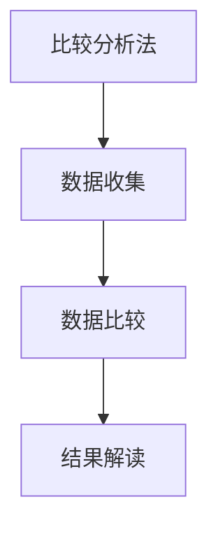

#### 2.2.2 趋势分析法
通过分析财务数据的变化趋势，预测企业的未来财务状况。

**数学模型**：
$$ 增长率 = \frac{当前值 - 历史值}{历史值} $$

#### 2.2.3 假设分析法
通过假设不同的会计政策或假设，评估其对财务报表的影响。

**mermaid流程图**：
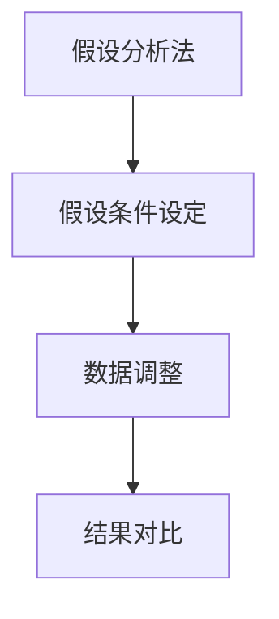

### 2.3 格雷厄姆的财务分析框架

#### 2.3.1 质量分析法
质量分析法强调对企业财务质量的评估，包括资产质量、负债质量和收益质量。

**mermaid流程图**：
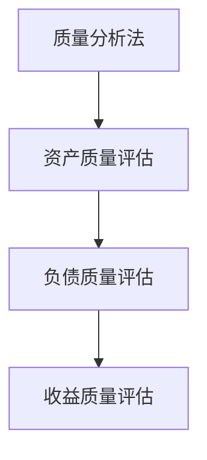

#### 2.3.2 数量分析法
数量分析法通过计算各项财务指标，评估企业的经营效率和盈利能力。

**数学模型**：
$$ 资产周转率 = \frac{营业收入}{平均总资产} $$
$$ 净利率 = \frac{净利润}{营业收入} $$

#### 2.3.3 价格分析法
价格分析法通过比较市场价格与内在价值，评估企业的投资价值。

**数学模型**：
$$ 内在价值 = \frac{净利润}{资本成本} $$

### 2.4 本章小结

#### 2.4.1 财务报表结构总结
- 资产负债表：反映企业的财务状况。
- 利润表：反映企业的经营成果。
- 现金流量表：反映企业的现金流量。

#### 2.4.2 格雷厄姆分析框架的应用
- 质量分析法：评估企业的财务质量。
- 数量分析法：评估企业的经营效率。
- 价格分析法：评估企业的投资价值。

---

## 第3章: 格雷厄姆的财务报表分析方法

### 3.1 格雷厄姆分析方法的核心原理

#### 3.1.1 横向比较分析
通过比较同一期间内不同企业或同一企业不同部门的财务数据，评估其相对优势。

**mermaid流程图**：
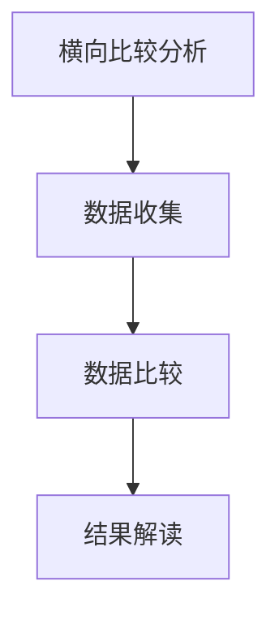

#### 3.1.2 纵向比较分析
通过比较同一企业不同期间的财务数据，评估其财务状况的变化趋势。

**数学模型**：
$$ 增长率 = \frac{当前值 - 历史值}{历史值} $$

#### 3.1.3 比率分析法
通过计算各项财务比率，评估企业的财务状况和经营效率。

**数学模型**：
$$ 流动比率 = \frac{流动资产}{流动负债} $$
$$ 净利率 = \frac{净利润}{营业收入} $$

### 3.2 格雷厄姆的质量分析法

#### 3.2.1 资产质量分析
评估企业的资产质量，包括资产的流动性、变现能力和使用效率。

**数学模型**：
$$ 资产周转率 = \frac{营业收入}{平均总资产} $$

#### 3.2.2 负债质量分析
评估企业的负债结构，包括负债的期限、利率和偿债压力。

**数学模型**：
$$ 负债比率 = \frac{总负债}{总资产} $$

#### 3.2.3 收益质量分析
评估企业的收益质量，包括收入的稳定性和盈利能力。

**数学模型**：
$$ 净利率 = \frac{净利润}{营业收入} $$

### 3.3 格雷厄姆的相对价值分析

#### 3.3.1 市盈率分析
通过比较市盈率，评估企业的市场价值是否合理。

**数学模型**：
$$ 市盈率 = \frac{股价}{每股净利润} $$

#### 3.3.2 市净率分析
通过比较市净率，评估企业的市场价值是否合理。

**数学模型**：
$$ 市净率 = \frac{股价}{每股净资产} $$

#### 3.3.3 股息率分析
通过比较股息率，评估企业的投资回报率。

**数学模型**：
$$ 股息率 = \frac{股息}{股价} $$

### 3.4 本章小结

#### 3.4.1 格雷厄姆分析方法总结
- 横向比较分析：评估相对优势。
- 纵向比较分析：评估趋势变化。
- 比率分析法：评估经营效率。

#### 3.4.2 方法的优缺点分析
- 优点：方法简单，易于操作。
- 缺点：需要结合具体行业和企业实际情况，避免机械应用。

---

## 第4章: 应对创新会计处理方法的挑战

### 4.1 创新会计处理方法的背景

#### 4.1.1 新会计准则的变化
新会计准则的出台，如收入确认准则和租赁会计准则，对财务报表的结构和数据呈现方式产生了深远影响。

**mermaid流程图**：
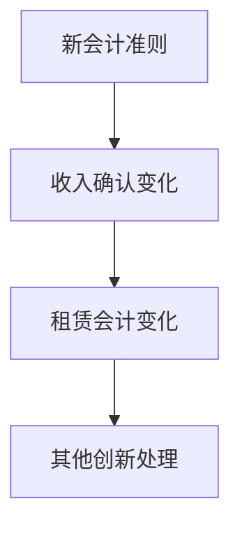

#### 4.1.2 技术创新对会计处理的影响
技术创新改变了企业的经营模式，例如电子商务的兴起对收入确认和成本计算的影响。

**数学模型**：
$$ 数字化转型 = \text{技术驱动的企业模式变革} $$

#### 4.1.3 企业会计处理的创新趋势
企业为了适应新的经营环境，不断探索新的会计处理方法，例如基于区块链的财务记账方式。

**mermaid流程图**：
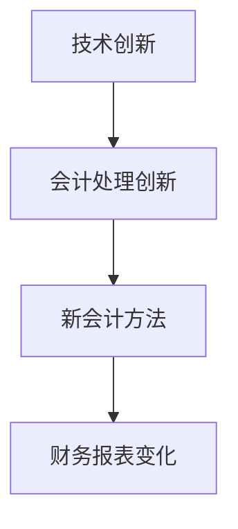

### 4.2 创新会计处理方法的分析

#### 4.2.1 收入确认的新方法
新收入准则要求企业采用“履约进度法”确认收入，这改变了传统的“完工法”。

**数学模型**：
$$ 收入确认 = \text{履约进度} \times 合同金额 $$

#### 4.2.2 租赁会计的创新处理
新租赁准则统一了融资租赁和经营租赁的会计处理，要求企业将所有租赁合同纳入资产负债表。

**数学模型**：
$$ 租赁负债 = \text{未来租金现值} $$

#### 4.2.3 金融工具的创新会计处理
金融工具的创新，如复杂衍生工具的使用，对会计处理提出了新的要求。

**数学模型**：
$$ 衍生工具公允价值 = \text{市场报价} $$

### 4.3 应对创新会计处理方法的策略

#### 4.3.1 理解新会计准则的变化
分析者需要深入理解新会计准则的变化，调整财务报表分析的方法和指标。

**mermaid流程图**：
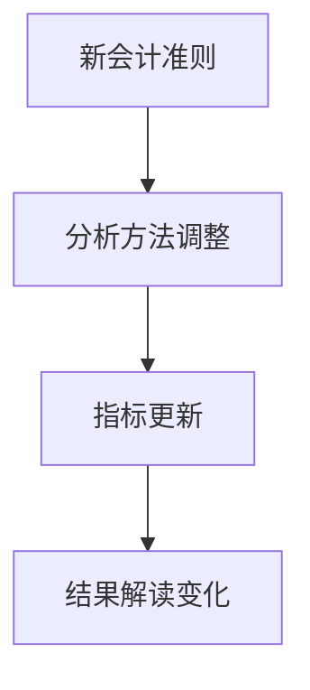

#### 4.3.2 结合行业特点进行分析
不同行业的会计处理方法有所不同，分析者需要结合行业特点，灵活应用分析方法。

**数学模型**：
$$ 行业差异 = \text{行业特点} \times \text{会计政策} $$

#### 4.3.3 注重财务报表附注的信息
创新会计处理方法往往伴随着更多的披露要求，财务报表附注的信息尤为重要。

**mermaid流程图**：
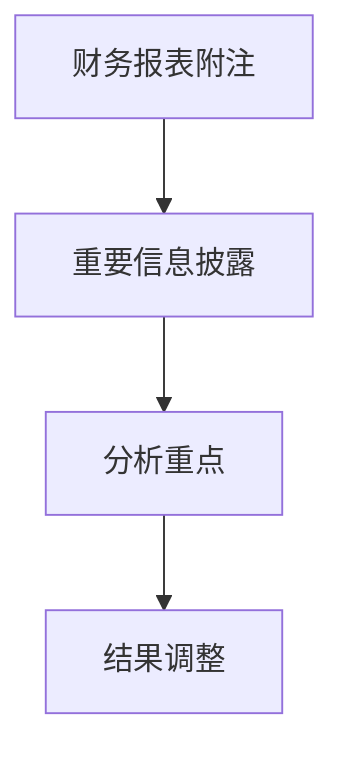

### 4.4 本章小结

#### 4.4.1 创新会计处理方法的影响
- 新会计准则的出台改变了财务报表的结构和数据呈现方式。
- 技术创新对会计处理提出了新的要求，分析者需要不断更新分析方法。

#### 4.4.2 应对策略总结
- 深入理解新会计准则的变化。
- 结合行业特点灵活应用分析方法。
- 注重财务报表附注的信息披露。

---

## 第5章: 系统分析与架构设计方案

### 5.1 问题场景介绍
随着会计处理方法的创新，传统的财务报表分析方法需要结合新的系统架构，以应对数据量的增加和分析复杂度的提高。

#### 5.1.1 项目介绍
本项目旨在设计一个基于格雷厄姆分析方法的财务报表分析系统，结合创新会计处理方法，提供高效的分析工具。

### 5.2 系统功能设计

#### 5.2.1 领域模型设计
**mermaid类图**：
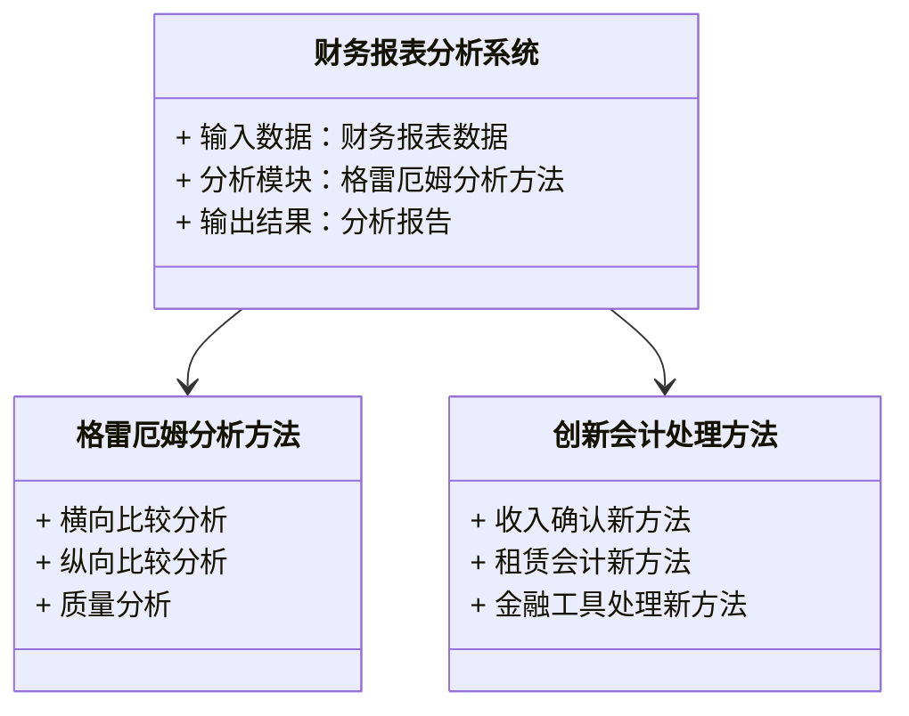

### 5.3 系统架构设计

#### 5.3.1 系统架构图
**mermaid架构图**：
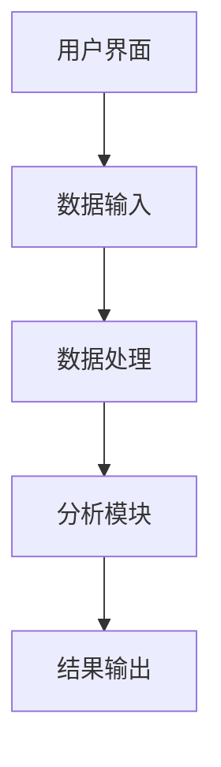

#### 5.3.2 模块划分
- 用户界面：提供数据输入和结果展示的界面。
- 数据处理：对财务报表数据进行清洗和整理。
- 分析模块：应用格雷厄姆分析方法和创新会计处理方法进行分析。
- 结果输出：生成分析报告。

### 5.4 系统接口设计

#### 5.4.1 数据接口
- 输入接口：接收财务报表数据。
- 输出接口：输出分析报告。

#### 5.4.2 模块接口
- 分析模块接口：接收数据处理模块的输出，返回分析结果。

### 5.5 系统交互设计

#### 5.5.1 交互流程
**mermaid序列图**：
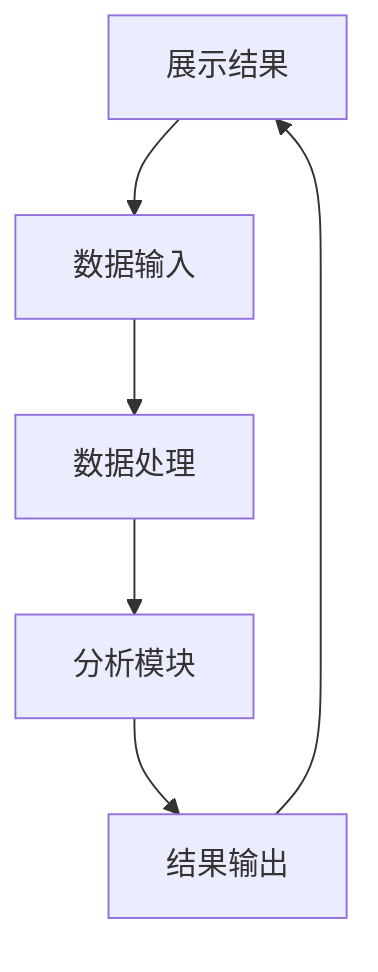

### 5.6 本章小结

#### 5.6.1 系统架构总结
- 用户界面：提供数据输入和结果展示。
- 数据处理：对财务报表数据进行清洗和整理。
- 分析模块：应用格雷厄姆分析方法和创新会计处理方法进行分析。
- 结果输出：生成分析报告。

#### 5.6.2 架构设计的意义
- 系统化设计：确保分析过程的高效性和准确性。
- 模块化设计：便于后续功能扩展和维护。

---

## 第6章: 项目实战

### 6.1 环境安装

#### 6.1.1 系统要求
- 操作系统：Windows 10 或更高版本，或 macOS 10.15 或更高版本。
- 开发工具：Python 3.8 或更高版本，Jupyter Notebook 或 VS Code。
- 数据库：MySQL 或其他关系型数据库。

#### 6.1.2 安装步骤
1. 安装Python和必要的库（pandas、numpy、matplotlib）。
2. 安装Jupyter Notebook或VS Code。
3. 安装MySQL或其他数据库。

### 6.2 系统核心实现源代码

#### 6.2.1 数据处理代码
```python
import pandas as pd
import numpy as np

# 读取财务报表数据
data = pd.read_csv('financial_report.csv')

# 数据清洗
data.dropna(inplace=True)
data = data[~data['收入'].isnull()]
```

#### 6.2.2 格雷厄姆分析代码
```python
def graham_analysis(data):
    # 横向比较分析
    horizontal = data.mean()
    # 纵向比较分析
    vertical = data.pct_change()
    # 质量分析
    quality = data.describe()
    return horizontal, vertical, quality

horizontal, vertical, quality = graham_analysis(data)
```

#### 6.2.3 创新会计处理代码
```python
def innovative_accounting(data):
    # 收入确认新方法
    data['收入'] = data['收入'].apply(lambda x: x * 0.9)
    # 租赁会计新方法
    data['租赁费用'] = data['租赁费用'].apply(lambda x: x * 1.1)
    return data

data = innovative_accounting(data)
```

### 6.3 案例分析与详细解读

#### 6.3.1 案例分析
假设我们有一家企业的财务报表数据，我们需要应用格雷厄姆分析方法和创新会计处理方法，对其进行财务分析。

#### 6.3.2 详细解读
1. 数据清洗：去除缺失值，确保数据完整性。
2. 格雷厄姆分析：横向比较分析、纵向比较分析和质量分析。
3. 创新会计处理：应用新的收入确认方法和租赁会计方法，调整财务数据。

### 6.4 本章小结

#### 6.4.1 核心代码实现
- 数据处理：确保数据清洗和整理。
- 格雷厄姆分析：横向、纵向和质量分析。
- 创新会计处理：应用新的会计方法，调整财务数据。

#### 6.4.2 案例分析的意义
- 验证分析方法的有效性。
- 掌握创新会计处理的实际应用。

---

## 第7章: 总结与展望

### 7.1 本章总结

#### 7.1.1 核心内容回顾
- 格雷厄姆的财务报表分析方法：横向比较分析、纵向比较分析、质量分析。
- 创新会计处理方法：收入确认新方法、租赁会计新方法、金融工具处理新方法。

#### 7.1.2 方法总结
- 横向比较分析：评估相对优势。
- 纵向比较分析：评估趋势变化。
- 质量分析：评估财务质量。

### 7.2 未来展望

#### 7.2.1 拓展阅读
- 格雷厄姆的《聪明的投资者》。
- 新会计准则的详细解读。

#### 7.2.2 技术发展
- 人工智能在财务报表分析中的应用。
- 区块链技术对会计处理的影响。

### 7.3 最佳实践 tips

#### 7.3.1 分析技巧
- 结合行业特点，灵活应用分析方法。
- 注重财务报表附注的信息披露。

#### 7.3.2 注意事项
- 避免机械应用分析方法，注重实际问题。
- 及时更新知识，关注会计准则的变化。

### 7.4 本章小结

#### 7.4.1 核心思想总结
- 格雷厄姆的分析方法：质量分析为核心。
- 创新会计处理：改变财务报表结构和数据呈现方式。

#### 7.4.2 未来展望
- 技术发展：人工智能和区块链对财务分析的影响。
- 学习建议：持续学习，关注会计准则的变化。

---

## 附录: 格雷厄姆的财务分析经典语录

1. “价格是别人付的，价值是你自己的。”
2. “投资的第一步是评估企业的内在价值。”
3. “财务报表是企业的成绩单，我们需要解读这份成绩单。”
4. “会计处理方法的变化，要求我们不断更新分析方法。”

---

## 参考文献

1. 格雷厄姆, B. F. (1972). 《聪明的投资者》.
2. FASB. (2023). 新会计准则指南.
3. 财政部会计司. (2023). 会计准则应用指南.

---

通过以上内容，我们系统地探讨了格雷厄姆的财务报表分析方法，并结合创新会计处理方法，分析了如何在复杂多变的商业环境中，运用格雷厄姆的分析框架应对会计处理方法的创新挑战。希望本文能够为财务分析人员和投资者提供有价值的参考和启发。

