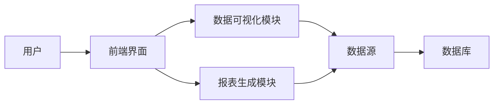
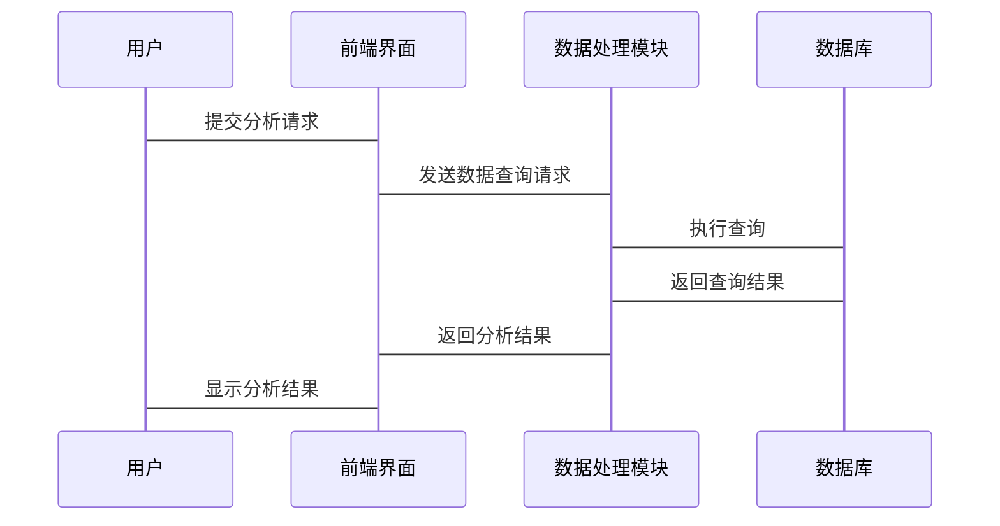

                 


# 《格雷厄姆的资产负债表分析技巧》

---

## 关键词：格雷厄姆，资产负债表，财务分析，投资技巧，价值投资

---

## 摘要：  
本文深入探讨了格雷厄姆的资产负债表分析技巧，从基本概念到高级方法，结合实际案例和系统架构设计，全面解析如何通过资产负债表评估企业财务健康状况和投资价值。文章从背景介绍、核心概念、算法原理、系统架构、项目实战到最佳实践，层层递进，帮助读者掌握这一经典的投资分析方法。

---

## 第三部分: 资产负债表分析的高级方法

## # 第5章: 多维度分析与行业差异

### 5.1 行业差异对资产负债表分析的影响
#### 5.1.1 不同行业的财务特征对比
#### 5.1.2 行业周期性对资产负债表的影响
#### 5.1.3 行业风险评估与资产负债表分析

### 5.2 资产负债表多维度分析框架
#### 5.2.1 财务比率的多维度对比
#### 5.2.2 企业生命周期与资产负债表分析
#### 5.2.3 行业标杆与企业实际表现的对比

### 5.3 格雷厄姆风格的横向与纵向对比分析
#### 5.3.1 横向对比分析：同行业公司间的财务指标对比
#### 5.3.2 纵向对比分析：企业自身历史数据对比
#### 5.3.3 格雷厄姆对横向与纵向分析的重视

## # 第6章: 资产负债表分析的系统架构设计

### 6.1 系统分析与设计背景
#### 6.1.1 问题场景介绍
#### 6.1.2 项目介绍与目标
#### 6.1.3 系统功能设计（领域模型）
#### 6.1.4 系统架构设计

### 6.2 系统架构设计
#### 6.2.1 系统架构图


#### 6.2.2 系统接口设计
#### 6.2.3 系统交互流程图


### 6.3 系统功能实现
#### 6.3.1 数据采集与处理模块
#### 6.3.2 财务比率计算模块
#### 6.3.3 数据可视化模块

---

## 第四部分: 资产负债表分析的项目实战

## # 第7章: 项目实战：基于Python的资产负债表分析系统

### 7.1 环境安装与配置
#### 7.1.1 安装Python与必要的库（Pandas、Matplotlib、Seaborn）
#### 7.1.2 数据源获取与准备（以苹果公司为例）

### 7.2 系统核心代码实现
#### 7.2.1 数据读取与处理
```python
import pandas as pd

# 读取资产负债表数据
def read_financial_statement():
    df = pd.read_csv('balance_sheet.csv')
    return df

# 数据预处理
def preprocess_data(df):
    df = df.dropna()
    df['ratio'] = df['流动资产'] / df['流动负债']
    return df

# 示例数据
data = {
    '流动资产': [100, 120, 150],
    '流动负债': [60, 70, 80],
    '非流动资产': [50, 60, 70],
    '非流动负债': [20, 25, 30],
    '所有者权益': [70, 80, 90]
}

df = pd.DataFrame(data)
```

#### 7.2.2 财务比率计算与可视化
```python
import matplotlib.pyplot as plt
import seaborn as sns

# 计算流动比率
def calculate流动比率(df):
   流动资产 = df['流动资产']
   流动负债 = df['流动负债']
   流动比率 = 流动资产 / 流动负债
    return 流动比率

# 可视化流动比率
流动比率 = calculate流动比率(df)
plt.figure(figsize=(10,6))
sns.lineplot(x=df.index, y=流动比率, label='流动比率')
plt.title('流动比率变化趋势')
plt.xlabel('季度')
plt.ylabel('流动比率')
plt.show()
```

#### 7.2.3 投资价值评估与报告生成
```python
from reportlab.pdfgen import canvas

# 生成分析报告
def generate_report():
    c = canvas.Canvas('balance_sheet_analysis.pdf')
    c.drawString(100, 750, '资产负债表分析报告')
    c.drawString(100, 730, '流动资产：$流动资产')
    c.drawString(100, 710, '流动负债：$流动负债')
    c.save()

generate_report()
```

### 7.3 实际案例分析与解读
#### 7.3.1 案例背景
#### 7.3.2 数据分析过程
#### 7.3.3 投资决策建议

### 7.4 项目小结与经验分享
#### 7.4.1 项目实现的关键点
#### 7.4.2 项目中的常见问题与解决方案
#### 7.4.3 系统优化与扩展方向

---

## 第五部分: 最佳实践与注意事项

## # 第8章: 格雷厄姆资产负债表分析法的最佳实践

### 8.1 核心要点回顾
#### 8.1.1 重视流动资产与流动负债的比率
#### 8.1.2 关注非流动资产与非流动负债的结构
#### 8.1.3 结合行业特点进行分析

### 8.2 分析中的注意事项
#### 8.2.1 数据来源的可靠性
#### 8.2.2 时间周期的选择
#### 8.2.3 结合其他财务报表（利润表、现金流量表）进行综合分析

### 8.3 格雷厄姆分析法的拓展应用
#### 8.3.1 结合机器学习进行预测
#### 8.3.2 应用于企业估值模型
#### 8.3.3 在投资组合管理中的应用

## # 第9章: 总结与展望

### 9.1 总结
#### 9.1.1 格雷厄姆资产负债表分析法的核心思想
#### 9.1.2 本文的主要内容回顾
#### 9.1.3 分析方法的实际应用价值

### 9.2 展望
#### 9.2.1 资产负债表分析的未来发展趋势
#### 9.2.2 结合新技术（如AI）的创新应用
#### 9.2.3 投资者如何持续提升分析能力

---

## 关键词：格雷厄姆，资产负债表，财务分析，投资技巧，价值投资

---

## 摘要：  
本文深入探讨了格雷厄姆的资产负债表分析技巧，从基本概念到高级方法，结合实际案例和系统架构设计，全面解析如何通过资产负债表评估企业财务健康状况和投资价值。文章从背景介绍、核心概念、算法原理、系统架构、项目实战到最佳实践，层层递进，帮助读者掌握这一经典的投资分析方法。

