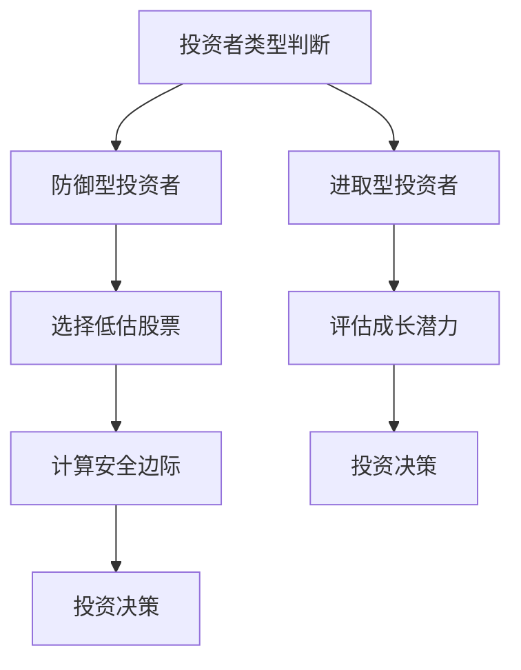
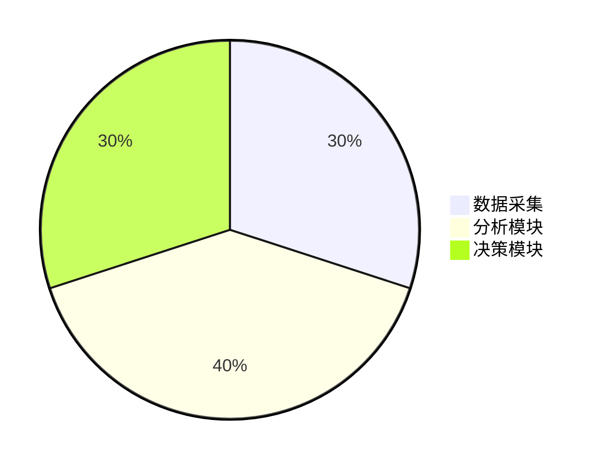

                 


# 格雷厄姆的防御型和进取型投资者区别

## 关键词：
- 格雷厄姆，防御型投资者，进取型投资者，投资策略，价值投资

## 摘要：
本文详细分析了格雷厄姆提出的防御型和进取型投资者之间的区别，探讨了这两种投资策略的核心原理、特点以及它们在实际投资中的应用场景。文章从背景介绍到系统架构设计，结合数学模型和项目实战，全面解析了防御型和进取型投资者的区别，为投资者提供了深入的理论指导和实践参考。

---

# 目录大纲：《格雷厄姆的防御型和进取型投资者区别》

---

## 第一部分：背景介绍

### 第1章：格雷厄姆及其投资理念

#### 1.1 格雷厄姆的生平简介
- 1.1.1 格雷厄姆的早期经历
  - 格雷厄姆出生于美国纽约州，早年在金融领域积累了丰富的经验。
  - 他曾在哥伦比亚大学任教，培养了许多著名的投资学家。
- 1.1.2 格雷厄姆的投资哲学
  - 他倡导价值投资，强调以低于内在价值的价格买入优质股票。
  - 强调安全边际，即买入价格远低于内在价值。
- 1.1.3 格雷厄姆对投资界的影响
  - 他的著作《证券分析》和《聪明的投资者》对全球投资界产生了深远影响。
  - 他的理念被 Warren Buffett 等投资者广泛应用。

#### 1.2 投资者的分类
- 1.2.1 投资者的类型概述
  - 投资者根据风险承受能力和投资目标可分为不同类型。
- 1.2.2 防御型和进取型投资者的定义
  - 防御型投资者：追求稳定收益，注重本金安全。
  - 进取型投资者：追求高回报，愿意承担高风险。

---

## 第二部分：核心概念与联系

### 第3章：防御型和进取型投资者的核心原理

#### 3.1 核心概念原理
- 3.1.1 防御型投资的原理
  - 风险厌恶：防御型投资者倾向于选择低风险、低波动性投资。
  - 稳定收益：通过选择 dividend-paying stocks 或债券实现稳定的现金流。
- 3.1.2 进取型投资的原理
  - 高风险承受能力：愿意承担更高的风险以追求更高的回报。
  - 高回报目标：通过投资成长股、小盘股等实现资本增值。

#### 3.2 对比分析
- 3.2.1 投资目标对比
  - 防御型投资者：注重本金安全和稳定收益。
  - 进取型投资者：注重资本增值和高回报。
- 3.2.2 风险承受能力对比
  - 防御型投资者：低风险承受能力。
  - 进取型投资者：高风险承受能力。
- 3.2.3 投资策略对比
  - 防御型投资者：选择价值被低估的股票，注重安全边际。
  - 进取型投资者：投资于成长潜力大的股票，注重公司基本面和行业前景。

### 第4章：防御型和进取型投资者的对比分析

#### 4.1 对比分析表格
| 属性                | 防御型投资者               | 进取型投资者               |
|---------------------|--------------------------|--------------------------|
| 投资目标            | 稳定收益，本金安全         | 高回报，资本增值         |
| 风险承受能力        | 低风险承受能力           | 高风险承受能力           |
| 投资策略            | 选择低估股票，注重分红     | 投资成长股，注重公司前景   |
| 适合人群            | 保守投资者，追求稳定收益   | 进取投资者，追求高回报     |

#### 4.2 ER实体关系图
- 图中展示了防御型和进取型投资者在投资策略上的核心差异。

---

## 第三部分：算法原理讲解

### 第5章：防御型和进取型投资者的决策流程

#### 5.1 决策流程图


#### 5.2 数学模型
- 安全边际计算公式：
  $$ 安全边际 = 股票价格 < 内在价值 \times 20\% $$
- 成长股评估公式：
  $$ 成长潜力 = (收入增长率 + 净利润增长率) / 2 $$

---

## 第四部分：数学模型

### 第6章：防御型和进取型投资者的数学模型

#### 6.1 防御型投资者的模型
- 市盈率（P/E）：
  $$ P/E = \frac{股价}{每股收益} $$
- 市净率（P/B）：
  $$ P/B = \frac{股价}{每股净资产} $$

防御型投资者倾向于选择 P/E 和 P/B 均低于行业平均水平的股票。

#### 6.2 进取型投资者的模型
- 股票增长率（Growth Rate）：
  $$ Growth Rate = \frac{净利润增长率}{收入增长率} $$
- 内在成长价值：
  $$ 内在成长价值 = \sum_{t=1}^{n} \frac{现金流}{(1 + r)^t} $$

---

## 第五部分：系统分析与架构设计

### 第7章：投资决策支持系统

#### 7.1 系统功能设计
- 数据采集模块：收集股票数据、市场数据。
- 分析模块：计算 P/E、P/B、Growth Rate 等指标。
- 决策模块：根据投资者类型推荐股票。

#### 7.2 系统架构图


---

## 第六部分：项目实战

### 第8章：投资组合优化

#### 8.1 环境安装
- 安装 Python 和相关库（Pandas、NumPy）。

#### 8.2 核心实现代码
```python
import pandas as pd

# 防御型投资策略
def defensive_investment(stocks):
    return stocks[stocks['P/E'] < stocks['P/E'].mean()]

# 进取型投资策略
def aggressive_investment(stocks):
    return stocks[stocks['Growth Rate'] > stocks['Growth Rate'].mean()]

# 示例数据
data = {
    '股票': ['A', 'B', 'C', 'D'],
    'P/E': [10, 15, 8, 12],
    'Growth Rate': [0.05, 0.08, 0.03, 0.06]
}
stocks = pd.DataFrame(data)

# 应用策略
defensive_stocks = defensive_investment(stocks)
aggressive_stocks = aggressive_investment(stocks)

print("防御型投资组合:", defensive_stocks)
print("进取型投资组合:", aggressive_stocks)
```

---

## 第七部分：总结与扩展

### 第9章：最佳实践与投资建议

#### 9.1 小结
- 防御型和进取型投资者在目标、风险承受能力和策略上有显著差异。
- 投资者应根据自身情况选择合适策略。

#### 9.2 注意事项
- 防御型投资者需定期审查投资组合，确保安全边际。
- 进取型投资者需关注市场变化，及时调整投资策略。

#### 9.3 拓展阅读
- 格雷厄姆的《聪明的投资者》。
- 巴菲特的《致股东的信》。

---

通过以上结构化和详细的内容，您可以撰写一篇关于格雷厄姆防御型和进取型投资者区别的高质量技术博客文章。

