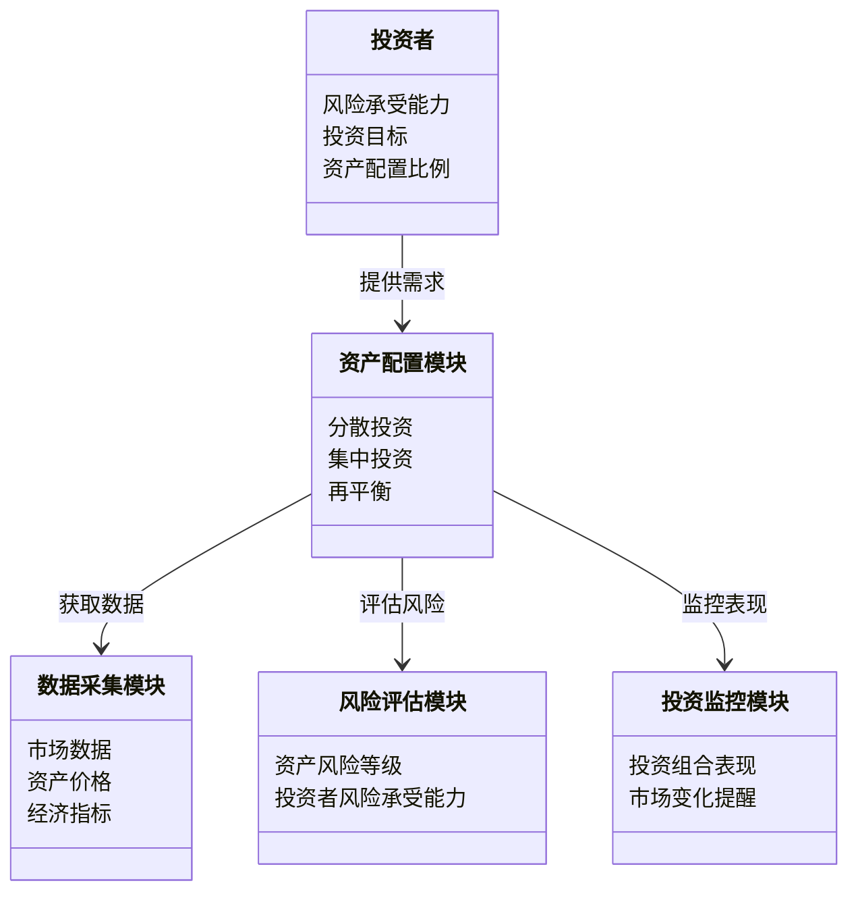

                 


# 格雷厄姆的防御型和进取型投资者：知己知彼

## 关键词
格雷厄姆，防御型投资者，进取型投资者，资产配置，风险管理，投资心理

## 摘要
本文深入探讨了格雷厄姆提出的防御型和进取型投资者的概念及其在投资决策中的应用。通过分析这两种投资策略的核心思想、实施步骤、优缺点以及实际案例，帮助投资者更好地理解如何根据自身风险承受能力和投资目标选择合适的投资策略。文章还结合了投资心理和系统架构，提供了一套完整的投资解决方案，帮助读者在复杂多变的市场环境中实现长期稳定的收益。

---

## 第一部分: 投资者的知己知彼概述

### 第1章: 投资者的知己知彼概述

#### 1.1 投资者的定义与分类
- **1.1.1 投资者的定义**  
  投资者是指通过购买资产（如股票、债券、房地产等）以期获得未来收益的个人或机构。投资者的核心目标是通过合理的资产配置和风险管理，在不同市场环境下实现财富的保值与增值。

- **1.1.2 格雷厄姆的投资理念**  
  本杰明·格雷厄姆是价值投资的鼻祖，他认为投资者应以安全边际为核心，寻找那些市场价格低于其内在价值的资产进行投资。他将投资者分为两类：防御型和进取型。

- **1.1.3 知己知彼的内涵**  
  投资者需要清晰地了解自己的风险承受能力、投资目标和市场认知，同时对市场环境、资产特性和投资工具有深入的理解。只有做到“知己知彼”，才能在投资决策中做出最优选择。

#### 1.2 防御型与进取型投资者的定义
- **1.2.1 防御型投资者的特征**  
  防御型投资者注重本金的安全性，追求稳定的收益，通常投资于低风险、高流动性资产，如债券、货币市场工具和蓝筹股。

- **1.2.2 进取型投资者的特征**  
  进取型投资者愿意承担更高的风险，以期获得更高的收益，通常投资于股票、创业公司、私募基金等高风险资产。

- **1.2.3 两者的核心区别与联系**  
  | 特性                | 防御型投资者           | 进取型投资者           |
  |---------------------|-----------------------|-----------------------|
  | 风险承受能力        | 低                   | 高                   |
  | 投资目标            | 稳定收益             | 高收益               |
  | 资产配置比例        | 债券、蓝筹股为主       | 成长股、高风险资产为主|

---

## 第二部分: 防御型投资者的策略与实践

### 第2章: 防御型投资者的核心策略

#### 2.1 防御型投资的基本原则
- **价值投资**：寻找市场价格低于内在价值的资产，注重安全边际。
- **分散投资**：通过多样化配置降低风险。
- **长期持有**：避免频繁交易，减少交易成本。

#### 2.2 防御型投资的三大支柱
1. **安全性**：选择信用评级高、流动性强的资产。
2. **稳定性**：投资于收益稳定的资产，如国债、分红稳定的蓝筹股。
3. **分散性**：通过多资产配置降低特定风险。

#### 2.3 防御型投资的实施步骤
1. **评估风险承受能力**：确定自身对风险的容忍度。
2. **设定投资目标**：明确是追求保值还是适度增长。
3. **选择资产类别**：优先选择低风险资产。
4. **定期再平衡**：根据市场变化调整资产配置。

---

### 第3章: 防御型投资者的资产配置

#### 3.1 资产配置的基本原理
- 资产配置是将资金分配到不同资产类别中，以实现风险和收益的最优平衡。

#### 3.2 防御型资产配置的模型
- **债券配置**：占比60%-70%，包括国债、企业债。
- **股票配置**：占比20%-30%，选择分红稳定、业绩优良的蓝筹股。
- **现金配置**：占比5%-10%，用于应对短期资金需求。

#### 3.3 防御型资产配置的优缺点
- **优点**：风险低，收益稳定，适合保守型投资者。
- **缺点**：收益相对较低，无法对抗通货膨胀。

---

## 第三部分: 进取型投资者的策略与实践

### 第4章: 进取型投资者的核心策略

#### 4.1 进取型投资的基本原则
- **成长性优先**：选择业绩增长快、前景广阔的资产。
- **集中投资**：将资金集中在少数优质资产上，以获得更高收益。
- **杠杆效应**：合理利用杠杆工具放大收益。

#### 4.2 进取型投资的三大支柱
1. **成长性**：选择业绩增长快、市盈率合理的股票。
2. **集中性**：将资金集中在高增长资产上。
3. **杠杆性**：合理使用融资工具放大收益。

#### 4.3 进取型投资的实施步骤
1. **评估风险承受能力**：确定自身对高风险资产的容忍度。
2. **设定投资目标**：明确是追求高收益还是高增长。
3. **选择资产类别**：优先选择高风险资产。
4. **定期再平衡**：根据市场变化调整资产配置。

---

### 第5章: 进取型投资者的资产配置

#### 5.1 资产配置的基本原理
- 资产配置是将资金分配到不同资产类别中，以实现风险和收益的最优平衡。

#### 5.2 进取型资产配置的模型
- **股票配置**：占比70%-80%，包括成长股、创业公司。
- **债券配置**：占比10%-20%，用于降低整体风险。
- **现金配置**：占比5%-10%，用于应对短期资金需求。

#### 5.3 进取型资产配置的优缺点
- **优点**：收益高，适合风险承受能力强的投资者。
- **缺点**：风险高，市场波动大，容易遭受重大损失。

---

## 第四部分: 防御型与进取型投资者的对比分析

### 第6章: 防御型与进取型投资者的对比

#### 6.1 投资目标的对比
- **防御型**：追求稳定收益，注重本金安全。
- **进取型**：追求高收益，愿意承担高风险。

#### 6.2 投资策略的对比
- **防御型**：分散投资、长期持有、注重安全边际。
- **进取型**：集中投资、杠杆效应、注重成长性。

#### 6.3 投资风险的对比
- **防御型**：低风险，适合保守型投资者。
- **进取型**：高风险，适合风险承受能力强的投资者。

---

## 第五部分: 投资心理与行为分析

### 第7章: 投资心理与行为分析

#### 7.1 投资者的心理特征
- **防御型投资者**：风险厌恶，追求安全感，倾向于保守型投资。
- **进取型投资者**：风险偏好，追求成就感，倾向于冒险型投资。

#### 7.2 心理偏差对投资决策的影响
- **过度自信**：认为自己能够准确预测市场走势。
- **从众心理**：盲目跟随市场潮流，忽视独立判断。
- **损失厌恶**：对潜在损失的恐惧导致决策失误。

#### 7.3 如何克服心理偏差
- **加强自我认知**：了解自己的心理特征和投资偏好。
- **制定明确的投资计划**：避免情绪化决策。
- **定期回顾与调整**：及时发现并纠正心理偏差。

---

## 第六部分: 投资系统架构与实战

### 第8章: 投资系统的架构设计

#### 8.1 系统功能模块划分
- **数据采集模块**：收集市场数据、资产价格、经济指标。
- **风险评估模块**：评估资产的风险等级。
- **资产配置模块**：根据投资者需求生成配置方案。
- **投资监控模块**：实时监控投资组合表现。

#### 8.2 系统架构的mermaid类图


#### 8.3 系统接口设计
- **输入接口**：投资者风险承受能力和投资目标。
- **输出接口**：资产配置方案和投资建议。

---

### 第9章: 投资系统的实战应用

#### 9.1 环境安装与配置
- **工具选择**：使用Python的Pandas和Matplotlib库进行数据处理和可视化。
- **环境搭建**：安装Jupyter Notebook、Pandas、Matplotlib。

#### 9.2 核心实现源代码
```python
import pandas as pd
import matplotlib.pyplot as plt

# 示例：防御型资产配置
def defensive_portfolio():
    bonds = 0.7
    stocks = 0.25
    cash = 0.05
    return {"债券": bonds, "股票": stocks, "现金": cash}

# 示例：进取型资产配置
def aggressive_portfolio():
    stocks = 0.8
    bonds = 0.1
    cash = 0.05
    return {"股票": stocks, "债券": bonds, "现金": cash}

# 可视化配置比例
portfolio_defensive = defensive_portfolio()
portfolio_aggressive = aggressive_portfolio()

categories = list(portfolio_defensive.keys())
values_defensive = [v for v in portfolio_defensive.values()]
values_aggressive = [v for v in portfolio_aggressive.values()]

plt.figure(figsize=(10, 6))
plt.subplot(2, 1, 1)
plt.pie(values_defensive, labels=categories, autopct='%1.1f%%', title='防御型配置')
plt.subplot(2, 1, 2)
plt.pie(values_aggressive, labels=categories, autopct='%1.1f%%', title='进取型配置')
plt.show()
```

#### 9.3 代码应用解读与分析
- **防御型配置**：债券占比70%，股票占比25%，现金占比5%。
- **进取型配置**：股票占比80%，债券占比10%，现金占比5%。

---

## 总结
格雷厄姆提出的防御型和进取型投资者理念为现代投资理论奠定了基础。通过了解自身的风险承受能力和投资目标，投资者可以更好地选择适合自己的投资策略。同时，结合系统的投资管理和心理调节，投资者可以在复杂多变的市场环境中实现长期稳定的收益。

**小结**：
1. **知己知彼**：了解自身投资目标和市场环境是投资成功的关键。
2. **策略选择**：根据自身情况选择防御型或进取型投资策略。
3. **系统管理**：通过系统化的资产配置和投资监控实现投资目标。
4. **心理调节**：克服心理偏差，避免情绪化决策。

**注意事项**：
- 投资有风险，入市需谨慎。
- 本文内容仅供参考，具体投资决策需结合市场环境和个人情况。

**拓展阅读**：
- 格雷厄姆《证券投资分析》
- 巴菲特《巴菲特致股东的信》
- 现代投资组合理论相关书籍

