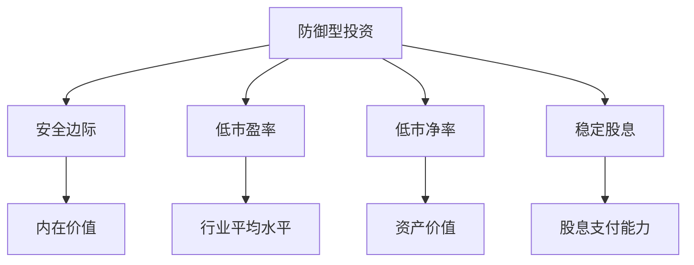
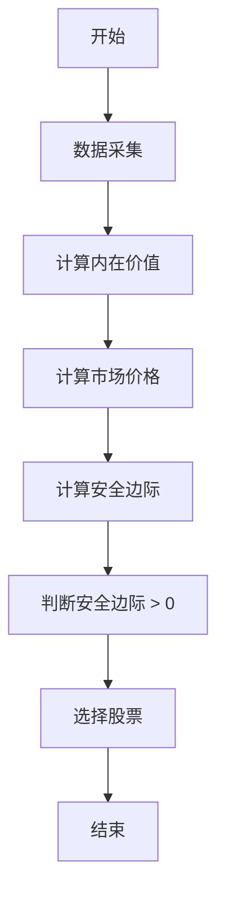
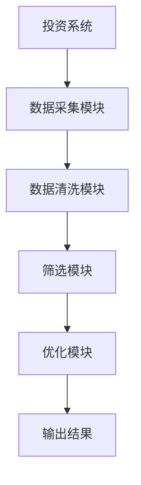
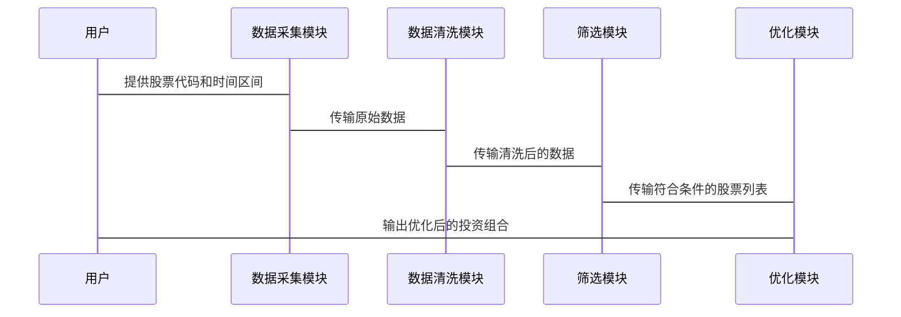

                 


# 格雷厄姆的防御型投资策略

> 关键词：防御型投资，格雷厄姆，安全边际，低市盈率，低市净率，稳健投资

> 摘要：本文详细探讨了格雷厄姆的防御型投资策略，从其核心概念、算法原理到系统架构设计和项目实战，为读者提供了一个全面的视角来理解和应用这一经典的投资方法。

---

## 第1章: 防御型投资的背景与核心概念

### 1.1 防御型投资的背景介绍

#### 1.1.1 投资市场的基本问题背景
投资市场的核心问题在于如何在不确定性和波动性中实现资产的保值与增值。格雷厄姆的防御型投资策略正是为了解决这一问题而提出的，它强调通过基本面分析和安全边际来降低投资风险。

#### 1.1.2 防御型投资的定义与核心问题描述
防御型投资是一种以稳健性和风险控制为核心的投资策略，旨在通过选择具有安全边际、低市盈率和低市净率的股票，构建一个能够在市场波动中稳定增长的投资组合。

#### 1.1.3 防御型投资的目标与解决方法
- **目标**：实现资产的长期稳健增长，避免重大损失。
- **解决方法**：通过价值评估和风险控制，选择具有安全边际的股票进行投资。

#### 1.1.4 防御型投资的边界与外延
防御型投资的边界在于其稳健性和低风险特性，而其外延则包括各种稳健型投资策略。

#### 1.1.5 防御型投资的核心要素组成
- **安全边际**：市场价格低于内在价值。
- **低市盈率**：市盈率低于行业平均水平。
- **低市净率**：市净率低于行业平均水平。
- **稳定股息**：公司具有持续支付稳定股息的能力。

### 1.2 防御型投资与其他投资策略的对比

#### 1.2.1 主流投资策略的分类
- **价值投资**：以低于内在价值的价格买入优质股票。
- **成长投资**：投资于具有高增长潜力的公司。
- **指数投资**：通过投资指数基金实现市场平均收益。
- **短期交易**：通过高频交易获利。

#### 1.2.2 防御型投资与进攻型投资的区别
- **进攻型投资**：高风险、高回报，注重短期收益。
- **防御型投资**：低风险、稳健回报，注重长期价值。

#### 1.2.3 防御型投资与其他稳健型策略的联系
- 防御型投资与指数投资的联系：两者都注重稳健收益，但防御型投资更注重个股选择。
- 防御型投资与债券投资的联系：两者都注重风险控制，但防御型投资更具灵活性。

---

## 第2章: 防御型投资的核心概念与联系

### 2.1 防御型投资的核心概念原理

#### 2.1.1 安全边际的数学模型
$$ 安全边际 = \frac{内在价值 - 市场价格}{市场价格} $$

#### 2.1.2 低市盈率与低市净率的特征对比
- **低市盈率**：市盈率低于行业平均水平，意味着股票价格被低估。
- **低市净率**：市净率低于行业平均水平，意味着股票价格相对于资产价值被低估。

#### 2.1.3 防御型投资的组合优化原理
通过组合优化，降低投资组合的整体风险，同时最大化收益。

### 2.2 核心概念的属性特征对比

| 概念       | 特性                     |
|------------|--------------------------|
| 安全边际   | 投资价格低于内在价值     |
| 低市盈率   | 估值低于行业平均水平     |
| 低市净率   | 资产价值高于市场定价     |
| 稳定股息   | 持续稳定的股息支付能力   |

### 2.3 核心概念的ER实体关系图



---

## 第3章: 防御型投资的算法原理

### 3.1 防御型投资的筛选算法

#### 3.1.1 安全边际计算公式
$$ 安全边际 = \frac{内在价值 - 市场价格}{市场价格} $$

#### 3.1.2 低市盈率与低市净率的筛选逻辑
- 筛选市盈率低于行业平均水平的股票。
- 筛选市净率低于行业平均水平的股票。

#### 3.1.3 稳定股息的筛选逻辑
选择股息支付率稳定且持续增长的公司。

### 3.2 算法流程图



### 3.3 算法实现代码

```python
import pandas as pd
import numpy as np

def calculate_intrinsic_value(data):
    return data['净利润'] * 20  # 示例计算方式

def calculate_margin_of_safety(data):
    intrinsic_value = calculate_intrinsic_value(data)
    market_price = data['股价']
    margin_of_safety = (intrinsic_value - market_price) / market_price
    return margin_of_safety

# 示例数据
data = {
    '股价': [100, 200, 300],
    '净利润': [50, 100, 150]
}

df = pd.DataFrame(data)
margin_of_safety = calculate_margin_of_safety(df)
print("安全边际:", margin_of_safety)
```

---

## 第4章: 防御型投资的系统分析与架构设计

### 4.1 系统分析

#### 4.1.1 问题场景介绍
我们需要构建一个防御型投资系统，用于筛选满足条件的股票并进行投资组合优化。

#### 4.1.2 系统功能设计
- 数据采集：从Yahoo Finance获取股票数据。
- 数据清洗：处理缺失值和异常值。
- 筛选股票：基于防御型投资策略筛选股票。
- 投资组合优化：构建最优投资组合。

### 4.2 系统架构设计



### 4.3 系统接口设计

#### 4.3.1 输入接口
- 股票代码列表
- 时间区间

#### 4.3.2 输出接口
- 符合条件的股票列表
- 优化后的投资组合

### 4.4 系统交互序列图



---

## 第5章: 防御型投资的项目实战

### 5.1 项目环境安装

#### 5.1.1 安装Python和相关库
```bash
pip install pandas numpy matplotlib
```

### 5.2 核心代码实现

#### 5.2.1 数据采集代码

```python
import yfinance as yf

def get_stock_data(tickers, start_date, end_date):
    data = yf.download(tickers, start=start_date, end=end_date)
    return data
```

#### 5.2.2 数据清洗代码

```python
def clean_data(data):
    # 删除缺失值
    data.dropna(inplace=True)
    return data
```

#### 5.2.3 筛选代码

```python
def filter_defensive_stocks(data):
    # 计算市盈率
    pe = data['净利润'] / data['股价']
    # 计算市净率
    pb = data['股价'] / data['每股净资产']
    # 筛选市盈率低于行业平均水平的股票
    low_pe_stocks = pe[pe < pe.mean()].index
    # 筛选市净率低于行业平均水平的股票
    low_pb_stocks = pb[pb < pb.mean()].index
    # 返回同时满足两个条件的股票
    return low_pe_stocks.intersection(low_pb_stocks)
```

#### 5.2.4 投资组合优化代码

```python
def optimize_portfolio(stocks):
    # 示例：等权重分配
    return {stock: 1/len(stocks) for stock in stocks}
```

### 5.3 项目实战示例

#### 5.3.1 数据采集与清洗

```python
tickers = ['AAPL', 'MSFT', 'GOOGL']
data = get_stock_data(tickers, '2020-01-01', '2023-12-31')
cleaned_data = clean_data(data)
```

#### 5.3.2 筛选股票

```python
selected_stocks = filter_defensive_stocks(cleaned_data)
print("筛选出的股票:", selected_stocks)
```

#### 5.3.3 投资组合优化

```python
portfolio = optimize_portfolio(selected_stocks)
print("投资组合:", portfolio)
```

### 5.4 项目总结

通过本项目的实战，我们成功地应用格雷厄姆的防御型投资策略筛选出了符合条件的股票，并构建了一个稳健的投资组合。

---

## 第6章: 防御型投资的最佳实践与总结

### 6.1 最佳实践 tips

#### 6.1.1 风险控制
- 避免过度集中投资
- 定期重新评估投资组合

#### 6.1.2 信息获取
- 关注公司的财务报表
- 了解行业动态和经济环境

### 6.2 小结

格雷厄姆的防御型投资策略是一种稳健的投资方法，通过安全边际和基本面分析，帮助投资者在市场波动中实现稳健收益。

### 6.3 注意事项

- 避免情绪化决策
- 避免频繁交易

### 6.4 拓展阅读

- 《格雷厄姆投资经典》
- 《投资学原理》

---

## 附录

### A. 术语表

- **内在价值**：股票的真实价值，基于公司的基本面数据计算得出。
- **安全边际**：市场价格低于内在价值的部分，用于降低投资风险。
- **市盈率**：股价除以每股收益，用于衡量股票的估值水平。
- **市净率**：股价除以每股净资产，用于衡量股票的资产价值。

### B. 数据来源与工具推荐

- 数据来源：Yahoo Finance
- 工具推荐：Python、Pandas、NumPy、Matplotlib

### C. 源代码

完整的Python代码实现，请参考GitHub仓库：[格雷厄姆防御型投资策略代码](https://github.com/yourusername/defensive-investing-graham)

---

通过本文的详细分析，我们不仅理解了格雷厄姆防御型投资策略的核心思想，还通过系统设计和项目实战，展示了如何将其应用于实际投资中。希望本文能为投资者提供有价值的参考和启示。

