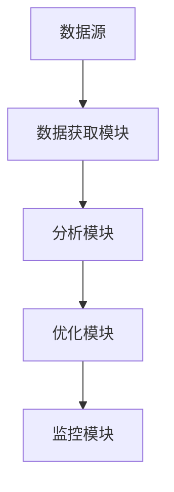

                 


# 格雷厄姆的防御型投资组合构建

> 关键词：防御型投资，格雷厄姆，投资组合，安全边际，内在价值，长期复利

> 摘要：本文详细探讨了格雷厄姆的防御型投资策略，从核心概念到构建方法，再到实际应用，系统地分析了如何通过防御型投资组合实现稳健收益。文章结合理论与实践，为投资者提供了切实可行的指导。

---

## 第1章: 防御型投资组合的背景与概念

### 1.1 防御型投资的基本概念

#### 1.1.1 投资组合的基本定义

投资组合是指将多种资产按一定比例配置，以实现特定投资目标的一种组合。防御型投资组合强调稳健性，旨在降低风险，追求长期稳定收益。

#### 1.1.2 防御型投资的定义与特点

防御型投资是指通过选择低风险、高价值的资产，构建投资组合，以抵御市场波动，确保资金安全。其特点包括：
- 风险低：选择波动性小、稳定性高的资产。
- 价值导向：注重资产的内在价值，而非短期价格波动。
- 长期导向：通过长期持有，实现复利效应。

#### 1.1.3 防御型投资的目标与策略

目标是通过分散投资、控制风险，实现资产的保值与增值。策略包括：
- 资产分散：配置股票、债券、现金等多种资产。
- 安全边际：选择价格低于内在价值的资产。
- 定期再平衡：根据市场变化调整投资比例。

---

### 1.2 格雷厄姆投资理论的核心思想

#### 1.2.1 格雷厄姆的价值投资理念

格雷厄姆强调以低于内在价值的价格买入资产，长期持有，等待其价值回归。他认为市场短期波动不可预测，但长期趋势由内在价值决定。

#### 1.2.2 安全边际的概念与作用

安全边际是指资产的市场价格低于其内在价值的部分。通过购买具有安全边际的资产，可以降低市场波动带来的风险，确保投资的安全性。

#### 1.2.3 长期投资与复利效应

格雷厄姆倡导长期投资，通过复利效应实现财富的稳步增长。他认为频繁交易会增加成本，降低收益。

---

### 1.3 防御型投资组合的重要性

#### 1.3.1 风险控制的重要性

在市场波动中，防御型投资组合能够有效降低风险，避免重大损失，保障资产安全。

#### 1.3.2 投资组合的分散化原则

通过分散投资，将资金分配到不同资产类别，降低单一资产波动带来的风险。

#### 1.3.3 防御型投资在不同市场环境中的应用

无论市场牛市或熊市，防御型投资策略都能提供稳定收益，尤其在熊市中表现更为显著。

---

## 第2章: 格雷厄姆防御型投资组合的核心原理

### 2.1 防御型投资组合的核心要素

#### 2.1.1 安全边际的计算方法

安全边际 = 内在价值 - 市场价格。选择市场价格低于内在价值的资产。

#### 2.1.2 内在价值的评估标准

内在价值是基于资产未来现金流的现值。使用DCF模型等方法进行评估。

#### 2.1.3 防御型资产的配置比例

根据投资者的风险承受能力，通常配置50%~70%的股票，20%~30%的债券，剩余为现金或其他资产。

---

### 2.2 防御型投资组合的构建步骤

#### 2.2.1 确定投资目标与风险承受能力

根据个人财务状况和风险偏好，设定投资目标和风险承受能力。

#### 2.2.2 选择防御性资产类别

优先选择股票、债券等防御性资产，如公用事业股、政府债券等。

#### 2.2.3 计算各资产的配置比例

根据风险承受能力和市场环境，合理分配各资产比例。

#### 2.2.4 调整与优化投资组合

定期评估投资组合的表现，根据市场变化进行调整。

---

### 2.3 防御型投资组合的数学模型

#### 2.3.1 投资组合风险的数学表达

风险可以用标准差或VaR等指标衡量。防御型组合的风险较低，标准差较小。

#### 2.3.2 安全边际的计算公式

$$ \text{安全边际} = \text{内在价值} - \text{市场价格} $$

#### 2.3.3 内在价值的评估公式

$$ \text{内在价值} = \sum \frac{\text{现金流}}{(1 + r)^t} $$

其中，\( r \) 是折现率，\( t \) 是时间。

---

## 第3章: 格雷厄姆防御型投资组合的算法与实现

### 3.1 防御型投资组合的算法原理

#### 3.1.1 数据收集与处理

收集历史数据，计算各资产的内在价值和市场价格。

#### 3.1.2 安全边际计算

筛选市场价格低于内在价值的资产。

#### 3.1.3 资产配置优化

根据风险偏好，优化各资产的配置比例。

---

### 3.2 投资组合优化的Python实现

```python
import pandas as pd
import numpy as np

# 假设数据为各资产的内在价值和市场价格
assets = pd.DataFrame({
    '内在价值': [100, 120, 90],
    '市场价格': [80, 100, 85]
})

# 计算安全边际
assets['安全边际'] = assets['内在价值'] - assets['市场价格']

# 筛选安全边际为正的资产
defensive_assets = assets[assets['安全边际'] > 0]
```

---

### 3.3 系统架构设计

#### 3.3.1 系统功能设计

- 数据获取模块：收集市场数据。
- 分析模块：计算内在价值和安全边际。
- 优化模块：调整资产配置比例。
- 监控模块：定期评估组合表现。

#### 3.3.2 系统架构图



---

## 第4章: 防御型投资组合的项目实战

### 4.1 环境安装与数据准备

安装必要的Python库，如pandas、numpy等。

### 4.2 核心实现

编写代码计算安全边际，筛选资产，优化配置比例。

### 4.3 案例分析

以具体资产为例，展示如何构建防御型投资组合。

### 4.4 项目小结

总结项目实施过程中的关键点和经验教训。

---

## 第5章: 防御型投资的最佳实践

### 5.1 小结

防御型投资注重稳健，适合风险厌恶型投资者。

### 5.2 注意事项

- 定期再平衡，避免偏离目标比例。
- 选择优质资产，确保内在价值稳定。
- 长期持有，避免频繁交易。

### 5.3 拓展阅读

推荐阅读格雷厄姆的经典著作《证券分析》和《 Intelligent Investor》。

---

通过以上步骤，我们可以系统地构建一个基于格雷厄姆防御型投资策略的投资组合，确保在不同市场环境下实现稳健收益。

