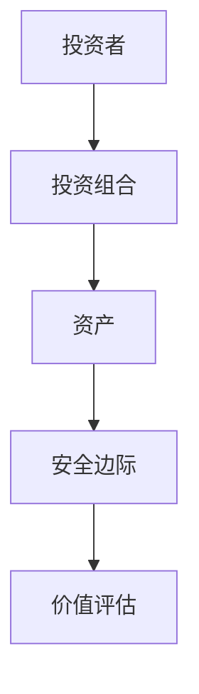
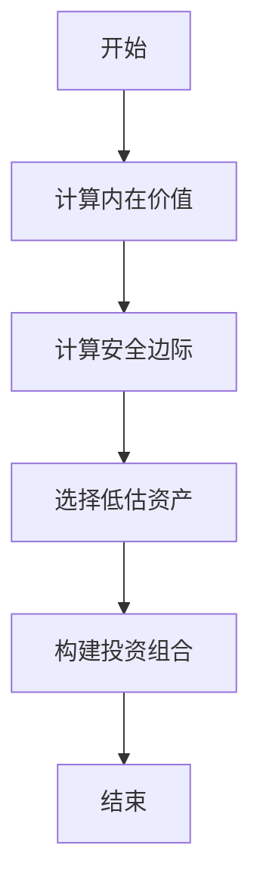
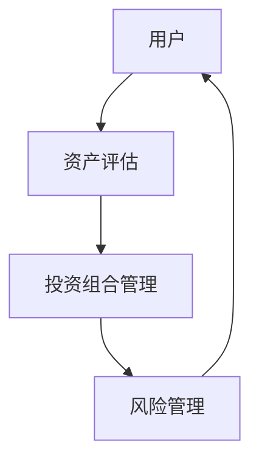
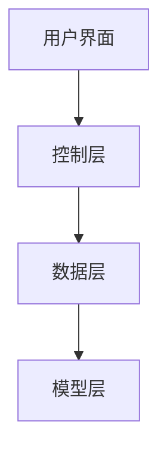
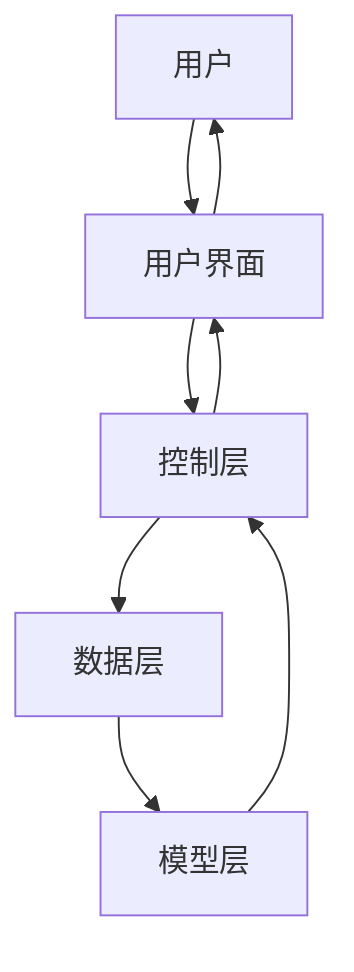

                 


# 格雷厄姆的防御型投资组合构建方法

## 关键词
防御型投资，安全边际，价值评估，投资组合管理，格雷厄姆，风险管理

## 摘要
本文详细介绍了格雷厄姆的防御型投资策略，探讨了其核心概念、算法原理、系统架构设计以及实战案例。通过分析安全边际、价值评估等关键要素，结合数学模型和系统设计，展示了如何构建一个稳健的投资组合。文章适合投资新手和专业投资者，旨在帮助读者在不确定的市场中实现长期稳健的收益。

---

# 第一部分: 防御型投资组合的背景与核心概念

## 第1章: 投资的基本概念

### 1.1 投资的基本原理

#### 1.1.1 资产配置与投资目标
资产配置是投资策略的核心，涉及将资金分配到不同资产类别（如股票、债券、房地产等）以实现风险分散和收益最大化。投资目标因人而异，可能是追求稳定收益、资本增值或短期流动性。

#### 1.1.2 风险与收益的平衡
投资的基本原理是收益与风险的权衡。高风险通常意味着高潜在收益，而低风险则对应相对稳定的回报。理解这种平衡是制定投资策略的关键。

#### 1.1.3 投资者心理与行为
投资者心理在投资决策中起着重要作用。常见心理偏差包括过度自信、从众心理和损失厌恶，这些因素可能导致非理性决策。

### 1.2 防御型投资的定义与特点

#### 1.2.1 防御型投资的定义
防御型投资是一种以稳健性和风险控制为核心的投资策略，旨在通过低估资产和安全边际保护投资者免受重大损失。

#### 1.2.2 防御型投资的核心特点
- 强调安全边际
- 侧重长期价值
- 低风险，高防御性
- 适合保守型投资者

#### 1.2.3 防御型投资与进攻型投资的区别
| 特性             | 防御型投资                 | 进攻型投资               |
|------------------|---------------------------|--------------------------|
| 风险偏好         | 低风险                   | 高风险                 |
| 收益目标         | 稳定收益                 | 高收益                 |
| 时间框架         | 长期                     | 短期或中期              |
| 适合场景         | 不确定性高的市场         | 稳定或上涨的市场         |

### 1.3 格雷厄姆的投资哲学

#### 1.3.1 格雷厄姆的生平与贡献
本杰明·格雷厄姆（Benjamin Graham）是价值投资之父，其著作《聪明的投资者》奠定了防御型投资的基础。

#### 1.3.2 格雷厄姆的投资理念
格雷厄姆强调安全边际和内在价值，主张以低于内在价值的价格买入资产，以降低风险并确保长期收益。

#### 1.3.3 格雷厄姆的安全边际理论
安全边际是资产市场价格与内在价值之间的差距，提供缓冲空间以应对市场波动和不确定性。

## 第2章: 防御型投资组合的核心概念

### 2.1 核心概念与联系

#### 2.1.1 安全边际的定义与计算
安全边际 = 市场价格 / 内在价值

#### 2.1.2 价值评估与市场定价
通过分析企业财务指标（如市盈率、市净率）进行价值评估，确定其内在价值是否被市场低估。

#### 2.1.3 风险调整后的收益
考虑风险因素后的真实收益，通常以夏普比率或最大回撤来衡量。

### 2.2 核心概念原理

#### 2.2.1 安全边际的数学模型
$$ 安全边际 = \frac{市场价格}{内在价值} $$

#### 2.2.2 价值评估的公式
$$ 内在价值 = \frac{预期现金流}{折现率} $$

### 2.3 核心概念对比表格

| 概念       | 定义                                                                 |
|------------|----------------------------------------------------------------------|
| 安全边际   | 市场价格与内在价值之间的差距，提供保护的缓冲区                     |
| 价值评估   | 对企业未来现金流的折现，计算其内在价值                           |

### 2.4 ER实体关系图


---

# 第二部分: 防御型投资组合的算法原理

## 第3章: 防御型投资组合的算法原理

### 3.1 算法原理讲解

#### 3.1.1 算法步骤
1. 计算资产的内在价值。
2. 计算安全边际。
3. 选择低估资产。
4. 构建投资组合。



### 3.2 数学公式与代码实现

#### 3.2.1 安全边际计算代码
```python
def calculate_margin(price, value):
    return price / value
```

#### 3.2.2 价值评估代码
```python
def calculate_intrinsic_value(cash_flows, discount_rate):
    return sum(cash_flows) / discount_rate
```

### 3.3 算法流程图


---

# 第三部分: 系统分析与架构设计

## 第4章: 系统分析与架构设计

### 4.1 项目介绍

#### 4.1.1 项目背景
构建一个基于格雷厄姆防御型投资策略的投资组合管理系统。

### 4.2 系统功能设计

#### 4.2.1 功能模块
- 用户管理
- 资产评估
- 投资组合管理
- 风险管理

#### 4.2.2 功能流程图


### 4.3 系统架构设计

#### 4.3.1 架构图


### 4.4 系统接口设计

#### 4.4.1 API接口
- `/api/users`：用户管理
- `/api/assets`：资产评估
- `/api/portfolio`：投资组合管理

### 4.5 系统交互流程图



---

# 第四部分: 项目实战

## 第5章: 项目实战

### 5.1 环境安装

#### 5.1.1 安装Python
```bash
python --version
pip install requests pandas numpy
```

### 5.2 核心代码实现

#### 5.2.1 计算内在价值
```python
def calculate_intrinsic_value(cash_flows, discount_rate):
    return sum(cash_flows) / discount_rate
```

#### 5.2.2 构建投资组合
```python
def build_portfolio/assets:
    portfolio = []
    for asset in assets:
        if calculate_margin(asset.price, asset.value) > 1.1:
            portfolio.append(asset)
    return portfolio
```

### 5.3 案例分析

#### 5.3.1 案例分析
假设某资产市场价格为$50，内在价值为$45，安全边际为11.1%，符合防御型投资标准。

### 5.4 详细解读

#### 5.4.1 投资组合选择
选择低估资产，计算其安全边际，并构建投资组合，定期进行再平衡。

---

# 第五部分: 最佳实践与总结

## 第6章: 最佳实践

### 6.1 小结

- 理解防御型投资的核心理念
- 选择低估资产
- 计算安全边际

### 6.2 注意事项

- 定期评估和再平衡
- 避免过度集中
- 耐心持有

### 6.3 未来展望

- 结合量化分析
- 利用人工智能优化投资组合

### 6.4 最佳实践总结

- 长期持有
- 分散投资
- 定期再平衡
- 定期审查和优化

---

# 总结

本文系统地介绍了格雷厄姆的防御型投资策略，从核心概念到系统设计，再到实战案例，为投资者提供了全面的指导。通过本文的学习，读者可以掌握构建稳健投资组合的方法，实现长期稳健的收益。

--- 

# END

