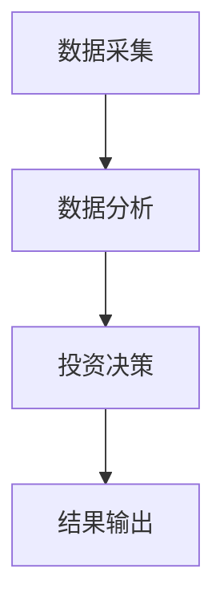
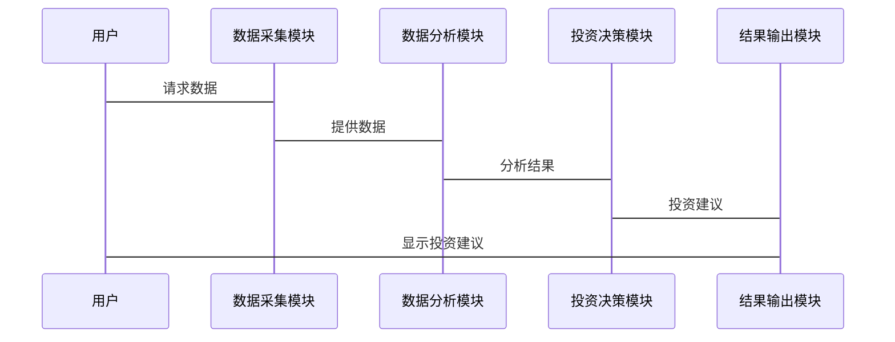

                 


# 格雷厄姆的防御型投资者策略：稳健致胜

## 关键词：
- 防御型投资
- 格雷厄姆
- 安全边际
- 投资策略
- 价值评估
- 稳健投资

## 摘要：
本文深入探讨了格雷厄姆的防御型投资策略，从其核心理念、数学模型到系统架构设计，结合实际案例，详细分析了如何通过稳健的投资方法实现长期收益。文章从技术角度出发，将投资策略与系统设计相结合，为读者提供了从理论到实践的全面指导。

---

## 第1章：格雷厄姆与防御型投资概述

### 1.1 格雷厄姆及其投资理念

#### 1.1.1 格雷厄姆的生平简介
 Benjamin Graham 是价值投资的鼻祖，被誉为“价值投资之父”。他出生于1894年，曾在哥伦比亚大学教授证券分析，并在金融领域有着深远的影响。他的投资理念强调安全性和稳健性，注重长期收益而非短期波动。

#### 1.1.2 格雷厄姆的价值投资理论
 格雷厄姆的价值投资理论强调以低于内在价值的价格买入优质资产。他认为市场的短期波动是不可预测的，但长期来看，资产的价格会回归其内在价值。

#### 1.1.3 防御型投资的核心思想
 防御型投资的核心思想是通过买入低估的资产，构建一个稳健的组合，以抵御市场波动的风险。格雷厄姆强调安全边际，即买入价格远低于内在价值，以确保即使市场波动，投资者也能获得正收益。

### 1.2 防御型投资的定义与特点

#### 1.2.1 防御型投资的定义
 防御型投资是一种以长期稳健收益为目标的投资策略，注重安全性和稳定性，避免高风险和高波动性。

#### 1.2.2 防御型投资的核心特点
 - 低风险：通过分散投资和买入低估资产降低风险。
 - 长期稳健：注重长期收益，而非短期波动。
 - 安全边际：买入价格远低于内在价值。

#### 1.2.3 防御型投资与进攻型投资的区别
 | 属性       | 防御型投资                   | 进攻型投资                   |
 |------------|----------------------------|----------------------------|
 | 风险偏好   | 低风险                       | 高风险                       |
 | 收益目标   | 稳健收益                     | 高收益                       |
 | 投资期限   | 长期                         | 短期                         |

### 1.3 防御型投资的适用场景

#### 1.3.1 稳定收益的需求
 防御型投资适合那些追求稳定收益的投资者，尤其是风险厌恶型投资者。

#### 1.3.2 风险厌恶型投资者
 对于那些无法承受高风险的投资者，防御型投资是一种理想的选择。

#### 1.3.3 长期稳健投资的目标
 防御型投资适合那些希望长期稳健增长的投资者，尤其是在市场波动较大的情况下。

---

## 第2章：防御型投资的核心策略

### 2.1 安全边际的概念与应用

#### 2.1.1 安全边际的定义
 安全边际是指买入价格与资产内在价值之间的差距。通过建立安全边际，投资者可以在市场波动时减少损失，确保稳健收益。

#### 2.1.2 安全边际的计算方法
 计算安全边际的公式为：
 $$ \text{安全边际} = \text{内在价值} - \text{市场价格} $$

#### 2.1.3 安全边际在投资决策中的作用
 安全边际是防御型投资的核心要素，通过确保买入价格远低于内在价值，投资者可以在市场下跌时减少损失，并在市场上涨时获得超额收益。

### 2.2 分散投资的原则

#### 2.2.1 分散投资的重要性
 分散投资可以降低特定资产的风险，通过投资多种资产或行业，减少组合波动性。

#### 2.2.2 分散投资的具体策略
 - 跨行业投资：避免将所有资金集中在单一行业。
 - 跨区域投资：分散投资于不同地区的资产。
 - 跨资产类别投资：同时投资股票、债券、房地产等多种资产。

#### 2.2.3 分散投资的风险控制
 通过分散投资，投资者可以降低非系统性风险，但无法完全消除系统性风险。因此，分散投资是防御型投资的重要策略之一。

### 2.3 价值评估的方法

#### 2.3.1 基本面分析的核心要素
 基本面分析包括对公司的财务状况、行业地位、盈利能力等的分析。

#### 2.3.2 市盈率与市净率的计算
 - 市盈率（P/E）：市盈率 = 股价 / 每股收益
 - 市净率（P/B）：市净率 = 股价 / 每股净资产

#### 2.3.3 内在价值的评估模型
 内在价值的计算公式为：
 $$ \text{内在价值} = \text{未来现金流的现值} $$

---

## 第3章：防御型投资的数学模型与算法

### 3.1 安全边际的数学模型

#### 3.1.1 安全边际的计算公式
 $$ \text{安全边际} = \text{内在价值} - \text{市场价格} $$

#### 3.1.2 安全边际系数的确定方法
 安全边际系数可以通过历史数据分析确定，通常取 10% 到 30% 之间。

### 3.2 价值评估的算法流程

#### 3.2.1 数据收集与处理
 收集目标公司的财务数据，包括收入、利润、现金流等。

#### 3.2.2 财务指标分析
 计算市盈率、市净率、股息率等指标，评估资产的内在价值。

#### 3.2.3 内在价值计算与比较
 使用现值模型计算内在价值，并与市场价格进行比较，确定安全边际。

---

## 第4章：防御型投资的系统架构设计

### 4.1 系统模块划分

#### 4.1.1 数据采集模块
 负责收集市场数据，包括股票价格、财务报表等。

#### 4.1.2 数据分析模块
 对收集的数据进行处理和分析，计算安全边际、市盈率等指标。

#### 4.1.3 投资决策模块
 根据分析结果，生成投资建议，包括买入、卖出或持有。

### 4.2 系统架构图


### 4.3 系统接口设计

#### 4.3.1 数据接口
 定义数据接口，与数据源（如股票交易所）进行数据交互。

#### 4.3.2 用户接口
 提供用户友好的界面，展示分析结果和投资建议。

### 4.4 系统交互流程图



---

## 第5章：防御型投资的项目实战

### 5.1 环境安装

#### 5.1.1 安装Python
 使用Python作为编程语言，安装Anaconda或Miniconda。

#### 5.1.2 安装数据采集库
 使用`requests`和`beautifulsoup4`进行数据采集。

#### 5.1.3 安装数据分析库
 使用`pandas`和`numpy`进行数据分析。

### 5.2 核心代码实现

#### 5.2.1 数据采集代码
```python
import requests
from bs4 import BeautifulSoup

url = "https://finance.yahoo.com/quote/AAPL"
response = requests.get(url)
soup = BeautifulSoup(response.text, 'html.parser')
price = soup.find('span', {'class': 'Trsdu(0.1s)'}).text
print(price)
```

#### 5.2.2 价值评估代码
```python
import pandas as pd
import numpy as np

def calculate_intrinsic_value(revenue, profit_margin, discount_rate):
    return revenue * profit_margin / (1 + discount_rate)

revenue = 1000000000
profit_margin = 0.1
discount_rate = 0.05

intrinsic_value = calculate_intrinsic_value(revenue, profit_margin, discount_rate)
print(intrinsic_value)
```

### 5.3 实际案例分析

#### 5.3.1 案例背景
 以苹果公司为例，分析其财务状况和市场表现。

#### 5.3.2 安全边际计算
 根据苹果公司的财务数据，计算其内在价值和安全边际。

#### 5.3.3 投资策略制定
 根据分析结果，制定买入、卖出或持有的投资策略。

### 5.4 项目小结

#### 5.4.1 项目成果
 成功构建了一个防御型投资的分析系统，能够自动采集数据、分析价值、制定投资策略。

#### 5.4.2 经验总结
 防御型投资需要结合理论与实践，通过系统化的方法实现稳健收益。

---

## 第6章：最佳实践与小结

### 6.1 小结

#### 6.1.1 核心要点总结
 - 理解格雷厄姆的防御型投资理念。
 - 掌握安全边际的计算方法。
 - 学习系统架构设计与实现。

#### 6.1.2 投资策略总结
 防御型投资是一种稳健的投资策略，适合长期稳健收益的目标。

### 6.2 注意事项

#### 6.2.1 风险提示
 防御型投资并不能完全消除风险，市场波动仍可能对投资组合产生影响。

#### 6.2.2 投资纪律
 投资者需要严格遵守投资纪律，避免情绪化决策。

### 6.3 未来展望

#### 6.3.1 技术发展
 随着人工智能和大数据技术的发展，防御型投资的分析方法将更加精准和高效。

#### 6.3.2 市场趋势
 防御型投资在市场波动加剧的情况下，将更加受到投资者的青睐。

### 6.4 拓展阅读

#### 6.4.1 推荐书籍
 - 《聪明的投资者》——本杰明·格雷厄姆
 - 《投资学》——查尔斯·埃利森

#### 6.4.2 推荐网站
 - Yahoo Finance：https://finance.yahoo.com
 - Google Finance：https://www.google.com/finance

---

## 总结

格雷厄姆的防御型投资策略是一种稳健的投资方法，通过安全边际、分散投资和价值评估，帮助投资者在市场波动中实现长期稳健收益。本文从技术角度出发，结合系统架构设计和实际案例，为投资者提供了从理论到实践的全面指导。希望本文能为读者在防御型投资领域提供有价值的参考和启示。

---

**作者：[您的名字]**

