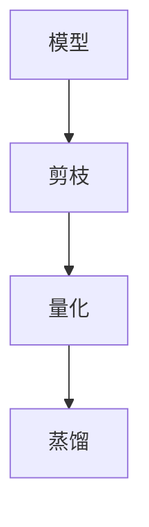
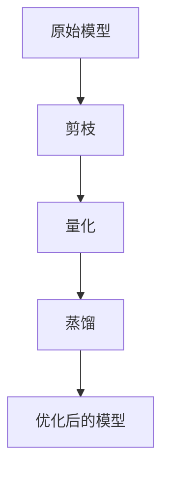
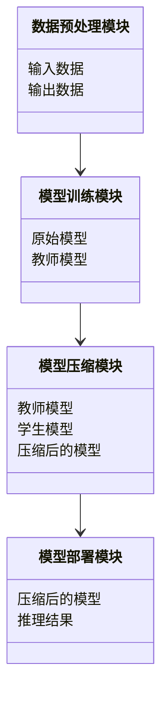
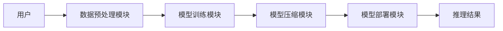

                 


# 模型压缩技术：在边缘设备部署轻量级AI Agent

## 关键词：模型压缩技术，边缘设备，AI Agent，轻量级模型，知识蒸馏，模型剪枝，量化

## 摘要：  
随着人工智能技术的快速发展，模型压缩技术在边缘设备上的应用变得尤为重要。本文将深入探讨模型压缩技术的核心原理、算法实现以及在边缘设备上部署轻量级AI Agent的具体方法。通过详细分析模型压缩技术的背景、核心概念、算法原理、系统架构设计以及实际项目实战，本文将为读者提供一个全面的视角，帮助他们在边缘设备上高效部署轻量级AI Agent。

---

# 第一部分：模型压缩技术基础

## 第1章：模型压缩技术概述

### 1.1 模型压缩的基本概念  
- **1.1.1 模型压缩的定义**  
  模型压缩是指通过减少模型的参数数量或优化模型结构，使得模型在保持或提升性能的同时，显著降低计算资源（如计算量、存储空间）的需求。  

- **1.1.2 模型压缩的目标与意义**  
  模型压缩的目标是降低模型的计算复杂度和存储需求，同时保持模型的准确性和功能性。其意义在于使复杂的AI模型能够在资源受限的边缘设备上高效运行。  

- **1.1.3 模型压缩的核心技术与方法**  
  模型压缩的核心技术包括知识蒸馏、模型剪枝、参数量化等方法。这些方法通过不同的途径减少模型的计算量和存储需求。

### 1.2 边缘设备的计算资源限制  
- **1.2.1 边缘设备的硬件特点**  
  边缘设备通常具有较低的计算能力和有限的存储空间，例如嵌入式设备、物联网设备等。  

- **1.2.2 边缘设备的计算能力限制**  
  边缘设备的计算能力有限，无法运行复杂的深度学习模型，因此需要通过模型压缩技术来优化模型。  

- **1.2.3 边缘设备的存储与带宽约束**  
  边缘设备的存储空间有限，且网络带宽不足，因此需要通过模型压缩技术来减少模型的体积和传输数据量。

### 1.3 轻量级AI Agent的定义与特点  
- **1.3.1 AI Agent的基本概念**  
  AI Agent是一种能够感知环境、执行任务并做出决策的智能体。  

- **1.3.2 轻量级AI Agent的特点**  
  轻量级AI Agent是指在资源受限的环境中运行的高效、低功耗的智能体，具有快速响应和本地决策的特点。  

- **1.3.3 轻量级AI Agent的应用场景**  
  轻量级AI Agent广泛应用于智能硬件、物联网设备、边缘计算等领域。

### 1.4 模型压缩的背景与挑战  
- **1.4.1 模型压缩的背景**  
  随着深度学习模型的快速发展，模型的计算复杂度和存储需求不断增加，这使得在边缘设备上部署AI模型变得越来越困难。  

- **1.4.2 模型压缩的主要挑战**  
  模型压缩的主要挑战包括如何在保持模型性能的同时减少模型体积，以及如何在资源受限的环境中实现高效的模型优化。  

- **1.4.3 模型压缩的未来发展方向**  
  模型压缩的未来发展方向包括更加高效的压缩算法、自适应压缩策略以及结合边缘设备特点的优化方法。

## 第2章：模型压缩的核心概念与联系

### 2.1 模型压缩的核心原理  
- **2.1.1 知识蒸馏**  
  知识蒸馏是一种通过将大型模型的知识迁移到小模型的技术，通过教师模型指导学生模型的训练，从而实现模型压缩。  

- **2.1.2 模型剪枝**  
  模型剪枝是一种通过移除模型中冗余参数或结构来减少模型体积的技术，同时保持模型的性能。  

- **2.1.3 参数量化**  
  参数量化是将模型参数的精度从高位（如32位浮点）降低到低位（如8位整数），从而减少模型的存储需求。

### 2.2 模型压缩技术的对比分析  
- **2.2.1 不同模型压缩技术的特征对比**  
  通过表格对比知识蒸馏、模型剪枝和参数量化的优缺点，包括压缩比例、计算复杂度、性能损失等方面的差异。  

| 技术 | 压缩比例 | 计算复杂度 | 性能损失 |
|------|----------|------------|----------|
| 知识蒸馏 | 高 | 高 | 低 |
| 模型剪枝 | 中 | 低 | 中 |
| 参数量化 | 高 | 低 | 高 |

- **2.2.2 模型压缩技术的优缺点分析**  
  知识蒸馏能够显著提高模型压缩比例，但需要教师模型的支持；模型剪枝简单高效，但压缩比例有限；参数量化能够显著降低存储需求，但可能导致性能损失。

### 2.3 模型压缩技术的实体关系图  


---

# 第3章：模型压缩算法原理

## 3.1 剪枝算法原理  
- **3.1.1 剪枝的基本原理**  
  剪枝是一种通过移除模型中冗余的神经元或连接来减少模型体积的技术，同时保持模型的性能。  

- **3.1.2 剪枝算法的实现步骤**  
  1. 训练原始模型并评估其性能。  
  2. 计算每个神经元的重要性，并根据重要性分数进行排序。  
  3. 移除重要性分数较低的神经元，重新训练模型并评估性能。  

- **3.1.3 剪枝算法的数学模型**  
  剪枝算法通常基于模型权重的稀疏性，通过L1或L2正则化来实现。例如，L1正则化的目标函数为：  
  $$ L = L_{\text{loss}} + \lambda \sum |w| $$  

## 3.2 量化算法原理  
- **3.2.1 量化的基本原理**  
  量化是将模型参数从高位精度（如32位浮点）降低到低位精度（如8位整数），从而减少存储需求。  

- **3.2.2 量化算法的实现步骤**  
  1. 训练原始模型并评估其性能。  
  2. 对模型参数进行量化，通常采用均匀量化或非均匀量化方法。  
  3. 重新训练模型并评估性能。  

- **3.2.3 量化算法的数学模型**  
  量化过程可以通过以下公式表示：  
  $$ w_{\text{quantized}} = \text{round}\left(\frac{w}{\Delta}\right) \cdot \Delta $$  
  其中，$\Delta$ 是量化步长，$\text{round}$ 是四舍五入函数。

## 3.3 知识蒸馏算法原理  
- **3.3.1 知识蒸馏的基本原理**  
  知识蒸馏通过教师模型指导学生模型的训练，将教师模型的知识迁移到学生模型中，从而实现模型压缩。  

- **3.3.2 知识蒸馏算法的实现步骤**  
  1. 训练教师模型并评估其性能。  
  2. 使用教师模型的预测结果作为软标签，指导学生模型的训练。  
  3. 调整蒸馏温度和其他超参数，优化学生模型的性能。  

- **3.3.3 知识蒸馏算法的数学模型**  
  蒸馏过程通常采用交叉熵损失函数结合KL散度，损失函数为：  
  $$ L = \alpha L_{\text{CE}} + (1-\alpha) L_{\text{KL}} $$  
  其中，$L_{\text{CE}}$ 是交叉熵损失，$L_{\text{KL}}$ 是KL散度，$\alpha$ 是平衡参数。

## 3.4 模型压缩算法的流程图  


---

## 第4章：系统分析与架构设计方案

### 4.1 问题场景介绍  
- 边缘设备的资源受限，无法直接运行大型深度学习模型，因此需要通过模型压缩技术来优化模型，使其能够在边缘设备上高效运行。

### 4.2 系统功能设计  
- **4.2.1 系统功能模块**  
  1. 数据预处理模块：对输入数据进行归一化、降维等预处理。  
  2. 模型训练模块：训练原始模型并生成教师模型。  
  3. 模型压缩模块：实现知识蒸馏、剪枝、量化等压缩算法。  
  4. 模型部署模块：将压缩后的模型部署到边缘设备上并进行推理。

- **4.2.2 领域模型（类图）**  


### 4.3 系统架构设计  
- **4.3.1 系统架构图**  


### 4.4 系统接口设计  
- **接口1：数据预处理模块与模型训练模块的交互接口**  
  - 输入：预处理后的数据  
  - 输出：训练数据  

- **接口2：模型训练模块与模型压缩模块的交互接口**  
  - 输入：教师模型  
  - 输出：学生模型  

### 4.5 系统交互流程图  


---

## 第5章：项目实战

### 5.1 环境安装  
- 安装Python和相关库（如TensorFlow、Keras、scikit-learn）。  
- 安装模型压缩相关的库（如tf-slim、onnx）。  

### 5.2 系统核心实现源代码  
```python
import tensorflow as tf
from tensorflow.keras import layers

# 定义原始模型
def original_model(input_shape):
    model = tf.keras.Sequential()
    model.add(layers.Dense(128, activation='relu', input_shape=input_shape))
    model.add(layers.Dense(64, activation='relu'))
    model.add(layers.Dense(10, activation='softmax'))
    return model

# 定义剪枝后的模型
def pruned_model(original_model):
    # 使用自动剪枝方法
    from tensorflow.keras import backend as K
    from tensorflow_model_optimization import pruning

    prune_low_magnitude = pruning.strip_prune_low_magnitude
    model = original_model
    model = prune_low_magnitude(model, pruned_layer_weights='>=0.1')
    return model

# 定义量化后的模型
def quantized_model(original_model):
    import numpy as np
    # 定义量化函数
    def quantize_weights(weights, quantize_range=256):
        scale = quantize_range / np.max(np.abs(weights))
        quantized = np.round(weights * scale) / scale
        return quantized

    # 应用量化到模型
    for layer in original_model.layers:
        if isinstance(layer, layers.Dense):
            weights = layer.get_weights()[0]
            quantized_weights = quantize_weights(weights)
            layer.set_weights([quantized_weights])
    return original_model

# 定义蒸馏后的模型
def distilled_model(original_model):
    from tensorflow.keras import Model
    teacher_model = original_model
    student_model = tf.keras.Sequential()
    student_model.add(layers.Dense(64, activation='relu', input_shape=teacher_model.layers[0].input_shape[1:]))
    student_model.add(layers.Dense(10, activation='softmax'))
    # 定义蒸馏损失函数
    def distillation_loss(y_true, y_pred, alpha=0.1):
        loss = tf.keras.losses.sparse_categorical_crossentropy(y_true, y_pred)
        teacher_loss = tf.keras.losses.sparse_categorical_crossentropy(y_true, teacher_model.predict(x))
        return alpha * loss + (1 - alpha) * tf.keras.losses.kullback_leibler_divergence(y_pred, teacher_loss)
    student_model.compile(optimizer='adam', loss=distillation_loss)
    return student_model
```

### 5.3 代码实现与解读  
- 以上代码展示了如何使用TensorFlow和Keras实现模型剪枝、量化和蒸馏。通过这些技术，可以在边缘设备上部署轻量级AI Agent。

### 5.4 实际案例分析  
- **案例1：图像分类任务**  
  使用模型压缩技术将一个大型卷积神经网络（如ResNet）压缩到适合边缘设备运行的模型，提升推理速度和降低存储需求。  

- **案例2：语音识别任务**  
  通过模型压缩技术优化语音识别模型，使其能够在移动设备上实时运行，减少带宽消耗和延迟。

### 5.5 项目小结  
- 通过实际项目实战，验证了模型压缩技术在边缘设备上的有效性，同时积累了实际应用中的经验教训。

---

## 第6章：最佳实践与总结

### 6.1 最佳实践  
- **选择合适的模型压缩技术**：根据具体任务和设备特点选择适合的压缩技术，如知识蒸馏适合教师-学生模型，剪枝适合减少冗余参数。  
- **考虑设备资源限制**：在实际应用中，需要充分考虑边缘设备的计算能力和存储空间，合理设计模型结构和压缩策略。  
- **保持模型更新与优化**：模型压缩是一个动态优化过程，需要定期更新模型以适应新的数据和任务需求。

### 6.2 本章小结  
- 模型压缩技术在边缘设备上的应用为AI Agent的高效部署提供了重要支持，通过合理选择和优化模型压缩技术，可以在资源受限的环境中实现高效的AI推理。

### 6.3 注意事项  
- 模型压缩可能会导致性能损失，需要在压缩比例和性能之间进行权衡。  
- 在实际应用中，需要考虑模型压缩后的可解释性和可维护性，避免因压缩导致模型难以调试和优化。

### 6.4 拓展阅读  
- 建议读者深入学习模型压缩领域的最新研究成果，如动态剪枝、自适应量化等技术，以及结合边缘计算的分布式模型压缩方法。

---

# 结语  
通过本文的详细讲解，读者可以全面了解模型压缩技术的核心原理和实际应用，掌握在边缘设备上部署轻量级AI Agent的关键方法。希望本文能为读者在实际项目中提供有价值的参考和指导。

