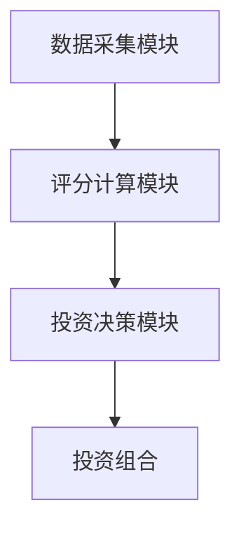

                 

# 比尔·米勒的价值增长投资：bridging value and growth

## 关键词：价值投资、成长投资、比尔·米勒、桥梁理论、数学模型、投资系统、案例分析

## 摘要：比尔·米勒以其独特的投资理念闻名，他成功地将价值投资和成长投资结合起来，创造了“桥梁理论”。本文将详细介绍价值投资和成长投资的基本原理，分析比尔·米勒的桥梁理论，探讨其数学模型和系统设计，并通过实际案例展示如何在投资中应用这些理论。最后，我们将总结最佳实践和未来投资趋势。

---

# 第一部分：引言

## 第1章：引言

### 1.1 价值投资与成长投资的背景

#### 1.1.1 投资的基本概念与分类

投资是指将资金投入到某个项目或资产中，以期望在未来获得收益或资本增值的行为。投资可以分为多种类型，包括股票、债券、房地产、货币市场工具等。在股票投资领域，主要有两种主要策略：价值投资和成长投资。

#### 1.1.2 价值投资与成长投资的定义

价值投资是一种以低于其内在价值的价格购买优质股票的投资策略，核心在于寻找被市场低估的公司。其创始人本杰明·格雷厄姆强调安全边际和对公司基本面的深入分析。成长投资则关注于投资那些具有高增长潜力的公司，即使其当前价格较高，但预期未来会有显著的收益增长。

#### 1.1.3 比尔·米勒的投资理念

比尔·米勒是美国著名投资经理，曾管理过富达麦哲伦基金，创造了连续15年跑赢市场的纪录。他的投资理念强调将价值投资和成长投资相结合，寻找那些既有增长潜力又价格合理的公司。

#### 1.1.4 价值投资与成长投资的优缺点

- 价值投资的优点：注重安全边际，风险较低，适合长期稳健的投资。
- 价值投资的缺点：可能会错过一些高速成长的机会。
- 成长投资的优点：预期收益高，适合长期高增长的投资者。
- 成长投资的缺点：风险较高，波动性大。

#### 1.1.5 比尔·米勒的桥梁理论

比尔·米勒提出的桥梁理论试图在价值投资和成长投资之间架起一座桥梁，通过综合考虑公司的基本面和成长性，找到两者之间的平衡点，从而实现长期稳定的收益。

### 1.2 价值与成长投资的结合

#### 1.2.1 价值与成长投资的优缺点

价值投资注重安全边际，而成长投资注重增长潜力。两者的结合可以在风险和收益之间找到更好的平衡。

#### 1.2.2 比尔·米勒的桥梁理论

桥梁理论通过综合评估公司的内在价值和成长潜力，寻找那些既有合理估值又有良好增长前景的公司。

#### 1.2.3 本书的核心目标

本书旨在通过分析比尔·米勒的投资策略，帮助读者理解如何将价值投资和成长投资相结合，构建一个稳健的投资组合。

#### 1.2.4 本书的章节安排

本书分为几个部分：引言、价值投资与成长投资的理论基础、桥梁理论的数学模型、系统设计与实现、案例分析和总结。

---

# 第二部分：价值与成长投资的理论基础

## 第2章：价值投资的核心原理

### 2.1 价值投资的基本概念

#### 2.1.1 价值投资的定义

价值投资是一种以低于其内在价值的价格购买股票的投资策略。其核心在于寻找市场低估的公司。

#### 2.1.2 价值投资的三大原则

- 安全边际：购买价格低于内在价值，以提供足够的安全空间。
- 企业基本面分析：深入分析公司的财务状况、行业地位和盈利能力。
- 长期持有：耐心持有优质股票，等待其价值回归。

#### 2.1.3 价值投资的适用场景

适用于市场低迷时期或周期性低谷时，寻找被低估的公司。

### 2.2 价值投资的关键指标

#### 2.2.1 市盈率（P/E）

市盈率=股票价格/每股净利润。

#### 2.2.2 市净率（P/B）

市净率=股票价格/每股净资产。

#### 2.2.3 股息率（Dividend Yield）

股息率=每股股息/股票价格。

### 2.3 价值投资的选股策略

#### 2.3.1 寻找被低估的股票

通过比较市盈率、市净率等指标，寻找低于行业平均水平的股票。

#### 2.3.2 分析公司基本面

关注公司的盈利能力、财务健康状况和行业地位。

#### 2.3.3 长期持有与耐心等待

价值投资强调长期持有，避免频繁交易。

---

## 第3章：成长投资的核心原理

### 3.1 成长投资的基本概念

#### 3.1.1 成长投资的定义

成长投资是一种投资于具有高增长潜力的公司的策略，通常以较高的市盈率为代价，以期望未来收益的高增长。

#### 3.1.2 成长投资的三大原则

- 寻找高增长潜力：关注营业收入和净利润的高增长率。
- 行业前景分析：选择处于高增长行业的公司。
- 中长期持有：等待公司成长带来的股价上涨。

#### 3.1.3 成长投资的适用场景

适用于新兴行业或经济高速增长时期，寻找高增长潜力的公司。

### 3.2 成长投资的关键指标

#### 3.2.1 市盈率（P/E）

市盈率=股票价格/每股净利润。

#### 3.2.2 市净率（P/B）

市净率=股票价格/每股净资产。

#### 3.2.3 营业收入增长率（Revenue Growth）

营业收入增长率=（本年营业收入-去年营业收入）/去年营业收入。

### 3.3 成长投资的选股策略

#### 3.3.1 寻找高成长性的股票

通过分析营业收入增长率、净利润增长率等指标，寻找具有持续增长潜力的公司。

#### 3.3.2 分析公司成长潜力

关注公司的研发能力、市场地位和行业前景。

#### 3.3.3 中长期持有与持续跟踪

成长投资强调中长期持有，同时持续跟踪公司成长情况。

---

# 第三部分：价值与成长投资的桥梁理论

## 第4章：比尔·米勒的桥梁理论

### 4.1 桥梁理论的提出

#### 4.1.1 桥梁理论的背景

价值投资和成长投资各有优缺点，如何在两者之间找到平衡点，是投资中的一个重要问题。

#### 4.1.2 桥梁理论的核心观点

通过综合评估公司的内在价值和成长潜力，寻找两者之间的平衡点。

#### 4.1.3 桥梁理论的数学模型

桥梁理论的数学模型包括价值评分和成长评分，通过加权平均得到综合评分。

### 4.2 桥梁理论的数学模型

#### 4.2.1 价值与成长的综合评分公式

综合评分 = α × 价值评分 + β × 成长评分

其中，α和β是权重系数，通常α + β = 1。

#### 4.2.2 投资组合优化的数学模型

目标函数：最大化预期收益 - 风险调整后的成本

约束条件：投资组合的总权重为1，且每个资产的权重在0到1之间。

#### 4.2.3 风险与收益的平衡方程

风险调整后的收益 = 收益 - 风险 × 风险调整系数

---

### 4.3 桥梁理论的应用

#### 4.3.1 价值与成长的动态平衡

根据市场环境的变化，动态调整α和β的权重。

#### 4.3.2 不同市场环境下的策略调整

在牛市中，增加成长投资的比例；在熊市中，增加价值投资的比例。

#### 4.3.3 长期与短期投资的结合

通过短期调整和长期持有的结合，实现收益的最大化。

---

## 第5章：桥梁理论的系统分析

### 5.1 投资系统架构

#### 5.1.1 系统目标与范围

设计一个能够综合评估价值和成长潜力的投资系统。

#### 5.1.2 系统功能模块

- 数据采集模块：收集公司基本面数据。
- 评分计算模块：计算价值评分和成长评分。
- 投资决策模块：根据评分结果，生成投资组合。

#### 5.1.3 系统架构图

### 5.2 系统功能设计

#### 5.2.1 价值与成长评分模块

- 价值评分：基于市盈率、市净率等指标。
- 成长评分：基于营业收入增长率、净利润增长率等指标。

#### 5.2.2 投资组合优化模块

- 根据评分结果，优化投资组合，确定各资产的权重。

#### 5.2.3 系统接口设计

- 数据接口：与数据源对接，获取公司基本面数据。
- 投资组合接口：输出优化后的投资组合。

---

## 第6章：桥梁理论的案例分析

### 6.1 案例背景

选取几家典型公司，分析如何应用桥梁理论进行投资决策。

### 6.2 案例分析

#### 6.2.1 公司A

价值评分：80，成长评分：70，综合评分：75。

#### 6.2.2 公司B

价值评分：60，成长评分：80，综合评分：70。

### 6.3 案例总结

通过综合评分，可以选择综合评分较高的公司进行投资。

---

# 第四部分：价值与成长投资的实战技巧

## 第7章：实战技巧与注意事项

### 7.1 投资组合的构建

根据桥梁理论，构建一个综合考虑价值和成长的投资组合。

### 7.2 风险管理

设定止损点，控制投资风险。

### 7.3 持续学习与调整

根据市场变化，持续学习和调整投资策略。

---

## 第8章：总结与展望

### 8.1 本书总结

通过桥梁理论，可以在价值投资和成长投资之间找到平衡点，实现稳健的投资收益。

### 8.2 未来展望

随着市场环境的变化，桥梁理论需要不断优化和调整，以适应新的投资需求。

---

# 结语

通过本文的详细讲解，读者可以更好地理解比尔·米勒的价值增长投资策略，并将其应用到实际投资中。希望本文能为投资者提供有价值的参考和启发。

