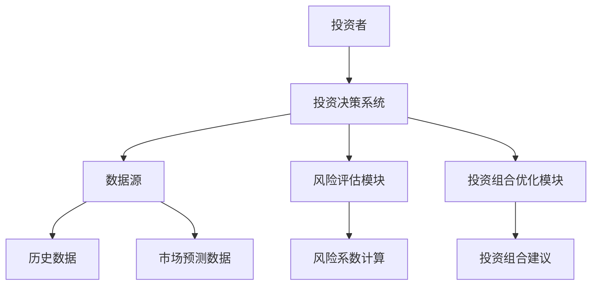
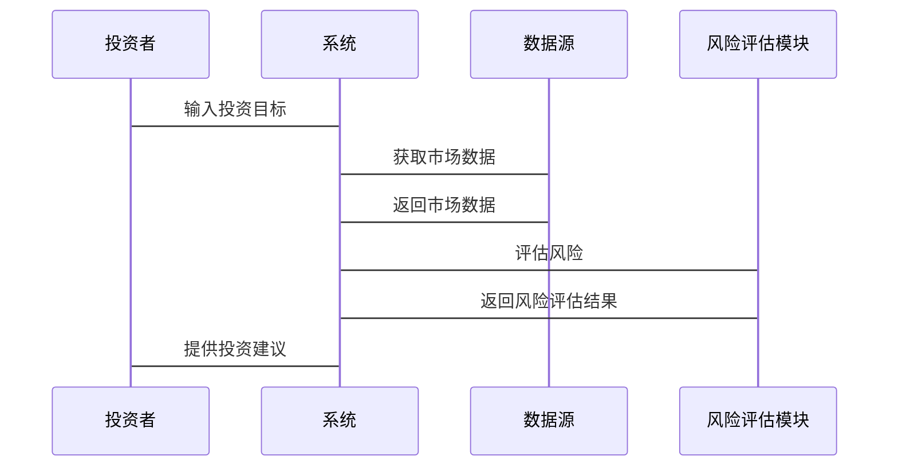

                 


## 第三部分: 项目实战与系统实现

### 第4章: 项目实战: 太阳能投资分析系统

#### 4.1 系统环境与工具安装

##### 4.1.1 开发环境配置
###### 操作系统要求
- 建议使用: Linux (Ubuntu 20.04+) / Windows 10+
- 开发工具: Python 3.8+, Jupyter Notebook, VS Code

###### 安装依赖包
```bash
pip install numpy pandas matplotlib seaborn
```

##### 4.1.2 数据源获取
###### 数据来源
- 历史能源数据: 可从政府能源机构或国际能源署获取
- 股票数据: Yahoo Finance API 或其他金融数据源

#### 4.2 系统核心代码实现

##### 4.2.1 数据预处理与清洗
###### 数据加载与处理代码
```python
import pandas as pd
import numpy as np

# 加载数据
solar_data = pd.read_csv('solar_energy.csv')
stock_data = pd.read_csv('巴菲特投资组合.csv')

# 数据清洗
solar_data.dropna(inplace=True)
stock_data.dropna(inplace=True)
```

##### 4.2.2 投资回报率计算
###### 投资回报率计算代码
```python
def calculate_return(data, period):
    return data.pct_change(period).cumprod().dropna()
```

##### 4.2.3 风险评估与分析
###### 风险系数计算代码
```python
import matplotlib.pyplot as plt

def plot_risk_analysis(risk_scores):
    plt.figure(figsize=(10, 6))
    plt.hist(risk_scores, bins=20, alpha=0.7)
    plt.title('风险系数分布')
    plt.xlabel('风险系数')
    plt.ylabel('频数')
    plt.show()
```

#### 4.3 系统架构设计

##### 4.3.1 系统架构图


#### 4.4 系统交互流程

##### 4.4.1 交互流程图


#### 4.5 系统实现小结

## 第五部分: 最佳实践与总结

### 第5章: 最佳实践与小结

#### 5.1 投资策略的关键点
- **长期持有**：耐心持有优质资产，避免频繁交易
- **价值投资**：关注企业内在价值，而非短期市场波动
- **风险管理**：量化风险，分散投资以降低整体风险

#### 5.2 小结

#### 5.3 注意事项
- **数据质量**：确保数据来源可靠，处理数据时需谨慎
- **模型假设**：投资模型基于假设，实际操作需根据市场变化调整
- **市场风险**：保持对市场的敏感性，及时调整投资策略

#### 5.4 拓展阅读
- 建议阅读书籍：《巴菲特投资思想的现代诠释》、《投资学原理》
- 推荐学习资源：QuantInsti 的《量化投资基础》在线课程

---

通过以上结构，文章将系统地探讨沃伦·巴菲特的太阳能投资理念，结合技术分析和数学建模，为读者提供一个全面而深入的分析框架。

