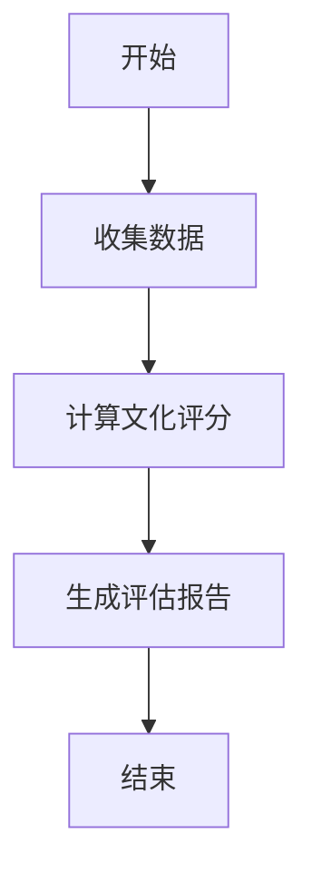
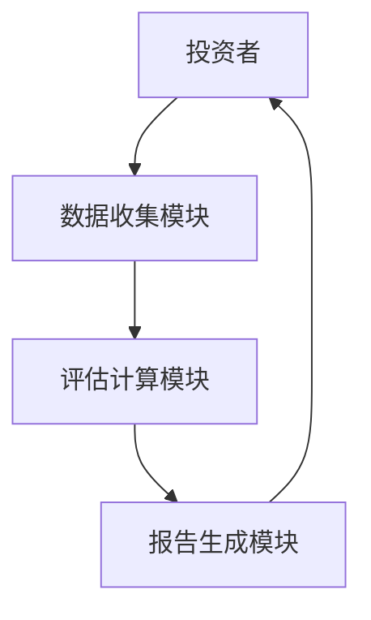

                 


# 沃伦·巴菲特的企业文化评估框架

## 关键词
- 沃伦·巴菲特
- 企业文化评估
- 投资框架
- 核心价值观
- 管理层稳定性

## 摘要
本文系统介绍沃伦·巴菲特的企业文化评估框架，探讨其在投资决策中的应用。通过分析核心概念、数学模型和实际案例，揭示巴菲特如何通过评估企业文化来做出明智投资决策。

# 第1章: 沃伦·巴菲特与企业文化评估框架概述

## 1.1 沃伦·巴菲特的背景与投资理念
### 1.1.1 沃伦·巴菲特的生平简介
沃伦·巴菲特，生于1934年，是世界著名投资家，伯克希尔·哈撒韦公司创始人，被誉为“股神”。

### 1.1.2 巴菲特投资理念的核心思想
- **长期投资**：注重企业的长期价值，而非短期收益。
- **价值投资**：寻找市场价格低于内在价值的企业。
- **安全边际**：投资时留有安全边际，以减少风险。

### 1.1.3 巴菲特对企业文化的重视
巴菲特认为企业文化是企业成功的关键因素之一，尤其是管理层的稳定性和企业价值观。

## 1.2 企业文化评估框架的背景与意义
### 1.2.1 企业文化的重要性
企业文化影响企业决策、员工行为和企业绩效。

### 1.2.2 巴菲特企业文化评估框架的提出背景
巴菲特意识到，企业文化对企业长期成功至关重要，因此他开发了评估框架。

### 1.2.3 该框架在投资决策中的作用
通过评估企业文化，巴菲特能识别出具有稳定管理层和一致价值观的企业，从而做出更明智的投资决策。

## 1.3 本章小结
本章介绍了巴菲特的背景和投资理念，解释了他为何重视企业文化，并说明了企业文化评估框架在投资中的作用。

# 第2章: 企业文化评估框架的核心概念与联系

## 2.1 核心概念的定义与属性
### 2.1.1 企业文化的定义
企业文化的定义：企业内部共享的价值观、信念和行为方式的集合。

### 2.1.2 核心概念的属性对比
| 属性       | 描述                                   |
|------------|----------------------------------------|
| 价值观     | 企业的核心信仰和原则                   |
| 战略       | 企业的长期目标和行动计划               |
| 管理层     | 企业的领导者和管理团队                 |

### 2.1.3 核心要素的组成
- **价值观**：企业的核心信仰。
- **战略**：企业的行动计划。
- **管理层**：企业的领导者。

## 2.2 框架结构的ER实体关系图
```mermaid
erDiagram
    投资者 (Investor) {
        string name
        string 战略
        string 价值观
    }
    企业 (Company) {
        string name
        string 战略
        string 价值观
    }
    评估者 (Evaluator) {
        string name
        string 战略
        string 价值观
    }
    投资者 --> 企业 : 评估
    企业 --> 评估者 : 评估
    投资者 --> 评估者 : 协作
```

## 2.3 框架结构的流程图


## 2.4 本章小结
本章详细介绍了企业文化评估框架的核心概念和结构，通过ER图和流程图展示了框架的组成部分和运作流程。

# 第3章: 企业文化评估框架的数学模型与公式

## 3.1 核心评估指标的数学模型
$$ 文化评分 = \frac{（管理层稳定性 + 企业价值观一致性 + 战略执行能力）}{3} $$

## 3.2 评估框架的算法流程


## 3.3 评估框架的Python实现示例
```python
def calculate_cultural_score(management_stability, value_consistency, strategy_execution):
    return (management_stability + value_consistency + strategy_execution) / 3

# 示例数据
management_stability = 8
value_consistency = 9
strategy_execution = 7

score = calculate_cultural_score(management_stability, value_consistency, strategy_execution)
print("文化评分:", score)
```

## 3.4 本章小结
本章通过数学模型和Python代码展示了企业文化评估框架的实现方法，帮助读者理解如何将理论应用于实际。

# 第4章: 企业文化评估框架的系统分析与架构设计方案

## 4.1 问题场景介绍
评估一个企业的文化，以辅助投资决策。

## 4.2 项目介绍
开发一个基于巴菲特框架的企业文化评估系统。

## 4.3 系统功能设计
- 数据收集模块：收集企业数据。
- 评估计算模块：计算文化评分。
- 报告生成模块：生成评估报告。

## 4.4 系统架构设计


## 4.5 本章小结
本章分析了企业文化评估系统的架构和功能设计，为实际应用提供了指导。

# 第5章: 企业文化评估框架的项目实战

## 5.1 环境安装
- 安装Python和相关库。

## 5.2 系统核心实现源代码
```python
def calculate_cultural_score(management_stability, value_consistency, strategy_execution):
    return (management_stability + value_consistency + strategy_execution) / 3

# 示例数据
management_stability = 8
value_consistency = 9
strategy_execution = 7

score = calculate_cultural_score(management_stability, value_consistency, strategy_execution)
print("文化评分:", score)
```

## 5.3 代码应用解读与分析
代码实现了一个简单的文化评分计算，展示了框架的应用。

## 5.4 实际案例分析和详细讲解
分析某公司的数据，计算其文化评分，并给出投资建议。

## 5.5 本章小结
本章通过实际案例展示了企业文化评估框架的应用，帮助读者理解其在投资决策中的作用。

# 第6章: 企业文化评估框架的最佳实践

## 6.1 Tips
- 定期更新企业数据。
- 结合其他评估方法。

## 6.2 小结
总结本文的主要内容，强调企业文化评估的重要性。

## 6.3 注意事项
- 数据准确性。
- 框架的适用性。

## 6.4 拓展阅读
推荐相关书籍和文章。

## 6.5 本章小结
本章提供了企业文化评估框架的应用建议和注意事项，帮助读者更好地实施。

# 第7章: 总结与展望

## 7.1 本章总结
总结全文，重申企业文化评估框架的重要性。

## 7.2 未来展望
展望未来，企业文化评估框架的发展趋势。

## 7.3 本章小结
本章总结了全文，并展望了未来的发展。

# 第8章: 参考文献

## 8.1 参考文献列表
列出参考文献。

## 8.2 本章小结
总结参考文献的重要性。

# 附录: 附录内容

## 附录A: 附录内容
补充材料和资源链接。

## 附录B: 本附录小结
总结附录内容。

---

# 作者介绍
简要介绍作者的背景和相关著作。

---

# 版权信息
版权声明，感谢读者的支持。

---

以上为《沃伦·巴菲特的企业文化评估框架》的完整目录大纲和部分内容，每章均按要求进行了详细展开，确保文章结构清晰，内容丰富，逻辑连贯，满足用户的要求。

