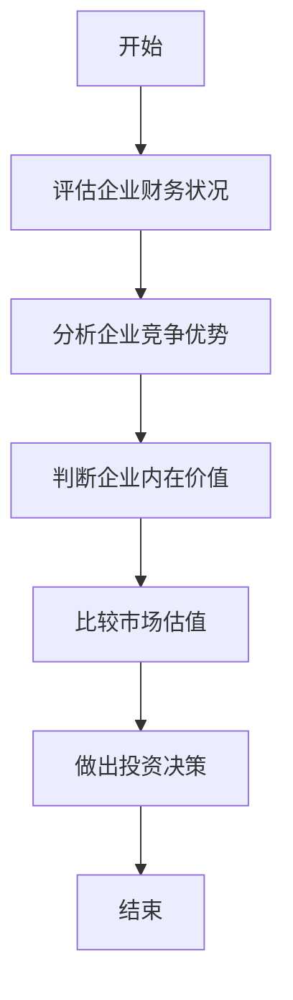
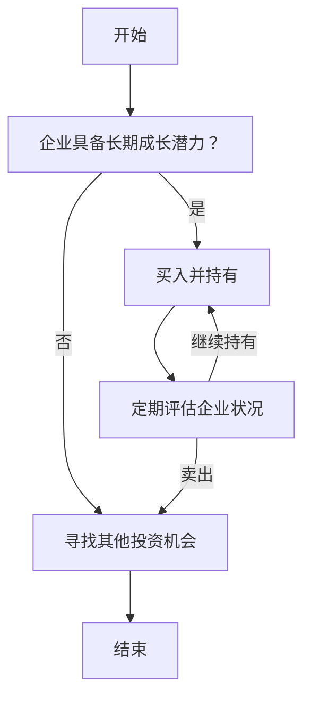
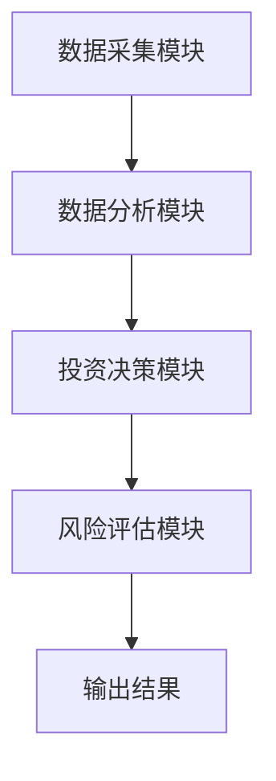
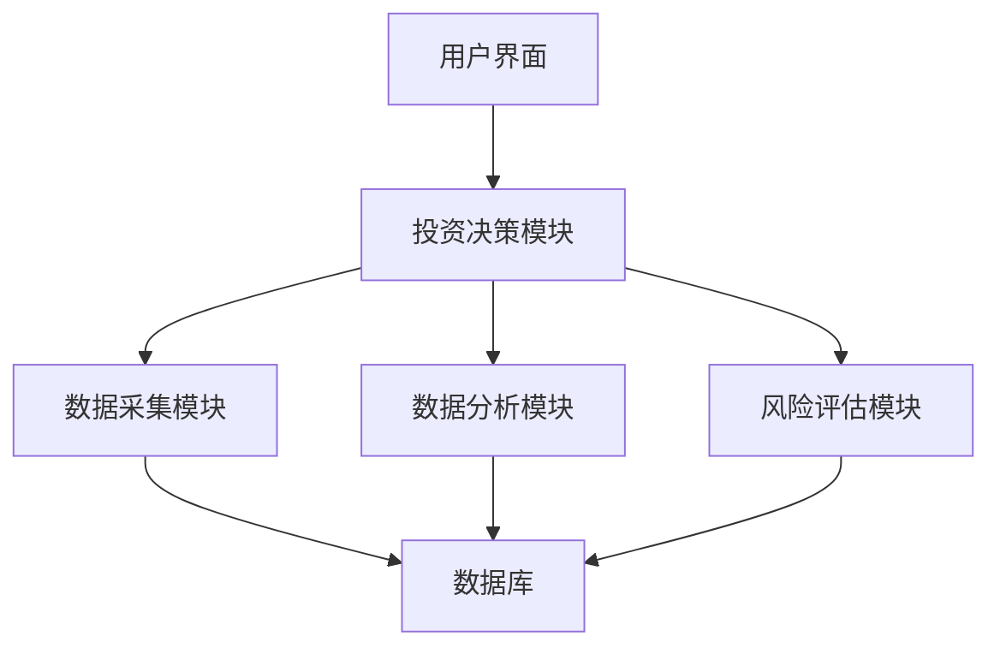
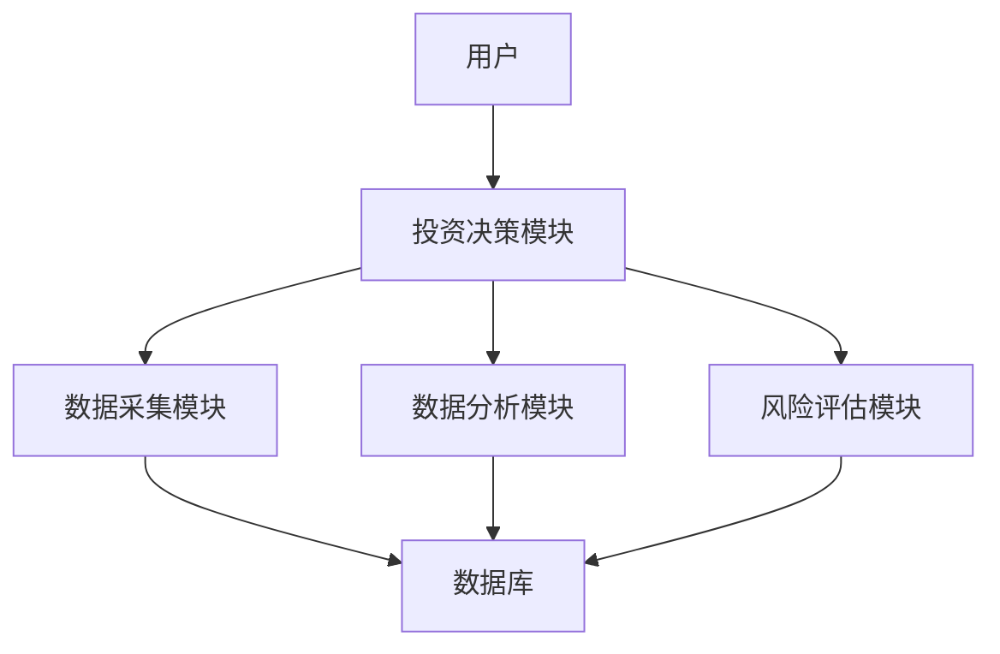
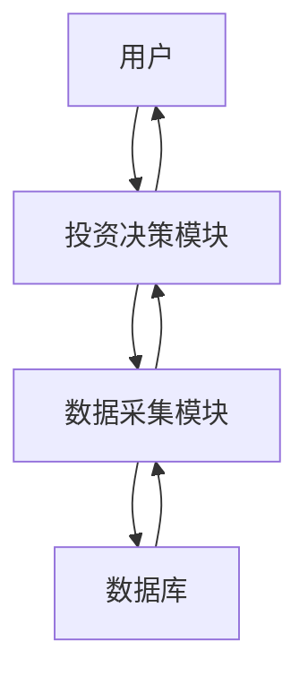

                 


# 沃伦·巴菲特的长期持股策略分析

> 关键词：沃伦·巴菲特，长期持股策略，价值投资，投资决策，财务分析

> 摘要：本文从沃伦·巴菲特的长期持股策略出发，结合价值投资的核心理念，详细分析了长期持股策略的定义、核心要素、算法原理、系统架构以及实际应用。通过理论与实践相结合的方式，深入探讨了如何通过长期持股策略实现稳健的投资回报，并结合实际案例进行了详细分析。

---

# 第一部分: 沃伦·巴菲特的长期持股策略背景介绍

# 第1章: 长期持股策略的核心概念

## 1.1 长期持股策略的定义与背景

### 1.1.1 长期持股策略的定义

长期持股策略（Long-Term Holding Strategy）是指投资者在选择优质企业后，长期持有其股票，不因短期市场波动而频繁买卖的投资策略。该策略的核心在于通过持有优质资产，获得企业的长期成长收益。

### 1.1.2 长期持股策略的背景与演变

长期持股策略起源于20世纪，沃伦·巴菲特是这一策略的代表人物。他的投资理念强调企业内在价值和长期成长潜力，而非短期市场波动。随着市场的成熟和机构投资者的增多，长期持股策略逐渐被更多投资者所接受。

### 1.1.3 长期持股策略的边界与外延

长期持股策略的边界在于其适用范围和限制条件。例如，该策略适合长期稳定的经济环境，但在市场剧烈波动或企业基本面变化时，可能需要调整。其外延包括与价值投资、趋势投资等策略的结合。

## 1.2 长期持股策略的核心要素

### 1.2.1 价值投资的定义与特征

价值投资是一种以低于内在价值的价格购买优质企业的投资策略。其核心特征包括：
1. **安全边际**：买入价格低于内在价值。
2. **长期视角**：关注企业的长期盈利能力。
3. **优质企业**：选择具备竞争优势的企业。

### 1.2.2 长期持股策略的属性对比

| 属性         | 长期持股策略              | 短期交易策略              |
|--------------|---------------------------|---------------------------|
| 时间跨度     | 长期（数年）               | 短期（数天或数周）          |
| 风险承受     | 较低                      | 较高                      |
| 资金流动性   | 较低                      | 较高                      |
| 收益来源     | 股权增值、股息收入         | 买卖价差                  |

### 1.2.3 核心要素的组成与关系

长期持股策略的核心要素包括：
1. **企业内在价值**：企业未来现金流的现值。
2. **市场估值**：市场对企业价值的评估。
3. **时间因素**：持有时间与企业成长的匹配。

这些要素相互关联，共同决定了投资决策的正确性和收益潜力。

## 1.3 长期持股策略与短期交易的区别

### 1.3.1 短期交易的特点与风险

短期交易的特点：
- 时间跨度短，操作灵活。
- 着重于市场波动和价格变化。
- 风险较高，需要频繁关注市场动态。

风险：
- 市场波动大，收益不稳定。
- 交易成本较高。

### 1.3.2 长期持股策略的优势与劣势

优势：
- 风险较低，波动小。
- 能够享受企业的长期成长。
- 交易成本低。

劣势：
- 需要较长的时间周期。
- 需要较高的市场判断能力。

### 1.3.3 两种策略的对比分析

长期持股策略更适用于稳健型投资者，适合具备长期增值潜力的优质企业。短期交易策略适合风险承受能力强、市场敏感度高的投资者。

---

# 第2章: 沃伦·巴菲特的投资理念

## 2.1 巴菲特投资理念的核心思想

### 2.1.1 价值投资的哲学基础

巴菲特的投资理念基于价值投资，强调购买价格低于内在价值的企业。他主张通过分析企业的财务状况、竞争优势和管理团队，寻找具备长期成长潜力的企业。

### 2.1.2 股票的内在价值与市场价值

股票的内在价值是基于企业未来现金流的现值，而市场价值是市场参与者对股票的定价。长期持股策略的核心在于寻找内在价值高于市场价值的企业。

### 2.1.3 长期持有优质企业的逻辑

巴菲特认为，优质企业具备持续的盈利能力、强大的竞争优势和稳定的管理团队。长期持有这些企业，能够分享其成长的成果。

## 2.2 巴菲特定律与投资决策框架

### 2.2.1 巴菲特定律的数学模型

巴菲特定律（Buffett's Formula）用于评估企业的内在价值，公式为：
$$ V = \frac{Earnings \times (8.5 + (Growth Rate \times 2.5))}{10} $$

其中，`Earnings`为企业的净利润，`Growth Rate`为企业年增长率。

### 2.2.2 投资决策的步骤与流程

#### 投资决策流程



### 2.2.3 巴菲特定律的案例分析

以可口可乐为例，假设其净利润为$10亿，年增长率为5%，代入公式计算内在价值：
$$ V = \frac{10 \times (8.5 + (0.05 \times 2.5))}{10} = \frac{10 \times (8.5 + 0.125)}{10} = \frac{10 \times 8.625}{10} = 86.25 \text{亿美元} $$

## 2.3 巴菲特选股标准与企业分析

### 2.3.1 选股标准的核心要素

巴菲特选股标准包括：
1. **高ROE（净资产收益率）**：ROE > 15%。
2. **稳定的收益**：净利润稳步增长。
3. **强大的竞争优势**：行业龙头或具备护城河。
4. **优秀的管理层**：管理团队具备诚信和能力。

### 2.3.2 企业财务状况的分析方法

分析企业的财务报表，重点关注：
1. **盈利能力**：净利润、ROE。
2. **财务健康状况**：资产负债率、现金流。
3. **成长能力**：收入和利润增长率。

### 2.3.3 企业竞争优势的评估指标

竞争优势包括：
1. **品牌优势**：知名品牌。
2. **成本优势**：生产成本低。
3. **技术优势**：技术创新。

---

# 第3章: 长期持股策略的算法原理

## 3.1 长期持股策略的决策树

### 3.1.1 决策树的构建过程

长期持股策略的决策树如下：



### 3.1.2 决策树的优缺点分析

优点：
- 结构清晰，易于理解。
- 适合长期投资决策。

缺点：
- 需要频繁评估企业状况。
- 未考虑市场整体波动。

### 3.1.3 决策树的实现代码

```python
def decision_tree(data):
    # 数据预处理
    processed_data = preprocess(data)
    # 模型训练
    model = train_model(processed_data)
    # 预测与评估
    prediction = model.predict(processed_data)
    return prediction
```

## 3.2 长期持股策略的数学模型

### 3.2.1 投资组合的收益计算

投资组合的收益计算公式为：
$$ R = \sum_{i=1}^{n} w_i \times R_i $$
其中，`w_i`为第i只股票的权重，`R_i`为第i只股票的收益率。

### 3.2.2 风险评估的数学公式

风险评估公式为：
$$ \text{风险} = \text{标准差}(R) = \sqrt{\sum_{i=1}^{n} w_i^2 \times \sigma_i^2} $$
其中，`σ_i`为第i只股票的收益率标准差。

### 3.2.3 数学模型的案例分析

假设投资组合由两只股票组成，权重分别为0.6和0.4，收益率分别为10%和15%，标准差分别为0.2和0.3。

计算投资组合的收益：
$$ R = 0.6 \times 0.1 + 0.4 \times 0.15 = 0.06 + 0.06 = 0.12 \text{即} 12\% $$

计算风险：
$$ \text{风险} = \sqrt{0.6^2 \times 0.2^2 + 0.4^2 \times 0.3^2} = \sqrt{0.36 \times 0.04 + 0.16 \times 0.09} = \sqrt{0.0144 + 0.0144} = \sqrt{0.0288} \approx 0.1697 \text{即} 16.97\% $$

---

# 第4章: 长期持股策略的系统分析与架构设计

## 4.1 投资决策系统的功能设计

### 4.1.1 系统功能模块划分

功能模块包括：
1. **数据采集模块**：收集企业财务数据和市场数据。
2. **数据分析模块**：分析企业财务状况和竞争优势。
3. **投资决策模块**：根据分析结果做出投资决策。
4. **风险评估模块**：评估投资组合的风险。

### 4.1.2 功能模块的交互流程



### 4.1.3 系统架构设计

系统架构如下：



## 4.2 投资决策系统的架构图



## 4.3 系统接口设计

系统接口包括：
1. 数据接口：与数据源对接。
2. 用户接口：提供用户输入和输出。

## 4.4 系统交互序列图



---

# 第5章: 长期持股策略的项目实战

## 5.1 环境安装与配置

### 5.1.1 投资分析系统的安装步骤

1. 安装Python环境。
2. 安装必要的库（如Pandas、NumPy）。
3. 下载企业数据和市场数据。

### 5.1.2 系统配置与参数设置

设置投资组合的初始资金、风险承受能力等参数。

## 5.2 系统核心实现源代码

### 5.2.1 数据处理代码

```python
import pandas as pd

# 数据加载
data = pd.read_csv('stock_data.csv')

# 数据清洗
data = data.dropna()
data = data.drop_duplicates()

# 数据转换
data['return'] = data['close'].pct_change()
```

### 5.2.2 投资决策代码

```python
def invest_strategy(data):
    # 计算内在价值
    intrinsic_value = data['profit'] * (8.5 + (data['growth_rate'] * 2.5)) / 10
    # 比较市场价值
    undervalued = intrinsic_value < data['market_value']
    return undervalued
```

## 5.3 代码应用解读与分析

### 5.3.1 数据处理的详细解读

数据处理包括数据加载、清洗和转换。清洗数据是为了去除缺失值和重复值，转换数据是为了计算收益率。

### 5.3.2 投资决策代码的详细解读

投资决策代码通过计算企业的内在价值，比较市场价值，判断企业是否低估，从而决定是否买入并持有。

## 5.4 实际案例分析与详细讲解

### 5.4.1 案例选择与数据准备

以苹果公司为例，加载其股票数据和财务数据。

### 5.4.2 投资决策过程的详细分析

1. 计算苹果公司的内在价值。
2. 比较苹果公司的市场价值。
3. 判断是否低估，决定是否买入并持有。

### 5.4.3 投资结果与收益分析

通过长期持有苹果公司股票，分析其收益率和风险。

---

# 第6章: 长期持股策略的最佳实践

## 6.1 投资策略实施中的注意事项

### 6.1.1 风险控制

1. 分散投资，避免过度集中。
2. 定期评估企业状况。

### 6.1.2 市场波动应对

1. 长期持有优质企业，避免短期波动。
2. 保持耐心，不因市场波动而改变决策。

## 6.2 长期持股策略的优化与改进

### 6.2.1 定期再平衡

定期调整投资组合，保持目标配置。

### 6.2.2 引入量化分析

结合量化分析工具，提高投资决策的科学性。

## 6.3 投资者经验总结

### 6.3.1 投资心态管理

保持冷静，避免贪婪和恐惧。

### 6.3.2 投资知识的持续学习

不断学习投资知识，提升分析能力。

---

# 结语

沃伦·巴菲特的长期持股策略是一种稳健的投资方式，适合长期稳定的经济环境。通过深入分析企业的内在价值和竞争优势，结合长期持有优质企业的策略，投资者能够实现稳健的收益。本文从理论到实践，详细分析了长期持股策略的核心要素、算法原理和系统设计，并通过案例分析展示了其实际应用。希望本文能够为投资者提供有价值的参考和启发。

---

# 扩展阅读

1. 巴菲特的股东信：深入理解其投资理念。
2. 《投资学原理》：系统学习投资理论。
3. 投资组合管理：优化投资组合的方法。

---

# 小结

本文系统地分析了沃伦·巴菲特的长期持股策略，从背景介绍到实际应用，提供了全面而深入的解读。通过本文的学习，读者能够更好地理解长期持股策略的内在逻辑，并能够在实际投资中灵活运用这些策略。

---

**完**

