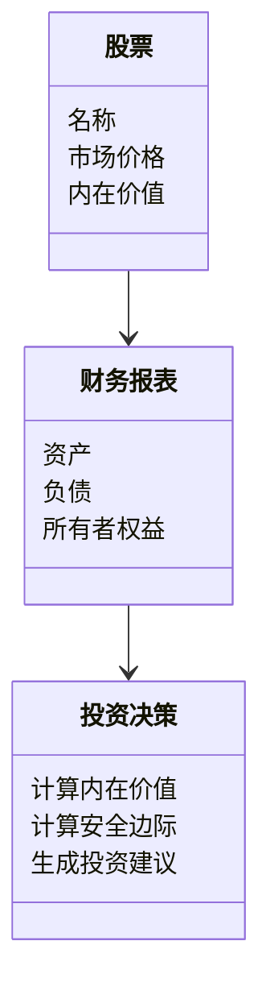
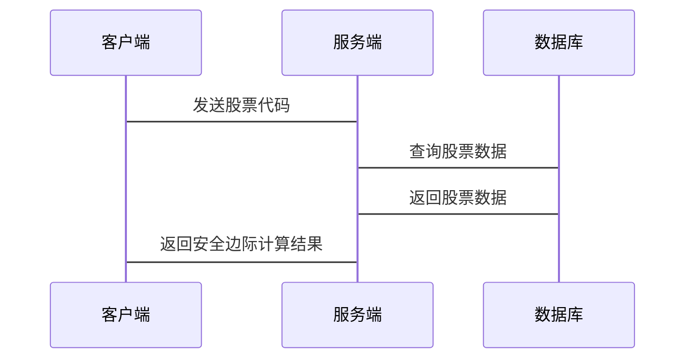

                 


# 沃尔特·施洛斯的价值投资实践指南

> 关键词：价值投资、内在价值、安全边际、财务分析、投资策略、长期持有、投资系统

> 摘要：本文详细介绍了沃尔特·施洛斯的价值投资实践方法，从理论基础到实际操作，系统性地阐述了如何通过基本面分析和长期持有策略实现投资目标。文章结合技术分析与投资策略，详细讲解了价值投资的核心概念、量化分析方法、系统架构设计以及实际项目案例，为投资者提供了全面的指导。

---

# 第一部分: 价值投资的背景与核心理念

## 第1章: 价值投资的起源与核心理念

### 1.1 价值投资的起源

#### 1.1.1 投资学的基本概念
- 投资学是研究如何通过资金分配和资产配置实现财富增长的学科。
- 价值投资是投资学中的一个重要流派，强调以低于内在价值的价格购买优质资产。

#### 1.1.2 价值投资的定义与特点
- **定义**：价值投资是一种以低于市场价格购买优质资产的投资策略，核心在于寻找市场低估的股票。
- **特点**：
  - 长期持有：注重长期价值，而非短期价格波动。
  - 基本面分析：通过分析企业的财务状况、行业地位和盈利能力来评估其内在价值。
  - 安全边际：买入价格低于内在价值，以降低风险。

#### 1.1.3 沃尔特·施洛斯的投资理念
- 沃尔特·施洛斯是价值投资的代表人物之一，其投资理念基于以下几点：
  - 专注于寻找具有强大财务基础和竞争优势的企业。
  - 以合理的价格（低于内在价值）买入并长期持有。
  - 避免短期市场波动的干扰，坚持长期价值。

### 1.2 价值投资的核心原则

#### 1.2.1 安全边际的概念与应用
- **安全边际**：指买入价格与内在价值之间的差距，用于降低投资风险。
- **公式**：安全边际 = 内在价值 - 市场价格
- **应用**：通过计算安全边际，投资者可以确保在买入时有一定的安全空间，避免市场波动带来的损失。

#### 1.2.2 长期持有策略的优缺点
- **优点**：
  - 长期持有可以避免频繁交易的成本和风险。
  - 稳定的复利效应，长期收益更高。
- **缺点**：
  - 需要较强的心理素质，面对短期市场波动时保持冷静。
  - 需要持续关注企业的基本面变化，及时调整投资组合。

#### 1.2.3 价值投资与成长投资的对比
- **价值投资**：注重低估值，追求安全边际，适合稳健型投资者。
- **成长投资**：注重高成长性，愿意为未来的增长支付更高价格，适合风险承受能力强的投资者。

### 1.3 价值投资的适用场景与局限性

#### 1.3.1 价值投资的适用市场环境
- 适用于市场低估、企业基本面稳定的情况。
- 在经济衰退或市场恐慌时，往往能发现更多的低估机会。

#### 1.3.2 价值投资在不同经济周期的表现
- **经济繁荣期**：价值投资可能表现平平，因为市场情绪高涨，高估现象普遍。
- **经济衰退期**：价值投资往往表现优异，因为市场恐慌导致许多优质资产被低估。

#### 1.3.3 价值投资的局限性
- **市场有效性**：在有效市场中，低估的机会较少，价值投资的收益可能有限。
- **竞争加剧**：随着价值投资的普及，优质资产的低估机会可能减少。

---

## 第2章: 价值投资的核心概念与分析框架

### 2.1 内在价值的定义与计算

#### 2.1.1 内在价值的公式推导
- 内在价值是企业未来现金流的现值。
- 公式：$$\text{内在价值} = \sum_{t=1}^{n} \frac{CF_t}{(1 + r)^t}$$
  - \(CF_t\)：第t年的自由现金流。
  - \(r\)：折现率。

#### 2.1.2 内在价值的计算方法
- 使用DCF模型（ discounted cash flow model）计算企业的内在价值。
- 通过分析企业的盈利能力、成长潜力和行业地位，确定合理的折现率。

### 2.2 安全边际的理论与应用

#### 2.2.1 安全边际的定义与计算
- 安全边际 = 内在价值 - 市场价格。
- 通过计算安全边际，投资者可以判断买入价格是否合理。

#### 2.2.2 安全边际在投资决策中的应用
- 安全边际为正时，买入股票具有较高的安全性和潜在的收益。
- 安全边际越大，投资风险越小。

### 2.3 财务报表分析与价值评估

#### 2.3.1 财务报表的基本结构
- **资产负债表**：反映企业的资产、负债和所有者权益。
- **利润表**：反映企业的收入、成本和利润。
- **现金流量表**：反映企业的现金流入和流出情况。

#### 2.3.2 财务指标与价值评估的关系
- **市盈率（P/E）**：市场价格/每股收益。
- **市净率（P/B）**：市场价格/每股净资产。
- **股息率**：每股股息/市场价格。

---

## 第3章: 价值投资的量化分析与算法原理

### 3.1 价值评估模型的建立

#### 3.1.1 模型的输入变量与输出结果
- **输入变量**：
  - 企业未来现金流预测。
  - 合理的折现率。
- **输出结果**：
  - 企业的内在价值。
  - 合理的买入价格。

#### 3.1.2 模型的假设条件与限制
- 假设企业的现金流可以合理预测。
- 折现率的选择对结果影响较大。

### 3.2 安全边际的量化计算

#### 3.2.1 计算安全边际的公式
- $$\text{安全边际} = \text{内在价值} - \text{市场价格}$$

#### 3.2.2 通过Python计算安全边际
```python
def calculate_margin_of_safety(intrinsic_value, market_price):
    return intrinsic_value - market_price

# 示例
intrinsic_value = 100
market_price = 80
margin = calculate_margin_of_safety(intrinsic_value, market_price)
print(f"安全边际为: {margin}")
```

---

## 第4章: 价值投资的系统分析与架构设计

### 4.1 投资系统的功能设计

#### 4.1.1 领域模型（Mermaid类图）


### 4.2 系统架构设计

#### 4.2.1 系统架构图（Mermaid架构图）


### 4.3 系统交互设计

#### 4.3.1 系统交互图（Mermaid序列图）


---

## 第5章: 价值投资的项目实战

### 5.1 环境安装与配置

#### 5.1.1 安装Python环境
```bash
python --version
pip install numpy pandas matplotlib
```

### 5.2 核心代码实现

#### 5.2.1 计算内在价值的Python代码
```python
import numpy as np
import pandas as pd

def calculate_intrinsic_value(cash_flows, discount_rate):
    return np.npv(discount_rate, cash_flows)

# 示例数据
cash_flows = [100, 120, 150, 200]
discount_rate = 0.08
intrinsic_value = calculate_intrinsic_value(cash_flows, discount_rate)
print(f"内在价值为: {intrinsic_value}")
```

### 5.3 实际案例分析

#### 5.3.1 案例分析：亚马逊（Amazon）
- **财务数据**：分析亚马逊的收入、利润和现金流。
- **内在价值计算**：使用DCF模型计算亚马逊的内在价值。
- **安全边际计算**：比较市场价格与内在价值，判断是否具有安全边际。

---

## 第6章: 价值投资的最佳实践

### 6.1 小结

#### 6.1.1 价值投资的核心要点
- 理解内在价值的计算方法。
- 重视安全边际的作用。
- 长期持有优质资产。

### 6.2 注意事项

#### 6.2.1 投资中的常见误区
- 过度关注短期价格波动。
- 忽视企业的基本面。
- 过度依赖技术分析。

### 6.3 拓展阅读

#### 6.3.1 推荐书籍
- 《投资最重要的事》——巴菲特的投资箴言。
- 《价值投资入门》——系统介绍价值投资的方法。

---

## 第7章: 总结

### 7.1 价值投资的总结
- 价值投资是一种长期有效的投资策略。
- 通过基本面分析和安全边际计算，投资者可以找到低估的优质资产。
- 长期持有是实现财富增长的关键。

### 7.2 投资系统的总结
- 通过系统化的分析和量化方法，投资者可以更科学地进行投资决策。
- 价值投资与技术分析的结合，可以提高投资的准确性和效率。

### 7.3 展望未来
- 随着技术的发展，价值投资的量化分析将更加精确。
- 数据分析和人工智能技术的应用，将为投资者提供更多的工具和方法。

---

**附录：**
- Python代码示例
- Mermaid图表代码
- 投资系统架构设计文档

---

**注**：由于篇幅限制，本文仅为摘要和部分章节内容，完整文章请参考相关书籍和资料。

