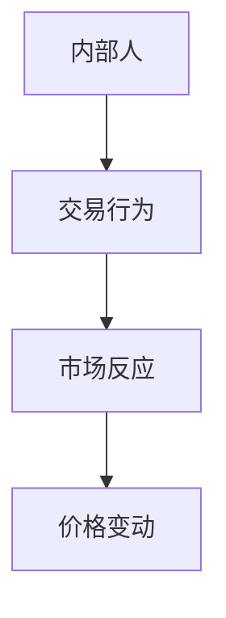
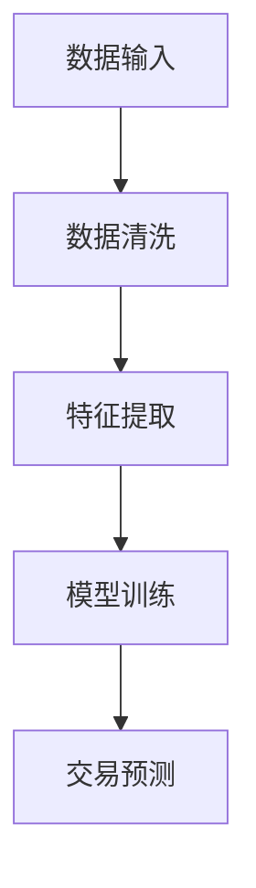
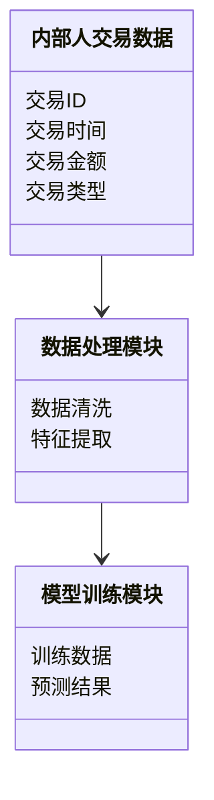
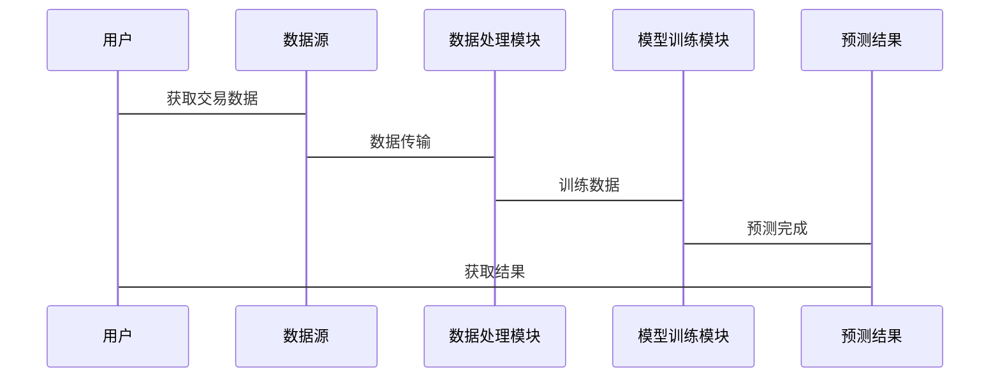

                 


# {{《沃尔特·施洛斯的公司内部人交易分析》}}

> 关键词：内部人交易分析，沃尔特·施洛斯，交易算法，数据分析，系统架构，项目实战

> 摘要：本文深入分析了沃尔特·施洛斯在公司内部人交易分析领域的理论与实践，结合实际案例，系统性地介绍了内部人交易分析的核心概念、算法原理、系统架构设计及项目实战。文章内容丰富，结构紧凑，适合希望深入理解内部人交易分析的读者。

---

# 第一部分：内部人交易分析的背景与基础

## 第1章：内部人交易分析的定义与背景

### 1.1 内部人交易的定义与核心概念

#### 1.1.1 内部人交易的基本定义
- 内部人交易的定义
- 内部人的范畴
- 内部交易的基本类型

#### 1.1.2 内部人交易的法律与道德边界
- 内部交易的法律约束
- 道德层面的考量
- 全球范围内内部交易的监管框架

#### 1.1.3 内部人交易的核心要素与结构
- 内部交易的关键要素
- 内部交易的结构化分析

### 1.2 沃尔特·施洛斯的内部人交易理论

#### 1.2.1 施洛斯的交易分析方法
- 施洛斯的交易分析模型
- 施洛斯分析方法的核心思想

#### 1.2.2 施洛斯交易分析的核心假设
- 内部交易与市场行为的关系
- 价格波动的预测机制

#### 1.2.3 施洛斯交易分析与其他交易分析方法的对比
- 传统交易分析方法的局限性
- 施洛斯方法的独特性

## 第2章：内部人交易分析的核心概念与联系

### 2.1 核心概念的原理与特征

#### 2.1.1 内部人交易的核心原理
- 内部交易的驱动因素
- 信息不对称的影响

#### 2.1.2 内部人交易的关键特征对比
- 不同类型交易的特征分析
- 交易规模与市场反应的关系

#### 2.1.3 实体关系图的 Mermaid 流程图


### 2.2 核心概念的数学模型与公式

#### 2.2.1 内部人交易的数学模型
$$ \text{交易影响} = \alpha \times \text{交易金额} + \beta \times \text{交易时间} $$

#### 2.2.2 交易影响的量化公式
$$ \text{交易概率} = \frac{\text{内部交易金额}}{\text{总交易金额}} \times 100 $$

---

# 第二部分：内部人交易分析的算法原理

## 第3章：内部人交易分析的算法原理

### 3.1 算法原理的 Mermaid 流程图



### 3.2 算法实现的 Python 代码

```python
# 示例代码：内部人交易分析算法
def insider_transaction_analysis(data):
    # 数据清洗
    cleaned_data = data.dropna()
    # 特征提取
    features = cleaned_data[['交易金额', '交易时间', '交易类型']]
    # 模型训练
    model = train_model(features)
    # 预测结果
    predictions = model.predict(features)
    return predictions
```

### 3.3 算法的数学模型与公式

#### 3.3.1 交易影响的数学模型
$$ \text{交易影响} = \alpha \times \text{交易金额} + \beta \times \text{交易时间} $$

#### 3.3.2 交易概率的计算
$$ \text{交易概率} = \frac{\text{内部交易金额}}{\text{总交易金额}} \times 100 $$

---

# 第三部分：内部人交易分析的系统架构与实现

## 第4章：内部人交易分析的系统架构设计

### 4.1 系统功能设计

#### 4.1.1 领域模型的 Mermaid 类图


#### 4.1.2 系统架构的 Mermaid 序列图


### 4.2 系统接口设计

#### 4.2.1 数据接口
- 数据输入接口
- 数据输出接口

#### 4.2.2 模型接口
- 模型训练接口
- 模型预测接口

---

# 第四部分：内部人交易分析的项目实战

## 第5章：内部人交易分析的项目实战

### 5.1 项目环境与数据准备

#### 5.1.1 环境搭建
- 数据库选择
- 开发工具安装

#### 5.1.2 数据采集
- 数据来源
- 数据清洗

### 5.2 项目实现

#### 5.2.1 核心代码实现
```python
# 示例代码：内部人交易分析实现
def main():
    # 数据加载
    data = pd.read_csv('transaction_data.csv')
    # 数据清洗
    cleaned_data = data.dropna()
    # 特征提取
    features = cleaned_data[['交易金额', '交易时间', '交易类型']]
    # 模型训练
    model = train_model(features)
    # 预测结果
    predictions = model.predict(features)
    # 结果保存
    predictions.to_csv('prediction_results.csv', index=False)

if __name__ == '__main__':
    main()
```

#### 5.2.2 代码实现解读
- 代码结构解析
- 关键函数解读

### 5.3 项目小结

---

# 第五部分：最佳实践与注意事项

## 第6章：最佳实践与注意事项

### 6.1 最佳实践

#### 6.1.1 数据质量管理
- 数据清洗的重要性
- 数据验证的技巧

#### 6.1.2 模型优化策略
- 参数调优方法
- 模型评估指标

### 6.2 注意事项

#### 6.2.1 数据隐私与合规性
- 数据使用的法律合规性
- 数据安全保护措施

#### 6.2.2 模型的可解释性
- 模型解释的重要性
- 提高模型透明度的方法

### 6.3 拓展阅读

#### 6.3.1 内部人交易分析的最新研究
- 施洛斯理论的最新发展
- 行业内的研究趋势

#### 6.3.2 相关技术的深入学习
- 其他交易分析方法
- 数据科学领域的最新技术

