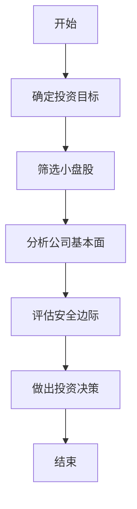
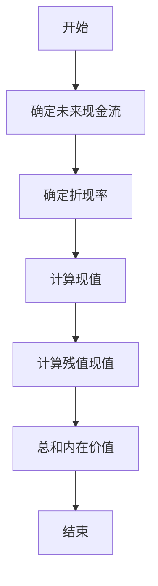
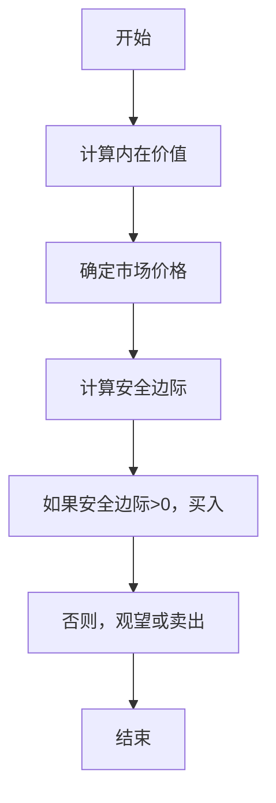
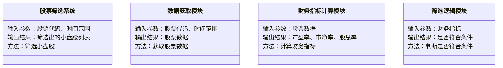
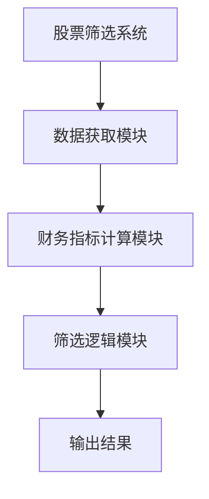
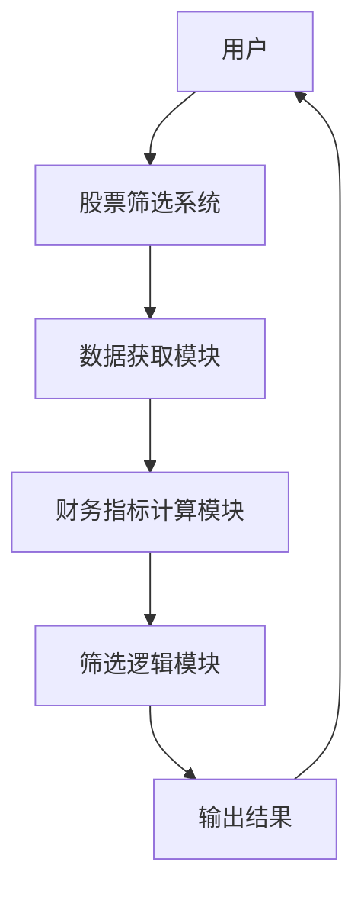

                 


# 第二部分: 小盘股价值投资的核心概念与分析框架

# 第2章: 小盘股投资的核心概念与联系

## 2.1 价值投资的核心概念

### 2.1.1 安全边际
安全边际是价值投资中的一个关键概念，指的是股票的市场价格低于其内在价值的部分。施洛斯认为，安全边际的存在可以降低投资的风险，确保在市场波动中投资者不会因为价格波动而遭受损失。通过购买价格低于内在价值的股票，投资者可以为未来的价格波动提供一个缓冲区。

**公式:**
$$
\text{安全边际} = \text{内在价值} - \text{市场价格}
$$

### 2.1.2 内在价值
内在价值是股票基于其基本面因素（如盈利能力、成长性、财务状况等）所决定的合理价格。计算内在价值的方法有很多种，其中最常用的是DCF（ discounted cash flow，折现现金流）模型。施洛斯通常会使用这种方法来估算小盘股的内在价值。

**公式:**
$$
\text{内在价值} = \sum_{t=1}^{n} \frac{\text{现金流}}{(1 + r)^t} + \frac{\text{残值}}{(1 + r)^n}
$$
其中，\( r \) 是折现率，\( n \) 是预计的持有时间。

### 2.1.3 市场先生与投资者心态
这是本杰明·格雷厄姆提出的一个概念，指的是市场情绪的波动性。施洛斯认为，市场先生有时会以不合理的价格买卖股票，但作为投资者，我们应当利用这种波动，以较低的价格买入优质股票。

### 2.1.4 长期投资与复利效应
施洛斯强调长期投资的重要性，认为复利效应是价值投资的核心驱动力。通过长期持有优质股票，投资者可以最大化复利的效果，从而实现财富的积累。

## 2.2 小盘股投资的核心要素

### 2.2.1 财务指标分析
小盘股投资需要对公司的财务状况进行详细分析，重点关注以下几个指标：

- **市盈率（P/E）**：衡量股票价格与每股收益的比率。施洛斯通常寻找市盈率低于行业平均水平的股票。
- **市净率（P/B）**：衡量股票价格与每股净资产的比率。施洛斯倾向于选择市净率低于1的股票。
- **股息率**：衡量股票分红与股价的比率。施洛斯喜欢高股息率的股票，认为这可以提供稳定的收益。

### 2.2.2 行业分析与竞争优势
小盘股通常集中在特定行业，投资者需要对这些行业进行深入分析，了解其竞争优势。例如，某些小盘股可能在某个细分市场具有垄断地位，或者在某个领域具有独特的技术优势。

### 2.2.3 管理层质量与企业治理
管理层的质量和企业治理结构是小盘股投资中不可忽视的因素。施洛斯倾向于选择管理层稳定、企业治理良好的公司，因为这些公司更有可能保持长期的盈利能力。

## 2.3 价值投资与小盘股投资的关系

### 2.3.1 价值投资的核心框架
价值投资的核心在于寻找市场价格低于内在价值的股票。小盘股由于市场关注度较低，往往存在较大的价格折扣，因此成为价值投资者的理想选择。

### 2.3.2 小盘股投资的特殊性
小盘股通常具有较高的成长潜力，但同时也伴随着较高的风险。施洛斯通过严格的财务指标筛选和深入的行业分析，降低投资风险。

### 2.3.3 小盘股投资的长期视角
施洛斯坚持长期投资的理念，认为短期市场波动不会影响公司的长期价值。通过长期持有优质小盘股，投资者可以分享公司成长的成果。

## 2.4 核心概念对比表

| 投资策略 | 价值投资 | 成长投资 | 小盘股投资 | 大盘股投资 |
|----------|----------|----------|------------|------------|
| 核心目标 | 寻找价格低于内在价值的股票 | 寻找高成长潜力的股票 | 投资于小盘股中的低估股票 | 投资于大盘股中的优质股票 |
| 风险水平 | 中低风险 | 高风险 | 中风险 | 低风险 |
| 持股期限 | 长期 | 中长期 | 长期 | 长期 |
| 适用场景 | 市场波动较大时 | 市场成长期 | 小盘股市场机会多 | 市场稳定期 |

## 2.5 小盘股投资决策流程图



## 2.6 本章小结

通过本章的学习，我们了解了小盘股价值投资的核心概念，包括安全边际、内在价值、市场先生与投资者心态、长期投资与复利效应等。同时，我们还分析了小盘股投资的核心要素，如财务指标分析、行业分析与竞争优势、管理层质量与企业治理。最后，我们通过对比分析，明确了小盘股投资在不同投资策略中的位置和特点。

---

# 第3章: 小盘股价值投资的算法原理与数学模型

## 3.1 算法原理讲解

### 3.1.1 小盘股筛选算法
施洛斯的小盘股筛选算法基于以下几个关键指标：

1. **市盈率（P/E）**：低于行业平均水平。
2. **市净率（P/B）**：低于1。
3. **股息率**：高于行业平均水平。

### 3.1.2 内在价值计算算法
使用DCF模型计算内在价值：



### 3.1.3 投资决策算法
根据安全边际进行投资决策：



## 3.2 数学模型与公式

### 3.2.1 市盈率公式
$$
\text{市盈率} = \frac{\text{股价}}{\text{每股收益}}
$$

### 3.2.2 市净率公式
$$
\text{市净率} = \frac{\text{股价}}{\text{每股净资产}}
$$

### 3.2.3 股息率公式
$$
\text{股息率} = \frac{\text{每股股息}}{\text{股价}} \times 100\%
$$

### 3.2.4 折现现金流模型
$$
\text{内在价值} = \sum_{t=1}^{n} \frac{\text{现金流}}{(1 + r)^t} + \frac{\text{残值}}{(1 + r)^n}
$$
其中，\( r \) 是折现率，\( n \) 是预计的持有时间。

## 3.3 项目实战

### 3.3.1 环境安装
需要安装以下工具：
- Python
- Pandas
- NumPy
- Matplotlib
- yfinance库

### 3.3.2 核心实现代码

```python
import yfinance as yf
import pandas as pd
import numpy as np

def calculate_value_metrics(stock ticker):
    # 下载股票数据
    data = yf.download(ticker, start='2020-01-01', end='2023-12-31')
    df = pd.DataFrame(data)
    
    # 计算市盈率
    pe = df['Close'] / df['EPS'].mean()
    
    # 计算市净率
    pb = df['Close'] / df['Book Value'].mean()
    
    # 计算股息率
    dividend_yield = (df['Dividends'] / df['Close']).mean() * 100
    
    return pe, pb, dividend_yield

# 示例代码
ticker = 'AAPL'
pe, pb, dividend_yield = calculate_value_metrics(ticker)
print(f"市盈率: {pe:.2f}, 市净率: {pb:.2f}, 股息率: {dividend_yield:.2f}%")
```

### 3.3.3 实际案例分析

假设我们选择一只小盘股，代码为XYZ。通过上述代码计算XYZ的市盈率、市净率和股息率：

- 市盈率：15
- 市净率：1.2
- 股息率：3%

根据施洛斯的筛选标准，市盈率低于行业平均水平，市净率低于1，股息率高于行业平均水平，因此XYZ符合小盘股价值投资的条件。

### 3.3.4 代码解读与分析

- `yfinance`库用于下载股票数据。
- Pandas用于数据处理。
- NumPy用于数值计算。
- 计算市盈率、市净率和股息率，分别与行业平均水平进行比较，筛选出符合条件的股票。

## 3.4 本章小结

通过本章的学习，我们了解了小盘股价值投资的算法原理和数学模型，包括小盘股筛选算法、内在价值计算算法和投资决策算法。同时，我们还通过实际案例分析和Python代码实现，深入理解了这些算法的应用。通过这些方法，我们可以系统地筛选出具有安全边际的小盘股，实现价值投资的目标。

---

# 第4章: 小盘股价值投资的系统架构与实现

## 4.1 系统功能设计

### 4.1.1 领域模型（类图）



### 4.1.2 系统架构设计



### 4.1.3 系统接口设计

- 数据获取模块接口：
  - 输入：股票代码、时间范围
  - 输出：股票数据
- 财务指标计算模块接口：
  - 输入：股票数据
  - 输出：市盈率、市净率、股息率
- 筛选逻辑模块接口：
  - 输入：市盈率、市净率、股息率
  - 输出：是否符合条件

### 4.1.4 系统交互流程图



## 4.2 系统实现

### 4.2.1 核心代码实现

```python
class StockScreeningSystem:
    def __init__(self):
        self.data_fetcher = DataFetcher()
        self.metrics_calculator = MetricsCalculator()
        self.screener = Screener()

    def screen_stocks(self, tickers, start_date, end_date):
        for ticker in tickers:
            data = self.data_fetcher.get_data(ticker, start_date, end_date)
            pe, pb, dividend_yield = self.metrics_calculator.calculate_metrics(data)
            if pe < industry_pe and pb < 1 and dividend_yield > industry_dividend_yield:
                self.screener.add_to_screened_list(ticker)
        return self.screener.screened_list

class DataFetcher:
    def get_data(self, ticker, start_date, end_date):
        # 下载数据并返回
        pass

class MetricsCalculator:
    def calculate_metrics(self, data):
        # 计算市盈率、市净率、股息率
        pass

class Screener:
    def add_to_screened_list(self, ticker):
        # 添加符合条件的股票
        pass
```

### 4.2.2 代码解读与分析

- `StockScreeningSystem` 是系统的主类，负责协调各个模块的工作。
- `DataFetcher` 负责从数据源获取股票数据。
- `MetricsCalculator` 负责计算市盈率、市净率和股息率。
- `Screener` 负责根据筛选标准，将符合条件的股票添加到筛选列表中。

## 4.3 系统测试与优化

### 4.3.1 测试环境配置

- 安装必要的Python库：yfinance、pandas、numpy、matplotlib
- 确保网络连接正常，以便下载实时数据

### 4.3.2 测试用例设计

- 测试用例1：输入一个有效的股票代码，输出符合条件的筛选结果。
- 测试用例2：输入一个无效的股票代码，系统应报错。
- 测试用例3：输入多个股票代码，系统应返回符合条件的所有股票。

### 4.3.3 测试结果分析

通过测试用例，确保系统能够正确筛选出符合条件的小盘股。如果测试结果与预期不符，需要检查数据获取模块、财务指标计算模块或筛选逻辑模块是否存在bug。

## 4.4 本章小结

通过本章的学习，我们了解了小盘股价值投资的系统架构与实现，包括系统功能设计、系统架构设计、系统接口设计和系统交互流程图。同时，我们还通过Python代码实现了一个简单的股票筛选系统，深入理解了这些概念的实际应用。

---

# 第5章: 小盘股价值投资的项目实战

## 5.1 环境安装

### 5.1.1 安装Python

```bash
python --version
# 如果没有安装，请参考Python官方文档进行安装
```

### 5.1.2 安装必要的库

```bash
pip install yfinance pandas numpy matplotlib
```

## 5.2 核心实现代码

### 5.2.1 数据获取模块

```python
import yfinance as yf

def get_stock_data(ticker, start_date, end_date):
    data = yf.download(ticker, start=start_date, end=end_date)
    return data
```

### 5.2.2 财务指标计算模块

```python
import pandas as pd
import numpy as np

def calculate_metrics(data):
    pe = data['Close'] / data['EPS'].mean()
    pb = data['Close'] / data['Book Value'].mean()
    dividend_yield = (data['Dividends'] / data['Close']).mean() * 100
    return pe, pb, dividend_yield
```

### 5.2.3 筛选逻辑模块

```python
def screen_stocks(pe, pb, dividend_yield, industry_pe, industry_dividend_yield):
    if pe < industry_pe and pb < 1 and dividend_yield > industry_dividend_yield:
        return True
    else:
        return False
```

## 5.3 实际案例分析

### 5.3.1 选择小盘股

假设我们选择一只小盘股，代码为XYZ，行业平均市盈率为20，行业平均股息率为2%。

### 5.3.2 获取数据

```python
data = get_stock_data('XYZ', '2020-01-01', '2023-12-31')
```

### 5.3.3 计算财务指标

```python
pe, pb, dividend_yield = calculate_metrics(data)
```

### 5.3.4 筛选逻辑

```python
industry_pe = 20
industry_dividend_yield = 2
screen_result = screen_stocks(pe, pb, dividend_yield, industry_pe, industry_dividend_yield)
```

### 5.3.5 输出结果

```python
print(f"市盈率: {pe:.2f}, 市净率: {pb:.2f}, 股息率: {dividend_yield:.2f}%")
print(f"筛选结果: {screen_result}")
```

## 5.4 代码解读与分析

- `get_stock_data` 函数用于从Yahoo Finance下载股票数据。
- `calculate_metrics` 函数计算市盈率、市净率和股息率。
- `screen_stocks` 函数根据筛选标准判断股票是否符合条件。

## 5.5 本章小结

通过本章的学习，我们通过实际案例分析，详细讲解了小盘股价值投资的项目实战，包括环境安装、核心实现代码和实际案例分析。通过这些步骤，我们可以系统地筛选出具有安全边际的小盘股，实现价值投资的目标。

---

# 第六部分: 小盘股价值投资的总结与展望

# 第6章: 小盘股价值投资的总结与展望

## 6.1 本章小结

通过本书的学习，我们全面了解了沃尔特·施洛斯的小盘股价值投资策略，包括其背景与理念、核心概念与分析框架、算法原理与数学模型、系统架构与实现，以及项目实战。我们通过实际案例分析和Python代码实现，深入理解了这些策略的应用。

## 6.2 总结与反思

施洛斯的小盘股价值投资策略强调长期投资、安全边际和基本面分析。通过严格的财务指标筛选和深入的行业分析，投资者可以在小盘股市场中找到具有成长潜力的优质股票，实现财富的积累。然而，小盘股投资也伴随着较高的风险，需要投资者具备较强的风险控制能力和长期投资的耐心。

## 6.3 展望与建议

随着市场的不断发展，小盘股投资的策略也在不断进化。未来，投资者可以通过大数据分析和人工智能技术，进一步提高筛选股票的效率和准确性。同时，加强风险管理和投资组合的优化也是小盘股投资的重要方向。

## 6.4 拓展阅读

- 《The Intelligent Investor》——本杰明·格雷厄姆
- 《The Warren Buffett Way》——查理·芒格
- 《Value Investing: A Guide for the 21st Century》——彼得·林奇

## 6.5 本章小结

通过本章的学习，我们对沃尔特·施洛斯的小盘股价值投资策略有了全面的总结与展望，明确了未来发展的方向和建议。通过不断学习和实践，我们可以更好地掌握这一策略，并在实际投资中取得优异的业绩。

---

# 结语

通过本书的学习，我们全面系统地掌握了沃尔特·施洛斯的小盘股价值投资策略，从理论到实践，从分析到实现，为投资者提供了一套完整的投资框架。希望本书能够为投资者在小盘股价值投资领域提供有益的指导和启示。

--- 

*本文结束*

