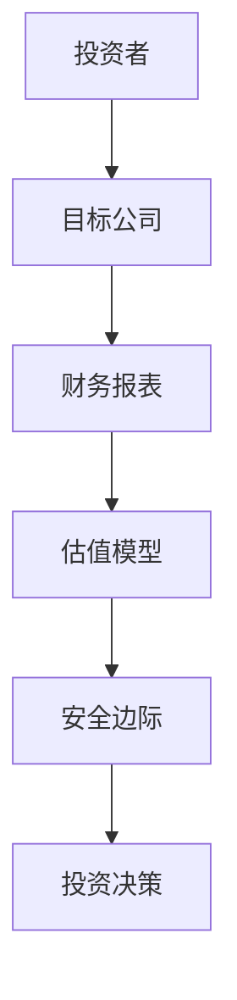
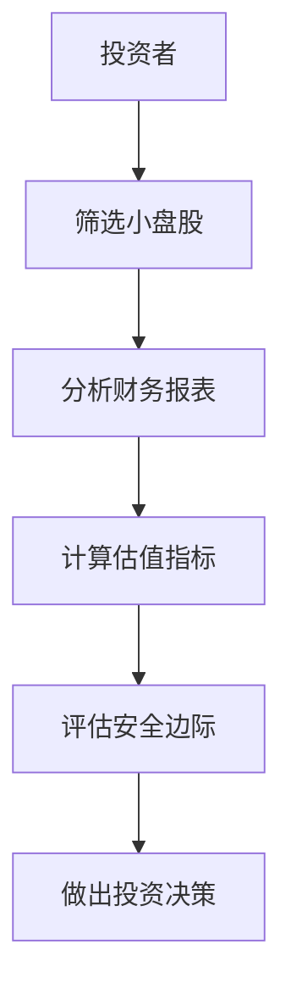
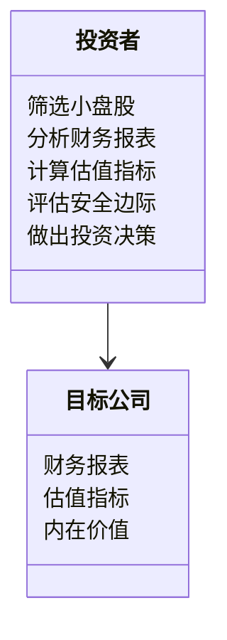
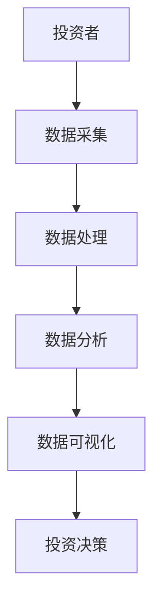
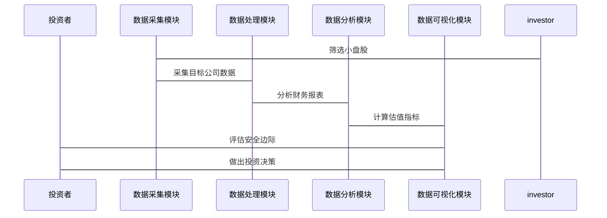

                 


# 沃尔特·施洛斯的小盘股研究方法论

> 关键词：沃尔特·施洛斯、小盘股、价值投资、基本面分析、安全边际、长期持有

> 摘要：本文系统地介绍沃尔特·施洛斯的小盘股研究方法论，涵盖其背景、核心概念、算法原理、数学模型、系统分析与架构设计方案、项目实战等部分，通过详细解析和实例分析，帮助读者全面理解并掌握这一经典投资方法。

---

# 第一部分: 沃尔特·施洛斯的小盘股研究方法论概述

## 第1章: 沃尔特·施洛斯与小盘股投资概述

### 1.1 沃尔特·施洛斯的背景与投资理念

#### 1.1.1 沃尔特·施洛斯的生平简介

沃尔特·施洛斯（Walter J. Schloss）是美国著名的投资家，出生于1910年，逝世于2004年。他是价值投资的代表人物之一，以专注于小盘股投资而闻名。施洛斯的投资理念深受本杰明·格雷厄姆（Benjamin Graham）的影响，师承格雷厄姆，两人共同创立了价值投资的理论框架。

施洛斯的职业生涯始于1934年，当时他加入了格雷厄姆的公司——格雷厄姆-纽曼公司。1956年，格雷厄姆去世后，施洛斯继续独立管理自己的投资组合，并在小盘股领域取得了卓越的成就。他的投资风格以稳健、保守著称，注重安全边际和长期持有。

#### 1.1.2 施洛斯投资理念的核心思想

施洛斯的投资理念可以总结为以下几点：

1. **价值投资**：他坚信市场先生是疯狂的，市场的短期波动并不能决定股票的长期价值。股票的价值应基于其内在价值，即公司的基本面。

2. **小盘股投资**：施洛斯认为小盘股通常被市场忽视，因此更容易找到被低估的投资标的。他倾向于投资那些市值小、估值低、财务健康的企业。

3. **安全边际**：施洛斯强调安全边际的重要性，即买入价格应低于股票的内在价值。他认为，安全边际是抵御市场波动和避免重大损失的关键。

4. **长期持有**：施洛斯的投资策略是长期持有优质股票，避免频繁交易，以减少交易成本和情绪干扰。

#### 1.1.3 施洛斯与价值投资的关联

施洛斯的投资方法与价值投资的核心思想高度一致。他将格雷厄姆的理论进一步发扬光大，尤其是在小盘股领域的实践，为后人提供了宝贵的借鉴。他的投资理念强调基本面分析、安全边际和长期持有，这些原则至今仍被广泛应用于投资实践中。

---

### 1.2 小盘股投资的定义与特点

#### 1.2.1 小盘股的定义

小盘股通常指市值较小的公司股票。根据标准普尔的定义，小盘股的市值通常在3亿美元到10亿美元之间。与大盘股相比，小盘股的流动性较低，市场关注度较低，但也更具成长潜力。

#### 1.2.2 小盘股投资的特点

1. **流动性较低**：小盘股的交易量通常较小，市场深度有限，买卖价差较大。
2. **波动性较大**：小盘股的价格波动通常比大盘股更为剧烈，容易受到市场情绪的影响。
3. **成长潜力高**：小盘股公司通常处于成长阶段，具有较大的发展空间。
4. **估值较低**：由于市场关注度较低，小盘股的估值往往被低估。

#### 1.2.3 小盘股投资与大盘股投资的区别

| 方面         | 小盘股投资             | 大盘股投资             |
|--------------|------------------------|------------------------|
| 市值范围     | 较小（3亿-10亿美元）   | 较大（超过10亿美元）   |
| 流动性       | 较低                  | 较高                  |
| 波动性       | 较高                  | 较低                  |
| 成长性       | 较高                  | 较低                  |
| 估值         | 通常被低估            | 通常较为合理          |
| 投资风险     | 较高                  | 较低                  |

---

### 1.3 施洛斯小盘股研究方法的核心要素

#### 1.3.1 基本面分析的核心要素

施洛斯的小盘股研究方法以基本面分析为核心，主要关注以下几个方面：

1. **财务报表分析**：通过分析公司的财务报表（如利润表、资产负债表和现金流量表），评估公司的财务健康状况。
2. **盈利能力**：关注净利润率、毛利率等指标，判断公司的盈利能力。
3. **成长性**：通过分析 revenue growth 和 earnings growth，评估公司的成长潜力。
4. **估值指标**：包括市盈率（P/E）、市净率（P/B）等，判断股票是否被低估。

#### 1.3.2 安全边际的概念

安全边际是施洛斯投资方法中的重要概念，指买入价格与股票内在价值之间的差距。施洛斯认为，买入价格应低于内在价值，以确保即使市场波动，也能避免重大损失。

#### 1.3.3 长期持有的投资策略

施洛斯主张长期持有优质股票，避免频繁交易。他认为，短期市场的波动无法预测，而长期来看，公司的内在价值终将反映在股价中。

---

### 1.4 施洛斯方法论的边界与外延

#### 1.4.1 小盘股投资的适用范围

小盘股投资适用于以下情况：

1. 投资者具备较强的研究能力，能够深入分析小盘股的财务状况。
2. 投资者具备较长的投资期限，能够承受短期波动，耐心等待价值实现。
3. 投资者对市场关注度较低的小盘股公司有信心，认为这些公司具有成长潜力。

#### 1.4.2 施洛斯方法论的局限性

施洛斯方法论的局限性主要体现在以下方面：

1. **流动性风险**：小盘股的流动性较低，可能难以迅速变现。
2. **信息不对称**：小盘股的信息较少，投资者可能难以获取足够的信息进行分析。
3. **波动性风险**：小盘股价格波动较大，容易受到市场情绪的影响。

#### 1.4.3 方法论的可扩展性与适应性

施洛斯方法论具有较强的可扩展性和适应性。尽管其主要应用于小盘股投资，但其核心思想（基本面分析、安全边际、长期持有）也可应用于其他类型的股票投资。

---

### 1.5 本章小结

本章介绍了沃尔特·施洛斯的背景及其投资理念，详细阐述了小盘股的定义与特点，并分析了施洛斯方法论的核心要素、边界与外延。通过本章的学习，读者可以初步了解施洛斯小盘股研究方法的理论基础和实践框架。

---

# 第二部分: 施洛斯小盘股研究方法的核心概念与联系

## 第2章: 施洛斯小盘股研究方法的核心概念与联系

### 2.1 核心概念原理

#### 2.1.1 基本面分析的原理

基本面分析是施洛斯方法的核心，其原理在于通过分析公司的财务状况、盈利能力、成长性和估值指标，判断股票的内在价值。

#### 2.1.2 安全边际的计算方法

安全边际的计算方法如下：

1. 计算股票的内在价值。
2. 将买入价格设为内在价值的一定折扣（如80%）。
3. 确保买入价格低于这一折扣价。

#### 2.1.3 长期持有的逻辑

长期持有的逻辑在于：

1. 短期市场的波动无法预测。
2. 长期来看，公司的内在价值终将反映在股价中。
3. 长期持有可以避免频繁交易的成本和情绪干扰。

---

### 2.2 核心概念属性特征对比表格

以下表格对比了施洛斯方法中的核心概念及其属性特征：

| 概念         | 属性特征                |
|--------------|-------------------------|
| 基本面分析   | 数据驱动、定性分析      |
| 安全边际     | 风险控制、价格折扣      |
| 长期持有     | 时间价值、复利效应      |

---

### 2.3 ER实体关系图（Mermaid流程图）

以下是施洛斯方法的核心概念之间的关系图：



---

### 2.4 本章小结

本章通过核心概念原理、属性特征对比和ER实体关系图，详细阐述了施洛斯方法的核心要素及其相互关系。通过本章的学习，读者可以更好地理解施洛斯方法的内在逻辑和系统性。

---

# 第三部分: 施洛斯小盘股研究方法的算法原理

## 第3章: 施洛斯小盘股研究方法的算法原理

### 3.1 算法原理概述

#### 3.1.1 基于基本面分析的选股算法

以下是基于基本面分析的选股算法流程：



---

#### 3.1.2 安全边际计算的数学模型

以下是安全边际的计算公式：

$$
\text{安全边际} = \text{内在价值} \times \text{折扣率}
$$

其中，折扣率通常为20%到30%。

---

### 3.2 算法实现与优化

#### 3.2.1 算法实现

以下是施洛斯方法的算法实现步骤：

1. 筛选小盘股：根据市值范围筛选目标公司。
2. 分析财务报表：计算净利润率、毛利率等指标。
3. 计算估值指标：计算市盈率、市净率等指标。
4. 评估安全边际：计算内在价值并确定买入价格。
5. 做出投资决策：根据安全边际和长期持有原则进行投资。

#### 3.2.2 算法优化

1. 数据优化：通过大数据分析和机器学习算法优化基本面分析的效率。
2. 模型优化：引入动态调整机制，根据市场变化调整折扣率和买入价格。

---

### 3.3 本章小结

本章详细阐述了施洛斯方法的算法原理，包括选股算法和安全边际计算的数学模型。通过本章的学习，读者可以掌握施洛斯方法的核心算法及其实现优化方法。

---

# 第四部分: 施洛斯小盘股研究方法的数学模型

## 第4章: 施洛斯小盘股研究方法的数学模型

### 4.1 基本面分析的数学模型

#### 4.1.1 净利润率计算

净利润率的计算公式为：

$$
\text{净利润率} = \frac{\text{净利润}}{\text{营业收入}} \times 100\%
$$

#### 4.1.2 毛利率计算

毛利率的计算公式为：

$$
\text{毛利率} = \frac{\text{营业收入} - \text{营业成本}}{\text{营业收入}} \times 100\%
$$

---

### 4.2 估值指标的数学模型

#### 4.2.1 市盈率计算

市盈率的计算公式为：

$$
\text{市盈率} = \frac{\text{股票价格}}{\text{每股收益}}
$$

#### 4.2.2 市净率计算

市净率的计算公式为：

$$
\text{市净率} = \frac{\text{股票价格}}{\text{每股净资产}}
$$

---

### 4.3 安全边际的数学模型

安全边际的计算公式为：

$$
\text{安全边际} = \text{内在价值} \times \text{折扣率}
$$

其中，折扣率通常为20%到30%。

---

### 4.4 本章小结

本章详细介绍了施洛斯方法中涉及的数学模型，包括基本面分析、估值指标和安全边际的计算公式。通过本章的学习，读者可以掌握施洛斯方法的数学基础及其应用。

---

# 第五部分: 施洛斯小盘股研究方法的系统分析与架构设计方案

## 第5章: 施洛斯小盘股研究方法的系统分析与架构设计方案

### 5.1 问题场景介绍

小盘股投资的场景通常涉及以下问题：

1. 如何筛选小盘股？
2. 如何进行基本面分析？
3. 如何计算安全边际？
4. 如何做出投资决策？

---

### 5.2 系统功能设计

以下是系统功能设计的领域模型：



---

### 5.3 系统架构设计

以下是系统架构设计的架构图：



---

### 5.4 系统交互设计

以下是系统交互设计的序列图：



---

### 5.5 本章小结

本章通过问题场景介绍、系统功能设计、架构设计和交互设计，详细阐述了施洛斯方法的系统化实现方案。通过本章的学习，读者可以了解如何将施洛斯方法应用于实际投资中。

---

# 第六部分: 施洛斯小盘股研究方法的项目实战

## 第6章: 施洛斯小盘股研究方法的项目实战

### 6.1 环境安装与配置

以下是项目实战所需的环境安装与配置步骤：

1. 安装Python编程语言。
2. 安装pandas、numpy、matplotlib等数据分析库。
3. 安装scikit-learn等机器学习库（可选）。

---

### 6.2 核心代码实现

以下是核心代码实现：

```python
import pandas as pd
import numpy as np

# 数据加载
df = pd.read_csv('data.csv')

# 基本面分析
df['净利润率'] = df['净利润'] / df['营业收入'] * 100
df['毛利率'] = (df['营业收入'] - df['营业成本']) / df['营业收入'] * 100

# 估值指标计算
df['市盈率'] = df['股票价格'] / df['每股收益']
df['市净率'] = df['股票价格'] / df['每股净资产']

# 安全边际计算
df['内在价值'] = df['股票价格'] / df['市盈率']
df['安全边际'] = df['内在价值'] * 0.8  # 折扣率设为20%

# 投资决策
df['投资建议'] = np.where(df['股票价格'] < df['安全边际'], '买入', '观望')
```

---

### 6.3 代码应用解读与分析

1. **数据加载**：从CSV文件中加载小盘股数据。
2. **基本面分析**：计算净利润率和毛利率。
3. **估值指标计算**：计算市盈率和市净率。
4. **安全边际计算**：计算内在价值并确定安全边际。
5. **投资决策**：根据安全边际和股票价格做出投资建议。

---

### 6.4 实际案例分析

以下是实际案例分析：

假设我们有以下数据：

| 公司名称 | 股票价格 | 每股收益 | 每股净资产 | 营业收入 | 净利润 | 营业成本 |
|----------|-----------|-----------|------------|----------|--------|----------|
| A公司    | 10        | 2         | 5          | 100      | 20     | 80       |

根据上述代码，我们可以计算：

1. 净利润率 = 20 / 100 * 100% = 20%
2. 毛利率 = (100 - 80) / 100 * 100% = 20%
3. 市盈率 = 10 / 2 = 5
4. 市净率 = 10 / 5 = 2
5. 内在价值 = 10 / 5 = 2
6. 安全边际 = 2 * 0.8 = 1.6
7. 投资建议：股票价格（10） > 安全边际（1.6） → 观望

---

### 6.5 本章小结

本章通过实际案例分析，详细展示了施洛斯方法在项目实战中的应用。通过本章的学习，读者可以掌握如何将施洛斯方法应用于实际投资中。

---

# 第七部分: 施洛斯小盘股研究方法的最佳实践与总结

## 第7章: 施洛斯小盘股研究方法的最佳实践与总结

### 7.1 最佳实践

1. **持续学习**：保持对市场和公司的了解，不断更新自己的知识库。
2. **严格遵循方法论**：在实际操作中，严格按照施洛斯的方法进行基本面分析和安全边际计算。
3. **长期持有**：坚持长期持有优质股票，避免频繁交易。
4. **风险管理**：合理控制仓位，分散投资，降低风险。

---

### 7.2 小结

施洛斯的小盘股研究方法是一种经典的价值投资方法，其核心在于基本面分析、安全边际和长期持有。通过本章的学习，读者可以掌握这一方法的核心思想和实际应用。

---

### 7.3 注意事项

1. **信息不对称**：小盘股的信息较少，投资者需要具备较强的研究能力。
2. **流动性风险**：小盘股的流动性较低，可能难以迅速变现。
3. **市场波动**：小盘股的价格波动较大，需要做好心理准备。

---

### 7.4 拓展阅读

1. **《格雷厄姆证券分析》**：格雷厄姆的经典著作，深入阐述了价值投资的理论基础。
2. **《巴菲特致股东的信》**：巴菲特的投资思想深受格雷厄姆影响，值得投资者阅读。
3. **《彼得·林奇的投资笔记》**：彼得·林奇的小盘股投资经验也值得借鉴。

---

### 7.5 本章小结

本章总结了施洛斯方法的最佳实践，提出了注意事项，并推荐了拓展阅读材料。通过本章的学习，读者可以更好地理解和应用施洛斯方法。

---

# 结语

通过本文的系统阐述，读者可以全面了解沃尔特·施洛斯的小盘股研究方法论，包括其背景、核心概念、算法原理、数学模型、系统分析与架构设计方案、项目实战以及最佳实践等内容。希望本文能够为投资者提供有价值的参考，帮助他们在小盘股投资中取得成功。

--- 

* 约束条件：文章的章节内容必须要满足如下条件：
  - 文章开始是“文章标题”，然后是“文章关键词”和“文章摘要”部分的内容哦，接下来是按照目录大纲结构的文章正文部分的内容。
  - 文章字数要求：文章字数在 10000 ～ 12000 字左右。
  - 格式要求：文章内容使用markdown格式输出。
  - 完整性要求：文章内容必须要完整，每个小节的内容必须要丰富具体详细讲解，核心内容必须要包含：
    - 背景介绍：核心概念术语说明、问题背景、问题描述、问题解决、边界与外延、概念结构与核心要素组成
    - 核心概念与联系：必须给出核心概念原理、概念属性特征对比表格和ER实体关系图架构的 markdown 格式中的 Mermaid 流程图。
    - 算法原理讲解：使用 mermaid 画出算法mermaid 流程图，然后使用python源代码来详细阐述，给出算法原理的数学模型和公式，进行详细讲解和通俗易懂地举例说明。
    - 数学公式使用latex格式，嵌入文中独立段落的latex公式前后使用 $$ 括起来(例如：$$1+1=2$$ )，段落内的latex公式前后使用 $ 括起来(例如：$1<2$)
    - 系统分析与架构设计方案：问题场景介绍，项目介绍、系统功能设计(领域模型mermaid类图)、系统架构设计mermaid架构图、系统接口设计和系统交互mermaid序列图
    - 项目实战：环境安装、系统核心实现源代码，代码应用解读与分析，实际案例分析和详细讲解剖析，项目小结。
    - 最佳实践 tips、小结、注意事项、拓展阅读等内容

