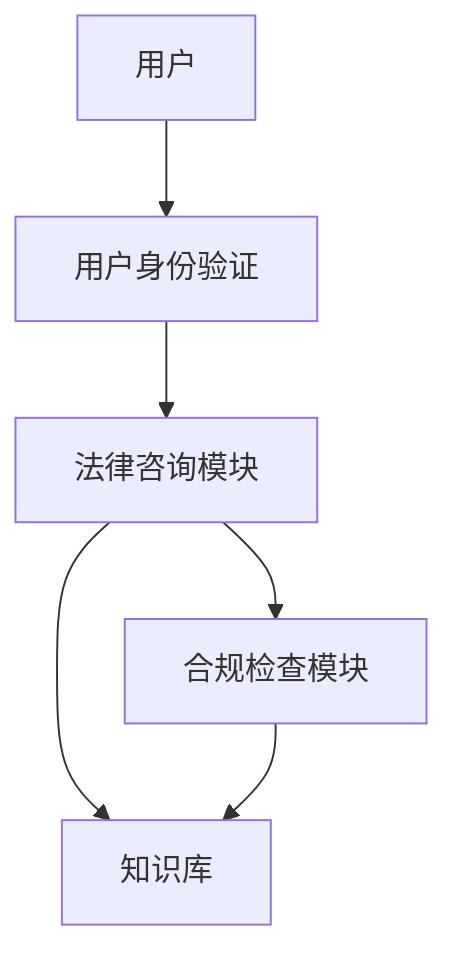
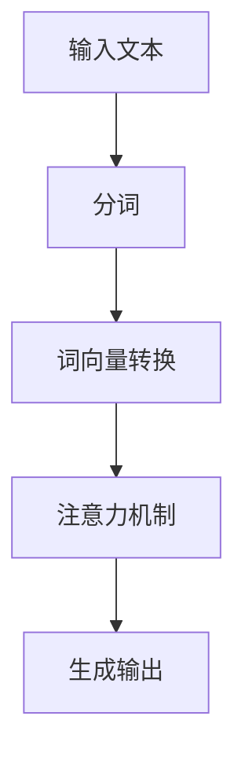

                 


# 法律顾问 AI Agent：LLM 在法律咨询与合规检查中的应用

> 关键词：AI Agent，LLM，法律咨询，合规检查，自然语言处理，法律顾问，人工智能

> 摘要：本文探讨了法律顾问 AI Agent 在法律咨询与合规检查中的应用，分析了大型语言模型（LLM）在法律领域的优势，详细介绍了系统架构设计、算法原理及实际案例。通过逐步分析，展示了如何利用AI技术提升法律服务的效率与准确性。

---

## 第一部分：法律顾问 AI Agent 的背景与核心概念

### 第1章：法律咨询与合规检查的现状与挑战

#### 1.1 传统法律咨询的特点与局限性
- **问题背景**：法律咨询传统模式的痛点，如效率低、成本高、资源分配不均。
- **局限性分析**：人工咨询的效率瓶颈，知识更新的滞后性，用户体验的不一致性。

#### 1.2 AI 技术在法律领域的引入
- **AI 的潜力**：自然语言处理（NLP）技术在法律文本分析中的应用前景。
- **LLM 的优势**：快速响应、深度分析、个性化服务。

#### 1.3 LLM 在法律咨询中的具体应用
- 合同审查与分析
- 法律案例检索与分析
- 法律文书自动生成

### 第2章：法律顾问 AI Agent 的核心概念与架构

#### 2.1 法律顾问 AI Agent 的定义与特点
- **定义**：AI Agent 在法律咨询中的角色与功能。
- **特点**：智能性、实时性、准确性。

#### 2.2 法律顾问 AI Agent 的构建要素
- 数据来源与处理
- 模型训练与优化
- 用户交互界面设计

#### 2.3 法律顾问 AI Agent 的核心算法
- **LLM 的训练过程**：基于 Transformer 的模型结构，注意力机制的实现。
- **文本处理**：分词、词向量表示、语义理解。

---

## 第二部分：系统架构与设计

### 第3章：法律顾问 AI Agent 的系统架构设计

#### 3.1 系统功能模块划分
- 用户身份验证模块
- 法律咨询模块
- 合规检查模块
- 知识库管理模块

#### 3.2 系统架构设计
- 分层架构设计
- 微服务架构设计
- 数据流与服务调用流程

#### 3.3 系统架构图


### 第4章：法律顾问 AI Agent 的算法原理与实现

#### 4.1 LLM 的训练与推理过程
- **模型结构**：基于 Transformer 的编码器-解码器结构。
- **注意力机制**：计算输入序列中每个词的重要性。
- **损失函数**：交叉熵损失函数。

#### 4.2 法律文本的特征提取与处理
- **文本分词**：使用预训练模型进行分词。
- **词向量表示**：利用 Word2Vec 或 GloVe 进行词向量转换。

#### 4.3 算法流程图


---

## 第三部分：项目实战与案例分析

### 第5章：项目实战

#### 5.1 环境配置
- **工具与库**：Python、TensorFlow、PyTorch、Hugging Face 的预训练模型。

#### 5.2 核心代码实现
```python
def contract_review(text):
    # 文本预处理
    tokens = tokenizer.encode(text)
    # 模型推理
    outputs = model.generate(tokens, max_length=500)
    # 解码输出
    review = tokenizer.decode(outputs[0], skip_special_tokens=True)
    return review
```

#### 5.3 功能解读与案例分析
- **案例1**：合同条款审查
- **案例2**：合规检查

---

## 第四部分：最佳实践与总结

### 第6章：最佳实践与总结

#### 6.1 关键点总结
- LLM 的优势与局限性
- 系统设计的注意事项

#### 6.2 未来趋势与展望
- 法律 AI 的智能化与个性化发展
- 多模态 AI 的应用潜力

#### 6.3 注意事项
- 数据隐私与合规性
- 模型的可解释性

---

## 附录

### 附录A：API 接口文档

### 附录B：参考文献

---

通过以上结构，文章详细分析了法律顾问 AI Agent 的背景、系统架构、算法原理和实际应用，为读者提供了全面的技术视角。

