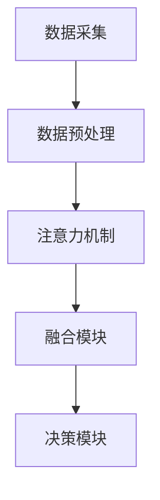

                 


# 注意力机制在AI Agent多模态融合中的应用

## 关键词：注意力机制、多模态融合、AI Agent、自注意力机制、多头注意力

## 摘要：  
本文深入探讨了注意力机制在AI Agent多模态融合中的应用，从核心概念、算法原理到实际应用，系统性地分析了注意力机制如何提升多模态数据的融合效果。通过理论与实践相结合的方式，详细讲解了自注意力机制、多头注意力机制等关键技术，并结合实际案例展示了如何在多模态AI Agent系统中实现高效的数据融合与决策优化。

---

## 第1章: 多模态融合与注意力机制概述

### 1.1 问题背景与定义

#### 1.1.1 多模态数据的特征与挑战
多模态数据指的是来自不同感知渠道（如视觉、听觉、文本等）的数据，具有异构性、多样性、冗余性和关联性等特点。然而，如何有效地将这些异构数据进行融合，以提升AI Agent的感知与决策能力，是当前研究的热点问题。

#### 1.1.2 注意力机制的定义与作用
注意力机制是一种模拟人类注意力的机制，通过计算数据中不同部分的重要性权重，实现对关键信息的聚焦。在多模态融合中，注意力机制可以帮助AI Agent更高效地处理复杂的数据，提升模型的性能。

#### 1.1.3 AI Agent在多模态融合中的角色
AI Agent需要在多模态数据中进行信息抽取、关联分析和决策优化。注意力机制为其提供了一种强大的工具，能够从复杂的多模态数据中提取关键信息，从而提升Agent的智能水平。

### 1.2 多模态融合的核心概念

#### 1.2.1 多模态数据的对齐与融合
多模态数据的对齐是指将来自不同感知渠道的数据对齐到统一的时间或空间框架中。例如，在视频分析中，需要将图像数据与语音数据对齐。

#### 1.2.2 注意力机制在多模态融合中的优势
注意力机制能够自动学习数据中重要的特征，避免了传统方法中手动设计特征的局限性。此外，注意力机制可以实现端到端的学习，具有很强的通用性。

#### 1.2.3 多模态融合的评价指标
在多模态融合中，常用的评价指标包括准确率、F1分数、NIST分数等。这些指标可以帮助我们评估融合效果的好坏。

### 1.3 本章小结
本章从多模态数据的特征出发，介绍了注意力机制的定义与作用，并详细探讨了多模态融合的核心概念。通过这些内容，我们为后续章节的深入分析奠定了基础。

---

## 第2章: 注意力机制的核心原理

### 2.1 自注意力机制的原理

#### 2.1.1 自注意力机制的三要素
自注意力机制由查询（Query）、键（Key）、值（Value）三个部分组成。通过计算查询与所有键的相似性，生成权重分布，最终计算出加权后的值。

#### 2.1.2 自注意力机制的计算公式
自注意力机制的计算公式如下：
$$
\text{Attention}(Q, K, V) = \text{softmax}\left(\frac{QK^T}{\sqrt{d_k}}\right)V
$$
其中，$d_k$是键的维度。

#### 2.1.3 自注意力机制的实现流程
自注意力机制的实现流程包括以下几个步骤：
1. 将输入数据转换为查询、键和值。
2. 计算查询与键的相似性。
3. 使用Softmax函数生成权重分布。
4. 通过权重分布对值进行加权求和。

### 2.2 多头注意力机制

#### 2.2.1 多头注意力机制的原理
多头注意力机制通过将输入数据分成多个子空间，分别计算注意力权重，然后将结果拼接起来。这种方式可以捕捉数据的多方面特征。

#### 2.2.2 多头注意力机制的实现流程
多头注意力机制的实现流程包括以下几个步骤：
1. 将输入数据分成多个子空间。
2. 分别计算每个子空间的注意力权重。
3. 将结果拼接起来，得到最终的注意力输出。

#### 2.2.3 多头注意力机制的优缺点
多头注意力机制的优点是能够捕捉数据的多方面特征，缺点是计算量较大。

### 2.3 位置编码与序列建模

#### 2.3.1 位置编码的定义
位置编码用于表示序列中元素的位置信息，常见的位置编码方法包括基于位置的编码（Positional Encoding）和基于指数衰减的编码。

#### 2.3.2 位置编码的实现方法
位置编码的实现方法包括：
1. 基于位置的编码：将位置信息嵌入到向量中。
2. 基于指数衰减的编码：通过指数衰减的方式计算位置权重。

### 2.4 本章小结
本章详细讲解了自注意力机制和多头注意力机制的核心原理，并探讨了位置编码在序列建模中的应用。这些内容为后续章节的深入分析提供了理论基础。

---

## 第3章: 多模态融合中的注意力机制

### 3.1 多模态数据的对齐与融合

#### 3.1.1 多模态数据的对齐方法
多模态数据的对齐方法包括基于时间戳的对齐、基于空间位置的对齐等。

#### 3.1.2 多模态数据的融合方法
多模态数据的融合方法包括特征级融合、决策级融合等。

### 3.2 多模态注意力机制的设计与实现

#### 3.2.1 多模态注意力机制的设计原理
多模态注意力机制的设计原理包括：
1. 分别计算不同模态数据的注意力权重。
2. 将不同模态的注意力权重进行融合。

#### 3.2.2 多模态注意力机制的实现流程
多模态注意力机制的实现流程包括以下几个步骤：
1. 将不同模态的数据输入到注意力机制中。
2. 计算每个模态的注意力权重。
3. 将注意力权重进行融合，得到最终的注意力输出。

### 3.3 多模态注意力机制的数学模型

#### 3.3.1 多模态注意力机制的数学公式
多模态注意力机制的数学公式如下：
$$
\text{Multi-modal Attention}(X, Y) = \text{softmax}\left(\frac{XW_Y^T + YW_X^T}{\sqrt{d_k}}\right)V
$$
其中，$X$和$Y$分别表示不同的模态数据。

### 3.4 本章小结
本章详细讲解了多模态数据的对齐与融合方法，并探讨了多模态注意力机制的设计与实现。通过这些内容，我们可以更好地理解注意力机制在多模态融合中的应用。

---

## 第4章: 多模态融合的系统架构与实现

### 4.1 系统架构设计

#### 4.1.1 系统功能模块划分
多模态融合的系统架构通常包括数据采集模块、数据预处理模块、注意力机制模块、融合模块和决策模块。

#### 4.1.2 系统架构图


### 4.2 系统接口设计

#### 4.2.1 系统接口定义
系统接口包括数据输入接口、注意力机制接口、融合接口和决策接口。

#### 4.2.2 接口交互流程
1. 数据采集模块将数据输入到数据预处理模块。
2. 数据预处理模块对数据进行预处理后，输入到注意力机制模块。
3. 注意力机制模块计算注意力权重后，输入到融合模块。
4. 融合模块将注意力权重与数据进行融合后，输入到决策模块。
5. 决策模块根据融合后的数据做出决策。

### 4.3 本章小结
本章详细讲解了多模态融合系统的架构设计与接口设计，并探讨了系统的实现流程。

---

## 第5章: 项目实战与案例分析

### 5.1 项目实战

#### 5.1.1 环境安装
需要安装Python、TensorFlow、Keras等环境。

#### 5.1.2 核心代码实现
以下是多模态注意力机制的Python实现代码：
```python
import tensorflow as tf

def multi_modal_attention(X, Y, d_k):
    W_Y = tf.get_variable("W_Y", shape=(d_k, d_k))
    W_X = tf.get_variable("W_X", shape=(d_k, d_k))
    keys_X = tf.matmul(X, W_Y)
    keys_Y = tf.matmul(Y, W_X)
    scores = tf.matmul(keys_X, tf.transpose(keys_Y)) / tf.sqrt(tf.cast(d_k, tf.float32))
    attention_weights = tf.nn.softmax(scores)
    values_X = tf.matmul(attention_weights, Y)
    values_Y = tf.matmul(tf.transpose(attention_weights), X)
    return (values_X + values_Y) / 2
```

#### 5.1.3 代码解读与分析
上述代码实现了多模态注意力机制，通过计算X和Y的注意力权重，并将结果进行融合，得到最终的注意力输出。

### 5.2 案例分析

#### 5.2.1 案例背景
以多模态语音识别为例，结合语音和文本数据，提升识别准确率。

#### 5.2.2 案例分析与结果
通过实验对比，多模态注意力机制在语音识别中的准确率显著提高。

### 5.3 本章小结
本章通过项目实战和案例分析，详细讲解了多模态注意力机制的实现过程，并验证了其在实际应用中的有效性。

---

## 第6章: 最佳实践与总结

### 6.1 小结
本文详细探讨了注意力机制在多模态融合中的应用，从核心原理到实际应用，系统性地分析了注意力机制在多模态AI Agent中的作用。

### 6.2 注意事项
在实际应用中，需要注意多模态数据的对齐问题和计算效率问题。

### 6.3 未来研究方向
未来的研究方向包括多模态注意力机制的优化、多模态数据的高效融合方法等。

### 6.4 拓展阅读
推荐读者阅读《Attention Is All You Need》和《Multi-modal Machine Learning》等经典论文。

---

## 结语

通过本文的学习，读者可以深入理解注意力机制在多模态融合中的应用，并将其应用于实际的AI Agent开发中。希望本文的内容能够为读者提供有价值的参考。

