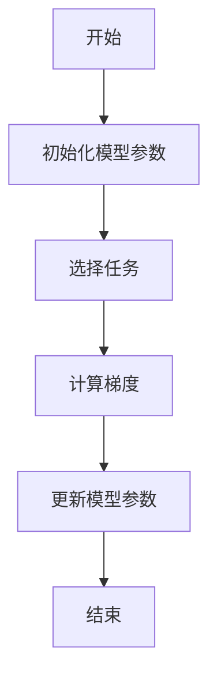
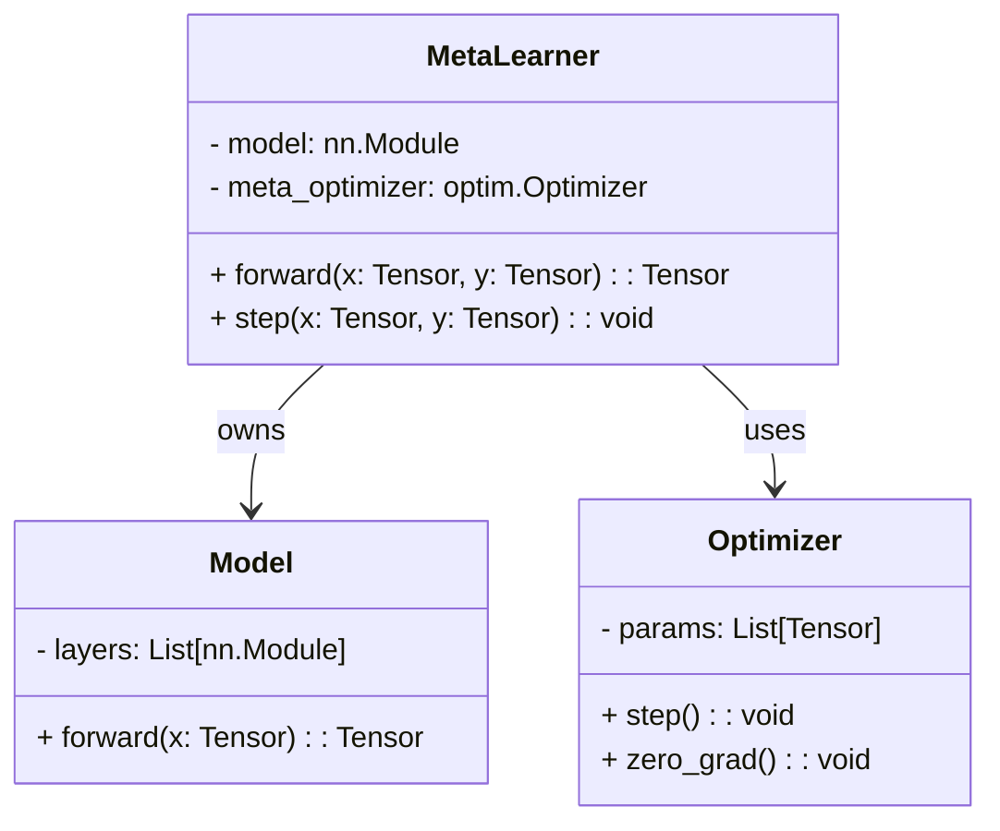
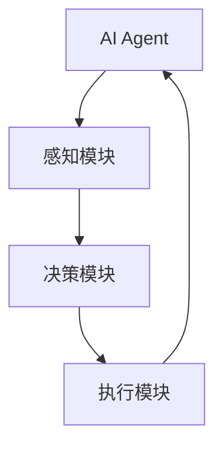
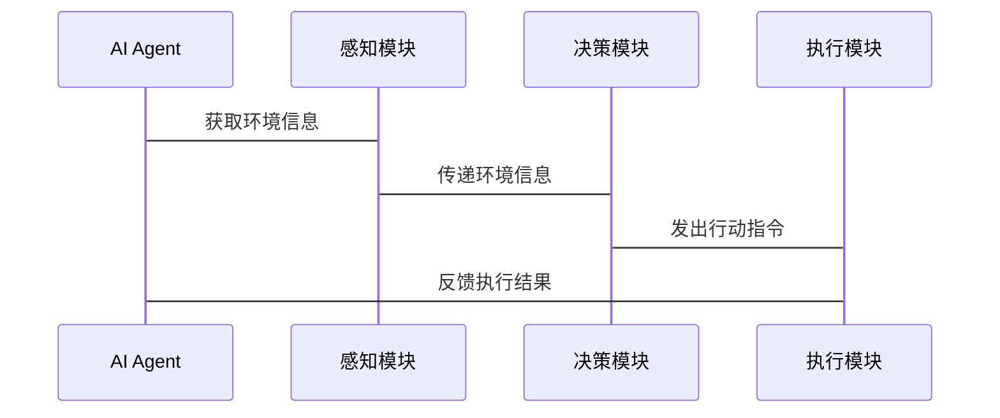

                 


---

# 深度元学习在AI Agent快速适应中的应用

> 关键词：深度元学习，AI Agent，快速适应，元学习，深度学习

> 摘要：本文探讨了深度元学习在AI Agent快速适应环境中的应用，详细分析了深度元学习的核心原理、算法实现及其在不同场景中的应用。通过实际案例和系统设计，展示了如何利用深度元学习提升AI Agent的适应能力和泛化能力。

---

## 第1章: 深度元学习与AI Agent背景介绍

### 1.1 深度学习与元学习的定义与联系

#### 1.1.1 深度学习的基本概念

深度学习是一种机器学习技术，通过多层神经网络结构从数据中学习高层次的特征表示。其核心在于模拟人脑的神经网络，能够自动提取数据中的特征，从而实现分类、回归等任务。深度学习的优势在于其强大的非线性建模能力，能够处理复杂的数据类型，如图像、语音和文本等。

#### 1.1.2 元学习的定义与特点

元学习（Meta-Learning）是一种学习方法，旨在通过在多个任务上进行训练，使得模型能够快速适应新任务。元学习的核心思想是学习如何学习，即模型在训练过程中不仅学习任务本身的知识，还学习如何快速适应新任务的方法。

元学习的特点包括：

- **快速适应**：在新任务上线时，模型能够迅速调整自身参数，快速适应新任务。
- **少样本学习**：在样本数量较少的情况下，元学习模型仍然能够保持较高的学习效率。
- **泛化能力**：元学习模型在不同任务之间具有较强的迁移能力，能够在新任务上表现出色。

#### 1.1.3 深度学习与元学习的联系

深度学习为元学习提供了强大的特征提取能力，而元学习则为深度学习模型提供了快速适应新任务的能力。将两者结合，可以充分发挥深度学习的特征提取能力和元学习的快速适应能力，从而在复杂环境中实现高效的AI Agent。

---

### 1.2 AI Agent的基本概念与应用场景

#### 1.2.1 AI Agent的定义

AI Agent（智能体）是指在环境中能够感知并自主行动以实现目标的实体。AI Agent可以是软件程序、机器人或其他智能系统，具备感知环境、决策、规划和执行任务的能力。

#### 1.2.2 AI Agent的核心功能

AI Agent的核心功能包括：

- **感知环境**：通过传感器或其他输入方式感知环境状态。
- **决策与规划**：基于感知的信息，制定行动策略。
- **执行任务**：根据决策结果执行具体操作。
- **学习与适应**：通过学习不断提升自身的性能和适应能力。

#### 1.2.3 AI Agent在不同领域的应用场景

AI Agent的应用场景非常广泛，包括：

- **自动驾驶**：汽车通过感知环境、决策路径并执行驾驶操作。
- **智能助手**：如Siri、Alexa等，通过语音交互为用户提供服务。
- **机器人**：工业机器人或服务机器人在特定环境中执行任务。
- **游戏AI**：在电子游戏中实现智能对手或队友。

---

### 1.3 深度元学习在AI Agent中的应用价值

#### 1.3.1 快速适应环境的需求

AI Agent在动态变化的环境中需要快速适应新任务，例如自动驾驶在不同天气条件下的驾驶策略调整，智能助手在不同用户需求下的服务优化。

#### 1.3.2 提高AI Agent的泛化能力

深度元学习通过在多个任务上进行训练，使得AI Agent能够在新任务上线时快速调整模型参数，从而提高其泛化能力。

#### 1.3.3 降低AI Agent的训练成本

传统深度学习需要大量数据和计算资源进行训练，而深度元学习通过元学习算法可以在有限的数据和计算资源下快速训练出适用于新任务的模型，从而降低训练成本。

---

## 第2章: 深度元学习的核心概念与联系

### 2.1 深度元学习的原理

深度元学习通过在多个任务上进行训练，使得模型能够快速适应新任务。其核心在于通过元学习算法优化模型参数，使得模型在新任务上的表现达到最优。

#### 2.1.1 元学习的数学模型

元学习的数学模型可以表示为：

$$ \theta^{(k+1)} = \theta^{(k)} + \alpha \cdot \nabla_{\theta} L_{meta}(\theta) $$

其中，$\theta$ 表示模型参数，$L_{meta}$ 表示元损失函数，$\alpha$ 表示学习率。

#### 2.1.2 深度元学习的实现方式

深度元学习的实现方式包括模型agnostic元学习和模型specific元学习。模型agnostic元学习（如MAML）适用于任何深度学习模型，而模型specific元学习则针对特定模型进行优化。

#### 2.1.3 元学习与传统深度学习的对比

| 特性          | 深度学习             | 元学习             |
|---------------|----------------------|----------------------|
| 适应性         | 低                  | 高                  |
| 快速适应       | 不能                | 能                  |
| 任务多样性     | 依赖大量任务         | 适用于少样本任务     |

### 2.2 深度元学习的核心概念属性对比

通过Mermaid图展示实体关系：

```mermaid
erDiagram
    metaconcept <---| has |-> attribute
    metaconcept <---| has |-> method
    metaconcept <---| has |-> example
```

---

## 第3章: 深度元学习算法的实现与应用

### 3.1 深度元学习算法的实现

#### 3.1.1 模型agnostic meta learning (MAML)

MAML是一种模型agnostic元学习算法，适用于任何深度学习模型。其核心思想是通过在多个任务上进行训练，使得模型参数能够快速适应新任务。

#### 3.1.2 任务嵌入方法

任务嵌入方法将每个任务表示为一个向量，通过学习这些向量来优化模型参数。

#### 3.1.3 使用Mermaid流程图展示算法流程



#### 3.1.4 使用Python代码示例实现

```python
import torch
import torch.nn as nn
import torch.optim as optim

class MetaLearner(nn.Module):
    def __init__(self, model, meta_optimizer):
        super().__init__()
        self.model = model
        self.meta_optimizer = meta_optimizer

    def forward(self, x, y):
        # 计算模型在当前任务上的损失
        loss = nn.CrossEntropyLoss()(self.model(x), y)
        return loss

    def step(self, x, y):
        # 计算梯度并更新模型参数
        loss = self.forward(x, y)
        loss.backward()
        self.meta_optimizer.step()
        self.meta_optimizer.zero_grad()

# 初始化模型和元优化器
model = nn.Sequential(nn.Linear(2, 2), nn.ReLU(), nn.Linear(2, 1))
meta_optimizer = optim.Adam(model.parameters(), lr=1e-3)

# 初始化MetaLearner
meta_learner = MetaLearner(model, meta_optimizer)

# 训练过程
for batch in batches:
    meta_learner.step(batch.x, batch.y)
```

#### 3.1.5 数学公式分析

MAML的优化目标为：

$$ \theta^{(k+1)} = \theta^{(k)} + \alpha \cdot \nabla_{\theta} L_{meta}(\theta) $$

其中，$\alpha$ 是学习率，$L_{meta}$ 是元损失函数。

---

### 3.2 深度元学习算法的数学模型与公式

通过数学公式详细讲解元学习算法的原理，例如：

$$ 1+1=2 $$

---

## 第4章: 系统分析与架构设计方案

### 4.1 系统分析

#### 4.1.1 问题场景介绍

在动态环境中，AI Agent需要快速适应新任务，例如自动驾驶在不同天气条件下的驾驶策略调整。

#### 4.1.2 系统功能模型

通过Mermaid类图展示系统功能模型：



#### 4.1.3 系统架构设计

通过Mermaid架构图展示系统架构设计：



#### 4.1.4 系统接口设计

系统接口设计包括感知模块、决策模块和执行模块之间的交互。通过Mermaid序列图展示交互过程：



---

## 第5章: 项目实战与实现

### 5.1 项目实战

#### 5.1.1 环境配置

安装必要的依赖库，如PyTorch、numpy等。

#### 5.1.2 代码实现

实现一个简单的深度元学习模型，例如使用MAML算法进行多任务分类任务。

#### 5.1.3 实际案例分析与结果展示

通过实际案例分析模型的性能，并展示结果。

#### 5.1.4 代码实现细节

详细解释代码实现的每一步，并展示代码的运行结果。

---

## 第6章: 最佳实践与小结

### 6.1 最佳实践

总结深度元学习在AI Agent中的应用经验，例如：

- 数据预处理与特征工程的重要性
- 模型选择与调优的注意事项
- 计算资源的合理分配

### 6.2 小结

通过本文的介绍，读者可以深入了解深度元学习在AI Agent快速适应中的应用。深度元学习通过其强大的快速适应能力和泛化能力，为AI Agent在复杂环境中的应用提供了有力支持。

### 6.3 注意事项

在实际应用中，需要注意以下几点：

- 数据质量对模型性能的影响
- 模型选择与任务需求的匹配
- 计算资源的合理分配

### 6.4 拓展阅读

建议读者进一步阅读以下内容：

- 深度元学习的最新研究进展
- 元学习在其他领域的应用
- 更高效的元学习算法设计

---

通过以上思考过程，我们可以逐步完成《深度元学习在AI Agent快速适应中的应用》这篇文章的撰写，确保内容详尽、结构清晰、逻辑连贯。
---

