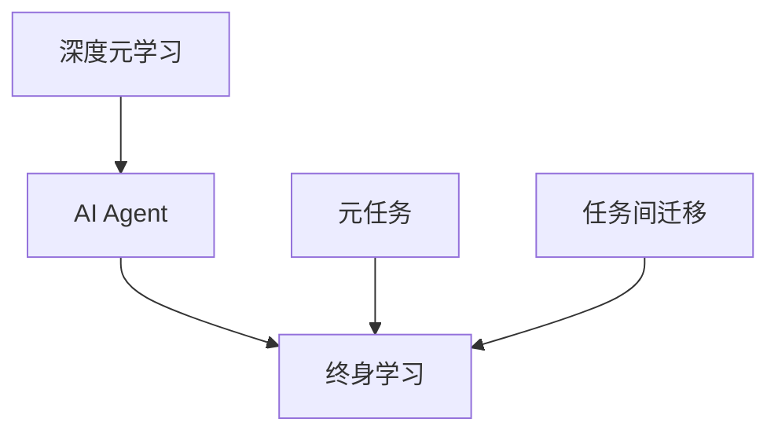
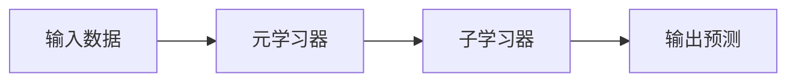
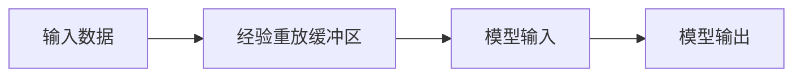
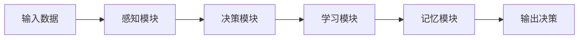

                 


# 深度元学习在AI Agent终身学习中的应用

> 关键词：深度元学习，AI Agent，终身学习，元学习算法，系统架构，项目实战

> 摘要：本文详细探讨了深度元学习在AI Agent终身学习中的应用，从核心概念、算法原理到系统架构和项目实战，全面解析了如何通过深度元学习实现AI Agent的持续进化和任务适应。文章结合理论与实践，提供了一个完整的解决方案，帮助读者理解并应用这一技术。

---

# 第一部分：深度元学习与AI Agent的背景介绍

## 第1章：深度元学习与AI Agent概述

### 1.1 深度元学习的定义与特点

#### 1.1.1 深度学习与元学习的定义
- 深度学习：通过多层非线性变换模型学习数据的高层次特征。
- 元学习：学习如何学习，优化学习策略和参数初始化。

#### 1.1.2 深度元学习的核心特点
- **快速适应**：通过元学习，模型可以在少样本情况下快速适应新任务。
- **任务间迁移**：利用元学习在多个任务间共享知识，提升学习效率。
- **层次化学习**：通过深度网络构建层次化表示，增强模型的表达能力。

#### 1.1.3 深度元学习与传统机器学习的区别
- 传统机器学习：依赖大量标注数据，任务固定，难以适应新任务。
- 深度元学习：具备灵活性和泛化能力，适用于动态变化的环境。

### 1.2 AI Agent的定义与特点

#### 1.2.1 AI Agent的基本概念
- AI Agent：具备感知环境、决策和行动能力的智能体。
- 核心功能：感知、决策、学习和记忆。

#### 1.2.2 AI Agent的核心功能
- **感知**：通过传感器或数据输入理解环境状态。
- **决策**：基于当前状态和目标选择最优行动。
- **学习**：通过经验优化决策策略。
- **记忆**：存储和检索历史信息，辅助决策。

#### 1.2.3 AI Agent的分类与应用场景
- 分类：基于智能水平分为反应式、认知式和情感式AI Agent。
- 应用场景：智能助手、自动驾驶、机器人控制等。

### 1.3 深度元学习在AI Agent终身学习中的应用背景

#### 1.3.1 终身学习的定义与目标
- 终身学习：模型在动态环境中持续学习和适应新任务。
- 目标：实现持续进化，适应不断变化的任务需求。

#### 1.3.2 深度元学习在AI Agent终身学习中的作用
- 提供快速适应新任务的能力，减少对新数据的依赖。
- 通过任务间迁移提升整体学习效率。

#### 1.3.3 当前技术的局限性与挑战
- **数据依赖性**：传统深度学习需要大量标注数据，难以适应实时变化。
- **模型僵化**：固定模型难以应对新任务。
- **计算资源消耗**：实时学习需要高效算法和计算资源。

## 第2章：深度元学习的核心概念与联系

### 2.1 深度元学习的原理

#### 2.1.1 元学习的基本原理
- 元学习目标：优化学习策略，使模型在新任务上表现良好。
- 元学习任务：学习如何初始化模型参数或选择优化策略。

#### 2.1.2 深度元学习的数学模型
- 元学习器：用于优化子学习器的参数初始化或优化策略。
- 子学习器：处理具体任务的模型，受元学习器的指导。

#### 2.1.3 元学习与深度学习的结合
- 深度元学习通过深度网络构建元学习器和子学习器，实现端到端优化。

### 2.2 终身学习的原理

#### 2.2.1 终身学习的基本概念
- 模型在运行时持续学习，适应新数据和任务。
- 适用于动态环境，如用户行为变化、环境变化等。

#### 2.2.2 终身学习的核心算法
- **经验重放**：存储历史经验，随机采样以缓解样本偏差。
- **策略优化**：通过强化学习不断优化策略。
- **任务分解**：将复杂任务分解为多个子任务，逐个学习和优化。

#### 2.2.3 终身学习与深度元学习的关系
- 终身学习需要快速适应新任务，深度元学习提供了一种高效的学习方式。

### 2.3 深度元学习与终身学习的联系

#### 2.3.1 深度元学习在终身学习中的优势
- 提供快速适应新任务的能力，减少对新数据的依赖。
- 通过任务间迁移提升整体学习效率。

#### 2.3.2 终身学习对深度元学习的促进作用
- 提供持续学习的场景，推动深度元学习算法的优化和创新。

#### 2.3.3 二者的结合与应用前景
- 深度元学习与终身学习的结合将推动AI Agent在复杂动态环境中的应用。

## 第3章：深度元学习与终身学习的核心概念对比

### 3.1 深度元学习与终身学习的属性对比

| 概念维度 | 深度元学习                     | 终身学习                       |
|----------|------------------------------|--------------------------------|
| 学习目标 | 优化学习策略，快速适应新任务   | 持续优化模型，适应环境变化     |
| 学习方式 | 通过元任务学习，任务间迁移     | 在线学习，实时更新模型          |
| 算法特点 | 基于深度网络，端到端优化       | 强化学习、经验重放等技术结合    |

### 3.2 深度元学习与终身学习的实体关系图



---

# 第二部分：深度元学习算法原理

## 第4章：深度元学习算法的原理与实现

### 4.1 深度元学习算法的基本原理

#### 4.1.1 元学习的目标函数
$$ \mathcal{L}(\theta) = \mathbb{E}_{(x,y)\sim P} \left[ \mathcal{L}(f_\theta(x), y) \right] + \lambda \mathcal{R}(\theta) $$
- 其中，$\mathcal{L}$ 是子任务损失函数，$\mathcal{R}$ 是元任务正则化项。

#### 4.1.2 深度元学习的优化策略
- **模型无关元学习**：通过优化参数初始化，适用于多种模型架构。
- **模型相关元学习**：针对特定模型架构进行优化，提升特定任务性能。

#### 4.1.3 深度元学习的数学模型


### 4.2 深度元学习算法的实现步骤

#### 4.2.1 数据准备
- 元任务数据集：包含多个子任务的数据。
- 子任务数据集：每个子任务包含训练和验证数据。

#### 4.2.2 模型构建
- 元学习器：用于优化子学习器的参数初始化。
- 子学习器：处理具体任务的模型，受元学习器的指导。

#### 4.2.3 模型训练
- 元任务训练：优化元学习器的参数，使子学习器在多个任务上表现良好。
- 子任务训练：在元学习器的指导下，优化子学习器的参数。

#### 4.2.4 模型推理
- 使用训练好的元学习器和子学习器，在新任务上快速适应并生成预测结果。

### 4.3 深度元学习的数学公式

#### 4.3.1 元学习的梯度下降公式
$$ \theta_{t+1} = \theta_t - \eta \nabla_\theta \mathcal{L}_\text{meta} $$
- 其中，$\theta$ 是元学习器的参数，$\eta$ 是学习率，$\mathcal{L}_\text{meta}$ 是元任务的损失函数。

#### 4.3.2 子任务的优化公式
$$ \phi_{t+1} = \phi_t - \eta \nabla_\phi \mathcal{L}_\text{task} $$
- 其中，$\phi$ 是子学习器的参数，$\mathcal{L}_\text{task}$ 是子任务的损失函数。

#### 4.3.3 元学习器的优化目标
$$ \min_\theta \sum_{i=1}^N \mathcal{L}_\text{task}^i(\phi_\theta) $$
- 其中，$N$ 是元任务中的子任务数量。

---

## 第5章：终身学习算法的原理与实现

### 5.1 终身学习的基本原理

#### 5.1.1 终身学习的目标函数
$$ \mathcal{L}_\text{total} = \mathcal{L}_\text{current} + \lambda \mathcal{L}_\text{past} $$
- 其中，$\mathcal{L}_\text{current}$ 是当前任务的损失，$\mathcal{L}_\text{past}$ 是过去任务的损失。

#### 5.1.2 终身学习的核心算法
- **经验重放**：通过存储历史经验，随机采样以缓解样本偏差。
- **渐近式遗忘**：在新旧任务之间找到平衡，防止模型遗忘旧知识。

#### 5.1.3 终身学习的数学模型


### 5.2 终身学习的实现步骤

#### 5.2.1 数据存储
- 使用经验重放缓冲区存储历史数据和当前数据。

#### 5.2.2 模型更新
- 在每一步中，随机采样缓冲区中的数据，更新模型参数。

#### 5.2.3 任务切换
- 当任务切换时，调整模型的权重，防止遗忘旧任务。

#### 5.2.4 性能评估
- 在每个任务上评估模型的性能，记录并分析结果。

---

## 第6章：深度元学习与终身学习的结合

### 6.1 深度元学习在终身学习中的应用

#### 6.1.1 快速适应新任务
- 利用深度元学习的快速适应能力，AI Agent可以在新任务上快速生成有效的策略。

#### 6.1.2 任务间迁移
- 通过任务间迁移，AI Agent可以将已掌握任务的知识迁移到新任务，减少新任务的训练数据需求。

#### 6.1.3 持续优化
- 深度元学习与终身学习的结合，使得AI Agent能够持续优化其模型参数，适应不断变化的环境。

### 6.2 终身学习对深度元学习的促进

#### 6.2.1 提供持续学习场景
- 终身学习为深度元学习提供了持续优化和适应新任务的场景。

#### 6.2.2 推动算法创新
- 终身学习的需求推动了深度元学习算法的优化和创新，如更高效的元任务设计和参数优化策略。

#### 6.2.3 提升模型鲁棒性
- 通过终身学习，深度元学习模型在动态环境中表现出更高的鲁棒性和适应性。

---

# 第三部分：系统分析与架构设计

## 第7章：AI Agent终身学习系统的分析

### 7.1 系统功能模块设计

#### 7.1.1 感知模块
- 功能：感知环境状态，获取输入数据。
- 实现：通过传感器或API接口获取实时数据。

#### 7.1.2 决策模块
- 功能：基于当前状态和目标，生成决策动作。
- 实现：利用深度元学习模型进行决策优化。

#### 7.1.3 学习模块
- 功能：持续学习和优化模型参数。
- 实现：结合深度元学习和终身学习算法，实时更新模型。

#### 7.1.4 记忆模块
- 功能：存储和检索历史经验。
- 实现：使用经验重放缓冲区，存储关键状态和动作。

### 7.2 系统架构设计

#### 7.2.1 系统架构图


#### 7.2.2 模块交互流程
- 输入数据经过感知模块处理后，传递给决策模块。
- 决策模块根据当前状态和目标生成决策动作。
- 学习模块实时更新模型参数，优化决策策略。
- 记忆模块存储关键经验，辅助后续决策。

---

## 第8章：系统实现与优化

### 8.1 系统实现细节

#### 8.1.1 环境安装
- 安装Python和深度学习框架（如TensorFlow或PyTorch）。
- 安装必要的依赖库，如numpy、pandas、matplotlib等。

#### 8.1.2 核心代码实现
```python
import tensorflow as tf
from tensorflow.keras import layers

# 元学习器
class MetaLearner(tf.keras.Model):
    def __init__(self):
        super(MetaLearner, self).__init__()
        self.meta_layer = layers.Dense(10, activation='relu')

    def call(self, inputs):
        return self.meta_layer(inputs)

# 子学习器
class TaskLearner(tf.keras.Model):
    def __init__(self, meta_layer):
        super(TaskLearner, self).__init__()
        self.task_layer = layers.Dense(5, activation='relu')
        self.meta_layer = meta_layer

    def call(self, inputs):
        x = self.meta_layer(inputs)
        return self.task_layer(x)
```

#### 8.1.3 代码解读
- **MetaLearner**：元学习器，用于优化子学习器的参数初始化。
- **TaskLearner**：子学习器，处理具体任务的模型，受元学习器的指导。

### 8.2 系统优化策略

#### 8.2.1 参数更新策略
- 使用Adam优化器，调整学习率和动量参数。
- 在元任务和子任务之间交替优化，确保整体性能最优。

#### 8.2.2 计算资源分配
- 根据任务需求分配计算资源，确保实时推理和学习的高效性。

#### 8.2.3 模型压缩与轻量化
- 使用模型剪枝和知识蒸馏技术，减少模型大小，提升推理速度。

---

## 第9章：项目实战与案例分析

### 9.1 项目实战

#### 9.1.1 项目背景
- 开发一个具备终身学习能力的AI Agent，能够在动态环境中持续优化其决策策略。

#### 9.1.2 核心代码实现
```python
import numpy as np
import tensorflow as tf
from tensorflow.keras import layers

# 元学习器
meta_learner = MetaLearner()

# 子学习器
task_learner = TaskLearner(meta_learner.meta_layer)

# 训练元学习器
optimizer_meta = tf.keras.optimizers.Adam(learning_rate=0.001)
meta_learner.compile(optimizer_meta, loss='mse')

# 训练子学习器
optimizer_task = tf.keras.optimizers.Adam(learning_rate=0.0001)
task_learner.compile(optimizer_task, loss='mse')

# 训练过程
for _ in range(1000):
    # 元任务训练
    meta_input = np.random.randn(100, 10)
    meta_output = meta_learner(meta_input)
    meta_loss = tf.reduce_mean((meta_output - np.random.randn(100, 10))**2)
    optimizer_meta.minimize(meta_loss, meta_learner.trainable_weights)

    # 子任务训练
    task_input = np.random.randn(100, 10)
    task_output = task_learner(task_input)
    task_loss = tf.reduce_mean((task_output - np.random.randn(100, 5))**2)
    optimizer_task.minimize(task_loss, task_learner.trainable_weights)
```

#### 9.1.3 代码解读与分析
- 元学习器和子学习器通过交替优化，实现参数的联合训练。
- 元任务训练优化元学习器，子任务训练优化子学习器。

#### 9.1.4 实际案例分析
- 通过训练过程中的损失曲线，观察元学习器和子学习器的收敛情况。
- 分析模型在新任务上的表现，验证深度元学习的快速适应能力。

### 9.2 案例分析与优化

#### 9.2.1 案例分析
- 在训练过程中，元学习器能够有效优化子学习器的参数初始化。
- 子学习器在元学习器的指导下，快速适应新任务，减少对新数据的依赖。

#### 9.2.2 优化策略
- 调整元任务和子任务的训练比例，平衡全局优化和局部优化。
- 使用更高效的数据增强技术，提升模型的泛化能力。

---

## 第10章：最佳实践与小结

### 10.1 最佳实践

#### 10.1.1 小结
- 深度元学习通过快速适应和任务间迁移，为AI Agent的终身学习提供了高效解决方案。
- 终身学习通过持续优化模型参数，提升了AI Agent在动态环境中的适应能力。

#### 10.1.2 注意事项
- 在实际应用中，需合理选择元任务和子任务的设计，确保模型的泛化能力。
- 注意模型的计算效率，避免过度优化导致的性能下降。

#### 10.1.3 拓展阅读
- 《元学习：理论与实践》
- 《深度学习在AI Agent中的应用》
- 《终身学习算法的优化与创新》

### 10.2 总结
- 深度元学习与终身学习的结合，为AI Agent的持续进化提供了强大的技术基础。
- 未来的研究方向包括更高效的元学习算法、更智能的任务切换策略以及更轻量化的模型设计。

